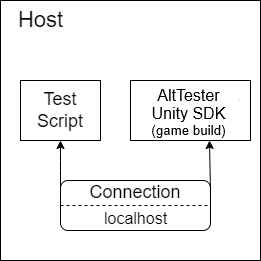
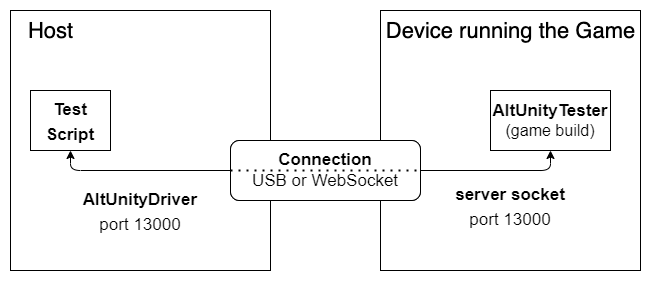
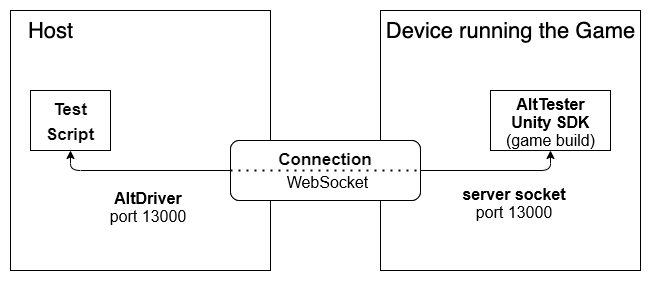
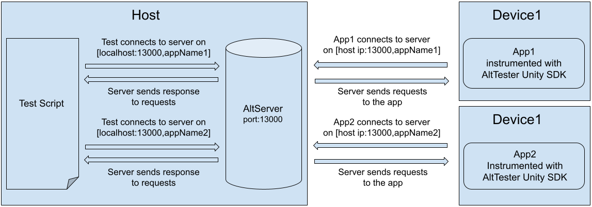
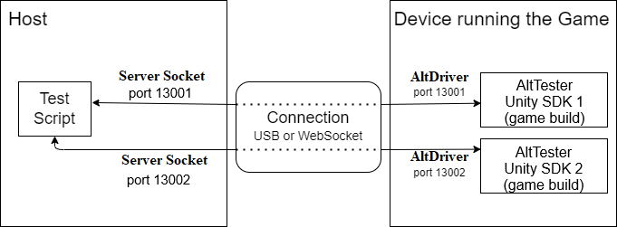
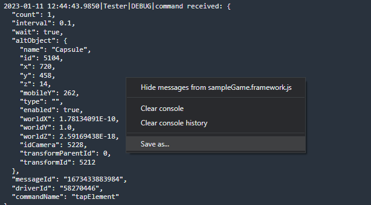

# Advanced Usage

This guide covers some of the more advanced features, patterns and
configuration options of AltTester® Unity SDK.

## AltTester® input

AltTester® Unity SDK has an `Input` class which overrides the Input class implemented by Unity. This way AltTester® intercepts the input actions to be performed in the instrumented app and simulates them through this class.
In case you are using assembly definitions inside your project, you will have to reference the `AltTesterUnitySDK.asmdef` in all your .asmdef files which use input actions.

## AltTester® input vs. regular input

AltTester®'s custom input is active, by default, in any instrumented build. This means that certain input related actions (the ones that are part of Unity's `Input` class) will be inactive for regular input (the device's input). Because of this, pressing a key from the keyboard for example will not have any effect on the app. However, the simulated input from the tests, like the `PressKey` command, will be able to manipulate the object within the scene. While the AltTester® input is active, the icon from the right bottom corner is green. You can change this behaviour by clicking on the AltTester®'s icon and unchecking the box with the `AltTester® Input` message. Now the icon will turn darker, signaling that the regular input is active. In this state, you can interfere with the object from the app using the keyboard or other input. Keep in mind that, input actions from the AltTester® Desktop won't have any effect while regular input is active. At the same time, if you want to run some automated tests, the AltTester® input will be activated automatically for you.

## Build apps from the command line

To build your Unity application from command line you need a static method in
your project that handles the build logic. To instrument your Unity application
with AltTester® Unity SDK, your build method must define `ALTTESTER` scripting
symbol and must insert AltTester® Prefab in the first scene of the app.

Depending on your project's setup, there are two ways in which apps can be
built from the command line:


```eval_rst
.. note::

    AltTester® Unity SDK does not work by default in release mode. If you instrument
    your app in release mode, AltTester® Prefab self removes from the scenes and
    the socket server does not start. Best case practice is to customize your
    build script to insert AltTester® Prefab only in Debug mode.

    If you do want to use AltTester® Unity SDK in release mode see
    `Using AltTester® Unity SDK in Release mode section <#using-alttester-unity-sdk-in-release-mode>`_.

```


**1. If you already have a custom build method for your app**

If you already have a custom build method for your app, you can add the
following lines to your build method. Also, the BuildPlayerOptions should
check for *BuildOptions.Development* and *BuildOptions.IncludeTestAssemblies*.

```c#
var buildTargetGroup = BuildTargetGroup.Android;
AltBuilder.AddAltTesterInScriptingDefineSymbolsGroup(buildTargetGroup);
AltBuilder.CreateJsonFileForInputMappingOfAxis();
var instrumentationSettings = new AltInstrumentationSettings();
AltBuilder.InsertAltInScene(FirstSceneOfTheApp, instrumentationSettings);
```

```eval_rst
.. note::

    Change ``buildTargetGroup`` above to the target group for which you are
    building.

```

**2. If you create a new custom build method for your app**

The following example script can be used. It sets all the project settings
needed and uses the same two important lines from point 1 above.

This example method is configured for the Android platform, so make sure to
update it based on your target platform.

```eval_rst
.. literalinclude:: ../_static/examples~/advanced-usage/build-from-command-line.txt
    :language: c#

```

The following command is used to call the build method:

```eval_rst
.. code-block:: bash

    <UnityPath>/Unity -projectPath $CI_PROJECT_DIR -executeMethod BuilderClass.BuildFromCommandLine -logFile logFile.log -quit

```

You can find more information about the build command and arguments
[here](https://docs.unity3d.com/Manual/CommandLineArguments.html).

```eval_rst
.. note::

    After building from the command line you can run the tests by using the
    commands from the `next section <#run-tests-from-the-command-line>`_.

```

## How to make an instrumented build using Unity Cloud Build

To instrument your Unity project with AltTester® Unity SDK using Unity Cloud Build, follow these steps:

1. **Create or select a build configuration**  
   In Unity Cloud Build, either use an existing configuration or create a new one for your instrumented build.

2. **Set the build to Development Mode**  
   In the configuration settings, ensure that the build is set to Development Mode.

3. **Configure Script Hooks**  
    In the Script Hooks section, add your method name to the **Pre-Export Method** field. This method should contain the code that inserts AltTester® into your build.

4. **Add Scripting Define Symbols**  
   In the Script Hooks section, add `ALTTESTER` to the **Scripting Define Symbols** field.  

```eval_rst
    .. image:: ../_static/img/advanced-usage/unity-cloud-configuration.png
```

 ```eval_rst
    .. image:: ../_static/img/advanced-usage/code-unity-cloud.png
```

```eval_rst
.. note::
     An example with a working script can be found at `Unity-Project <https://github.com/alttester/UnityCloudTestBuild>`_
```

## How to make a production build

There is no need to remove the AltTester® package entirely from the project, only the `ALTTESTER` Scripting Define Symbol should be deleted from the Player Settings. Also, make sure that the `Keep ALTTESTER symbol defined` checkbox is unchecked. After that, you can build your app normally as you would do in Unity.

## Run tests from the command line

In order to run tests from the command line you can use the following example
commands:

```eval_rst
.. tabs::

    .. tab:: C#

        Available AltTester® SDK command line arguments:

        ``-testsClass`` - runs tests from given class/classes

        Example command running tests from a single test class:

        .. code-block:: bash

            <UnityPath>/Unity -projectPath $PROJECT_DIR -executeMethod AltTester.AltTesterUnitySDK.Editor.AltTestRunner.RunTestFromCommandLine -testsClass MyTestClass -logFile logFile.log -batchmode -quit

        Example command running tests from two test classes:

        .. code-block:: bash

            <UnityPath>/Unity -projectPath $PROJECT_DIR -executeMethod AltTester.AltTesterUnitySDK.Editor.AltTestRunner.RunTestFromCommandLine -testsClass MyTestClass1 MyTestClass2 -logFile logFile.log -batchmode -quit

        ``-tests`` - runs given test/tests

        Example command running a single test:

        .. code-block:: bash

            <UnityPath>/Unity -projectPath $PROJECT_DIR -executeMethod AltTester.AltTesterUnitySDK.Editor.AltTestRunner.RunTestFromCommandLine -tests MyTestClass.MyTestName -logFile logFile.log -batchmode -quit

        Example command running two tests:

        .. code-block:: bash

            <UnityPath>/Unity -projectPath $PROJECT_DIR -executeMethod AltTester.AltTesterUnitySDK.Editor.AltTestRunner.RunTestFromCommandLine -tests MyTestClass1.MyTestName1 MyTestClass2.MyTestName2 -logFile logFile.log -batchmode -quit

        ``-testsAssembly`` - runs tests from given assembly/assemblies

        Example command running all tests from given assembly:

        .. code-block:: bash

            <UnityPath>/Unity -projectPath $PROJECT_DIR -executeMethod AltTester.AltTesterUnitySDK.Editor.AltTestRunner.RunTestFromCommandLine -testsAssembly MyAssembly -logFile logFile.log -batchmode -quit

        Example command running tests from two assemblies:

        .. code-block:: bash

            <UnityPath>/Unity -projectPath $PROJECT_DIR -executeMethod AltTester.AltTesterUnitySDK.Editor.AltTestRunner.RunTestFromCommandLine -testsAssembly MyAssembly1 MyAssembly2 -logFile logFile.log -batchmode -quit

        ``-reportPath`` - the xml test report will be generated here

        .. code-block:: bash

            <UnityPath>/Unity -projectPath $PROJECT_DIR -executeMethod AltTester.AltTesterUnitySDK.Editor.AltTestRunner.RunTestFromCommandLine -tests MyFirstTest.TestStartGame -reportPath $PROJECT_DIR/testReport.xml -logFile logFile.log -batchmode -quit

    .. tab:: Java

        .. code-block:: bash

            mvn test

    .. tab:: Python

        Using the ``unittest`` module:

        .. code-block:: bash

            python -m unittest <name_of_your_test_file.py>

        Using the ``pytest`` package:

        .. code-block:: bash

            pytest  <name_of_your_test_file.py>

    .. tab:: robot

        .. code-block:: bash

            robot <name_of_your_test_file.robot>

```

## Run tests on a Continuous Integration Server

1. Instrument your app build with AltTester® Unity SDK from Unity or by [building from the command line](#build-apps-from-the-command-line).
2. Start the app build on a device.
3. Run your tests - see commands in the ["Run tests from the command line" section](#run-tests-from-the-command-line).

An example CI configuration file can be viewed in the [GitHub repository](https://github.com/alttester/AltTester-Unity-SDK/blob/development/.github/workflows/push.yml).


## What is reverse port forwarding and when to use it

Reverse port forwarding, is the behind-the-scenes process of intercepting
data traffic and redirecting it from a device's IP and/or port to the computer's IP and/or port.

When you run your app instrumented with AltTester® Unity SDK on a device, you need
to tell your build how to connect to the AltTester® Server.

Reverse port forwarding can be set up either through the command line or in the
test code by using the methods available in the AltTester® SDK classes.

The following are some cases when reverse port forwarded is needed:

1. [Connect to the app running on a USB connected device](#connect-to-the-app-running-on-a-usb-connected-device)
2. [Connect to multiple devices running the app](#connect-to-multiple-devices-running-the-app)

### How to setup reverse port forwarding

#### In case of Android

Reverse port forwarding can be set up in two ways:

- through the command line using ADB
- in the test code by using the methods available in the AltTester® SDK classes

All methods listed above require that you have ADB installed.

For further information including how to install ADB, check [this article](https://developer.android.com/studio/command-line/adb).

#### In case of iOS

Unfortunately, IProxy does not have a way of setting up reverse port forwarding. As a workaround, to connect the device via USB you should follow the steps below:
- set the iOS device as a Personal Hotspot 
- enable Hotspot via USB on the machine running the AltTester® Server 
  - for this to work, you need to make sure that you have the `Disable unless needed` toggle disabled in the Network settings for the USB connection
  ```eval_rst
    .. image:: ../_static/img/advanced-usage/connect-via-hotspot-USB_iOS.png
  ```
  - the hotspot network and the first device to connect to it are most of the time on `172.20.10.2` so you could set this IP for builds for iOS
- add the IP of the machine running the AltTester® Server to the first input field in the green popup from the instrumented app/game

In the routing table, the personal hotspot network would be secondary, therefore the traffic shouldn't be redirected through the hotspot:

```eval_rst
    .. image:: ../_static/img/advanced-usage/workaround_iOS.png
```

```eval_rst
.. tabs::

    .. tab:: Command Line

        .. tabs::

            .. tab:: Android

                - Reverse port forwarding using the following command::

                    adb [-s UDID] reverse tcp:device_port tcp:local_port.

            .. tab:: iOS

                - Not available. A workaround is described above.

    .. tab:: C#

        .. tabs::

            .. tab:: Android

                Use the following static methods from the **AltReversePortForwarding** class in your test file:

                    - **ReversePortForwardingAndroid**
                    
                        .. code-block:: c#

                            ReversePortForwardingAndroid(int remotePort = 13000, int localPort = 13000, string deviceId = "", string adbPath = "")
                     
                    - **RemoveReversePortForwardingAndroid**

                        .. code-block:: c#

                            RemoveReversePortForwardingAndroid(int remotePort = 13000, string deviceId = "", string adbPath = "")

                Example test file:

                    .. literalinclude:: ../_static/examples~/common/csharp-android-test.cs
                        :language: c#

            .. tab:: iOS

                Not available. A workaround is described above.

    .. tab:: Java

        .. tabs::

            .. tab:: Android

                Use the following static methods from the **AltReversePortForwarding** class in your test file:

                    - **reversePortForwardingAndroid**
                                        
                        .. code-block:: java

                            reversePortForwardingAndroid(int remotePort = 13000, int localPort = 13000, string deviceId = "", string adbPath = "")
                     
                    - **removeReverseForwardingAndroid**

                        .. code-block:: java

                            removeReverseForwardingAndroid(int remotePort = 13000, string deviceId = "", string adbPath = "")

                Example test file:

                    .. literalinclude:: ../_static/examples~/common/java-android-test.java
                        :language: java

            .. tab:: iOS

                Not available. A workaround is described above.

    .. tab:: Python

        .. tabs::

            .. tab:: Android

                Use the following static methods from the **AltReversePortForwarding** class in your test file:

                    - **reverse_port_forwarding_android**
                    
                        .. code-block:: py

                            reverse_port_forwarding_android(device_port = 13000, local_port = 13000, device_id = "")
                     
                    - **remove_reverse_port_forwarding_android**
                    
                        .. code-block:: py

                            remove_reverse_port_forwarding_android(device_port = 13000, device_id = "")

                Example test file:

                    .. literalinclude:: ../_static/examples~/common/python-android-test.py
                        :language: py

            .. tab:: iOS

                Not available. A workaround is described above.

    .. tab:: robot

        .. tabs::

            .. tab:: Android

                Use the following static methods from the **AltReversePortForwarding** class in your test file:

                    - **Reverse Port Forwarding Android**
                        .. code-block:: robot

                            Reverse Port Forwarding Android    device_port=13000    local_port=13000    device_id=your_device_id 
                    
                    - **Remove Reverse Port Forwarding Android**
                        .. code-block:: robot

                            Remove Reverse Port Forwarding Android    device_port=13000

                Example test file:

                    .. literalinclude:: ../_static/examples~/common/robot-android-test.robot
                        :language: robot
                        :emphasize-lines: 26, 31

            .. tab:: iOS

                Not available. A workaround is described above.

```

```eval_rst
.. note::
    The default port on which the AltTester® Unity SDK is running is 13000.
    The port can be changed from the green popup. Make sure to press `Restart` after modifying its value.
```

## Connect AltTester® Unity SDK running inside the app to AltTester® Server

There are multiple scenarios:

  - [Establish connection when the instrumented app and the test code are running on the same machine](#establish-connection-when-the-instrumented-app-and-the-test-code-are-running-on-the-same-machine)
  - [Establish connection when the app is running on a device connected via USB](#establish-connection-when-the-app-is-running-on-a-device-connected-via-usb)
  - [Establish connection via IP when the app is running on a device](#establish-connection-via-ip-when-the-app-is-running-on-a-device)
  - [Establish connection when different instances of the same app are running on multiple devices](#establish-connection-when-different-instances-of-the-same-app-are-running-on-multiple-devices)
  - [Establish connection when multiple instances of the same application are running on the same device](#establish-connection-when-multiple-instances-of-the-same-application-are-running-on-the-same-device)

### Establish connection when the instrumented app and the test code are running on the same machine



1. Start AltTester® Server on your machine by opening AltTester® Desktop. The server will be listening on port 13000 by default.
2. Open your instrumented app on the same machine. It will automatically connect to AltTester® Server. The server identifies the app using the **appName**.
3. Connect your tests to the server using the line below in your **OneTimeSetup()**. Start your tests on the machine used before. Make sure that AltTester® Server, the instrumented app and your tests are using **the same port**. Data transmission happens on localhost.

```eval_rst
.. tabs::
    .. code-tab:: c#

            altDriver = new AltDriver (host: "127.0.0.1", port: 13000, appName: "MyApp");

    .. code-tab:: java

            altDriver = new AltDriver ("127.0.0.1", 13000, "MyApp");

    .. code-tab:: py

            cls.alt_driver = AltDriver(host="127.0.0.1", port=13000, app_name="MyApp")

    .. code-tab:: robot

            Initialize Altdriver    host=127.0.0.1    port=13000    app_name=MyApp
```

In this case **reverse port forwarding** is not needed as both the app and tests are using localhost:13000.

### Establish connection when the app is running on a device connected via USB



1. Start AltTester® Server on your machine by opening AltTester® Desktop. The server will be listening on port 13000 by default.
2. Open your instrumented app on your device.
3. Use [Reverse Port Forwarding](#what-is-reverse-port-forwarding-and-when-to-use-it) to direct the data traffic from the device's port to the computer's port. After this, your app will be connected to AltTester® Server. The server identifies the app using the **appName**.
4. Connect your tests to AltTester® Server using the line below in your **OneTimeSetup()**. Start your tests on the machine used before. Make sure that AltTester® Server, the instrumented app and your tests are using **the same port**. Data transmission happens on localhost.

```eval_rst
.. tabs::
    .. code-tab:: c#

            altDriver = new AltDriver (host: "127.0.0.1", port: 13000, appName: "MyApp");

    .. code-tab:: java

            altDriver = new AltDriver ("127.0.0.1", 13000, "MyApp");

    .. code-tab:: py

            cls.alt_driver = AltDriver(host="127.0.0.1", port=13000, app_name="MyApp")

    .. code-tab:: robot

            Initialize Altdriver    host=127.0.0.1    port=13000    app_name=MyApp
```

### Establish connection via IP when the app is running on a device



1. Start AltTester® Server on your machine by opening AltTester® Desktop. The server will be listening on port 13000 by default.
2. Open your instrumented app on your device. 
3. Change the host from the green popup in your instrumented build to the machine's IP AltTester® Server is running on. The server identifies the app using the **appName**.
4. Connect your tests to AltTester® Server using the line below in your **OneTimeSetup()**. Start your tests on the machine used before. Make sure that AltTester® Server, the instrumented app and your tests are using **the same port**. Data transmission between tests and server happens on localhost; transmission between device and server happens on the host's IP.

```eval_rst
.. tabs::
    .. code-tab:: c#

            altDriver = new AltDriver (host: "127.0.0.1", port: 13000, appName: "MyApp");

    .. code-tab:: java

            altDriver = new AltDriver ("127.0.0.1", 13000, "MyApp");

    .. code-tab:: py

            cls.alt_driver = AltDriver(host="127.0.0.1", port=13000, app_name="MyApp")

    .. code-tab:: robot

            Initialize Altdriver    host=127.0.0.1    port=13000    app_name=MyApp
```

In this case [Reverse Port Forwarding](#what-is-reverse-port-forwarding-and-when-to-use-it) is not needed. **Despite that**, it is recommended to use reverse port forwarding since IP addresses could change and would need to be updated more frequently.

### Establish connection when different instances of the same app are running on multiple devices

#### Connection through IP


1. Start AltTester® Server on your machine by opening AltTester® Desktop. The server will be listening on port 13000 by default.
2. Open your instrumented app on your devices. Make sure they have different names. In case you want to change the name, you can do that in the green popup. There is no need to make another instrumented build.
3. Change the hosts from the green popups in your instrumented builds to the machine's IP AltTester® Server is running on. The server identifies the apps using the **appName**.
4. Connect your tests to AltTester® Server using the line below in your **OneTimeSetup()**. You will need to create **2 AltDrivers** as you have 2 devices. AltDriver1 will communicate with device1 and AltDriver2 with device2. Start your tests on the machine used before. Make sure that AltTester® Server, the instrumented app and your tests are using **the same port**. Data transmission between tests and server happens on localhost; transmission between devices and server happens on the host's IP.

```eval_rst
.. tabs::
    .. code-tab:: c#

            altDriver1 = new AltDriver (host: "127.0.0.1", port: 13000, appName: "MyApp1");
            altDriver2 = new AltDriver (host: "127.0.0.1", port: 13000, appName: "MyApp2");

    .. code-tab:: java

            altDriver1 = new AltDriver ("127.0.0.1", 13000, "MyApp1");
            altDriver2 = new AltDriver ("127.0.0.1", 13000, "MyApp2");

    .. code-tab:: py

            cls.alt_driver1 = AltDriver(host="127.0.0.1", port=13000, app_name="MyApp1")
            cls.alt_driver2 = AltDriver(host="127.0.0.1", port=13000, app_name="MyApp2")

    .. code-tab:: robot

            Initialize Altdriver1    host=127.0.0.1    port=13000    app_name=MyApp1
            Initialize Altdriver2    host=127.0.0.1    port=13000    app_name=MyApp2
```

The same happens with n devices. Repeat the steps n times.

#### Connection through USB

Use **reverse port forwarding** for both devices. Data transmission happens exclusively on localhost.
Ex. with 2 Android devices:

    adb -s deviceId1 reverse tcp:13000 tcp:1300
    adb -s deviceId2 reverse tcp:13000 tcp:1300


### Establish connection when multiple instances of the same application are running on the same device

#### Connection through IP


1. Start AltTester® Server on your machine by opening AltTester® Desktop. The server will be listening on port 13000 by default.
2. Open your instrumented apps on your device. Make sure they have different names. In case you want to change the name, you can do that in the green popup. There is no need to make another instrumented build.
3. Change the hosts from the green popups in your instrumented builds to the machine's IP AltTester® Server is running on. The server identifies the apps using the **appName**.
4. Connect your tests to AltTester® Server using the line below in your **OneTimeSetup()**. You will need to create **2 AltDrivers** as you have 2 apps. AltDriver1 will communicate with app1 and AltDriver2 with app2. Start your tests on the machine used before. Make sure that AltTester® Server, the instrumented app and your tests are using **the same port**. Data transmission between tests and server happens on localhost; transmission between device and server happens on the host's IP.

```eval_rst
.. tabs::
    .. code-tab:: c#

            altDriver1 = new AltDriver (host: "127.0.0.1", port: 13000, appName: "MyApp1");
            altDriver2 = new AltDriver (host: "127.0.0.1", port: 13000, appName: "MyApp2");

    .. code-tab:: java

            altDriver1 = new AltDriver ("127.0.0.1", 13000, "MyApp1");
            altDriver2 = new AltDriver ("127.0.0.1", 13000, "MyApp2");

    .. code-tab:: py

            cls.alt_driver1 = AltDriver(host="127.0.0.1", port=13000, app_name="MyApp1")
            cls.alt_driver2 = AltDriver(host="127.0.0.1", port=13000, app_name="MyApp2")

    .. code-tab:: robot

            Initialize Altdriver1    host=127.0.0.1    port=13000    app_name=MyApp1
            Initialize Altdriver2    host=127.0.0.1    port=13000    app_name=MyApp2
```

#### Connection through USB

Use [Reverse Port Forwarding](#what-is-reverse-port-forwarding-and-when-to-use-it). Data transmission happens exclusively on localhost.

```eval_rst
.. important::

    On mobile devices, AltDriver can interact only with a single app at a time and the app needs to be in focus. In case of 2 drivers and 2 apps, you need to switch (in your test scripts) between the applications. This is due to the fact that on Android/iOS only one application is in focus at a time, even when using split screen mode.
```

## Execute tests concurrently

In the `AltDriver` constructor you have the option to specify multiple tags. The available tags are: app name, platform, platform version, device instance id and app id. The app id can be used to uniquely identify an app. In case you specify no tags, the tests will be run on a randomly chosen app.

Keep in mind that, the tags given in the constructor will choose one random free app satisfying the requirements. Only one test can run on one app simultaneously. If you want to run the same tests on multiple apps concurrently, you have to start the `dotnet test` command multiple times, once for each app/device that you want your tests to be executed on. Depending on your setup, you might want to replace the `dotnet test` command with `pytest` or any other command that you usually use to start your tests.

```eval_rst
.. note::

    In order to ensure that the `dotnet test` command is executed multiple times concurrently within the same terminal add an `&` at the end of the command to run it in the background.
```

```eval_rst
.. note::

    Make sure that your **product names are different** in case you started multiple instrumented apps on the **same device**, otherwise your tests might fail because they are using the same resources (ex. values saved to `PlayerPref`).
```

Ex1. Let's say we want to run a set of tests on all apps started on Windows 11 (the exact platform version is displayed in the green popup and in AltTester® Desktop). For that, use the following code snippet:

```eval_rst
.. tabs::
    .. code-tab:: c#

            altDriver = new AltDriver (host: "127.0.0.1", port: 13000, platformVersion: "Windows 11  (10.0.22621) 64bit");

    .. code-tab:: java

            altDriver = new AltDriver ("127.0.0.1", 13000, false, 60, "unknown", "unknown", "Windows 11  (10.0.22621) 64bit", "unknown", "unknown");

    .. code-tab:: py

            alt_driver = AltDriver(host="127.0.0.1", port=13000, platform_version="Windows 11  (10.0.22621) 64bit")

    .. code-tab:: robot

            Initialize Altdriver    host=127.0.0.1    port=13000    platform_version=Windows 11 ${SPACE}(10.0.22621) 64bit 
```

Ex2. Let's say we want to run the same set of tests on Windows and Android platforms. If you run your tests with `pytest`, use the following code snippets:

In your test file:
```eval_rst
    .. code-block:: py

        def test(platform):
            alt_driver = AltDriver(host="127.0.0.1", port=13000, platform=platform)
```

In your conftest.py file:
```eval_rst
    .. code-block:: py

        def pytest_addoption(parser):
            parser.addoption("--platform", action="store", default="default name")


        def pytest_generate_tests(metafunc):
            option_value = metafunc.config.option.platform
            if 'platform' in metafunc.fixturenames and option_value is not None:
                metafunc.parametrize("platform", [option_value])
```

Then you can run from the command line with a command line argument:

```eval_rst
    .. code-block:: bash

        pytest --platform "WindowsPlayer" &
        pytest --platform "Android"
```

Another way of doing this is with environment variables:

In your test file:
```eval_rst
    .. code-block:: py

        def test():
            alt_driver = AltDriver(host="127.0.0.1", port=13000, platform=get_platform())
```

In your conftest.py file:
```eval_rst
    .. code-block:: py

        def get_platform():
            return os.environ.get("PLATFORM", "")
```

Then you can set the environment variables and run from the command line the `pytest` command:

```eval_rst
    .. code-block:: bash

        export PLATFORM="WindowsPlayer"
        pytest &
        export PLATFORM="Android"
        pytest
```

```eval_rst
.. important::

    Although this version of AltTester® Unity SDK is backwards compatible, in case you have older versions of instrumented apps, you won't be able to run your tests concurrently.
```

## Using AltTester® Unity SDK in Release mode

By default AltTester® Unity SDK does not run in release mode. We recommended that you do not instrument your Unity application in release mode with AltTester® Unity SDK. That being said, if you do want to instrument your application in release mode, you need to uncheck `RunOnlyInDebugMode` flag on the AltRunner script inside AltTester® Unity SDK asset folder `AltTester/Runtime/Prefab/AltTesterPrefab.prefab`

## Logging

There are two types of logging that can be configured in AltTester® Unity SDK. The logs from AltDriver (from the tests) and the logs from the AltTester® Unity SDK (from the instrumented Unity application)

```eval_rst
.. note::

    From version 1.7.0 on logs from `Server` are referred to as logs from `Tester`.

```

### AltTester® Unity SDK logging

Logging inside the instrumented Unity application is handled using a custom NLog LogFactory. The Server LogFactory can be accessed here: `AltTester.AltTesterUnitySDK.Logging.ServerLogManager.Instance`

There are two logger targets that you can configure on the server:

-   FileLogger
-   UnityLogger

Logging inside the instrumented app can be configured from the driver using the SetServerLogging command:

```eval_rst
.. tabs::

    .. code-tab:: c#

        altDriver.SetServerLogging(AltLogger.File, AltLogLevel.Off);
        altDriver.SetServerLogging(AltLogger.Unity, AltLogLevel.Info);

    .. code-tab:: java

        altDriver.setServerLogging(AltLogger.File, AltLogLevel.Off);
        altDriver.setServerLogging(AltLogger.Unity, AltLogLevel.Info);

    .. code-tab:: py

        alt_driver.set_server_logging(AltLogger.File, AltLogLevel.Off)
        alt_driver.set_server_logging(AltLogger.Unity, AltLogLevel.Info)

    .. code-tab:: robot

        Set Server Logging    File     Off
        Set Server Logging    Unity    Info

```

### AltDriver logging

Logging on the driver is handled using `NLog` in C#, `loguru` in python and `log4j` in Java. By default logging is disabled in the driver (tests). If you want to enable it you can set the `enableLogging` in `AltDriver` constructor.

```eval_rst
.. tabs::

    .. tab:: C#

        Logging is handled using a custom NLog LogFactory.  The Driver LogFactory can be accessed here: `AltTester.AltTesterSDK.Driver.Logging.DriverLogManager.Instance`

        There are three logger targets that you can configure on the driver:

        * FileLogger
        * UnityLogger //available only when runnning tests from Unity
        * ConsoleLogger //available only when runnning tests using the Nuget package

        If you want to configure different level of logging for different targets you can use `AltTester.AltTesterSDK.Driver.Logging.DriverLogManager.SetMinLogLevel(AltLogger.File, AltLogLevel.Info)`

        .. code-block:: c#

            /* start AltDriver with logging enabled */
            var altDriver = new AltDriver (enableLogging: true);

            /* start AltDriver with logging disabled */
            var altDriver = new AltDriver (enableLogging: false);

            /* disable AltDriver logging */
            altDriver.SetLogging(enableLogging: false);

            /* enable AltDriver logging */
            altDriver.SetLogging(enableLogging: true);

            /* set logging level to Info for File target */
            AltTester.AltTesterSDK.Driver.Logging.DriverLogManager.SetMinLogLevel(AltLogger.File, AltLogLevel.Info);


    .. tab:: Java

        Logging is handled via log4j. You can use log4j configuration files to customize your logging.

        Setting the `enableLogging` in `AltDriver` initializes logger named `com.AltTester` configured with two appenders, a file appender `AltFileAppender` and a console appender `AltConsoleAppender`

        .. code-block:: java

            /* start AltDriver with logging enabled */
            altDriver = new AltDriver("127.0.0.1", 13000, true);

            /* start AltDriver with logging disabled */
            altDriver = new AltDriver("127.0.0.1", 13000, false);

            /* disable logging for com.AltTester® logger */
            final LoggerContext ctx = (LoggerContext) LogManager.getContext(false);
            final Configuration config = ctx.getConfiguration();
            config.getLoggerConfig("com.AltTester").setLevel(Level.OFF);

            ctx.updateLoggers();


    .. tab:: Python

        Logging is handled via loguru.

        Setting the `enable_logging` to `True` in AltDriver, all logs from `alttester` package are enabled.

        .. code-block:: python

            /* start AltDriver with logging enabled */
            alt_driver = AltDriver(enable_logging= True)
            
            /* start AltDriver with logging disabled */
            alt_driver = AltDriver(enable_logging= False)            
            
            /* enable logging in driver /*
            loguru.logger.enable("alttester")

            /* disable logging in driver /*
            loguru.logger.disable("alttester")   


    .. tab:: robot

        Logging is handled via loguru.

        Setting the `enable_logging` to `True` in AltDriver, all logs from `alttester` package are enabled.

        .. code-block:: robot

            /* start AltDriver with logging enabled */
            Initialize AltDriver    enable_logging=True
            
            /* start AltDriver with logging disabled */
            Initialize AltDriver    enable_logging=False            

            /* enable logging in driver /*
            Enable Loguru Logger alttester

            /* disable logging in driver /*
            Disable Loguru Logger alttester
```

## Logging in WebGL

The logs for a WebGL instrumented build are displaied in the browser's console. You can open the `Console` tab by pressing `F12`. To download the logs right click inside the `Console` and choose `Save as...`.



## Code Stripping

AltTester® Unity SDK is using reflection in some of the commands to get information from the instrumented application. If you application is using IL2CPP scripting backend then it might strip code that you would use in your tests. If this is the case we recommend creating an `link.xml` file. More information on how to manage code stripping and create an `link.xml` file is found in [Unity documentation](https://docs.unity3d.com/Manual/ManagedCodeStripping.html)

## Generate testing reports using Allure

### NUnit
#### Prerequisites

1. Allure installed on your system:
    - **Windows**: [Scoop installation](https://docs.qameta.io/allure/#_windows) or [Manual installation](https://docs.qameta.io/allure/#_manual_installation).
    - **MacOS**: use the following command in your terminal `brew install allure`.
2. NUnit project where all the test classes belong to a certain **namespace**.
3. (Not a must) VS Code installed with the [Live Server extention](https://marketplace.visualstudio.com/items?itemName=ritwickdey.LiveServer).

`*` surely you can use any other IDE if it has these features.
#### Setup

1. Add the Allure NUnit package to your project:
    ```
    dotnet add package Allure.NUnit --version 2.9.5-preview.1
    ```
* Other versions: https://www.nuget.org/packages/Allure.NUnit/
2. Create two folders called `allure-report` and `allure-results` under your project.
3. Add an `allureConfig.json` file at the following path `/bin/Debug/netcoreappX` (where X is the version of your dotnet)
    - Config file [example](https://github.com/allure-framework/allure-csharp/blob/main/Allure.NUnit.Examples/allureConfig.json).
    - the value of the `directory` property should be the full path to the `allure-results` previously created folder.
4. In the tests files, import the AllureNUnit adapter `using NUnit.Allure.Core`.
5. Use the attribute `[TestFixture]` and the `[AllureNUnit]` under it. 
    - Additionally, you can add more attributes that increase the diversity of your report. See more examples [here](https://github.com/allure-framework/allure-csharp/tree/main/Allure.NUnit.Examples).

#### How to run the tests to obtain an Allure report

1. Execute tests to generate the output in the `allure-results` folder by using the command:
    ```
    dotnet test --results-directory allure-results
    ```
2. Generate a report in the `allure-report` folder:
    ```
    allure generate allure-results -o allure-report
    ```
#### How to check the results

- Using VS Code and Live Server:
    - Navigate to the `allure-report` folder and open the `index.html` file with [Live server](https://www.alphr.com/vs-code-open-with-live-server/).
- Using an allure command:
    ```
    allure serve allure-results
    ```
This command will generate a new report but not in a specific output. To find the report's location, check the terminal output and there will be a message like `Report successfully generated to PATH` where the path is the report's location.

#### Examples
- [EXAMPLES-CSharp-AllureNUnit-AltTrashCat](https://github.com/alttester/EXAMPLES-CSharp-AllureNUnit-AltTrashCat).

More details related to Allure can be found at the official [Allure documentation](https://docs.qameta.io/allure/).

### Pytest
#### Prerequisites

1. Allure installed on your system:
    - **Windows**: [Scoop installation](https://docs.qameta.io/allure/#_windows) or [Manual installation](https://docs.qameta.io/allure/#_manual_installation).
    - **MacOS**: use the following command in your terminal `brew install allure`.
2. Pytest installed (`pip install pytest`)

#### Setup

1. Add the allure-pytest dependency to your project:
    ```
    pip install allure-pytest
    ```
2. Create a folder called `allure-report` by using the following command in your terminal:
    ```
    allure generate
    ```

#### How to run the tests to obtain an Allure report

1. Execute tests to generate the output in the `allure-report` folder by using the command:
    ```
    pytest -v --alluredir=allure-report/ test_suite.py
    ```
2. For viewing the allure report use the following command after the previous:
    ```
    allure serve allure-report/
    ```
#### How to obtain a single html report

In order to obtain a single html file with the whole report, you should use `allure-combine`. Please follow the steps:
1. Install allure-combine using the following command in your terminal:
    ```
    pip install allure-combine
    ```

2. Generate a non-combined report by using the follosing command:
    ```
    allure generate -c allure-report -o allure-results-html
    ```
3. Generate a single html file with the whole report:
    ```
    allure-combine ./allure-results-html
    ```

`!` For MacOS, you should replace `pip` with `pip3`.
The name of the combined report is `combined.html` and it is under `allure-results-html` folder.

#### Examples
- [EXAMPLES-Python-Standalone-AltTrashCat](https://github.com/alttester/EXAMPLES-Python-Standalone-AltTrashCat).

More details related to Allure can be found at the official [Allure documentation](https://docs.qameta.io/allure/).

### Java
#### Prerequisites

1. Allure installed on your system:
    - **Windows**: [Scoop installation](https://docs.qameta.io/allure/#_windows) or [Manual installation](https://docs.qameta.io/allure/#_manual_installation).
    - **MacOS**: use the following command in your terminal `brew install allure`.
2. Maven installed on your system:
    - **Windows**: [Guide from official Maven docs](https://maven.apache.org/install.html).
    - **MacOS**: `brew install maven`.
3. (Not a must) Allure-combine python package: `pip install allure-combine`.

#### Updating the `pom.xml`
1. Update the properties section of your `pom.xml` with the following info:
    ```
    <properties>
        <project.build.sourceEncoding>UTF-8</project.build.sourceEncoding>
        <junit.version>4.13.2</junit.version>
        <allure.junit4.version>2.14.0</allure.junit4.version>
        <maven.compiler.plugin.version>3.5.1</maven.compiler.plugin.version>
        <maven.compiler.source>11</maven.compiler.source>
        <maven.compiler.target>11</maven.compiler.target>
        <aspectj.version>1.9.6</aspectj.version>
        <maven-surefire-plugin-version>3.0.0-M5</maven-surefire-plugin-version>
    </properties>
    ```
2. Update the build section of your `pom.xml` with the following info:
    ```
    <build>
            
        <plugins>
    <!-- Compiler plug-in -->
    
            <plugin>
                    <groupId>org.apache.maven.plugins</groupId>
                    <artifactId>maven-compiler-plugin</artifactId>
                    <version>${maven.compiler.plugin.version}</version>
                    <configuration>
                        <source>${maven.compiler.source}</source> <!--For JAVA 8 use 1.8-->
                        <target>${maven.compiler.target}</target> <!--For JAVA 8 use 1.8-->
                    </configuration>
                </plugin>
                
        <!-- Added Surefire Plugin configuration to execute tests -->       
            <plugin>
                <groupId>org.apache.maven.plugins</groupId>
                <artifactId>maven-surefire-plugin</artifactId>
                <version>${maven-surefire-plugin-version}</version>
                <configuration>
                    <testFailureIgnore>false</testFailureIgnore>
                    <argLine>
                        -javaagent:"${settings.localRepository}/org/aspectj/aspectjweaver/${aspectj.version}/aspectjweaver-${aspectj.version}.jar"
                    </argLine>
                    <properties>
                        <property>
                            <name>listener</name>
                            <value>io.qameta.allure.junit4.AllureJunit4</value>
                        </property>
                    </properties>
                </configuration>
                <dependencies>
                    <dependency>
                        <groupId>org.aspectj</groupId>
                        <artifactId>aspectjweaver</artifactId>
                        <version>${aspectj.version}</version>
                    </dependency>
                </dependencies>
            </plugin>
        </plugins>
    </build>
    ```
3. Include in your dependecies section the following items:
    ```
    <dependencies>
            <dependency>
                <groupId>com.alttester</groupId>
                <artifactId>alttester</artifactId>
                <version>2.2.5</version>
            </dependency>
            <dependency>
                <groupId>junit</groupId>
                <artifactId>junit</artifactId>
                <version>${junit.version}</version>
                <scope>test</scope>
            </dependency>
            <dependency>
            <groupId>io.qameta.allure</groupId>
            <artifactId>allure-junit4</artifactId>
            <version>${allure.junit4.version}</version>
            <scope>test</scope>
        </dependency> 
        </dependencies>
    ```
For more information, check [QA Automation expert tutorial](https://qaautomation.expert/2021/08/06/integration-of-allure-report-with-selenium-and-junit4/).
#### How to run the tests to obtain an Allure report

1. Execute tests to generate the output in the `allure-results` folder by using the command:
    ```
    mvn test
    ```
2. For viewing the allure report use the following command after the previous:
    ```
    allure serve allure-results
    ```
#### How to obtain a single html report

In order to obtain a single html file with the whole report, you should use `allure-combine` which is a **python** package. Please follow the steps:
1. Install allure-combine using the following command in your terminal:
    ```
    pip install allure-combine
    ```

2. Generate a non-combined report by using the follosing command:
    ```
    allure generate -c allure-results -o allure-results-html
    ```
3. Generate a single html file with the whole report:
    ```
    allure-combine ./allure-results-html
    ```
`!` For MacOS, you should replace `pip` with `pip3`.
The name of the combined report is `combined.html` and it is under `allure-results-html` folder.
#### Examples
- [EXAMPLES-Java-Standalone-and-Android-AltTrashCat](https://github.com/alttester/EXAMPLES-Java-Standalone-and-Android-AltTrashCat).

More details related to Allure can be found at the official [Allure documentation](https://docs.qameta.io/allure/).