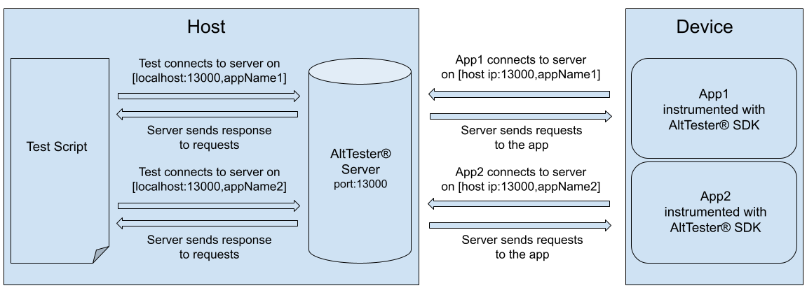
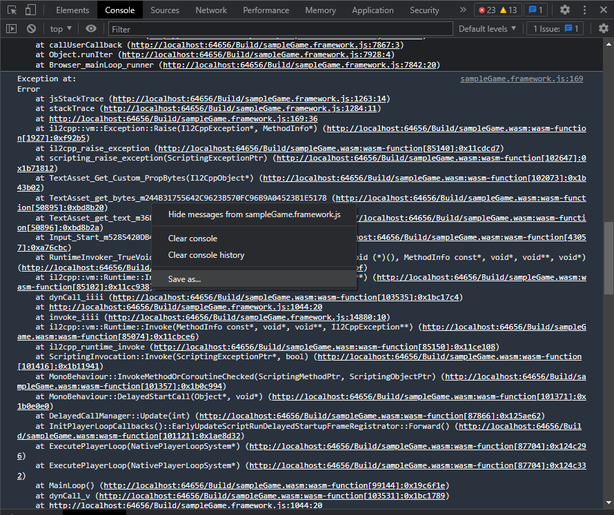

# Advanced Usage

This guide covers some of the more advanced features, patterns and
configuration options of AltTester Unity SDK.

## AltTester input vs. regular input

AltTester's custom input is active, by default, in any instrumented build. This means that certain input related actions (the ones that are part of Unity's `Input` class) will be inactive for regular input (the device's input). Because of this, pressing a key from the keyboard for example will not have any effect on the app. However, the simulated input from the tests, like the `PressKey` command, will be able to manipulate the object within the scene. While the AltTester input is active, the icon from the right bottom corner is green. You can change this behaviour by clicking on the AltTester's icon and unchecking the box with the `AltTester Input` message. Now the icon will turn darker, signaling that the regular input is active. In this state, you can interfere with the object from the app using the keyboard or other input. Keep in mind that, input actions from the AltTester Desktop won't have any effect while regular input is active. At the same time, if you want to run some automated tests, the AltTester input will be activated automatically for you.

## Build apps from the command line

To build your Unity application from command line you need a static method in
your project that handles the build logic. To instrument your Unity application
with AltTester Unity SDK, your build method must define `ALTTESTER` scripting
symbol and must insert AltTester Prefab in the first scene of the app.

Depending on your project's setup, there are two ways in which apps can be
built from the command line:


```eval_rst
.. note::

    AltTester Unity SDK does not work by default in release mode. If you instrument
    your app in release mode, AltTester Prefab self removes from the scenes and
    the socket server does not start. Best case practice is to customize your
    build script to insert AltTester Prefab only in Debug mode.

    If you do want to use AltTester Unity SDK in release mode see
    `Using AltTester Unity SDK in Release mode section <#using-alttester-in-release-mode>`_.

```


**1. If you already have a custom build method for your app**

If you already have a custom build method for your app, you can add the
following lines to your build method. Also, the BuildPlayerOptions should
check for *BuildOptions.Development* and *BuildOptions.IncludeTestAssemblies*.

```c#
var buildTargetGroup = BuildTargetGroup.Android;
AltBuilder.AddAltTesterInScriptingDefineSymbolsGroup(buildTargetGroup);
if (buildTargetGroup == UnityEditor.BuildTargetGroup.Standalone) {
    AltBuilder.CreateJsonFileForInputMappingOfAxis();
}
var instrumentationSettings = new AltInstrumentationSettings();
AltBuilder.InsertAltInScene(FirstSceneOfTheApp, instrumentationSettings);
```

```eval_rst
.. note::

    Change ``buildTargetGroup`` above to the target group for which you are
    building.

```


**2. If you create a new custom build method for your app**

The following example script can be used. It sets all the project settings
needed and uses the same two important lines from point 1 above.

This example method is configured for the Android platform, so make sure to
update it based on your target platform.

```eval_rst
.. include:: ../_static/examples~/advanced-usage/build-from-command-line.txt
    :code: c#

```

The following command is used to call the build method:

```eval_rst
.. code-block:: bash

    <UnityPath>/Unity -projectPath $CI_PROJECT_DIR -executeMethod BuilderClass.BuildFromCommandLine -logFile logFile.log -quit

```

You can find more information about the build command and arguments
[here](https://docs.unity3d.com/Manual/CommandLineArguments.html).

```eval_rst
.. note::

    After building from the command line you can run the tests by using the
    commands from the `next section <#run-tests-from-the-command-line>`_.

```

## Run tests from the command line

In order to run tests from the command line you can use the following example
commands:

```eval_rst
.. tabs::

    .. tab:: C#

        Available AltTester SDK command line arguments:

        ``-testsClass`` - runs tests from given class/classes

        Example command running tests from a single test class:

        .. code-block:: bash

            <UnityPath>/Unity -projectPath $PROJECT_DIR -executeMethod AltTesterEditor.AltTestRunner.RunTestFromCommandLine -testsClass MyTestClass -logFile logFile.log -batchmode -quit

        Example command running tests from two test classes:

        .. code-block:: bash

            <UnityPath>/Unity -projectPath $PROJECT_DIR -executeMethod AltTesterEditor.AltTestRunner.RunTestFromCommandLine -testsClass MyTestClass1 MyTestClass2 -logFile logFile.log -batchmode -quit

        ``-tests`` - runs given test/tests

        Example command running a single test:

        .. code-block:: bash

            <UnityPath>/Unity -projectPath $PROJECT_DIR -executeMethod AltTesterEditor.AltTestRunner.RunTestFromCommandLine -tests MyTestClass.MyTestName -logFile logFile.log -batchmode -quit

        Example command running two tests:

        .. code-block:: bash

            <UnityPath>/Unity -projectPath $PROJECT_DIR -executeMethod AltTesterEditor.AltTestRunner.RunTestFromCommandLine -tests MyTestClass1.MyTestName1 MyTestClass2.MyTestName2 -logFile logFile.log -batchmode -quit

        ``-testsAssembly`` - runs tests from given assembly/assemblies

        Example command running all tests from given assembly:

        .. code-block:: bash

            <UnityPath>/Unity -projectPath $PROJECT_DIR -executeMethod AltTesterEditor.AltTestRunner.RunTestFromCommandLine -testsAssembly MyAssembly -logFile logFile.log -batchmode -quit

        Example command running tests from two assemblies:

        .. code-block:: bash

            <UnityPath>/Unity -projectPath $PROJECT_DIR -executeMethod AltTesterEditor.AltTestRunner.RunTestFromCommandLine -testsAssembly MyAssembly1 MyAssembly2 -logFile logFile.log -batchmode -quit

        ``-reportPath`` - the xml test report will be generated here
        
        .. code-block:: bash

            <UnityPath>/Unity -projectPath $PROJECT_DIR -executeMethod AltTesterEditor.AltTestRunner.RunTestFromCommandLine -tests MyFirstTest.TestStartGame -reportPath $PROJECT_DIR/testReport.xml -logFile logFile.log -batchmode -quit

    .. tab:: Java

        .. code-block:: bash

            mvn test

    .. tab:: Python

        Using the ``unittest`` module:

        .. code-block:: bash

            python -m unittest <name_of_your_test_file.py>

        Using the ``pytest`` package:

        .. code-block:: bash

            pytest  <name_of_your_test_file.py>

```

## Run tests on a Continuous Integration Server

1. Instrument your app build with AltTester Unity SDK from Unity or by [building from the command line](#build-apps-from-the-command-line).
2. Start the app build on a device.
3. Run your tests - see commands in the ["Run tests from the command line" section](#run-tests-from-the-command-line).

An example CI configuration file can be viewed in the [GitLab repository](https://gitlab.com/altom/altunity/altunitytester/-/blob/master/.gitlab-ci.yml).


## What is port forwarding and when to use it

Port forwarding, or tunneling, is the behind-the-scenes process of intercepting
data traffic headed for a computer’s IP/port combination and redirecting it to
a different IP and/or port.

When you run your app instrumented with AltTester Unity SDK, on a device, you need
to tell your AltDriver how to connect to it.

Port forwarding can be set up either through a command line command or in the
test code by using the methods available in AltTester SDK classes.

The following are some cases when Port Forwarded is needed:

1. [Connect to the app running on a USB connected device](#connect-to-the-app-running-on-a-usb-connected-device)
2. [Connect to multiple devices running the app](#connect-to-multiple-devices-running-the-app)

### How to setup port forwarding

Port forwarding can be set up in three ways:

- through a command line command (using ADB/IProxy)
- in the test code by using the methods available in AltTester SDK classes
- from AltTester Editor - Port Forwarding Section

All methods listed above require that you have ADB or IProxy installed.

For installing ABD, check [this article](https://developer.android.com/studio/command-line/adb) for more information on ADB.

For installing IProxy `brew install libimobiledevice`. (_Requires IProxy 2.0.2_)

```eval_rst
.. tabs::

    .. tab:: Command Line

        .. tabs::

            .. tab:: Android

                - Forward the port using the following command::

                    adb [-s UDID] forward tcp:local_port tcp:device_port

                - Forward using AltTester Editor: click on the refresh button in the Port Forwarding section in the Editor to see    connected devices and then select the device to forward.

            .. tab:: iOS

                - Forward the port using the following command::

                    iproxy LOCAL_PORT DEVICE_PORT -u [UDID]

                - Forward using AltTester Editor: click on the refresh button in the Port Forwarding section in the Editor to see connected devices and then select the device to forward.

    .. tab:: C#

        .. tabs::

            .. tab:: Android

                Use the following static methods (from the ``AltPortForwarding`` class) in your test file:

                    - ForwardAndroid (int localPort = 13000, int remotePort = 13000, string deviceId = "", string adbPath = "")
                    - RemoveForwardAndroid (int localPort = 13000, string deviceId = "", string adbPath = "")

                Example test file:

                    .. include:: ../_static/examples~/common/csharp-android-test.cs
                        :code: c#

            .. tab:: iOS

                Use the following static methods (from the AltPortForwarding class) in your test file:

                    - ForwardIos(int localPort = 13000, int remotePort = 13000, string deviceId = "", string iproxyPath = "")
                    - KillAllIproxyProcess()

                Example test file:

                    .. include:: ../_static/examples~/common/csharp-ios-test.cs
                        :code: c#

    .. tab:: Java

        .. tabs::

            .. tab:: Android

                Use the following static methods (from the AltPortForwarding class) in your test file:

                    - forwardAndroid (int localPort = 13000, int remotePort = 13000, string deviceId = "", string adbPath = "")
                    - removeForwardAndroid (int localPort = 13000, string deviceId = "", string adbPath = "")

                Example test file:

                    .. include:: ../_static/examples~/common/java-android-test.java
                        :code: java

            .. tab:: iOS

                Use the following static methods (from the AltPortForwarding class) in your test file:

                    - forwardIos (int localPort = 13000, int remotePort = 13000, string deviceId = "", string iproxyPath = "")
                    - killAllIproxyProcess ()

                Example test file:

                    .. include:: ../_static/examples~/common/java-ios-test.java
                        :code: java

    .. tab:: Python

        .. tabs::

            .. tab:: Android

                Use the following static methods (from the AltPortForwarding class) in your test file:

                    - forward_android (local_port = 13000, device_port = 13000, device_id = "")
                    - remove_forward_android (local_port = 13000, device_id = "")

                Example test file:

                    .. include:: ../_static/examples~/common/python-android-test.py
                        :code: py

            .. tab:: iOS

                Use the following static methods (from the AltPortForwarding class) in your test file:

                    - forward_ios (local_port = 13000, device_port = 13000, device_id = "")
                    - kill_all_iproxy_process()

                Example test file:

                    .. include:: ../_static/examples~/common/python-ios-test.py
                        :code: py

```

```eval_rst
.. note::
    The default port on which the AltTester Unity SDK is running is 13000.
    Port can be changed when making a new app build or make use of port forwarding if needed.
```

## Connect to AltTester Unity SDK running inside the app

There are multiple scenarios on how to connect to the AltTester Unity SDK running inside a app:

- [Advanced Usage](#advanced-usage)
  - [Build apps from the command line](#build-apps-from-the-command-line)
  - [Run tests from the command line](#run-tests-from-the-command-line)
  - [Run tests on a Continuous Integration Server](#run-tests-on-a-continuous-integration-server)
  - [What is port forwarding and when to use it](#what-is-port-forwarding-and-when-to-use-it)
    - [How to setup port forwarding](#how-to-setup-port-forwarding)
  - [Connect to AltTester Unity SDK running inside the app](#connect-to-alttester-unity-sdk-running-inside-the-app)
    - [Connect to the app running on the same machine as the test code](#connect-to-the-app-running-on-the-same-machine-as-the-test-code)
    - [Connect to the app running on a USB connected device](#connect-to-the-app-running-on-a-usb-connected-device)
    - [Connect to the device running the app by using an IP address](#connect-to-the-device-running-the-app-by-using-an-ip-address)
    - [Connect to multiple devices running the app](#connect-to-multiple-devices-running-the-app)
    - [Connect to multiple builds of the application running on the same device](#connect-to-multiple-builds-of-the-application-running-on-the-same-device)
  - [Using AltTester Unity SDK in Release mode](#using-alttester-unity-sdk-in-release-mode)
  - [Logging](#logging)
    - [AltTester Unity SDK logging](#alttester-unity-sdk-logging)
    - [AltDriver logging](#altdriver-logging)
  - [Code Stripping](#code-stripping)

### Connect to the app running on the same machine as the test code


In this case Port Forwarding is not needed as both the app and tests are using localhost (127.0.0.1) connection and the default 13000 port.

### Connect to the app running on a USB connected device

If the device running the app is connected through a USB connection, commands sent to localhost port 13000 can be automatically forwarded to the device.


In this scenario you can use Port Forwarding to enable AltDriver to connect to the device via localhost.

Check [Port Forwarding](#what-is-port-forwarding-and-when-to-use-it) for more details about Port Forwarding and [Setup Port Forwarding](#how-to-setup-port-forwarding) section on how to make the setup.

### Connect to the device running the app by using an IP address


You can connect directly through an IP address if the port the instrumented Unity App is listening on is available and the IP address is reachable.
It is recommended to use [Port Forwarding](#what-is-port-forwarding-and-when-to-use-it) since IP addresses could change and would need to be updated more frequently.

The following command can be used to connect to the running instrumented Unity App:

```eval_rst
.. tabs::
    .. code-tab:: c#

            altDriver = new AltDriver ("deviceIp", 13000);

    .. code-tab:: java

            altDriver = new AltDriver ("deviceIp", 13000, true);

    .. code-tab:: py

            cls.altDriver = AltDriver(host='deviceIp', port=13000)
```

### Connect to multiple devices running the app



For two devices you have to do the same steps above, by [connecting through port forwarding](#how-to-setup-port-forwarding) twice.

So, in the end, you will have:

-   2 devices, each with one instrumented Unity App
-   1 computer with two AltDrivers

Then, in your tests, you will send commands from each of the two AltDrivers.

The same happens with n devices, repeat the steps n times.

### Connect to multiple builds of the application running on the same device

If you want to run two builds on the same device you will need to change the AltTester Unity SDK Port during instrumentation.

For example, you will instrument a app with AltTester Unity SDK to listen on port 13001 and another one to listen on port 13002.


Then in your tests you will need to create two AltDriver instances, one for each of the configured ports.

```eval_rst
.. important::

    On mobile devices, AltDriver can only interact with a single app at a time and the app needs to be in focus.

    On Android/iOS only one application is in focus at a time so you need to switch (in code) between the applications if using two drivers at the same time.
    This applies even when using split screen mode.

```

You can change the port for your app build from the AltTester Editor window inside your Unity project.


```eval_rst

.. note::
    After you have done the AltTester Unity SDK Port forwarding or connected to the AltDriver directly, you can use it in your tests to send commands to the server and receive information from the app.

```

## Using AltTester Unity SDK in Release mode

By default AltTester Unity SDK does not run in release mode. We recommended that you do not instrument your Unity application in release mode with AltTester Unity SDK. That being said, if you do want to instrument your application in release mode, you need to uncheck `RunOnlyInDebugMode` flag on AltRunnerPrefab inside AltTester Unity SDK asset folder `AltTester/Prefab/AltRunnerPrefab.prefab`

## Logging

There are two types of logging that can be configured in AltTester Unity SDK. The logs from AltDriver (from the tests) and the logs from the AltTester Unity SDK (from the instrumented Unity application)

```eval_rst
.. note::

    From version 1.7.0 on logs from `Server` are referred to as logs from `Tester`.

```

### AltTester Unity SDK logging

Logging inside the instrumented Unity application is handled using a custom NLog LogFactory. The Server LogFactory can be accessed here: `AltTester.Logging.ServerLogManager.Instance`

There are two logger targets that you can configure on the server:

-   FileLogger
-   UnityLogger

Logging inside the instrumented app can be configured from the driver using the SetServerLogging command:

```eval_rst
.. tabs::

    .. code-tab:: c#

        altDriver.SetServerLogging(AltLogger.File, AltLogLevel.Off);
        altDriver.SetServerLogging(AltLogger.Unity, AltLogLevel.Info);

    .. code-tab:: java

        altDriver.setServerLogging(AltLogger.File, AltLogLevel.Off);
        altDriver.setServerLogging(AltLogger.Unity, AltLogLevel.Info);

    .. code-tab:: py

        altDriver.set_server_logging(AltLogger.File, AltLogLevel.Off);
        altDriver.set_server_logging(AltLogger.Unity, AltLogLevel.Info);

```

### AltDriver logging

Logging on the driver is handled using `NLog` in C#, `loguru` in python and `log4j` in Java. By default logging is disabled in the driver (tests). If you want to enable it you can set the `enableLogging` in `AltDriver` constructor.

```eval_rst
.. tabs::

    .. tab:: C#

        Logging is handled using a custom NLog LogFactory.  The Driver LogFactory can be accessed here: `AltTester.AltDriver.Logging.DriverLogManager.Instance`

        There are three logger targets that you can configure on the driver:

        * FileLogger
        * UnityLogger //available only when runnning tests from Unity
        * ConsoleLogger //available only when runnning tests using the Nuget package

        If you want to configure different level of logging for different targets you can use `AltTester.AltDriver.Logging.DriverLogManager.SetMinLogLevel(AltLogger.File, AltLogLevel.Info)`

        .. code-block:: c#

            /* start AltDriver with logging disabled */
            var altDriver = new AltDriver (enableLogging: false);

            /* start AltDriver with logging enabled for Debug.Level; this is the default behaviour*/
            var altDriver = new AltDriver (enableLogging: true);

            /* disable AltDriver logging */
            altDriver.SetLogging(enableLogging: false);

            /* enable AltDriver logging */
            altDriver.SetLogging(enableLogging: true);

            /* set logging level to Info for File target */
            AltTester.AltDriver.Logging.DriverLogManager.SetMinLogLevel(AltLogger.File, AltLogLevel.Info);


    .. tab:: Java

        Logging is handled via log4j. You can use log4j configuration files to customize your logging.

        Setting the `enableLogging` in `AltDriver` initializes logger named `ro.AltTester` configured with two appenders, a file appender `AltFileAppender` and a console appender `AltConsoleAppender`

        .. code-block:: java

            /* start AltDriver with logging enabled */
            altDriver = new AltDriver("127.0.0.1", 13000, true);

            /* disable logging for ro.AltTester logger */
            final LoggerContext ctx = (LoggerContext) LogManager.getContext(false);
            final Configuration config = ctx.getConfiguration();
            config.getLoggerConfig("ro.AltTester").setLevel(Level.OFF);

            ctx.updateLoggers();


    .. tab:: Python

        Logging is handled via loguru.

        Setting the `enable_logging` to `False` in AltDriver, all logs from `alttester` package are disabled.

        .. code-block:: python

            # enable logging in driver:
            loguru.logger.enable("alttester")

            # disable logging in driver:
            loguru.logger.disable("alttesterr")

```

## Logging in WebGL

The logs for a WebGL instrumented build are displaied in the browser's console. You can open the `Console` tab by pressing `F12`. To download the logs right click inside the `Console` and choose `Save as...`.



## Code Stripping

AltTester Unity SDK is using reflection in some of the commands to get information from the instrumented application. If you application is using IL2CPP scripting backend then it might strip code that you would use in your tests. If this is the case we recommend creating an `link.xml` file. More information on how to manage code stripping and create an `link.xml` file is found in [Unity documentation](https://docs.unity3d.com/Manual/ManagedCodeStripping.html)
