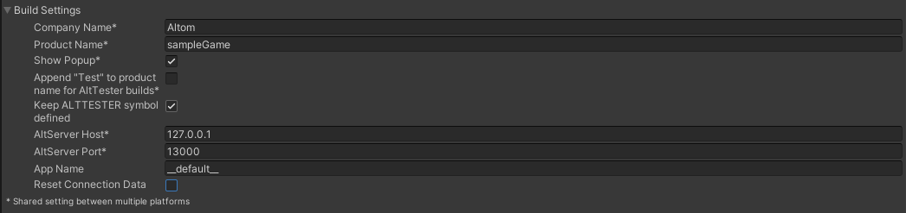
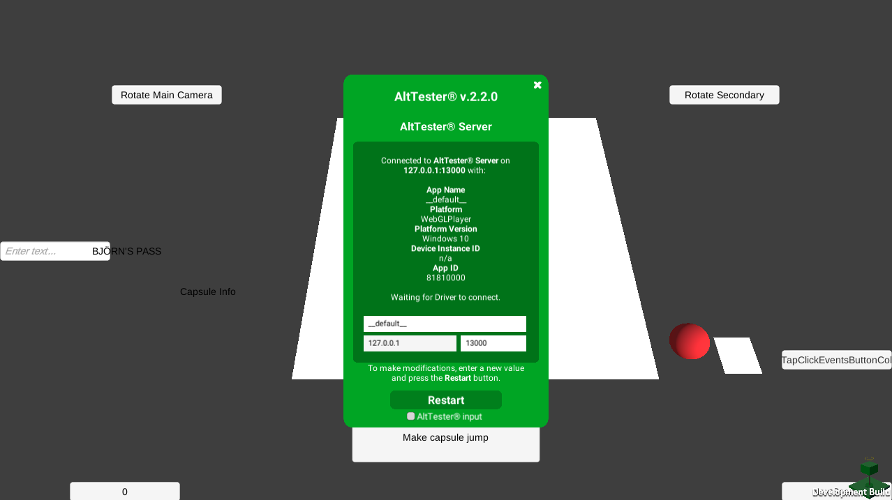

# AltTester® Editor

The GUI refers to the AltTester® Editor window that is displayed when
adding the AltTester® package in Unity.


In the following sections you can see a breakdown of all the sections in the GUI.

## Tests List


-   displays all the available tests from the project folder
-   user can use the Refresh button to update the tests list after making some changes in the test script
-   user can select what tests to run by checking the checkbox next to their name
-   user can either check each test individually or check the whole class of tests
-   tests that passed have a green checkmark while tests that failed are shown with a red x icon
-   Test Log Summary: contains a log for why a test has failed (see right side of screenshot)

```eval_rst

.. note::

    Make sure that each time you modify anything in the test script (e.g. test's name, code, add or delete a test etc.) before running tests in the AltTester® Editor you click the Refresh button to update the tests list.

```

```eval_rst

.. note::

    If the AltTest script is created inside a folder (or a folder that has a parent folder) that does not contain an assembly definition file then in the Tests list it will be displayed inside Assembly-CSharp-Editor.dll. Otherwise, if it is created inside a folder (or a folder that has a parent folder) that already contains an assembly definition file then in the Tests list it will be displayed inside that assembly definition.

```

## Build Settings



- *Company Name*

    Company name used for the app build (same with Unity's Player Settings).

- *Product Name*

    The product name (same with Unity's Player Settings).

- *Hide AltTester Popup Option*
    You can choose to hide the green AltTester popup by checking the "Hide Green Popup" option in the AltTester Editor. When checked, the popup will not be shown in the instrumented build.

    *Toggling the Popup at Runtime*
    You can show or hide it at any time using the following platform-specific shortcuts:
          - Desktop (PC/Mac): Press <kbd>Ctrl</kbd> + <kbd>Alt</kbd> + <kbd>T</kbd>.
          - Mobile (Android/iOS): Hold three fingers on the screen for one second. 



-   *Append "Test" to product name for AltTester® Unity SDK builds*:

    Will add "Test" to the product name.

-   *Keep ALTTESTER symbol defined*:

    Will add "ALTTESTER" to the scripting define symbols. This is usually done automatically when entering in play mode or building the application. This option is not recommended if you are developing your application but can be used if you are on a branch where you only write tests.

- *AltTester® Server Host*

    Refers to the host the AltTester® Server is listening on.
    You can change this value and make a new app build if you want to use another host.

- *AltTester® Server Port*

    Refers to the port the AltTester® Server is listening on.
    You can change this value and make a new app build if you want to use another port.

- *Reset Connection Data*

    In case you are building your app on the same device but you do not want to start the new build with the connection data from the old build, you will want to check this box. Even if you managed to connect to the old build with different data, your new build will use the host, port and app name specified in the Build Settings.

     You can also use the shortcut:
    - Press <kbd>LeftCtrl</kbd> + <kbd>LeftShift</kbd> + <kbd>D</kbd> + <kbd>L</kbd> to reset your connection data to the default values specified in the Build Settings.

## Test run Settings


- *Create XML Report*

    If this option is checked, it will generate an XML report for the tests run.

- *XML file path*

    The path for the XML report file.

```eval_rst

.. note::

    Make sure to provide a name followed by the **.xml** extention in the path for the report. If no location is provided, the file will be generated in the parent folder of the Unity project.

```

## Scene Manager


- The Scene Manager pane displays a list of the Scenes from your Project. Checked scenes are included in the build.
- Unity uses the list of Scenes to determine the order that it loads the Scenes in. To adjust the order of the Scenes use the action buttons   associated to each scene to move them up or down the list.
- Display scene full path: displays the full path where the scenes are located.
- Add Scene: displays all the scenes in the project. User can add scenes to the "Scene Manager" from the "Add Scene" popup.
- Action buttons (add / select / remove scenes).

## Build & Run Settings

_Platform Settings_

```eval_rst
    .. tabs::

        .. tab:: Android

            .. image:: ../_static/img/alttester-editor/settings-android.png
                :alt: Android Settings Section

            The **Android Bundle Identifier** field: fill in a valid bundle ID.

            The **Build Location** field: the build path for the instrumented Unity application.

                - By default, the *Output Path* is a folder with the same name as your app.

        .. tab:: iOS

            .. image:: ../_static/img/alttester-editor/settings-ios.png
                :alt: iOS Settings Section

            The **iOS Bundle Identifier** field: fill in a valid bundle ID.

            The **Signing Team ID** field: fill in with the team's ID.

            The **Automatically Signed** field: check this for default signing.

            The **Build Location** field: the build path for the instrumented Unity application.

                - By default, the *Output Path* is a folder with the same name as your app.

        .. tab:: Editor

            .. image:: ../_static/img/alttester-editor/settings-editor.png
                :alt: Editor Settings Section

        .. tab:: Standalone

            .. image:: ../_static/img/alttester-editor/settings-standalone.png
                :alt: Standalone Settings Section

            The **Build Target** field: choose build mode according to platform.

            The **Build Location** field: the build path for the instrumented Unity application.

                - By default, the *Output Path* is a folder with the same name as your app.

        .. tab:: WebGL

            .. image:: ../_static/img/alttester-editor/settings-webgl.png
                :alt: WebGL Settings Section

            The **Build Location** field: the build path for the instrumented Unity application.

                - By default, the *Output Path* is a folder with the same name as your app.
```

_Build Settings_

    * Build Only

_Run Settings_

    * Play in Editor
    * Build & Run

_Run Tests Settings_

    * Run All Tests
    * Run Selected Tests
    * Run Failed Tests


```eval_rst
.. note::

    Run Tests does not use the options set in the Platform section.

```
