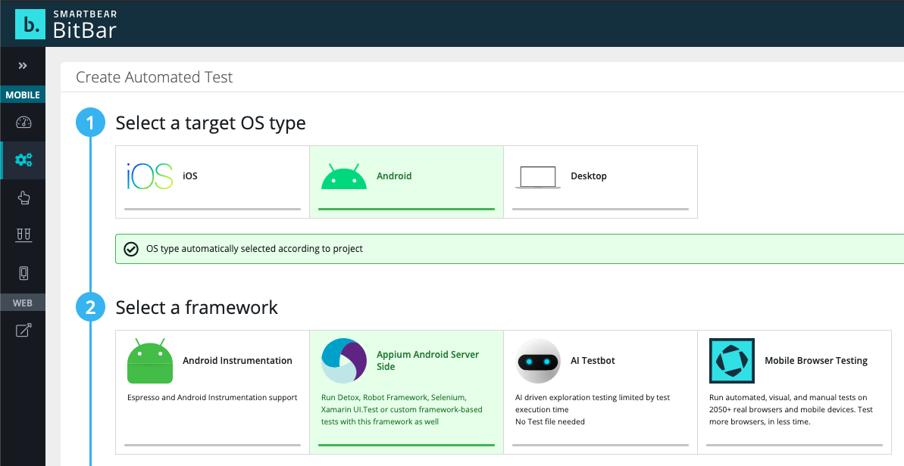
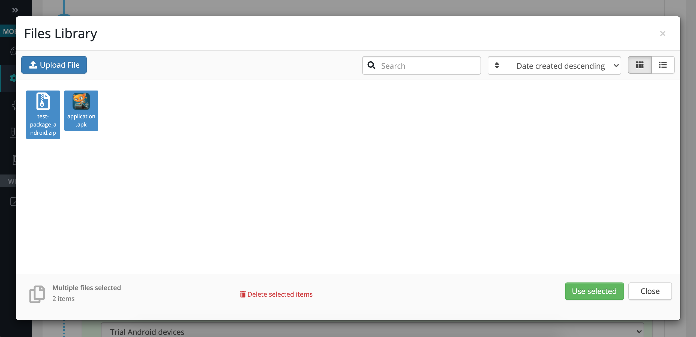
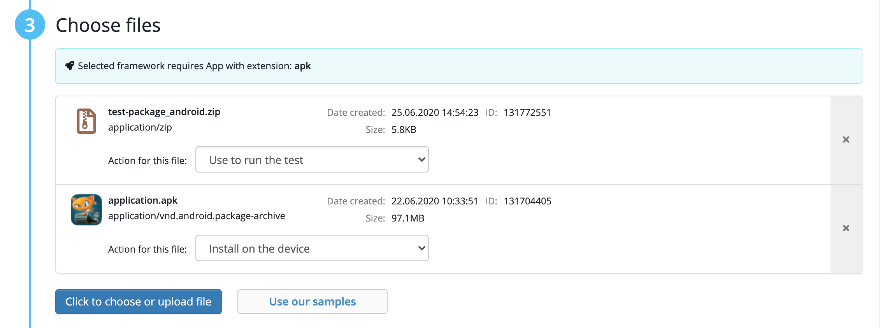

# Running tests using device cloud services

In some cases you might want to run your tests on dozens or even hundreds of real devices, to test the compatibility of your app on many different device models and OS versions. There are multiple device farms that will enable you to do so, without having to own the devices yourself.

Some of these cloud services allow running Appium automated tests by giving you access to an Appium server running in the cloud that has access to all their mobile devices. These services will work with AltTester Unity SDK only if they also offer some solution for local testing / tunneling that supports web sockets, so that the device in the cloud can access the AltTester Desktop app running locally on your machine. So far, we know that **BrowserStack** (with BrowerStack Local) and **Sauce Labs** work with AltTester.

```eval_rst

.. note::
    BrowserStack and Sauce Labs don’t support server side testing, meaning that the test folder can’t be uploaded onto the platform in order to run the tests. Client side testing generally focuses on testing the application or website directly on the user’s end. For testing carried out on cloud services, this means that the test suite is stored locally, on a computer and connected to a device in the cloud.

```

However, some of these cloud services give you access to a virtual machine or a Docker container that has a cloud device attached, where you upload your tests, configure your environment and run your tests. 

**AWS Device Farm** and **BitBar Cloud** both offer this type of "server-side" running, so they both support running AltTester tests. If you know of any other device cloud providers that might support this, please let us know and we will try them out.

## BrowserStack

If you want to run AltTester Unity SDK tests client side on a cloud service you may try using **BrowserStack App Automate**.

BrowserStack doesn't support server side testing, meaning that the user can't upload the test suite and the build on the cloud and then run them using a script.

An option for running tests that are not stored locally is to integrate with CI/CD tools, like **GitHub Actions**. 

### BrowserStack App Automate C# project example

BrowserStack App Automate is a cloud-based testing platform that allows developers and testers to perform automated testing of mobile applications on a wide range of real devices. 

In this automation process, BrowserStack uses a set of Appium capabilities to customize and configure the testing environment to match various scenarios.

<!-- to update here the article link-->
You can download our example project from [here](https://github.com/alttester/EXAMPLES-CSharp-BrowserStack-AltTrashCat). Also, for more details check [this article](https://insert-article-link-here/) from our Blog.

Because our tests are written in C# using the NUnit framework, we used the [Appium with NUnit section](https://www.browserstack.com/docs/app-automate/appium/getting-started/c-sharp/nunit) from the BrowserStack App Automate documentation to guide us through client side testing.

An important aspect of running tests on BrowserStack is that there’s a [local testing connection](https://www.browserstack.com/docs/app-automate/appium/getting-started/c-sharp/nunit/local-testing#3-configure-and-run-your-local-test) needed. **Local Testing**, a BrowserStack option, allows us to conduct automated test execution for mobile apps that access resources hosted in development or testing environments.

```eval_rst
.. image:: ../_static/img/alttester-with-cloud/browserstack-local-diagram.png
```

#### **Prerequisites**
- Test suite - we used [EXAMPLES-TrashCat-Tests](https://github.com/alttester/EXAMPLES-TrashCat-Tests)
- AltTester Desktop app installed for running AltServer
- [BrowserStack account](https://www.browserstack.com/users/sign_in?utm_source=google&utm_medium=cpc&utm_platform=paidads&utm_content=610276476173&utm_campaign=Search-Brand-Tier2-EMEA-CL&utm_campaigncode=BrowserStack.com+1011804&utm_term=p+browserstack%20com) - there is a free plan available that offers 100 min to run tests
- .NET `v5.0+` and NUnit `v3.0.0+`

#### **Steps for running tests on Android and iOS**

**1. Upload a test build of your app in BrowserStack and get the generated URL**

There are [two options](https://www.browserstack.com/docs/app-automate/appium/getting-started/c-sharp/nunit/integrate-your-tests#app-uploads-and-management) for passing the build:

a. you can upload the file (.apk or .ipa) from your local file system, as shown below - use the UI button available on the [Dashboard](https://app-automate.browserstack.com/dashboard/v2/quick-start/get-started)
```eval_rst
.. image:: ../_static/img/alttester-with-cloud/browserstack-upload-build.png
```

- a unique app ID, formatted as **bs://{app_id}** will be generated if the upload was successful - take note of this value because you will use it to specify the app capability for the application under test
- the app is stored in your account and it doesn’t change if you upload the same build

b. use the BrowserStack REST API endpoint

**2. Get BrowserStack credentials**

Once you are logged into your BrowserStack account, you can find the credentials in the AccessKey section in the [BrowserStack Dashboard](https://app-automate.browserstack.com/dashboard/v2/quick-start/get-started).

```eval_rst
.. image:: ../_static/img/alttester-with-cloud/browserstack-credentials.png
```

**3. Set the BrowserStack credentials and app ID as environment variables**

To set these values as environment variables on Windows you can create a **batch file** on your local machine and run it every time you load your IDE. This will keep the sensitive information out of the repository. 

Here is an example:

```
set BROWSERSTACK_USERNAME "yourUsername"
set BROWSERSTACK_ACCESS_KEY "yourAccessKey"
set BROWSERSTACK_APP_ID_SDK_201="yourAppId"
```

**4. Install dependencies**

In your code project, you need to install a Selenium WebDriver extension for Appium and C# Bindings for BrowserStack Local. Example:

```
dotnet add package Appium.WebDriver --version 4.4.0
dotnet add package BrowserStackLocal --version 2.3.0
```

**5. Create and configure new file**

In your repository, create a new file that will hold the required settings for the integration. This file will hold all of the **Appium** and **BrowserstackLocal** settings that ensure the connection between the local environment and the cloud device. For future reference it will be called [**BaseTest**](https://github.com/alttester/EXAMPLES-CSharp-BrowserStack-AltTrashCat/blob/main/tests/BaseTest.cs). Every test file in this project inherits this C# class. 

In this file add code that will:
- access the environment variables set in the previous steps using the `GetEnvironmentVariable` method like so:
    ```
    String BROWSERSTACK_USERNAME =Environment.GetEnvironmentVariable("BROWSERSTACK_USERNAME");
    String BROWSERSTACK_ACCESS_KEY = Environment.GetEnvironmentVariable("BROWSERSTACK_ACCESS_KEY");
    String BROWSERSTACK_APP_ID_SDK_201 = Environment.GetEnvironmentVariable("BROWSERSTACK_APP_ID_SDK_201");
    ```
- configure Appium capabilities and BrowserStack options
    - at this step you pass information to BrowserStack that configures the test environment as well as organizes the test runs - BrowserStack offers a [capabilities builder](https://www.browserstack.com/app-automate/capabilities?tag=w3c), which helps you determine what settings you need and how to format them correctly
    
    Example:

    ```eval_rst
    .. tabs::

        .. tab:: Android

            .. code-block:: console

                AppiumOptions capabilities = new AppiumOptions();
                Dictionary<string, object> browserstackOptions = new Dictionary<string, object>();

                browserstackOptions.Add("projectName", "TrashCat");
                browserstackOptions.Add("buildName", "TrashCat201Android");
                browserstackOptions.Add("sessionName", "tests - " + DateTime.Now.ToString("MMMM dd - HH:mm"));
                browserstackOptions.Add("local", "true");
                browserstackOptions.Add("userName", BROWSERSTACK_USERNAME);
                browserstackOptions.Add("accessKey", BROWSERSTACK_ACCESS_KEY);
                capabilities.AddAdditionalCapability("bstack:options", browserstackOptions);
                capabilities.AddAdditionalCapability("platformName", "android");
                capabilities.AddAdditionalCapability("platformVersion", "11.0");
                capabilities.AddAdditionalCapability("appium:deviceName", "Samsung Galaxy S21");
                capabilities.AddAdditionalCapability("appium:app", BROWSERSTACK_APP_ID_SDK_201);

        .. tab:: iOS

            .. code-block:: console

                AppiumOptions capabilities = new AppiumOptions();
                Dictionary<string, object> browserstackOptions = new Dictionary<string, object>();

                browserstackOptions.Add("projectName", "TrashCat");
                browserstackOptions.Add("buildName", "TrashCat201iOS");
                browserstackOptions.Add("sessionName", "tests - " + DateTime.Now.ToString("MMMM dd - HH:mm"));
                browserstackOptions.Add("local", "true");
                browserstackOptions.Add("userName", BROWSERSTACK_USERNAME);
                browserstackOptions.Add("accessKey", BROWSERSTACK_ACCESS_KEY);
                capabilities.AddAdditionalCapability("bstack:options", browserstackOptions);
                capabilities.AddAdditionalCapability("platformName", "ios");
                capabilities.AddAdditionalCapability("platformVersion", "16");
                capabilities.AddAdditionalCapability("appium:deviceName", "iPhone 14");
                capabilities.AddAdditionalCapability("appium:app", BROWSERSTACK_APP_ID_SDK_201);
    ```

- configure the local testing connection
    - using the BrowserStackLocal package, you need to start the local testing connection. You can do this in the code like this:

    ```
    browserStackLocal = new Local();
    List<KeyValuePair<string, string>> bsLocalArgs = new List<KeyValuePair<string, string>>() {
                            new KeyValuePair<string, string>("key", BROWSERSTACK_ACCESS_KEY)
    };
    browserStackLocal.start(bsLocalArgs);
    ```
    - this local connection can also be started manually. You need to download the [local binary from BrowserStack docs](https://www.browserstack.com/docs/local-testing/releases-and-downloads) and run the `.exe` file from its path

- start Appium Driver
    - in order to test remotely on BrowserStack, you need to use an instance of Appium Driver. For that, use the remote BrowserStack URL and your access credentials, which are stored inside the AppiumOptions variable named `capabilities`:

    ```eval_rst
    .. tabs::

        .. tab:: Android

            .. code-block:: console

                appiumDriver = new AndroidDriver<AndroidElement>(new Uri("https://hub-cloud.browserstack.com/wd/hub/"), capabilities);

        .. tab:: iOS

            .. code-block:: console

                appiumDriver = new IOSDriver<IOSElement>(new Uri("https://hub-cloud.browserstack.com/wd/hub/"), capabilities);
    ```

- initialize AltDriver
    ```
    altDriver = new AltDriver();
    ```
- [iOS] Handle permission pop-up
    - while running your tests on iOS you might get a pop-up that asks for permission to connect to devices on the local network
    - to accept this notification and give permission, use the following lines:
    ```
    IWebElement ll = appiumDriver.FindElement(OpenQA.Selenium.By.Id("Allow"));
    ll.Click();
    ```
- add method to keep Appium alive
    - in this context, Appium is only used to install the application and access it on the BrowserStack test device - after that, AltTester SDK picks up the connection and carries out the tests
    - you should add an action that keeps Appium alive in the `TearDown` method of the framework to ensure that Appium is used after every test. Here is an example:

    ```eval_rst
    .. tabs::

        .. tab:: Android

            .. code-block:: console

                appiumDriver.GetDisplayDensity();

        .. tab:: iOS

            .. code-block:: console

                appiumDriver.GetClipboardText();
    ```

- OneTimeTearDown: Quit the Appium driver and stop the local tunnel
    - at the end of your tests, add these methods in order to quit the driver and stop the BrowserStack local connection:

    ```
    [OneTimeTearDown]
    public void DisposeAppium()
    {
        Console.WriteLine("Ending");
        appiumDriver.Quit();
    altDriver.Stop();
        if (browserStackLocal != null)
        {
                browserStackLocal.stop();
        }
    }
    ```

- Additional step: Increase the idle timeout to 300s
    - if you have tests that take more than 90 seconds to complete, you can also set the maximum timeout using BrowserStack options:
    ```
    browserstackOptions.Add("idleTimeout", "300");
    ```

**6. Have AltTester Server running on local machine**

One of the [architectural changes from v2.0.0](https://alttester.com/alttester-desktop-2-0-0-alttester-unity-sdk-2-0-0-recorder-support-for-webgl-and-architectural-changes/) is that the AltServer module is incorporated in AltTester Desktop. In order to be able to execute tests, you need to have the **AltTester Desktop running** so that the AltDriver from the tests can connect to the local server. You can download the free version from [our website](https://alttester.com/alttester/#pricing).

**7. Run the tests**

Make sure AltTester Desktop is running, the environment variables are set and then trigger the test execution from the terminal with `dotnet test`.

### BrowserStack with GitHub Actions C# project example

A benefit that comes with the GitHub integration is that you don't need to have the AltTester Desktop app running on your computer in order to run the tests. In this case **AltServer** is running on another machine, making it possible for any team member to trigger the workflow that runs the tests on BrowserStack.

<!-- to update here the article link-->
You can download our example project from [here](https://github.com/alttester/EXAMPLES-CSharp-Cloud-Services-AltTrashCat). Also, for more details check [this article](https://insert-article-link-here/) from our Blog.

For this integration, the best solution is to create and use a **self-hosted runner** because it allows you to install and run the AltTester Desktop app that keeps AltServer active at all times. Starting with the [AltTester Unity SDK 2.0.0](https://alttester.com/alttester-desktop-2-0-0-alttester-unity-sdk-2-0-0-recorder-support-for-webgl-and-architectural-changes/) update it is required to have AltServer running in order to run tests.

#### **Local testing connection using BrowserStackLocal**

An important aspect of running tests on BrowserStack is that there’s a [local testing connection](https://www.browserstack.com/docs/app-automate/appium/getting-started/c-sharp/nunit/local-testing#3-configure-and-run-your-local-test) needed. Local Testing, a BrowserStack option, allows us to conduct automated test execution for mobile apps that access resources hosted in development or testing environments.
 
In this case we need a connection between the self-hosted runner that executes the tests and the BrowserStack device.

```eval_rst
.. image:: ../_static/img/alttester-with-cloud/browserstack-local-github-diagram.png
```

#### **Prerequisites**

- Test suite - we used [EXAMPLES-TrashCat-Tests](https://github.com/alttester/EXAMPLES-TrashCat-Tests)
- GitHub account and repository with the test suite
- [BrowserStack account](https://www.browserstack.com/users/sign_in?utm_source=google&utm_medium=cpc&utm_platform=paidads&utm_content=610276476173&utm_campaign=Search-Brand-Tier2-EMEA-CL&utm_campaigncode=BrowserStack.com+1011804&utm_term=p+browserstack%20com) - there is a free plan available that offers 100 min to run tests
- .NET v5.0+ and NUnit v3.0.0+
- A machine available to be defined as a self-hosted GitHub runner

#### **Setup steps**

For creating this testing context a Windows machine was defined as runner, but it is possible to use other systems as well. Please follow the [GitHub documentation](https://docs.github.com/en/actions/hosting-your-own-runners/managing-self-hosted-runners/adding-self-hosted-runners) for more details.

**1. Create a self-hosted runner and have AltServer running**

- the `Listening for jobs` line confirms that it is up and running
- now [download](https://alttester.com/alttester/#pricing), install and open the AltTester Desktop app (which contains AltServer)

**2. Upload a test build of your app in BrowserStack and get the generated URL**

Once you are logged into your BrowserStack account, upload your build instrumented with AltTester Unity SDK using the UI button available on Dashboard.
```eval_rst
.. image:: ../_static/img/alttester-with-cloud/browserstack-upload-build.png
```

**3. Set credentials and app id as GitHub Secrets**

In order to be authenticated, you need to define your username, access key and app ID (optional) as environment variables. To do that, you should set them as [GitHub Secrets](https://docs.github.com/en/actions/security-guides/encrypted-secrets?tool=webui#creating-encrypted-secrets-for-a-repository) first, due to the sensitivity of the information. Secrets can be defined in the Settings section of your repository.

Here is an example:

```
set BROWSERSTACK_USERNAME "yourUsername"
set BROWSERSTACK_ACCESS_KEY "yourAccessKey"
set BROWSERSTACK_APP_ID_SDK_201="yourAppId"
```

**4. Create .yml file and set environment variables**

Create a `.yml` file in your repository, under the `.github/workflows` folders. You can find it in the example repository as `BrowserStack.yml`.

To set the GitHub Secrets values as environment variables for your tests, use the following lines in the .yml workflow file:
```
env:
  BROWSERSTACK_USERNAME: ${{secrets.BROWSERSTACK_USERNAME}}
  BROWSERSTACK_ACCESS_KEY: ${{secrets.BROWSERSTACK_ACCESS_KEY}}
  BROWSERSTACK_APP_ID_SDK_201: ${{secrets.BROWSERSTACK_APP_ID_SDK_201}}
```

**5. Create a new file for BrowserStack and Appium configuration**

In your repository, create a new file that will hold the required settings for the integration. This file will hold all of the **Appium** and **BrowserStackLocal** settings that ensure the connection between the local environment and the cloud device. For future reference it will be called [BaseTest](https://github.com/alttester/EXAMPLES-CSharp-BrowserStack-AltTrashCat/blob/main/tests/BaseTest.cs). Every test file in this project inherits this C# class.

In this file add code that will:
- access the environment variables for BrowserStack credentials and app ID
    ```
    String BROWSERSTACK_USERNAME=Environment.GetEnvironmentVariable("BROWSERSTACK_USERNAME");
    String BROWSERSTACK_ACCESS_KEY = Environment.GetEnvironmentVariable("BROWSERSTACK_ACCESS_KEY");
    String BROWSERSTACK_APP_ID_SDK_201 =
    Environment.GetEnvironmentVariable("BROWSERSTACK_APP_ID_SDK_201");
    ```
- configure **Appium capabilities** (device details) and **BrowserStack options** (e.g. authentication, session details, local tunnel settings)

    Example:

    ```eval_rst
    .. tabs::

        .. tab:: Android

            .. code-block:: console

                AppiumOptions capabilities = new AppiumOptions();
                Dictionary<string, object> browserstackOptions = new Dictionary<string, object>();

                browserstackOptions.Add("projectName", "TrashCat");
                browserstackOptions.Add("buildName", "TrashCat201Android");
                browserstackOptions.Add("sessionName", "tests - " + DateTime.Now.ToString("MMMM dd - HH:mm"));
                browserstackOptions.Add("local", "true");
                browserstackOptions.Add("userName", BROWSERSTACK_USERNAME);
                browserstackOptions.Add("accessKey", BROWSERSTACK_ACCESS_KEY);
                capabilities.AddAdditionalCapability("bstack:options", browserstackOptions);
                capabilities.AddAdditionalCapability("platformName", "android");
                capabilities.AddAdditionalCapability("platformVersion", "11.0");
                capabilities.AddAdditionalCapability("appium:deviceName", "Samsung Galaxy S21");
                capabilities.AddAdditionalCapability("appium:app", BROWSERSTACK_APP_ID_SDK_201);

        .. tab:: iOS

            .. code-block:: console

                AppiumOptions capabilities = new AppiumOptions();
                Dictionary<string, object> browserstackOptions = new Dictionary<string, object>();

                browserstackOptions.Add("projectName", "TrashCat");
                browserstackOptions.Add("buildName", "TrashCat201iOS");
                browserstackOptions.Add("sessionName", "tests - " + DateTime.Now.ToString("MMMM dd - HH:mm"));
                browserstackOptions.Add("local", "true");
                browserstackOptions.Add("userName", BROWSERSTACK_USERNAME);
                browserstackOptions.Add("accessKey", BROWSERSTACK_ACCESS_KEY);
                capabilities.AddAdditionalCapability("bstack:options", browserstackOptions);
                capabilities.AddAdditionalCapability("platformName", "ios");
                capabilities.AddAdditionalCapability("platformVersion", "16");
                capabilities.AddAdditionalCapability("appium:deviceName", "iPhone 14");
                capabilities.AddAdditionalCapability("appium:app", BROWSERSTACK_APP_ID_SDK_201);

    ```

- configure the local testing connection
    - using the BrowserStackLocal package, you need to start the local testing connection. You can do this in the code like this:

    ```
    browserStackLocal = new Local();
    List<KeyValuePair<string, string>> bsLocalArgs = new List<KeyValuePair<string, string>>() {
                            new KeyValuePair<string, string>("key", BROWSERSTACK_ACCESS_KEY)
    };
    browserStackLocal.start(bsLocalArgs);
    ```
    - this local connection can also be started manually. You need to download the [local binary from BrowserStack docs](https://www.browserstack.com/docs/local-testing/releases-and-downloads) and run the `.exe` file from its path

- start Appium Driver
    - in order to test remotely on BrowserStack, you need to use an instance of Appium Driver. For that, use the remote BrowserStack URL and your access credentials, which are stored inside the AppiumOptions variable named `capabilities`:
    ```eval_rst
    .. tabs::

        .. tab:: Android

            .. code-block:: console

                appiumDriver = new AndroidDriver<AndroidElement>(new Uri("https://hub-cloud.browserstack.com/wd/hub/"), capabilities);

        .. tab:: iOS

            .. code-block:: console

                appiumDriver = new IOSDriver<IOSElement>(new Uri("https://hub-cloud.browserstack.com/wd/hub/"), capabilities);

    ```

- initialize AltDriver
    ```
    altDriver = new AltDriver();
    ```

- [iOS] Handle permission pop-up
    - while running your tests on iOS you might get a pop-up that asks for permission to connect to devices on the local network
    - to accept this notification and give permission, use the following lines:
    ```
    IWebElement ll = appiumDriver.FindElement(OpenQA.Selenium.By.Id("Allow"));
    ll.Click();
    ```

- add method to keep Appium alive
    - in this context, Appium is only used to install the application and access it on the BrowserStack test device - after that, AltTester SDK picks up the connection and carries out the tests
    - you should add an action that keeps Appium alive in the `TearDown` method of the framework to ensure that Appium is used after every test. Here is an example:

    ```eval_rst
    .. tabs::

        .. tab:: Android

            .. code-block:: console

                appiumDriver.GetDisplayDensity();

        .. tab:: iOS

            .. code-block:: console

                appiumDriver.GetClipboardText();
    ```

- OneTimeTearDown: Quit the Appium driver and stop the local tunnel
    - at the end of your tests, add these methods in order to quit the driver and stop the BrowserStack local connection:

    ```
    [OneTimeTearDown]
    public void DisposeAppium()
    {
        Console.WriteLine("Ending");
        appiumDriver.Quit();
    altDriver.Stop();
        if (browserStackLocal != null)
        {
                browserStackLocal.stop();
        }
    }
    ```

- Additional step: Increase the idle timeout to 300s
    - if you have tests that take more than 90 seconds to complete, you can also set the maximum timeout using BrowserStack options:
    ```
    browserstackOptions.Add("idleTimeout", "300");
    ```

**6. Define the workflow and run it**

Inside the workflow file (`BrowserStack.yml`), define a job that will configure the machine environment and run the tests. To do that, give a name to your job, assign the runner using labels and define the steps needed to run your tests.

You’ll see four steps defined for this job in the example repository:
- *Checkout the repository* - so that the workflow can access it
- *Setup dotnet* - in order to use a specific version of dotnet in the workflow
- *Restore dependencies* - to ensure that all dependencies required by the project are compatible with each other and there are no conflicts between them
- *Run tests*
```
jobs:
  csharp-tests-job:
    name: 'CSharp tests on BrowserStack'
    runs-on: [self-hosted, services]
    steps:
      - name: 'Checkout the repository'
        uses: actions/checkout@v2
        
      - name: Setup .NET
        uses: actions/setup-dotnet@v1
        with:
          dotnet-version: '7.0'
          
      - name: Restore dependencies
        run: dotnet restore

      - name: 'Running tests on BrowserStack'
        run:
          dotnet test
```
To run the workflow, set when you’d like it to be triggered [at the beginning of the file](https://docs.github.com/en/actions/using-workflows/triggering-a-workflow). In this example the workflow is set to run on every push on the *browserstack-example* branch. 
```
name: BrowserStack TrashCat
on:
  push:
    branches:
      - browserstack-example
```
After the job is picked up by the runner (depending on its availability), and the flow reaches the step *“Running tests on BrowserStack”*, you’ll see in your BrowserStack Dashboard that a new session has started. This is how a successfully running workflow looks like:
```eval_rst
.. image:: ../_static/img/alttester-with-cloud/browserstack-github-actions-workflow.png
```

## AWS Device Farm

Amazon offers another great alternative to cloud mobile testing, in the form of [**AWS Device Farm**](https://docs.aws.amazon.com/devicefarm/index.html). You can register for free and get a 1000 device minutes trial period (a credit card will be required for registration).

Because the application is instrumented with AltUnityTester SDK with a version ≥ v2.0.0, AltServer is no longer integrated into the instrumented application. In order to connect to AltServer, AltTester Desktop needs to be running and accessible from the devices running inside the AWS Device Farm. 

You can connect to AltTester Desktop in two ways:

**A. A remote connection**

- AltTester Desktop is opened in a remote location (e.g. a virtual machine in the cloud) from where it can be accessed through IP/URL.
- For the purpose of this example [AltTester Desktop was installed on an AWS instance](https://docs.google.com/document/d/1sZFnmYXsINdR5R0Szx1ce1Pao9_R0_jFiqNJZJv5BJU/edit#heading=h.o24rsr65ynnr). You can connect with the application through IP/URL. In this case, during instrumentation, you need to specify the IP/URL as the AltServerHost. 
- This works for both Android and iOS.

**B. A local connection**

- AltTester Desktop is installed on the AWS Device Farm VM. Therefore a localhost connection is established, so there is no need for setting the host during instrumentation. A license for running the application in batch mode is needed as well, which is stored separately in license.txt (Be aware to not make this file public). For an AltTester Desktop Linux build, please [contact us](https://alttester.com/about/#contact).
- The local connection works only for Android. Unfortunately, [IProxy does not have a way of setting up reverse port forwarding](https://alttester.com/docs/sdk/latest/pages/advanced-usage.html#in-case-of-ios).

You will need two files in order to run your tests:
* **.apk** file, with a build of your app containing the AltDriver;
* A **.zip** file containing your tests, the batchmode Linux AltTester Desktop build (in case of local connection), and other configuration files depending on the language you're running the tests on.

### AWS Device Farm python project example

You can download our example project from [here](https://github.com/alttester-test-examples/Python-AWS-AltTrashCat).

#### **Preparation steps**

**1. Prepare the application**
- Instrument the TrashCat application using AltTester Unity SDK `v2.0.2`. For additional information you can follow [this tutorial](https://alttester.com/walkthrough-tutorial-upgrading-trashcat-to-2-0-x/#Instrument%20TrashCat%20with%20AltTester%20Unity%20SDK%20v.2.0.x).
- Based on your option to connect to AltTester Desktop you need to set AltServer Host of the instrumented app to:
    - localhost (`127.0.0.1`) - for local connection 
    - IP/URL provided by the AWS Instance where AltTester Desktop is running - for remote connection

```eval_rst

.. note::
    If you want to use the AltTester Desktop Community edition (FREE plan) you need to create a Windows AWS Instance. You may only test on 1 device at a time.
    For the moment, the same applies if using the PRO edition too, as in the AWS Device Farm the tests run concurrently on devices and the instrumented app has the same AppName for all instances, which will not allow the AltServer to connect to all of them. In a future release, this problem will be handled so you may be able to test on more than 1 device (on the PRO edition). 

```

```eval_rst

.. note::
    If you are using the AltTester Desktop PRO edition for Linux batchmode you should take into account that when running tests on multiple devices for each device 1 license seat is required, as in the AWS Device Farm the tests run concurrently on devices and for each device, one instance of the AltTester Desktop is launched. In conclusion, you may only test on as many devices at a time as the available number of seats for your license key. 

```

**2. Prepare test code and dependencies**
- **for local connection** - from the cloned repository, create a **.zip** file containing:
    - the batchmode Linux build for AltTester Desktop (in the `AltTesterDesktopLinuxBatchmode` folder)
    - a `license.txt` file which will store your AltTester Desktop PRO license, needed to run batch mode commands. If you only have 1 seat per license please remove the activation in other places before using it here.
    - the `requirements.txt` file
    - the `tests` folder (which contains also the `pages` folder)
- **for remote connection** - from the cloned repository, create a **.zip** file containing:
    - the `requirements.txt` file
    - the `tests` folder (which contains also the `pages` folder) - don`t forget to add the IP/URL of the remote VM when defining AltDriver in ``base_test.py``
 
    Make sure to place all the files in the root directory.

**3. Prepare the configuration file**
- For a custom [test environment](https://docs.aws.amazon.com/devicefarm/latest/developerguide/custom-test-environments.html) you can edit the default configuration file by adding the needed commands. The commands are written as YAML so there are some validations for them
- Using the commands from the configuration file you can access the contents of the uploaded **.zip** folder, install applications, and ultimately run your tests

Keep in mind that the setup is different for Android and iOS. 

- **for local connection**
    - here are the commands needed in the Configuration file to run [AltServer in batchmode](https://alttester.com/docs/desktop/latest/pages/advanced-usage.html#running-altserver-in-terminal). You can choose to include these commands in your test code or add it in the Test Configuration file like in our example.

        ```
        export LICENSE_KEY=$(cat license.txt)
        cd AltTesterDesktopLinuxBatchmode
        ./AltTesterDesktop.x86_64 -batchmode -port 13000 -license $LICENSE_KEY -nographics -termsAndConditionsAccepted & 
        ```
        The `&` symbol is used to make the application run in the background. Failure to add the symbol will cause the commands following it to not be triggered. 
    - You also need to add port reverse forwarding when running on Android after Appium is started: 
        ```
        adb reverse -- remove-all
        adb reverse tcp:13000 tcp:13000
        ```
    - Don`t forget to remove the license activation after each run! 
        ```
        ./AltTesterDesktop.x86_64 -batchmode -removeActivation
        ```
- **for remote connection** - a way to connect to AltServer, within the AltTester Desktop application is by installing AltTester Desktop on an [Amazon EC2 Instance](https://docs.aws.amazon.com/AWSEC2/latest/UserGuide/Instances.html). The details of creating an EC2 Instance are out of scope, however, these are the main things to take into account for a successful connection: 
    - create a [Windows instance](https://docs.aws.amazon.com/AWSEC2/latest/WindowsGuide/EC2Win_Infrastructure.html) 
    ```eval_rst
        .. image:: ../_static/img/alttester-with-cloud/aws-windows-instance.png
    ```
    - add [Inbound rule to Security Group](https://docs.aws.amazon.com/AWSEC2/latest/WindowsGuide/working-with-security-groups.html#changing-security-group) to make port `13000` accessible - the custom TCP on port `13000` is needed to have the connection to AltTester Desktop default `13000` port  
    ```eval_rst
        .. image:: ../_static/img/alttester-with-cloud/aws-inbound-rule-to-security-group.png
    ``` 
    - [Connect to the Instance](https://docs.aws.amazon.com/AWSEC2/latest/WindowsGuide/connecting_to_windows_instance.html) through Remote Access Connection  
    ```eval_rst
        .. image:: ../_static/img/alttester-with-cloud/aws-connect-to-instance.png
    ```  
    - [Download AltTester Desktop for Windows](https://alttester.com/app/uploads/AltTester/desktop/AltTesterDesktop__v2.0.2.exe) and install it on the Instance  
    - [Associate an Elastic IP](https://docs.aws.amazon.com/AWSEC2/latest/UserGuide/elastic-ip-addresses-eip.html#using-instance-addressing-eips-associating), so that the IP remains constant after each opening of the instance
    ```eval_rst
        .. image:: ../_static/img/alttester-with-cloud/aws-associate-elastic-ip.png
    ```
```eval_rst

.. note::
    Please make sure to deactivate any Firewalls on the Windows VM, as it might block the connection.
```

#### **Steps for running tests on Android using the remote connection**

The instructions and resources will be for running tests on Android, for an application instrumented with AltUnityTester SDK v2.0.2 with a specific host (the elastic IP address provided when creating a remote connection), so that we can connect to it from an AWS Instance (remote connection).

```eval_rst

.. important::
    The remote connection needs to be opened and AltTester Desktop has to be running when starting a new automated run.
```
**1. Create a new project on AWS Device Farm**
- Access [AWS Device Farm](https://us-west-2.console.aws.amazon.com/devicefarm/home?region=us-east-1#/mobile/projects) of your account and create a new project like instructed [here](https://docs.aws.amazon.com/devicefarm/latest/developerguide/getting-started.html), making sure you are in `Mobile Device Testing` > `Projects`

**2. Create a new run**
- on the created project select `Create a new run`
- add the instrumented application build making sure you are on the `Mobile App` tab
- at the configuration step, choose *"Appium Python"* for the purpose of this example, then upload the **.zip** file
- the example project contains a **.yml** configuration file. Use it at the next step, by selecting *"Run your test in a custom environment"*. This will define how your test environment is set up and how the tests run
- the next step will allow you to select on which devices the tests will be executed. You can create your own device pool, or use the recommended top devices;
- for this example, no changes need to be done to the Device state configuration;
- at the last step, you can set the execution timeout for your devices, then start the tests.

Once the status is available the project screen will show the overall status of the tests execution progress and results. Selecting individual runs and devices will give detailed logs about the tests, together with a video recording of the run itself.

```eval_rst

.. note::
    The purpose of the example project is to offer a guide on how to run tests on AWS Device Farm, tests that are not adapted to pass on any type of Android device. In order for them to pass feel free to bring adjustments based on your needs.
```

### AWS Device Farm C# project example

AWS Device Farm does not offer an out-of-the-box solution for running tests written in C#, since it doesn't have an option for it, like in the case of Java or Python, for which there are Test Framework options available. However, using the Appium-ruby configuration from the test-type selection allows the upload of the tests written in C# as a zipped folder. 

<!-- to update here the article link-->
Check [this article](https://insert-article-link-here/) from our Blog for details on how to create the setup for running C# tests on the AWS Device Farm. The example project can be found [here](https://github.com/alttester/EXAMPLES-CSharp-AWS-AltTrashCat)

## BitBar Cloud

``` note::

    This section is not yet updated to work with version 2.0.*. We will updated this ASAP. 

```

BitBar Cloud is a platform that provides access to hundreds of real iOS and Android devices. It supports client side test execution, but also server-side test execution which we need in order to make AltTester work.

You can create a free account at <https://cloud.bitbar.com> and try out the test examples detailed below for yourself.

In order to run tests on the BitBart Cloud, you will first need to create two files:

* **.ipa** (for iOS) / **.apk** (for Android) file, with a build of your app containing the AltDriver;

If you’re unsure how to generate an **.ipa** file please watch the first half of [this video](https://www.youtube.com/embed/rCwWhEeivjY?start=0&end=199) for iOS.
After you finish setting up the build, you need to use the **Archive** option to generate the standalone **.ipa**. The required steps for the archive option are described [here](https://docs.saucelabs.com/mobile-apps/automated-testing/ipa-files/#creating-ipa-files-for-appium-testing). Keep in mind that you need to select **Development** at step 6.


* **.zip** file containing your tests and a script that defines how those tests will be run.
For more details about the content of this file please see the BitBar documentation [here](https://docs.bitbar.com/testing/scripted-run/)

```eval_rst
.. note::

   Please note that the ``run-tests.sh`` script that runs the tests needs to be at the root of the unzipped package. This means that your zipping method should not create an extra folder when compressing everything together.

```

### BitBar project example

``` note::

    This example is not yet updated to work with version 2.0.0. We will updated this ASAP. 

```

You can download our example BitBar project [here](https://github.com/alttester-test-examples/Python-Bitbar-AltTrashCat).
It contains a pre-built ***ipa*** and ***apk*** file, so you can try out running tests on both Android and iOS

**Steps to run the tests on BitBar:**
1. From the cloned repository, run the *`create-bitbar-package.sh <ios|android>`* script, choosing your desired os as a parameter. This will create a **.zip** file, containing all the files required to execute the tests;

2. On BitBar, create a new project, and Select a target OS type (Android in our example) and a framework (Appium Server Side);


3. Upload the application file (**.apk** or **.ipa**) and the **.zip** file. Please make sure to highlight both before clicking on *"Use selected"*.



    By default, the selected action for the zip file should be *“Use to run the test”* and for the app file *“Install on the device”*. If not, use the dropdown lists to select them.
    

4. If you are using a free account, leave the *“Use existing device group”* option checked, together with *“Trial Android devices”* selected. If you have a subscription, please see the BitBar Cloud documentation [here](https://docs.bitbar.com/testing/user-manuals/device-groups) for more info about creating your own device groups;

5. You can now create and run your automated tests.


Going back to the projects tab will allow you to monitor the progress of your tests and also show an overall status once the tests are done. Selecting an individual device will show you specific results for that device, as well as providing video recording of your test run.


## GitHub

GitHub Actions is a very powerful tool for creating a great process CI/CD. You can use public machines offered by GitHub or self-hosted runners in order to run tests automatically. We are using GitHub Actions to build and test our applications. You can see our workflows for AltTester Unity SDK [here](https://github.com/alttester/AltTester-Unity-SDK/tree/development/.github/workflows).

**Some useful links to create your workflows:**
  - [GitHub Action documentation](https://docs.github.com/en/actions)
  - [Unity Builder](https://github.com/marketplace/actions/unity-builder)
  - [Example project for running tests on a public machine](https://github.com/alttester/Example-Running-Tests-On-Github-Public-Runner)
  


