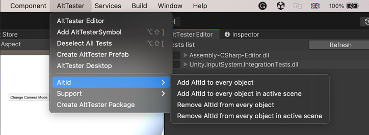

# API

If you are looking for information on a specific function, class or method, this part of the documentation is for you.

## AltDriver

The **AltDriver** class represents the main app driver component. When you instantiate an AltDriver in your tests, you can use it to "drive" your app like one of your users would, by interacting with all the app objects, their properties and methods.

An AltDriver instance will connect to the running instrumented Unity application. In the constructor, we need to tell the driver where (on what IP and on what port) the instrumented Unity App with a specific name is running and for how many seconds to let the communication opened.

**_Parameters_**

| Name           | Type    | Required | Description                                                                           |
| -------------- | ------- | -------- | ------------------------------------------------------------------------------------- |
| host           | string  | No       | The IP or hostname AltTester® Unity SDK is listening on. The default value is `127.0.0.1`. |
| port           | int     | No       | The default value is `13000`.                                                              |
| appName        | string  | No       | The name of the Unity application. The default value is `__default__`.                  |
| enableLogging  | boolean | No       | The default value is `false`.                                                           |
| connectTimeout | int     | No       | The connect timeout in seconds. The default value is `60`.                              |
| platform       | string  | No       | The platform of the Unity application. The default value is `unknown`.                  |
| platformVersion| string  | No       | The platform version of the Unity application. The default value is `unknown`.          |
| deviceInstanceId| string  | No      | The device instance id of the Unity application. The default value is`unknown`.         |
| appId        | string  | No         | The unique id of the Unity application. The default value is `unknown`.                 |

Once you have an instance of the _AltDriver_, you can use all the available commands to interact with the app. The available methods are the following:

### Find Objects

#### FindObject

Finds the first object in the scene that respects the given criteria. Check [By](#by-selector) for more information about criteria.

```eval_rst

.. important::
     Indexer functionality was changed in 2.0.2 to match that of XPath and it no longer returns the n-th child of the object. Now it returns the n-th object that respects the selectors (Name, Component, Tag, etc.) from the objects with the same parent. The numbering starts from 0 so the first object has the index 0 then the second object has the index 1 and so on. For example //Button/Text[1] will return the second object named `Text` that is the child of the `Button`
    
``````

**_Parameters_**

| Name        | Type               | Required | Description                                                                                                                                                                                                                                                                                                                                                                                                |
| ----------- | ------------------ | -------- | ---------------------------------------------------------------------------------------------------------------------------------------------------------------------------------------------------------------------------------------------------------------------------------------------------------------------------------------------------------------------------------------------------------- |
| by          | [By](#by-selector) | Yes      | Set what criteria to use in order to find the object.                                                                                                                                                                                                                                                                                                                                                      |
| value       | string             | Yes      | The value to which object will be compared to see if they respect the criteria or not.                                                                                                                                                                                                                                                                                                                     |
| cameraBy    | [By](#by-selector) | No       | Set what criteria to use in order to find the camera.                                                                                                                                                                                                                                                                                                                                                      |
| cameraValue | string             | No       | The value to which all the cameras in the scene will be compared to see if they respect the criteria or not to get the camera for which the screen coordinate of the object will be calculated. If no camera is given It will search through all camera that are in the scene until some camera sees the object or return the screen coordinate of the object calculated to the last camera in the scene.  |
| enabled     | boolean            | No       | If `true` will match only objects that are active in hierarchy. If `false` will match all objects.                                                                                                                                                                                                                                                                                                         |

**_Returns_**

- AltObject

**_Examples_**

```eval_rst
.. tabs::

    .. code-tab:: c#

        [Test]
        public void TestFindAltObject()
        {
            const string name = "Capsule";
            var altObject = altDriver.FindObject(By.NAME,name);
            Assert.NotNull(altObject);
            Assert.AreEqual(name, altObject.name);
        }

    .. code-tab:: java

        @Test
        public void testfindObject() throws Exception
        {
            String name = "Capsule";
            AltFindObjectsParams altFindObjectsParams = new AltFindObjectsParams.Builder(AltDriver.By.NAME,
                    name).isEnabled(true).withCamera(AltDriver.By.NAME, "Main Camera").build();
            AltObject altObject = altDriver.findObject(altFindObjectsParams);
            assertNotNull(altObject);
            assertEquals(name, altObject.name);
        }

    .. code-tab:: py

        def test_find_object(self):
            altObject = self.alt_driver.find_object(By.NAME, "Capsule")
            self.assertEqual(altObject.name, "Capsule")

    .. code-tab:: robot

        Test Find Object By Name
            ${capsule}=         Find Object         NAME        Capsule
            ${capsule_name}=    Get Object Name     ${capsule}
            Should Be Equal     ${capsule_name}     Capsule

```

#### FindObjects

Finds all objects in the scene that respects the given criteria. Check [By](#by-selector) for more information about criteria.
```eval_rst

.. important::
     Indexer functionality was changed in 2.0.2 to match that of XPath and it no longer returns the n-th child of the object. Now it returns the n-th object that respects the selectors (Name, Component, Tag, etc.) from the objects with the same parent. The numbering starts from 0 so the first object has the index 0 then the second object has the index 1 and so on. For example //Button/Text[1] will return the second object named `Text` that is the child of the `Button`
    
``````

**_Parameters_**

| Name        | Type               | Required | Description                                                                                                                                                                                                                                                                                                                                                                                                |
| ----------- | ------------------ | -------- | ---------------------------------------------------------------------------------------------------------------------------------------------------------------------------------------------------------------------------------------------------------------------------------------------------------------------------------------------------------------------------------------------------------- |
| by          | [By](#by-selector) | Yes      | Set what criteria to use in order to find the object.                                                                                                                                                                                                                                                                                                                                                      |
| value       | string             | Yes      | The value to which object will be compared to see if they respect the criteria or not.                                                                                                                                                                                                                                                                                                                     |
| cameraBy    | [By](#by-selector) | No       | Set what criteria to use in order to find the camera.                                                                                                                                                                                                                                                                                                                                                      |
| cameraValue | string             | No       | The value to which all the cameras in the scene will be compared to see if they respect the criteria or not to get the camera for which the screen coordinate of the object will be calculated. If no camera is given It will search through all camera that are in the scene until some camera sees the object or return the screen coordinate of the object calculated to the last camera in the scene.  |
| enabled     | boolean            | No       | If `true` will match only objects that are active in hierarchy. If `false` will match all objects.                                                                                                                                                                                                                                                                                                         |

**_Returns_**

- List of AltObjects or an empty list if no objects were found.

**_Examples_**

```eval_rst
.. tabs::

    .. code-tab:: c#

        [Test]
        public void TestFindObjectsByTag()
        {
            var altObjects = altDriver.FindObjects(By.TAG,"plane");
            Assert.AreEqual(2, altObjects.Count);
            foreach(var altObject in altObjects)
            {
                Assert.AreEqual("Plane", altObject.name);
            }
        }

    .. code-tab:: java

        @Test
        public void testFindAltObjects() throws Exception
        {
            String name = "Plane";
            AltFindObjectsParams altFindObjectsParams = new AltFindObjectsParams.Builder(AltDriver.By.NAME,
                name).isEnabled(true).withCamera(AltDriver.By.NAME, "Main Camera").build();
            AltObject[] altObjects = altDriver.findObjects(altFindObjectsParams);
            assertNotNull(altObjects);
            assertEquals(altObjects[0].name, name);
        }

    .. code-tab:: py

        def test_find_objects_by_layer(self):
                self.alt_driver.load_scene('Scene 1 AltDriverTestScene')
                altObjects = self.alt_driver.find_objects(By.LAYER,"Default")
                self.assertEquals(8, len(altObjects))

    .. code-tab:: robot

        Test Find Objects By Name
            ${alt_objects}=    Find Objects    NAME    Plane
            ${appears}=    Get Length    ${alt_objects}
            Should Be Equal As Integers    2    ${appears}

```

#### FindObjectWhichContains

Finds the first object in the scene that respects the given criteria. Check [By](#by-selector) for more information about criteria.

```eval_rst

.. important::
     Indexer functionality was changed in 2.0.2 to match that of XPath and it no longer returns the n-th child of the object. Now it returns the n-th object that respects the selectors (Name, Component, Tag, etc.) from the objects with the same parent. The numbering starts from 0 so the first object has the index 0 then the second object has the index 1 and so on. For example //Button/Text[1] will return the second object named `Text` that is the child of the `Button`
    
``````

**_Parameters_**

| Name        | Type               | Required | Description                                                                                                                                                                                                                                                                                                                                                                                                |
| ----------- | ------------------ | -------- | ---------------------------------------------------------------------------------------------------------------------------------------------------------------------------------------------------------------------------------------------------------------------------------------------------------------------------------------------------------------------------------------------------------- |
| by          | [By](#by-selector) | Yes      | Set what criteria to use in order to find the object.                                                                                                                                                                                                                                                                                                                                                      |
| value       | string             | Yes      | The value to which object will be compared to see if they respect the criteria or not.                                                                                                                                                                                                                                                                                                                     |
| cameraBy    | [By](#by-selector) | No       | Set what criteria to use in order to find the camera.                                                                                                                                                                                                                                                                                                                                                      |
| cameraValue | string             | No       | The value to which all the cameras in the scene will be compared to see if they respect the criteria or not to get the camera for which the screen coordinate of the object will be calculated. If no camera is given It will search through all camera that are in the scene until some camera sees the object or return the screen coordinate of the object calculated to the last camera in the scene.  |
| enabled     | boolean            | No       | If `true` will match only objects that are active in hierarchy. If `false` will match all objects.                                                                                                                                                                                                                                                                                                         |

**_Returns_**

- AltObject

**_Examples_**

```eval_rst
.. tabs::

    .. code-tab:: c#

        [Test]
        public void TestFindObjectWhichContains()
        {
            var altObject = altDriver.FindObjectWhichContains(By.NAME, "Event");
            Assert.AreEqual("EventSystem", altObject.name);
        }

    .. code-tab:: java

        @Test
        public void TestFindObjectWhichContains()
        {
            String name = "Event";
            AltFindObjectsParams altFindObjectsParams = new AltFindObjectsParams.Builder(AltDriver.By.NAME,
                   name).isEnabled(true).withCamera(AltDriver.By.NAME, "Main Camera").build();
            AltObject altObject = altDriver.findObjectWhichContains(altFindObjectsParams);
            assertEquals("EventSystem", altObject.name);
        }

    .. code-tab:: py

        def test_find_object_which_contains(self):
            altObject = self.alt_driver.find_object_which_contains(By.NAME, "Event");
            self.assertEqual("EventSystem", altObject.name)

    .. code-tab:: robot

        Test Find Object Which Contains
            ${alt_object}=          Find Object Which Contains      NAME            Event
            ${alt_object_name}=     Get Object Name                 ${alt_object}
            Should Contain          ${alt_object_name}              EventSystem

```

#### FindObjectsWhichContain

Finds all objects in the scene that respects the given criteria. Check [By](#by-selector) for more information about criteria.

```eval_rst

.. important::
     Indexer functionality was changed in 2.0.2 to match that of XPath and it no longer returns the n-th child of the object. Now it returns the n-th object that respects the selectors (Name, Component, Tag, etc.) from the objects with the same parent. The numbering starts from 0 so the first object has the index 0 then the second object has the index 1 and so on. For example //Button/Text[1] will return the second object named `Text` that is the child of the `Button`
    
``````

**_Parameters_**

| Name        | Type               | Required | Description                                                                                                                                                                                                                                                                                                                                                                                               |
| ----------- | ------------------ | -------- | --------------------------------------------------------------------------------------------------------------------------------------------------------------------------------------------------------------------------------------------------------------------------------------------------------------------------------------------------------------------------------------------------------- |
| by          | [By](#by-selector) | Yes      | Set what criteria to use in order to find the object.                                                                                                                                                                                                                                                                                                                                                     |
| value       | string             | Yes      | The value to which object will be compared to see if they respect the criteria or not.                                                                                                                                                                                                                                                                                                                    |
| cameraBy    | [By](#by-selector) | No       | Set what criteria to use in order to find the camera.                                                                                                                                                                                                                                                                                                                                                     |
| cameraValue | string             | No       | The value to which all the cameras in the scene will be compared to see if they respect the criteria or not to get the camera for which the screen coordinate of the object will be calculated. If no camera is given It will search through all camera that are in the scene until some camera sees the object or return the screen coordinate of the object calculated to the last camera in the scene. |
| enabled     | boolean            | No       | If `true` will match only objects that are active in hierarchy. If `false` will match all objects.                                                                                                                                                                                                                                                                                                        |

**_Returns_**

- List of AltObjects or an empty list if no objects were found.

**_Examples_**

```eval_rst
.. tabs::

    .. code-tab:: c#

        [Test]
        public void TestFindObjects()
        {
            var planes = altDriver.FindObjectsWhichContain(By.NAME, "Plane");
            Assert.AreEqual(3, planes.Count);
        }

    .. code-tab:: java

        @Test
        public void testFindObjectsWhereNameContains() throws Exception
        {
            String name = "Pla";
            AltFindObjectsParams altFindObjectsParams = new AltFindObjectsParams.Builder(AltDriver.By.NAME,
                name).isEnabled(true).withCamera("Main Camera").build();
            AltObject[] altObjects = altDriver.findObjectsWhichContain(altFindObjectsParams);
            assertNotNull(altObjects);
            assertTrue(altObjects[0].name.contains(name));
        }

    .. code-tab:: py

        def test_creating_stars(self):
            self.alt_driver.load_scene("Scene 5 Keyboard Input")

            stars = self.alt_driver.find_objects_which_contain(By.NAME, "Star", "Player2")
            self.assertEqual(1, len(stars))
            player = self.alt_driver.find_objects_which_contain(By.NAME, "Player", "Player2")

            self.alt_driver.move_mouse(int(stars[0].x), int(player[0].y) + 500, 1)
            time.sleep(1.5)

            self.alt_driver.press_key(AltKeyCode.Mouse0, 1,0)
            self.alt_driver.move_mouse_and_wait(int(stars[0].x), int(player[0].y) - 500, 1)
            self.alt_driver.press_key(AltKeyCode.Mouse0, 1,0)

            stars = self.alt_driver.find_objects_which_contain(By.NAME, "Star")
            self.assertEqual(3, len(stars))

    .. code-tab:: robot
        
        Test Find Objects Which Contain By Name
            ${alt_objects}=    Find Objects Which Contain    NAME    Capsule
            ${appears}=    Get Length    ${alt_objects}
            Should Be Equal As Integers    2    ${appears}
            FOR    ${obj}    IN    @{alt_objects}
                ${name}=    Get Object Name    ${obj}
                Should Contain    ${name}    Capsule
            END

```

#### FindObjectAtCoordinates

Retrieves the Unity object at given coordinates.

Uses `EventSystem.RaycastAll` to find object. If no object is found then it uses `UnityEngine.Physics.Raycast` and `UnityEngine.Physics2D.Raycast` and returns the one closer to the camera.

**_Parameters_**

| Name        | Type    | Required | Description             |
| ----------- | ------- | -------- | ----------------------- |
| coordinates | Vector2 | Yes      | The screen coordinates. |

**_Returns_**

- AltObject - The UI object hit by event system Raycast, nothing otherwise.

**_Examples_**

```eval_rst
.. tabs::

    .. code-tab:: c#

        [Test]
        public void TestFindElementAtCoordinates()
        {
            var counterButton = altDriver.FindObject(By.NAME, "ButtonCounter");
            var element = altDriver.FindObjectAtCoordinates(new AltVector2(80 + counterButton.x, 15 + counterButton.y));
            Assert.AreEqual("Text", element.name);
        }

    .. code-tab:: java

        @Test
        public void testFindElementAtCoordinates() {
            AltObject counterButton = altDriver.findObject(new AltFindObjectsParams.Builder(
                    AltDriver.By.NAME, "ButtonCounter").build());

            AltObject element = altDriver.findObjectAtCoordinates(
                    new AltFindObjectAtCoordinatesParams.Builder(new Vector2(80 + counterButton.x, 15 + counterButton.y))
                            .build());
            assertEquals("Text", element.name);
        }

    .. code-tab:: py

        def test_find_object_by_coordinates(self):
            self.alt_driver.load_scene("Scene 1 AltDriverTestScene")
            counter_button = self.alt_driver.find_object(By.NAME, "ButtonCounter")

            element = self.alt_driver.find_object_at_coordinates([80 + counter_button.x, 15 + counter_button.y])
            assert "Text" == element.name

    .. code-tab:: robot

        Test Find Object By Coordinates
            ${counter_button}=    Find Object    NAME    ButtonCounter
            ${counter_button_x}=    Get Object X    ${counter_button}
            ${counter_button_y}=    Get Object Y    ${counter_button}
            ${coordinate_x}=    Evaluate    80+${counter_button_x}
            ${coordinate_y}=    Evaluate    15+${counter_button_y}
            ${coordinates}=    Create List    ${coordinate_x}    ${coordinate_y}
            ${element}=    Find Object At Coordinates    ${coordinates}
            ${element_name}=    Get Object Name    ${element}
            Should Be Equal As Strings    ${element_name}    Text

```

#### GetAllElements

Returns information about every objects loaded in the currently loaded scenes. This also means objects that are set as DontDestroyOnLoad.

**_Parameters_**

| Name        | Type               | Required | Description                                                                                                                                                                                                                                                                                                                                                                                                |
| ----------- | ------------------ | -------- | ---------------------------------------------------------------------------------------------------------------------------------------------------------------------------------------------------------------------------------------------------------------------------------------------------------------------------------------------------------------------------------------------------------- |
| cameraBy    | [By](#by-selector) | No       | Set what criteria to use in order to find the camera.                                                                                                                                                                                                                                                                                                                                                      |
| cameraValue | string             | No       | The value to which all the cameras in the scene will be compared to see if they respect the criteria or not to get the camera for which the screen coordinate of the object will be calculated. If no camera is given It will search through all camera that are in the scene until some camera sees the object or return the screen coordinate of the object calculated to the last camera in the scene.  |
| enabled     | boolean            | No       | If `true` will match only objects that are active in hierarchy. If `false` will match all objects.                                                                                                                                                                                                                                                                                                         |

**_Returns_**

- List of AltObjects or an empty list if no objects were found.

**_Examples_**

```eval_rst
.. tabs::

    .. code-tab:: c#

        [Test]
        public void TestGetAllEnabledObjects()
        {
            var altObjects = altDriver.GetAllElements(enabled: true);
            Assert.IsNotEmpty(altObjects);
        }

    .. code-tab:: java

        @Test
        public void testGetAllElements() throws Exception {
            AltGetAllElementsParams altGetAllElementsParams = new AltGetAllElementsParams.Builder().withCamera(AltDriver.By.NAME, "Main Camera").isEnabled(true).build();
            AltObject[] altObjects = altDriver.getAllElements(altGetAllElementsParams);
            assertFalse(altObjects.isEmpty());
        }

    .. code-tab:: py

        def test_get_all_elements(self):
            alt_elements = self.alt_driver.get_all_elements(enabled=False)
            assert alt_elements

    .. code-tab:: robot

        Test Get All Elements
            ${elements}=    Get All Elements    enabled=${False}
            Should Not Be Empty    ${elements}
            ${expected_names}=    Create List    EventSystem    Canvas    Panel Drag Area    Panel    Header    Text    Drag Zone    Resize Zone    Close Button    Debugging    SF Scene Elements    Main Camera    Background    Particle System
            ${input_marks}=    Create List
            ${names}=    Create List
            FOR    ${element}    IN    @{elements}
                ${name}=    Get Object Name    ${element}
                Run Keyword If    '${name}'== 'InputMark(Clone)'    Append TransformId To List    ${element}    ${input_marks}
                ${element_name}=    Get Object Name    ${element}
                Append To List    ${names}    ${element_name}
            END
            FOR    ${name}    IN    @{expected_names}
                Should Contain    ${names}    ${name}
            END

```

#### WaitForObject

Waits until it finds an object that respects the given criteria or until timeout limit is reached. Check [By](#by-selector) for more information about criteria.

```eval_rst

.. important::
     Indexer functionality was changed in 2.0.2 to match that of XPath and it no longer returns the n-th child of the object. Now it returns the n-th object that respects the selectors (Name, Component, Tag, etc.) from the objects with the same parent. The numbering starts from 0 so the first object has the index 0 then the second object has the index 1 and so on. For example //Button/Text[1] will return the second object named `Text` that is the child of the `Button`
    
``````

**_Parameters_**

| Name        | Type               | Required | Description                                                                                                                                                                                                                                                                                                                                                                                                |
| ----------- | ------------------ | -------- | ---------------------------------------------------------------------------------------------------------------------------------------------------------------------------------------------------------------------------------------------------------------------------------------------------------------------------------------------------------------------------------------------------------- |
| by          | [By](#by-selector) | Yes      | Set what criteria to use in order to find the object.                                                                                                                                                                                                                                                                                                                                                      |
| value       | string             | Yes      | The value to which object will be compared to see if they respect the criteria or not.                                                                                                                                                                                                                                                                                                                     |
| cameraBy    | [By](#by-selector) | No       | Set what criteria to use in order to find the camera.                                                                                                                                                                                                                                                                                                                                                      |
| cameraValue | string             | No       | The value to which all the cameras in the scene will be compared to see if they respect the criteria or not to get the camera for which the screen coordinate of the object will be calculated. If no camera is given It will search through all camera that are in the scene until some camera sees the object or return the screen coordinate of the object calculated to the last camera in the scene.  |
| enabled     | boolean            | No       | If `true` will match only objects that are active in hierarchy. If `false` will match all objects.                                                                                                                                                                                                                                                                                                         |
| timeout     | double             | No       | The number of seconds that it will wait for object.                                                                                                                                                                                                                                                                                                                                                        |
| interval    | double             | No       | The number of seconds after which it will try to find the object again. The interval should be smaller than timeout.                                                                                                                                                                                                                                                                                       |

**_Returns_**

- AltObject

**_Examples_**

```eval_rst
.. tabs::

    .. code-tab:: c#

        [Test]
        public void TestWaitForExistingElement()
        {
            const string name = "Capsule";
            var timeStart = DateTime.Now;
            var altElement = altDriver.WaitForObject(By.NAME, name);
            var timeEnd = DateTime.Now;
            var time = timeEnd - timeStart;
            Assert.Less(time.TotalSeconds, 20);
            Assert.NotNull(altElement);
            Assert.AreEqual(altElement.name, name);
        }

    .. code-tab:: java

        @Test
        public void testWaitForExistingElement() {
            String name = "Capsule";
            long timeStart = System.currentTimeMillis();
            AltFindObjectsParams altFindObjectsParams = new AltFindObjectsParams.Builder(AltDriver.By.NAME,
                            name).build();
            AltWaitForObjectsParams altWaitForObjectsParams = new AltWaitForObjectsParams.Builder(
                            altFindObjectsParams).build();
            AltObject altElement = altDriver.waitForObject(altWaitForObjectsParams);
            long timeEnd = System.currentTimeMillis();
            long time = timeEnd - timeStart;
            assertTrue(time / 1000 < 20);
            assertNotNull(altElement);
            assertEquals(altElement.name, name);
        }

    .. code-tab:: py

        def test_wait_for_object(self):
            alt_object = self.alt_driver.wait_for_object(By.NAME, "Capsule")
            assert alt_object.name == "Capsule"

    .. code-tab:: robot

        Test Wait For Object By Name
            ${capsule}=         Wait For Object    NAME         Capsule
            ${capsule_name}=    Get Object Name    ${capsule}
            Should Be Equal     ${capsule_name}    Capsule

```

#### WaitForObjectWhichContains

Waits until it finds an object that respects the given criteria or time runs out and will throw an error. Check [By](#by-selector) for more information about criteria.

```eval_rst

.. important::
     Indexer functionality was changed in 2.0.2 to match that of XPath and it no longer returns the n-th child of the object. Now it returns the n-th object that respects the selectors (Name, Component, Tag, etc.) from the objects with the same parent. The numbering starts from 0 so the first object has the index 0 then the second object has the index 1 and so on. For example //Button/Text[1] will return the second object named `Text` that is the child of the `Button`
    
``````

**_Parameters_**

| Name        | Type               | Required | Description                                                                                                                                                                                                                                                                                                                                                                                               |
| ----------- | ------------------ | -------- | --------------------------------------------------------------------------------------------------------------------------------------------------------------------------------------------------------------------------------------------------------------------------------------------------------------------------------------------------------------------------------------------------------- |
| by          | [By](#by-selector) | Yes      | Set what criteria to use in order to find the object.                                                                                                                                                                                                                                                                                                                                                     |
| value       | string             | Yes      | The value to which object will be compared to see if they respect the criteria or not.                                                                                                                                                                                                                                                                                                                    |
| cameraBy    | [By](#by-selector) | No       | Set what criteria to use in order to find the camera.                                                                                                                                                                                                                                                                                                                                                     |
| cameraValue | string             | No       | The value to which all the cameras in the scene will be compared to see if they respect the criteria or not to get the camera for which the screen coordinate of the object will be calculated. If no camera is given It will search through all camera that are in the scene until some camera sees the object or return the screen coordinate of the object calculated to the last camera in the scene. |
| enabled     | boolean            | No       | If `true` will match only objects that are active in hierarchy. If `false` will match all objects.                                                                                                                                                                                                                                                                                                        |
| timeout     | double             | No       | The number of seconds that it will wait for object                                                                                                                                                                                                                                                                                                                                                        |
| interval    | double             | No       | The number of seconds after which it will try to find the object again. interval should be smaller than timeout                                                                                                                                                                                                                                                                                           |

**_Returns_**

- AltObject

**_Examples_**

```eval_rst
.. tabs::

    .. code-tab:: c#

        [Test]
        public void TestWaitForObjectWhichContains()
        {
            var altObject = altDriver.WaitForObjectWhichContains(By.NAME, "Canva");
            Assert.AreEqual("Canvas", altObject.name);
        }

    .. code-tab:: java

        @Test
        public void TestWaitForObjectWhichContainsWithCameraId() {
            AltFindObjectsParams altFindObjectsParametersCamera = new AltFindObjectsParams.Builder(By.PATH,
                    "//Main Camera").build();
            AltObject camera = altDriver.findObject(altFindObjectsParametersCamera);

            AltFindObjectsParams altFindObjectsParametersObject = new AltFindObjectsParams.Builder(By.NAME, "Canva")
                    .withCamera(By.ID, String.valueOf(camera.id)).build();
            AltWaitForObjectsParams altWaitForObjectsParams = new AltWaitForObjectsParams.Builder(
                    altFindObjectsParametersObject).build();
            AltObject altObject = altDriver.waitForObjectWhichContains(altWaitForObjectsParams);
            assertEquals("Canvas", altObject.name);

        }

    .. code-tab:: py

        def test_wait_for_object_which_contains(self):
            alt_object = self.alt_driver.wait_for_object_which_contains(By.NAME, "Main")
            assert alt_object.name == "Main Camera"

    .. code-tab:: robot

        Test Wait For Object Which Contains
            ${alt_object}=    Wait For Object Which Contains    NAME    Main
            ${alt_object_name}=    Get Object Name    ${alt_object}
            Should Be Equal As Strings    ${alt_object_name}    Main Camera

```

#### WaitForObjectNotBePresent

Waits until the object in the scene that respects the given criteria is no longer in the scene or until timeout limit is reached. Check [By](#by-selector) for more information about criteria.

```eval_rst

.. important::
     Indexer functionality was changed in 2.0.2 to match that of XPath and it no longer returns the n-th child of the object. Now it returns the n-th object that respects the selectors (Name, Component, Tag, etc.) from the objects with the same parent. The numbering starts from 0 so the first object has the index 0 then the second object has the index 1 and so on. For example //Button/Text[1] will return the second object named `Text` that is the child of the `Button`
    
``````

**_Parameters_**

| Name        | Type               | Required | Description                                                                                                                                                                                                                                                                                                                                                                                               |
| ----------- | ------------------ | -------- | --------------------------------------------------------------------------------------------------------------------------------------------------------------------------------------------------------------------------------------------------------------------------------------------------------------------------------------------------------------------------------------------------------- |
| by          | [By](#by-selector) | Yes      | Set what criteria to use in order to find the object.                                                                                                                                                                                                                                                                                                                                                     |
| value       | string             | Yes      | The value to which object will be compared to see if they respect the criteria or not.                                                                                                                                                                                                                                                                                                                    |
| cameraBy    | [By](#by-selector) | No       | Set what criteria to use in order to find the camera.                                                                                                                                                                                                                                                                                                                                                     |
| cameraValue | string             | No       | The value to which all the cameras in the scene will be compared to see if they respect the criteria or not to get the camera for which the screen coordinate of the object will be calculated. If no camera is given It will search through all camera that are in the scene until some camera sees the object or return the screen coordinate of the object calculated to the last camera in the scene. |
| enabled     | boolean            | No       | If `true` will match only objects that are active in hierarchy. If `false` will match all objects.                                                                                                                                                                                                                                                                                                        |
| timeout     | double             | No       | The number of seconds that it will wait for object.                                                                                                                                                                                                                                                                                                                                                       |
| interval    | double             | No       | The number of seconds after which it will try to find the object again. interval should be smaller than timeout.                                                                                                                                                                                                                                                                                          |

**_Returns_**

- Nothing

**_Examples_**

```eval_rst
.. tabs::

    .. code-tab:: c#

        [Test]
        public void TestWaitForObjectToNotExist()
        {
            altDriver.WaitForObjectNotBePresent(By.NAME, "Capsulee", timeout: 1, interval: 0.5f);
        }

    .. code-tab:: java

        @Test
        public void TestWaitForObjectToNotBePresent(){
            AltFindObjectsParams altFindObjectsParameters = new AltFindObjectsParams.Builder(AltDriver.By.NAME, "Capsulee").build();
            AltWaitForObjectsParams altWaitForObjectsParameters = new AltWaitForObjectsParams.Builder(altFindObjectsParams).build();
            altDriver.waitForObjectToNotBePresent(altWaitForObjectsParams);
        }

    .. code-tab:: py

        def test_wait_for_object_to_not_be_present(self):
            self.alt_driver.wait_for_object_to_not_be_present(By.NAME, "Capsuule")

    .. code-tab:: robot

        Test Wait For Object Not Be Present By Camera
            Wait For Object To Not Be Present    NAME    ObjectDestroyedIn5Secs    camera_by=NAME    camera_value=Main Camera
            ${elements}=    Get All Elements
            ${list}=    Convert To String    ${elements}
            Should Not Contain    ${list}    'name': 'ObjectDestroyedIn5Secs'

```

### SetCommandResponseTimeout

Sets the value for the command response timeout.

**_Parameters_**

| Name           | Type | Required | Description                                          |
| -------------- | ---- | -------- | ---------------------------------------------------- |
| commandTimeout | int  | Yes      | The duration for a command response from the driver. |

**_Returns_**

- Nothing

**_Examples_**

```eval_rst
.. tabs::

    .. code-tab:: c#

        altDriver.SetCommandResponseTimeout(commandTimeout);

    .. code-tab:: java

        altDriver.setCommandResponseTimeout(commandTimeout);

    .. code-tab:: py

        alt_driver.set_command_response_timeout(command_timeout)

    .. code-tab:: robot

        Set Command Response Timeout    30

```


### GetDelayAfterCommand

Gets the current delay after a command.

**_Parameters_**

None

**_Returns_**

- The current delay after a command.

**_Examples_**

```eval_rst
.. tabs::

    .. code-tab:: c#

        altDriver.GetDelayAfterCommand();

    .. code-tab:: java

        altDriver.getDelayAfterCommand();

    .. code-tab:: py

        alt_driver.get_delay_after_command()

    .. code-tab:: robot

        Get Delay After Command

```

### SetDelayAfterCommand

Set the delay after a command.

**_Parameters_**

| Name           | Type | Required | Description                      |
| -------------- | ---- | -------- | -------------------------------- |
| delay          | int  | Yes      | The new delay a after a command. |

**_Returns_**

- Nothing

**_Examples_**

```eval_rst
.. tabs::

    .. code-tab:: c#

        altDriver.SetDelayAfterCommand(5);

    .. code-tab:: java

        altDriver.setDelayAfterCommand(5);

    .. code-tab:: py

        alt_driver.set_delay_after_command(5)

    .. code-tab:: robot

        Set Delay After Command     5

```

### Input Actions

#### KeyDown

Simulates a key down.

**_Parameters_**

| Name    | Type            | Required | Description                                                                            |
| ------- | --------------- | -------- | -------------------------------------------------------------------------------------- |
| keyCode | AltKeyCode      | Yes      | The keyCode of the key simulated to be pressed.                                        |
| power   | int             | Yes      | A value between [-1,1] used for joysticks to indicate how hard the button was pressed. |

**_Returns_**

- Nothing

**_Examples_**

```eval_rst
.. tabs::

    .. code-tab:: c#

        [Test]
        public void TestKeyDownAndKeyUp()
        {
            altDriver.LoadScene("Scene 5 Keyboard Input");
            AltKeyCode kcode = AltKeyCode.A;

            altDriver.KeyDown(kcode, 1);
            var lastKeyDown = altDriver.FindObject(By.NAME, "LastKeyDownValue");
            var lastKeyPress = altDriver.FindObject(By.NAME, "LastKeyPressedValue");

            Assert.AreEqual((int)kcode, (int)Enum.Parse(typeof(AltKeyCode), lastKeyDown.GetText(), true));
            Assert.AreEqual((int)kcode, (int)Enum.Parse(typeof(AltKeyCode), lastKeyPress.GetText(), true));

            altDriver.KeyUp(kcode);
            var lastKeyUp = altDriver.FindObject(By.NAME, "LastKeyUpValue");

            Assert.AreEqual((int)kcode, (int)Enum.Parse(typeof(AltKeyCode), lastKeyUp.GetText(), true));
        }

    .. code-tab:: java

        @Test
        public void TestKeyDownAndKeyUp() throws Exception {
            AltFindObjectsParams altFindObjectsParameters1 = new AltFindObjectsParams.Builder(
                    AltDriver.By.NAME, "LastKeyDownValue").build();
            AltFindObjectsParams altFindObjectsParameters2 = new AltFindObjectsParams.Builder(
                    AltDriver.By.NAME, "LastKeyUpValue").build();
            AltFindObjectsParams altFindObjectsParameters3 = new AltFindObjectsParams.Builder(
                    AltDriver.By.NAME, "LastKeyPressedValue").build();
            AltKeyCode kcode = AltKeyCode.A;
            AltKeyParams altKeyParams = new AltKeyParams.Builder(kcode).build();

            altDriver.KeyDown(altKeyParams);
            Thread.sleep(2000);
            AltObject lastKeyDown = altDriver.findObject(altFindObjectsParameters1);
            AltObject lastKeyPress = altDriver.findObject(altFindObjectsParameters3);
            assertEquals("A", AltKeyCode.valueOf(lastKeyDown.getText()).name());
            assertEquals("A", AltKeyCode.valueOf(lastKeyPress.getText()).name());

            altDriver.KeyUp(kcode);
            Thread.sleep(2000);
            AltObject lastKeyUp = altDriver.findObject(altFindObjectsParameters2);
            assertEquals("A", AltKeyCode.valueOf(lastKeyUp.getText()).name());
        }

    .. code-tab:: py

        def test_key_down_and_key_up(self):
            self.alt_driver.load_scene('Scene 5 Keyboard Input')

            self.alt_driver.key_down(AltKeyCode.A)
            time.sleep(5)
            lastKeyDown = self.alt_driver.find_object(By.NAME, 'LastKeyDownValue')
            lastKeyPress = self.alt_driver.find_object(By.NAME, 'LastKeyPressedValue')

            self.assertEqual("A", lastKeyDown.get_text())
            self.assertEqual("A", lastKeyPress.get_text())

            self.alt_driver.key_up(AltKeyCode.A)
            time.sleep(5)
            lastKeyUp = self.alt_driver.find_object(By.NAME, 'LastKeyUpValue')
            self.assertEqual("A", lastKeyUp.get_text())

    .. code-tab:: robot

        Test Key Down And Key Up
            Load Scene              ${scene5}
            Key Down    A
            ${last_key_down}=       Find Object     NAME            LastKeyDownValue
            ${last_key_press}=      Find Object     NAME            LastKeyPressedValue
            ${last_key_down_text}=      Get Text    ${last_key_down}
            ${last_key_press_text}=     Get Text    ${last_key_press}
            Should Be Equal As Numbers    ${last_key_down_text}     97
            Should Be Equal As Numbers    ${last_key_press_text}    97
            Key Up    A
            ${last_key_up}=         Find Object     NAME            LastKeyUpValue
            ${last_key_up_text}=    Get Text        ${last_key_up}
            Should Be Equal As Numbers    ${last_key_up_text}       97

```

#### KeyUp

Simulates a key up.

**_Parameters_**

| Name    | Type            | Required | Description                                      |
| ------- | --------------- | -------- | ------------------------------------------------ |
| keyCode | AltKeyCode      | Yes      | The keyCode of the key simulated to be released. |

**_Returns_**

- Nothing

**_Examples_**

```eval_rst
.. tabs::

    .. code-tab:: c#

        [Test]
        public void TestKeyDownAndKeyUp()
        {
            altDriver.LoadScene("Scene 5 Keyboard Input");
            AltKeyCode kcode = AltKeyCode.A;

            altDriver.KeyDown(kcode, 1);
            var lastKeyDown = altDriver.FindObject(By.NAME, "LastKeyDownValue");
            var lastKeyPress = altDriver.FindObject(By.NAME, "LastKeyPressedValue");

            Assert.AreEqual((int)kcode, (int)Enum.Parse(typeof(AltKeyCode), lastKeyDown.GetText(), true));
            Assert.AreEqual((int)kcode, (int)Enum.Parse(typeof(AltKeyCode), lastKeyPress.GetText(), true));

            altDriver.KeyUp(kcode);
            var lastKeyUp = altDriver.FindObject(By.NAME, "LastKeyUpValue");

            Assert.AreEqual((int)kcode, (int)Enum.Parse(typeof(AltKeyCode), lastKeyUp.GetText(), true));
        }

    .. code-tab:: java

        @Test
        public void TestKeyDownAndKeyUp() throws Exception {
            AltFindObjectsParams altFindObjectsParameters1 = new AltFindObjectsParams.Builder(
                    AltDriver.By.NAME, "LastKeyDownValue").build();
            AltFindObjectsParams altFindObjectsParameters2 = new AltFindObjectsParams.Builder(
                    AltDriver.By.NAME, "LastKeyUpValue").build();
            AltFindObjectsParams altFindObjectsParameters3 = new AltFindObjectsParams.Builder(
                    AltDriver.By.NAME, "LastKeyPressedValue").build();
            AltKeyCode kcode = AltKeyCode.A;
            AltKeyParams altKeyParams = new AltKeyParams.Builder(kcode).build();

            altDriver.KeyDown(altKeyParams);
            Thread.sleep(2000);
            AltObject lastKeyDown = altDriver.findObject(altFindObjectsParameters1);
            AltObject lastKeyPress = altDriver.findObject(altFindObjectsParameters3);
            assertEquals("A", AltKeyCode.valueOf(lastKeyDown.getText()).name());
            assertEquals("A", AltKeyCode.valueOf(lastKeyPress.getText()).name());

            altDriver.KeyUp(kcode);
            Thread.sleep(2000);
            AltObject lastKeyUp = altDriver.findObject(altFindObjectsParameters2);
            assertEquals("A", AltKeyCode.valueOf(lastKeyUp.getText()).name());
        }

    .. code-tab:: py

        def test_key_down_and_key_up(self):
            self.alt_driver.load_scene('Scene 5 Keyboard Input')

            self.alt_driver.key_down(AltKeyCode.A)
            time.sleep(5)
            lastKeyDown = self.alt_driver.find_object(By.NAME, 'LastKeyDownValue')
            lastKeyPress = self.alt_driver.find_object(By.NAME, 'LastKeyPressedValue')

            self.assertEqual("A", lastKeyDown.get_text())
            self.assertEqual("A", lastKeyPress.get_text())

            self.alt_driver.key_up(AltKeyCode.A)
            time.sleep(5)
            lastKeyUp = self.alt_driver.find_object(By.NAME, 'LastKeyUpValue')
            self.assertEqual("A", lastKeyUp.get_text())

    .. code-tab:: robot

        Test Key Down And Key Up
            Load Scene              ${scene5}
            Key Down    A
            ${last_key_down}=       Find Object     NAME            LastKeyDownValue
            ${last_key_press}=      Find Object     NAME            LastKeyPressedValue
            ${last_key_down_text}=      Get Text    ${last_key_down}
            ${last_key_press_text}=     Get Text    ${last_key_press}
            Should Be Equal As Numbers    ${last_key_down_text}     97
            Should Be Equal As Numbers    ${last_key_press_text}    97
            Key Up    A
            ${last_key_up}=         Find Object     NAME            LastKeyUpValue
            ${last_key_up_text}=    Get Text        ${last_key_up}
            Should Be Equal As Numbers    ${last_key_up_text}       97

```

#### HoldButton

Simulates holding left click button down for a specified amount of time at given coordinates.

**_Parameters_**

| Name        | Type    | Required | Default | Description                                           |
| ----------- | ------- | -------- | ------- | ----------------------------------------------------- |
| coordinates | Vector2 | Yes      |         | The coordinates where the button is held down.        |
| duration    | float   | No       | 0.1     | The time measured in seconds to keep the button down. |
| wait        | boolean | No       | true    | If set wait for command to finish.                    |

**_Returns_**

- Nothing

**_Examples_**

```eval_rst
.. tabs::

    .. code-tab:: c#

        [Test]
        public void TestHoldButton()
        {
            var button = altDriver.FindObject(By.NAME, "UIButton");
            altDriver.HoldButton(button.GetScreenPosition(), 1);
            var capsuleInfo = altDriver.FindObject(By.NAME, "CapsuleInfo");
            var text = capsuleInfo.GetText();
            Assert.AreEqual(text, "UIButton clicked to jump capsule!");
        }

    .. code-tab:: java

        @Test
        public void testHoldButton() throws Exception {
            AltObject button = altDriver
                    .findObject(new AltFindObjectsParams.Builder(AltDriver.By.NAME, "UIButton").build());
            altDriver.holdButton(new AltHoldParams.Builder(button.getScreenPosition()).withDuration(1).build());
            AltObject capsuleInfo = altDriver
                    .findObject(new AltFindObjectsParams.Builder(AltDriver.By.NAME, "CapsuleInfo").build());
            String text = capsuleInfo.getText();
            assertEquals(text, "UIButton clicked to jump capsule!");
        }

    .. code-tab:: py

        def test_hold_button(self):
            self.alt_driver.load_scene("Scene 1 AltDriverTestScene")
            button = self.alt_driver.find_object(By.NAME, "UIButton")
            self.alt_driver.hold_button(button.get_screen_position(), 1)

            capsule_info = self.alt_driver.find_object(By.NAME, "CapsuleInfo")
            text = capsule_info.get_text()
            assert text == "UIButton clicked to jump capsule!"

    .. code-tab:: robot

        Test Hold Button
            ${button}=    Find Object    NAME    UIButton
            ${button_position}=    Get Screen Position    ${button}
            Hold Button    ${button_position}    duration=1
            ${capsule_info}=    Find Object    NAME    CapsuleInfo
            ${text}=    Get Text    ${capsule_info}
            Should Be Equal As Strings    ${text}    UIButton clicked to jump capsule!

```

#### MoveMouse

Simulate mouse movement in your app.

**_Parameters_**

| Name        | Type    | Required | Default | Description                                                                                            |
| ----------- | ------- | -------- | ------- | ------------------------------------------------------------------------------------------------------ |
| coordinates | Vector2 | Yes      |         | The screen coordinates.                                                                                |
| duration    | float   | No       | 0.1     | The time measured in seconds to move the mouse from the current mouse position to the set coordinates. |
| wait        | boolean | No       | true    | If set wait for command to finish.                                                                     |

**_Returns_**

- Nothing

**_Examples_**

```eval_rst
.. tabs::

    .. code-tab:: c#

        [Test]
        public void TestCreatingStars()
        {
            altDriver.LoadScene("Scene 5 Keyboard Input");

            var stars = altDriver.FindObjectsWhichContain(By.NAME, "Star", cameraValue: "Player2");
            var pressingpoint1 = altDriver.FindObjectWhichContains(By.NAME, "PressingPoint1", cameraValue: "Player2");
            Assert.AreEqual(1, stars.Count);

            altDriver.MoveMouse(new AltVector2(pressingpoint1.x, pressingpoint1.y), 1);
            altDriver.PressKey(AltKeyCode.Mouse0, 0.1f);

            var pressingpoint2 = altDriver.FindObjectWhichContains(By.NAME, "PressingPoint2", cameraValue: "Player2");
            altDriver.MoveMouse(new AltVector2(pressingpoint2.x, pressingpoint2.y), 1);
            altDriver.PressKey(AltKeyCode.Mouse0, 0.1f);

            stars = altDriver.FindObjectsWhichContain(By.NAME, "Star");
            Assert.AreEqual(3, stars.Count);
        }

    .. code-tab:: java

        @Test
        public void TestCreatingStars2() throws InterruptedException {
            AltObject[] stars = altDriver.findObjectsWhichContain(new AltFindObjectsParams.Builder(By.NAME, "Star").build());
            assertEquals(1, stars.length);

            AltObject pressingPoint1 = altDriver.findObject(new AltFindObjectsParams.Builder(By.NAME, "PressingPoint1").withCamera(By.NAME, "Player2").build());
            altDriver.moveMouse(new AltMoveMouseParams.Builder(pressingPoint1.getScreenPosition()).build());
            altDriver.pressKey(new AltPressKeyParams.Builder(AltKeyCode.Mouse0).build());

            AltObject pressingPoint2 = altDriver.findObject(new AltFindObjectsParams.Builder(AltDriver.By.NAME, "PressingPoint2").withCamera(AltDriver.By.NAME, "Player2").build());
            altDriver.moveMouse(new AltMoveMouseParams.Builder(pressingPoint2.getScreenPosition()).build());
            altDriver.pressKey(new AltPressKeyParams.Builder(AltKeyCode.Mouse0).build());

            stars = altDriver.findObjectsWhichContain(new AltFindObjectsParams.Builder(By.NAME, "Star").build());
            assertEquals(3, stars.length);
        }

    .. code-tab:: py

        def test_creating_stars(self):
            self.alt_driver.load_scene("Scene 5 Keyboard Input")
            stars = self.alt_driver.find_objects_which_contain(By.NAME, "Star", By.NAME, "Player2")
            assert len(stars) == 1

            self.alt_driver.find_objects_which_contain(By.NAME, "Player", By.NAME, "Player2")
            pressing_point_1 = self.alt_driver.find_object(By.NAME, "PressingPoint1", By.NAME, "Player2")

            self.alt_driver.move_mouse(pressing_point_1.get_screen_position(), duration=1)
            self.alt_driver.press_key(AltKeyCode.Mouse0, 1, 1)
            pressing_point_2 = self.alt_driver.find_object(By.NAME, "PressingPoint2", By.NAME, "Player2")
            self.alt_driver.move_mouse(pressing_point_2.get_screen_position(), duration=1)
            self.alt_driver.press_key(AltKeyCode.Mouse0, power=1, duration=1)

            stars = self.alt_driver.find_objects_which_contain(By.NAME, "Star")
            assert len(stars) == 3

    .. code-tab:: robot

        Test Creating Stars
            ${stars}=    Find Objects Which Contain    NAME    Star    camera_by=NAME    camera_value=Player2
            ${appears}=    Get Length    ${stars}
            Should Be Equal As Integers    1    ${appears}
            Find Objects Which Contain    NAME    Player    camera_by=NAME    camera_value=Player2
            ${pressing_point_1}=    Find Object    NAME    PressingPoint1    camera_by=NAME    camera_value=Player2
            ${pressing_point_1_coordinates}=    Get Screen Position    ${pressing_point_1}
            Move Mouse    ${pressing_point_1_coordinates}    duration=0.1    wait=${False}
            Sleep    0.1
            Press Key    Mouse0    power=1    duration=0.1    wait=${False}
            ${pressing_point_2}=    Find Object    NAME    PressingPoint2    camera_by=NAME    camera_value=Player2
            ${pressing_point_2_coordinates}=    Get Screen Position    ${pressing_point_1}
            Move Mouse    ${pressing_point_2_coordinates}    duration=0.1    wait=${False}
            Press Key    Mouse0    power=1    duration=0.1    wait=${False}
            Sleep    0.1
            ${stars}=    Find Objects Which Contain    NAME    Star
            ${appears}=    Get Length    ${stars}
            Should Be Equal As Integers    3    ${appears}

```

#### PressKey

Simulates key press action in your app.

**_Parameters_**

| Name     | Type            | Required | Default | Description                                                                              |
| -------- | --------------- | -------- | ------- | ---------------------------------------------------------------------------------------- |
| keycode  | AltKeyCode      | Yes      |         | The key code of the key simulated to be pressed.                                         |
| power    | float           | No       | 1       | A value between \[-1,1\] used for joysticks to indicate how hard the button was pressed. |
| duration | float           | No       | 0.1     | The time measured in seconds from the key press to the key release.                      |
| wait     | boolean         | No       | true    | If set wait for command to finish.                                                       |

**_Returns_**

- Nothing

**_Examples_**

```eval_rst
.. tabs::
    .. code-tab:: c#

        [Test]
        public void TestCreatingStars()
        {
            altDriver.LoadScene("Scene 5 Keyboard Input");

            var stars = altDriver.FindObjectsWhichContain(By.NAME, "Star", cameraValue: "Player2");
            var pressingpoint1 = altDriver.FindObjectWhichContains(By.NAME, "PressingPoint1", cameraValue: "Player2");
            Assert.AreEqual(1, stars.Count);

            altDriver.MoveMouse(new AltVector2(pressingpoint1.x, pressingpoint1.y), 1);
            altDriver.PressKey(AltKeyCode.Mouse0, 0.1f);

            var pressingpoint2 = altDriver.FindObjectWhichContains(By.NAME, "PressingPoint2", cameraValue: "Player2");
            altDriver.MoveMouse(new AltVector2(pressingpoint2.x, pressingpoint2.y), 1);
            altDriver.PressKey(AltKeyCode.Mouse0, 0.1f);

            stars = altDriver.FindObjectsWhichContain(By.NAME, "Star");
            Assert.AreEqual(3, stars.Count);
        }

    .. code-tab:: java

        @Test
        public void TestCreatingStars2() throws InterruptedException {
            AltObject[] stars = altDriver.findObjectsWhichContain(new AltFindObjectsParams.Builder(By.NAME, "Star").build());
            assertEquals(1, stars.length);

            AltObject pressingPoint1 = altDriver.findObject(new AltFindObjectsParams.Builder(By.NAME, "PressingPoint1").withCamera(By.NAME, "Player2").build());
            altDriver.moveMouse(new AltMoveMouseParams.Builder(pressingPoint1.getScreenPosition()).build());
            altDriver.pressKey(new AltPressKeyParams.Builder(AltKeyCode.Mouse0).build());

            AltObject pressingPoint2 = altDriver.findObject(new AltFindObjectsParams.Builder(AltDriver.By.NAME, "PressingPoint2").withCamera(AltDriver.By.NAME, "Player2").build());
            altDriver.moveMouse(new AltMoveMouseParams.Builder(pressingPoint2.getScreenPosition()).build());
            altDriver.pressKey(new AltPressKeyParams.Builder(AltKeyCode.Mouse0).build());

            stars = altDriver.findObjectsWhichContain(new AltFindObjectsParams.Builder(By.NAME, "Star").build());
            assertEquals(3, stars.length);
        }

    .. code-tab:: py

        def test_creating_stars(self):
            self.alt_driver.load_scene("Scene 5 Keyboard Input")
            stars = self.alt_driver.find_objects_which_contain(By.NAME, "Star", By.NAME, "Player2")
            assert len(stars) == 1

            self.alt_driver.find_objects_which_contain(By.NAME, "Player", By.NAME, "Player2")
            pressing_point_1 = self.alt_driver.find_object(By.NAME, "PressingPoint1", By.NAME, "Player2")

            self.alt_driver.move_mouse(pressing_point_1.get_screen_position(), duration=1)
            self.alt_driver.press_key(AltKeyCode.Mouse0, 1, 1)
            pressing_point_2 = self.alt_driver.find_object(By.NAME, "PressingPoint2", By.NAME, "Player2")
            self.alt_driver.move_mouse(pressing_point_2.get_screen_position(), duration=1)
            self.alt_driver.press_key(AltKeyCode.Mouse0, power=1, duration=1)

            stars = self.alt_driver.find_objects_which_contain(By.NAME, "Star")
            assert len(stars) == 3

    .. code-tab:: robot

        Test Creating Stars
            ${stars}=    Find Objects Which Contain    NAME    Star    camera_by=NAME    camera_value=Player2
            ${appears}=    Get Length    ${stars}
            Should Be Equal As Integers    1    ${appears}
            Find Objects Which Contain    NAME    Player    camera_by=NAME    camera_value=Player2
            ${pressing_point_1}=    Find Object    NAME    PressingPoint1    camera_by=NAME    camera_value=Player2
            ${pressing_point_1_coordinates}=    Get Screen Position    ${pressing_point_1}
            Move Mouse    ${pressing_point_1_coordinates}    duration=0.1    wait=${False}
            Sleep    0.1
            Press Key    Mouse0    power=1    duration=0.1    wait=${False}
            ${pressing_point_2}=    Find Object    NAME    PressingPoint2    camera_by=NAME    camera_value=Player2
            ${pressing_point_2_coordinates}=    Get Screen Position    ${pressing_point_1}
            Move Mouse    ${pressing_point_2_coordinates}    duration=0.1    wait=${False}
            Press Key    Mouse0    power=1    duration=0.1    wait=${False}
            Sleep    0.1
            ${stars}=    Find Objects Which Contain    NAME    Star
            ${appears}=    Get Length    ${stars}
            Should Be Equal As Integers    3    ${appears}

```

#### PressKeys

Simulates multiple key press action in your app.

**_Parameters_**

| Name     | Type               | Required | Default | Description                                                                                |
| -------- | ------------------ | -------- | ------- | ------------------------------------------------------------------------------------------ |
| keycodes | List\[AltKeyCode\] | Yes      |         | The list of keycodes simulated to be pressed simultaneously.                               |
| power    | float              | No       | 1       | A value between \[-1,1\] used for joysticks to indicate how hard the buttons were pressed. |
| duration | float              | No       | 0.1     | The time measured in seconds from the multiple key press to the multiple key release.      |
| wait     | boolean            | No       | true    | If set, wait for command to finish.                                                        |

**_Returns_**

- Nothing

**_Examples_**

```eval_rst
.. tabs::
    .. code-tab:: c#

        [Test]
        public void TestPressKeys()
        {
            AltKeyCode[] keys = { AltKeyCode.K, AltKeyCode.L };
            altDriver.PressKeys(keys);
            var altObject = altDriver.FindObject(By.NAME, "Capsule");
            var finalPropertyValue = altObject.GetComponentProperty<string>("AltExampleScriptCapsule", "stringToSetFromTests", "Assembly-CSharp");
            Assert.AreEqual("multiple keys pressed", finalPropertyValue);
        }

    .. code-tab:: java

        @Test
        public void testPressKeys()
        {
            AltKeyCode[] keys = {AltKeyCode.K, AltKeyCode.L};

            altDriver.pressKeys(new AltPressKeysParams.Builder(keys).build());

            AltFindObjectsParams altFindObjectsParams = new AltFindObjectsParams.Builder(
                    AltDriver.By.NAME, "Capsule").build();
            AltObject altObject = altDriver.findObject(altFindObjectsParams);

            AltGetComponentPropertyParams altGetComponentPropertyParams = new AltGetComponentPropertyParams.Builder(
                "AltExampleScriptCapsule",
                "stringToSetFromTests", "Assembly-CSharp").build();
            String finalPropertyValue = altObject.getComponentProperty(altGetComponentPropertyParams, String.class);

            assertEquals(finalPropertyValue, "multiple keys pressed");
        }

    .. code-tab:: py

        def test_press_keys(self):
            keys = [AltKeyCode.K, AltKeyCode.L]
            self.alt_driver.press_keys(keys)

            alt_unity_object = self.alt_driver.find_object(By.NAME, "Capsule")
            property_value = alt_unity_object.get_component_property(
                "AltExampleScriptCapsule",
                "stringToSetFromTests",
                "Assembly-CSharp"
            )
            assert property_value == "multiple keys pressed"

    .. code-tab:: robot

        Test Press Keys
            ${keys}=    Create List    K    L
            Press Keys    ${keys}
            ${alt_object}=    Find Object    NAME    Capsule
            ${property_value}=    Get Component Property    ${alt_object}    AltExampleScriptCapsule    stringToSetFromTests    Assembly-CSharp
            Should Be Equal As Strings    ${property_value}    multiple keys pressed

```

#### Scroll

Simulate scroll action in your app.

**_Parameters_**

| Name            | Type    | Required | Default | Description                                                                                  |
| --------------- | ------- | -------- | ------- | -------------------------------------------------------------------------------------------- |
| speed           | float   | No       | 1       | Set how fast to scroll. Positive values will scroll up and negative values will scroll down. |
| duration        | float   | No       | 0.1     | The duration of the scroll in seconds.                                                       |
| wait            | boolean | No       | true    | If set wait for command to finish.                                                           |
| speedHorizontal | float   | No       | 1       |Set how fast to scroll right or left.                                                         |

**_Returns_**

- Nothing

**_Examples_**

```eval_rst
.. tabs::

    .. code-tab:: c#

        [Test]
        public void TestScroll()
        {
            altDriver.LoadScene("Scene 5 Keyboard Input");
            var player2 = altDriver.FindObject(By.NAME, "Player2");
            AltVector3 cubeInitialPosition = new AltVector3(player2.worldX, player2.worldY, player2.worldY);
            altDriver.Scroll(4, 2);

            player2 = altDriver.FindObject(By.NAME, "Player2");
            AltVector3 cubeFinalPosition = new AltVector3(player2.worldX, player2.worldY, player2.worldY);
            Assert.AreNotEqual(cubeInitialPosition, cubeFinalPosition);
        }

    .. code-tab:: java

        @Test
        public void TestScroll() throws InterruptedException {
            AltFindObjectsParams altFindObjectsParams = new AltFindObjectsParams.Builder(AltDriver.By.NAME,
                    "Player2").build();
            AltObject player2 = altDriver.findObject(altFindObjectsParams);
            Vector3 cubeInitialPosition = new Vector3(player2.worldX, player2.worldY, player2.worldY);
            altDriver.scroll(new AltScrollParams.Builder().withSpeed(4).withDuration(2).build());

            player2 = altDriver.findObject(altFindObjectsParams);
            Vector3 cubeFinalPosition = new Vector3(player2.worldX, player2.worldY, player2.worldY);
            assertNotEquals(cubeInitialPosition, cubeFinalPosition);
        }

    .. code-tab:: py

        def test_scroll(self):
            self.alt_driver.load_scene("Scene 5 Keyboard Input")
            player2 = self.alt_driver.find_object(By.NAME, "Player2")
            cube_initial_position = [player2.worldX, player2.worldY, player2.worldY]
            self.alt_driver.scroll(4, 2)

            player2 = self.alt_driver.find_object(By.NAME, "Player2")
            cubeFinalPosition = [player2.worldX, player2.worldY, player2.worldY]
            assert cube_initial_position != cubeFinalPosition

    .. code-tab:: robot

        Test Scroll
            ${player2}=    Find Object    NAME    Player2
            ${cube_initial_position_x}=    Get Object WorldX    ${player2}
            ${cube_initial_position_y}=    Get Object WorldY    ${player2}
            ${cube_initial_position}=    Create List    ${cube_initial_position_x}    ${cube_initial_position_y}    ${cube_initial_position_y}
            Scroll    4    duration=1    wait=${False}
            Sleep    1
            ${player2}=    Find Object    NAME    Player2
            ${cube_final_position_x}=    Get Object WorldX    ${player2}
            ${cube_final_position_y}=    Get Object WorldY    ${player2}
            ${cube_final_position}=    Create List    ${cube_final_position_x}    ${cube_final_position_y}    ${cube_final_position_y}
            Should Not Be Equal    ${cube_initial_position}    ${cube_final_position}

```

#### Swipe

Simulates a swipe action between two points.

**_Parameters_**

| Name     | Type    | Required | Default | Description                                                                |
| -------- | ------- | -------- | ------- | -------------------------------------------------------------------------- |
| start    | Vector2 | Yes      |         | Starting location of the swipe.                                            |
| end      | Vector2 | Yes      |         | Ending location of the swipe.                                              |
| duration | float   | No       | 0.1     | The time measured in seconds to move the mouse from start to end location. |
| wait     | boolean | No       | true    | If set wait for command to finish.                                         |

**_Returns_**

- Nothing

**_Examples_**

```eval_rst
.. tabs::

    .. code-tab:: c#

        [Test]
        public void MultipleDragAndDrop()
        {
            var altElement1 = altDriver.FindObject(By.NAME, "Drag Image1");
            var altElement2 = altDriver.FindObject(By.NAME, "Drop Box1");
            altDriver.Swipe(new AltVector2(altElement1.x, altElement1.y), new AltVector2(altElement2.x, altElement2.y), 1);

            altElement1 = altDriver.FindObject(By.NAME, "Drag Image2");
            altElement2 = altDriver.FindObject(By.NAME, "Drop Box2");
            altDriver.Swipe(new AltVector2(altElement1.x, altElement1.y), new AltVector2(altElement2.x, altElement2.y), 1);

            altElement1 = altDriver.FindObject(By.NAME, "Drag Image3");
            altElement2 = altDriver.FindObject(By.NAME, "Drop Box1");
            altDriver.Swipe(new AltVector2(altElement1.x, altElement1.y), new AltVector2(altElement2.x, altElement2.y), 1);

            altElement1 = altDriver.FindObject(By.NAME, "Drag Image1");
            altElement2 = altDriver.FindObject(By.NAME, "Drop Box1");
            altDriver.Swipe(new AltVector2(altElement1.x, altElement1.y), new AltVector2(altElement2.x, altElement2.y), 1);
            var imageSource = altDriver.FindObject(By.NAME, "Drag Image1").GetComponentProperty("UnityEngine.UI.Image", "sprite", "UnityEngine.UI");
            var imageSourceDropZone = altDriver.FindObject(By.NAME, "Drop Image").GetComponentProperty("UnityEngine.UI.Image", "sprite", "UnityEngine.UI");
            Assert.AreNotEqual(imageSource, imageSourceDropZone);

            imageSource = altDriver.FindObject(By.NAME, "Drag Image2").GetComponentProperty("UnityEngine.UI.Image", "sprite", "UnityEngine.UI");
            imageSourceDropZone = altDriver.FindObject(By.NAME, "Drop").GetComponentProperty("UnityEngine.UI.Image", "sprite", "UnityEngine.UI");
            Assert.AreNotEqual(imageSource, imageSourceDropZone);
        }

    .. code-tab:: java

        @Test
        public void testMultipleDragAndDrop() throws Exception {

            AltFindObjectsParams altFindObjectsParameters1 = new AltFindObjectsParams.Builder(
                    AltDriver.By.NAME, "Drag Image1").build();
            AltFindObjectsParams altFindObjectsParameters2 = new AltFindObjectsParams.Builder(
                    AltDriver.By.NAME, "Drop Box1").build();
            AltFindObjectsParams altFindObjectsParameters3 = new AltFindObjectsParams.Builder(
                    AltDriver.By.NAME, "Drag Image2").build();
            AltFindObjectsParams altFindObjectsParameters4 = new AltFindObjectsParams.Builder(
                    AltDriver.By.NAME, "Drag Image3").build();
            AltFindObjectsParams altFindObjectsParameters5 = new AltFindObjectsParams.Builder(
                    AltDriver.By.NAME, "Drop Box2").build();
            AltFindObjectsParams altFindObjectsParameters6 = new AltFindObjectsParams.Builder(
                    AltDriver.By.NAME, "Drop Image").build();
            AltFindObjectsParams altFindObjectsParameters7 = new AltFindObjectsParams.Builder(
                    AltDriver.By.NAME, "Drop Image").build();

            AltObject altElement1 = altDriver.findObject(altFindObjectsParameters1);
            AltObject altElement2 = altDriver.findObject(altFindObjectsParameters2);
            altDriver
                    .swipe(new AltSwipeParams.Builder(altElement1.getScreenPosition(), altElement2.getScreenPosition())
                            .withDuration(2).build());

            altElement1 = altDriver.findObject(altFindObjectsParameters3);
            altElement2 = altDriver.findObject(altFindObjectsParameters5);
            altDriver
                    .swipe(new AltSwipeParams.Builder(altElement1.getScreenPosition(), altElement2.getScreenPosition())
                            .withDuration(2).build());

            altElement1 = altDriver.findObject(altFindObjectsParameters4);
            altElement2 = altDriver.findObject(altFindObjectsParameters2);
            altDriver
                    .swipe(new AltSwipeParams.Builder(altElement1.getScreenPosition(), altElement2.getScreenPosition())
                            .withDuration(3).build());

            altElement1 = altDriver.findObject(altFindObjectsParameters1);
            altElement2 = altDriver.findObject(altFindObjectsParameters2);
            altDriver
                    .swipe(new AltSwipeParams.Builder(altElement1.getScreenPosition(), altElement2.getScreenPosition())
                            .withDuration(1).build());
            AltSprite imageSource = altDriver.findObject(altFindObjectsParameters1)
                    .getComponentProperty(new AltGetComponentPropertyParams.Builder("UnityEngine.UI.Image", "sprite", "UnityEngine.UI").build(), AltSprite.class);

            AltSprite imageSourceDropZone = altDriver.findObject(altFindObjectsParameters6)
                    .getComponentProperty(new AltGetComponentPropertyParams.Builder("UnityEngine.UI.Image", "sprite", "UnityEngine.UI").build(), AltSprite.class);

            assertNotSame(imageSource, imageSourceDropZone);

            imageSource = altDriver.findObject(altFindObjectsParameters3)
                    .getComponentProperty(new AltGetComponentPropertyParams.Builder("UnityEngine.UI.Image", "sprite", "UnityEngine.UI").build(), AltSprite.class);

            imageSourceDropZone = altDriver.findObject(altFindObjectsParameters7)
                    .getComponentProperty(new AltGetComponentPropertyParams.Builder("UnityEngine.UI.Image", "sprite", "UnityEngine.UI").build(), AltSprite.class);
            assertNotSame(imageSource, imageSourceDropZone);
        }

    .. code-tab:: py

        def test_multiple_swipes(self):
            self.alt_driver.load_scene("Scene 3 Drag And Drop")

            image2 = self.alt_driver.find_object(By.NAME, "Drag Image2")
            box2 = self.alt_driver.find_object(By.NAME, "Drop Box2")

            self.alt_driver.swipe(image2.get_screen_position(), box2.get_screen_position(), 2)

            image3 = self.alt_driver.find_object(By.NAME, "Drag Image3")
            box1 = self.alt_driver.find_object(By.NAME, "Drop Box1")

            self.alt_driver.swipe(image3.get_screen_position(), box1.get_screen_position(), 1)

            image1 = self.alt_driver.find_object(By.NAME, "Drag Image1")
            box1 = self.alt_driver.find_object(By.NAME, "Drop Box1")

            self.alt_driver.swipe(image1.get_screen_position(), box1.get_screen_position(), 3)

            image_source = image1.get_component_property("UnityEngine.UI.Image", "sprite", "UnityEngine.UI")
            image_source_drop_zone = self.alt_driver.find_object(
                By.NAME, "Drop Image").get_component_property("UnityEngine.UI.Image", "sprite", "UnityEngine.UI")
            assert image_source != image_source_drop_zone

            image_source = image2.get_component_property("UnityEngine.UI.Image", "sprite", "UnityEngine.UI")
            image_source_drop_zone = self.alt_driver.find_object(
                By.NAME, "Drop").get_component_property("UnityEngine.UI.Image", "sprite", "UnityEngine.UI")
            assert image_source != image_source_drop_zone

    .. code-tab:: robot

        Test Multiple Swipes
            ${drag_location}=    Find Object    NAME    Drag Image2
            ${drop_location}=    Find Object    NAME    Drop Box2
            ${drag_location_position}=    Get Screen Position    ${drag_location}
            ${drop_location_position}=    Get Screen Position    ${drop_location}
            Swipe    ${drag_location_position}    ${drop_location_position}    duration=1   wait=${False}

            ${drag_location}=    Find Object    NAME    Drag Image2
            ${drop_location}=    Find Object    NAME    Drop Box1
            ${drag_location_position}=    Get Screen Position    ${drag_location}
            ${drop_location_position}=    Get Screen Position    ${drop_location}
            Swipe    ${drag_location_position}    ${drop_location_position}    duration=1    wait=${False}

            ${drag_location}=    Find Object    NAME    Drag Image1
            ${drop_location}=    Find Object    NAME    Drop Box1
            ${drag_location_position}=    Get Screen Position    ${drag_location}
            ${drop_location_position}=    Get Screen Position    ${drop_location}

            Swipe    ${drag_location_position}    ${drop_location_position}    duration=2    wait=${False}

            Wait For Object To Not Be Present    NAME    icon
            ${image_source}    ${image_source_drop_zone}=    Get Sprite Name    Drag Image1    Drop Image
            Should Be Equal    ${image_source}    ${image_source_drop_zone}
            ${image_source}    ${image_source_drop_zone}=    Get Sprite Name    Drag Image2    Drop
            Should Be Equal    ${image_source}    ${image_source_drop_zone}

```

#### MultipointSwipe

Simulates a multipoint swipe action.

**_Parameters_**

| Name      | Type                    | Required | Default | Description                                                                     |
| --------- | ----------------------- | -------- | ------- | ------------------------------------------------------------------------------- |
| positions | List\[AltVector2\]      | Yes      |         | A list of positions on the screen where the swipe be made.                      |
| duration  | float                   | No       | 0.1     | The time measured in seconds to swipe from first position to the last position. |
| wait      | boolean                 | No       | true    | If set wait for command to finish.                                              |

**_Returns_**

- Nothing

**_Examples_**

```eval_rst
.. tabs::

    .. code-tab:: c#

        [Test]
        public void TestResizePanelWithMultipointSwipe()
        {
            var altElement = altDriver.FindObject(By.NAME, "Resize Zone");
            var position = new AltVector2(altElement.x, altElement.y);
            var pos = new[]
            {
                altElement.GetScreenPosition(),
                new AltVector2(altElement.x - 200, altElement.y - 200),
                new AltVector2(altElement.x - 300, altElement.y - 100),
                new AltVector2(altElement.x - 50, altElement.y - 100),
                new AltVector2(altElement.x - 100, altElement.y - 100)
            };
            altDriver.MultipointSwipe(pos, 4);

            altElement = altDriver.FindObject(By.NAME, "Resize Zone");
            var position2 = new AltVector2(altElement.x, altElement.y);
            Assert.AreNotEqual(position, position2);
        }

    .. code-tab:: java

        @Test
        public void testResizePanelWithMultipointSwipe() throws Exception {
            AltFindObjectsParams altFindObjectsParameters1 = new AltFindObjectsParams.Builder(
                    AltDriver.By.NAME, "Resize Zone").build();
            AltObject altElement = altDriver.findObject(altFindObjectsParameters1);

            List<Vector2> positions = Arrays.asList(altElement.getScreenPosition(),
                    new Vector2(altElement.x + 100, altElement.y + 100),
                    new Vector2(altElement.x + 100, altElement.y + 200));

            altDriver.multipointSwipe(new AltMultipointSwipeParams.Builder(positions).withDuration(3).build());

            AltObject altElementAfterResize = altDriver.findObject(altFindObjectsParameters1);
            assertNotSame(altElement.x, altElementAfterResize.x);
            assertNotSame(altElement.y, altElementAfterResize.y);
        }

    .. code-tab:: py

        def test_resize_panel_with_multipoint_swipe(self):
            self.alt_driver.load_scene("Scene 2 Draggable Panel")

            alt_unity_object = self.alt_driver.find_object(By.NAME, "Resize Zone")
            position_init = (alt_unity_object.x, alt_unity_object.y)

            positions = [
                alt_unity_object.get_screen_position(),
                [alt_unity_object.x - 200, alt_unity_object.y - 200],
                [alt_unity_object.x - 300, alt_unity_object.y - 100],
                [alt_unity_object.x - 50, alt_unity_object.y - 100],
                [alt_unity_object.x - 100, alt_unity_object.y - 100]
            ]
            self.alt_driver.multipoint_swipe(positions, duration=4)

            alt_unity_object = self.alt_driver.find_object(By.NAME, "Resize Zone")
            position_final = (alt_unity_object.x, alt_unity_object.y)

            assert position_init != position_final

    .. code-tab:: robot

        Test Resize Panel With Multipoint Swipe
            ${alt_object}=    Find Object    NAME    Resize Zone
            ${alt_object_x}=    Get Object X    ${alt_object}
            ${alt_object_y}=    Get Object Y    ${alt_object}
            ${position_init}=    Create List    ${alt_object_x}    ${alt_object_y}
            ${screen_position}=    Get Screen Position    ${alt_object}
            ${positions}=    Create List    ${screen_position}
            ${new_x}=    Evaluate    ${alt_object_x}-200
            ${new_y}=    Evaluate    ${alt_object_y}-200
            ${new_screen_position}=    Create List    ${new_x}    ${new_y}
            Append To List    ${positions}    ${new_screen_position}
            ${new_x}=    Evaluate    ${alt_object_x}-300
            ${new_y}=    Evaluate    ${alt_object_y}-100
            ${new_screen_position}=    Create List    ${new_x}    ${new_y}
            Append To List    ${positions}    ${new_screen_position}
            ${new_x}=    Evaluate    ${alt_object_x}-50
            ${new_y}=    Evaluate    ${alt_object_y}-100
            ${new_screen_position}=    Create List    ${new_x}    ${new_y}
            Append To List    ${positions}    ${new_screen_position}
            ${new_x}=    Evaluate    ${alt_object_x}-100
            ${new_y}=    Evaluate    ${alt_object_y}-100
            ${new_screen_position}=    Create List    ${new_x}    ${new_y}
            Append To List    ${positions}    ${new_screen_position}
            Multipoint Swipe    ${positions}    duration=4
            ${alt_object}=    Find Object    NAME    Resize Zone
            ${alt_object_x}=    Get Object X    ${alt_object}
            ${alt_object_y}=    Get Object Y    ${alt_object}
            ${position_final}=    Create List    ${alt_object_x}    ${alt_object_y}
            Should Not Be Equal    ${position_init}    ${position_final}

```

#### BeginTouch

Simulates starting of a touch on the screen. To further interact with the touch use [MoveTouch](#movetouch) and [EndTouch](#endtouch)

**_Parameters_**

| Name        | Type    | Required | Description         |
| ----------- | ------- | -------- | ------------------- |
| coordinates | Vector2 | Yes      | Screen coordinates. |

**_Returns_**

- int - the fingerId.

**_Examples_**

```eval_rst
.. tabs::

    .. code-tab:: c#

        [Test]
        public void TestNewTouchCommands()
        {
            var draggableArea = altDriver.FindObject(By.NAME, "Drag Zone");
            var initialPosition = draggableArea.GetScreenPosition();
            int fingerId = altDriver.BeginTouch(draggableArea.GetScreenPosition());
            AltVector2 newPosition = new AltVector2(draggableArea.x + 20, draggableArea.y + 10);
            altDriver.MoveTouch(fingerId, newPosition);
            altDriver.EndTouch(fingerId);
            draggableArea = altDriver.FindObject(By.NAME, "Drag Zone");
            Assert.AreNotEqual(initialPosition, draggableArea.GetScreenPosition());

        }

    .. code-tab:: java

        @Test
        public void testNewTouchCommands() throws InterruptedException {
            AltFindObjectsParams altFindObjectsParameters1 = new AltFindObjectsParams.Builder(
                    AltDriver.By.NAME, "Drag Zone").build();
            AltObject draggableArea = altDriver.findObject(altFindObjectsParameters1);
            Vector2 initialPosition = draggableArea.getScreenPosition();
            int fingerId = altDriver.beginTouch(new AltBeginTouchParams.Builder(initialPosition).build());
            Vector2 newPosition = new Vector2(draggableArea.x + 20, draggableArea.y + 10);
            altDriver.moveTouch(new AltMoveTouchParams.Builder(fingerId, newPosition).build());
            altDriver.endTouch(new AltEndTouchParams.Builder(fingerId).build());
            draggableArea = altDriver.findObject(altFindObjectsParameters1);
            assertNotEquals(initialPosition.x, draggableArea.getScreenPosition().x);
            assertNotEquals(initialPosition.y, draggableArea.getScreenPosition().y);
        }

    .. code-tab:: py

        def test_new_touch_commands(self):
            self.alt_driver.load_scene('Scene 2 Draggable Panel')
            draggable_area = self.alt_driver.find_object(By.NAME, 'Drag Zone')
            initial_position = draggable_area.get_screen_position()
            finger_id = self.alt_driver.begin_touch(draggable_area.get_screen_position())
            self.alt_driver.move_touch(finger_id, [int(draggable_area.x) + 10, int(draggable_area.y) + 10])
            self.alt_driver.end_touch(finger_id)
            draggable_area = self.alt_driver.find_object(By.NAME, 'Drag Zone')
            self.assertNotEqual(initial_position, draggable_area)

    .. code-tab:: robot

        Test New Touch Commands
            ${draggable_area}=    Find Object    NAME    Drag Zone
            ${initial_position}=    Get Screen Position    ${draggable_area}
            ${finger_id}=    Begin Touch    ${initial_position}
            ${draggable_area_x}=    Get Object X    ${draggable_area}
            ${draggable_area_y}=    Get Object Y    ${draggable_area}
            ${new_x}=    Evaluate    ${draggable_area_x}+10
            ${new_y}=    Evaluate    ${draggable_area_y}+10
            ${new_screen_position}=    Create List    ${new_x}    ${new_y}
            Move Touch    ${finger_id}    ${new_screen_position}
            End Touch    ${finger_id}
            ${draggable_area}=    Find Object    NAME    Drag Zone
            ${final_position}=    Get Screen Position    ${draggable_area}
            Should Not Be Equal    ${initial_position}    ${final_position}

```

#### MoveTouch

Simulates a touch movement on the screen. Move the touch created with [BeginTouch](#begintouch) from the previous position to the position given as parameters.

**_Parameters_**

| Name        | Type    | Required | Description                                               |
| ----------- | ------- | -------- | --------------------------------------------------------- |
| fingerId    | int     | Yes      | Identifier returned by [BeginTouch](#begintouch) command. |
| coordinates | Vector2 | Yes      | Screen coordinates where the touch will be moved.         |

**_Returns_**

- Nothing

**_Examples_**

```eval_rst
.. tabs::

    .. code-tab:: c#

        [Test]
        public void TestNewTouchCommands()
        {
            var draggableArea = altDriver.FindObject(By.NAME, "Drag Zone");
            var initialPosition = draggableArea.GetScreenPosition();
            int fingerId = altDriver.BeginTouch(draggableArea.GetScreenPosition());
            AltVector2 newPosition = new AltVector2(draggableArea.x + 20, draggableArea.y + 10);
            altDriver.MoveTouch(fingerId, newPosition);
            altDriver.EndTouch(fingerId);
            draggableArea = altDriver.FindObject(By.NAME, "Drag Zone");
            Assert.AreNotEqual(initialPosition, draggableArea.GetScreenPosition());

        }

    .. code-tab:: java

        @Test
        public void testNewTouchCommands() throws InterruptedException {
            AltFindObjectsParams altFindObjectsParameters1 = new AltFindObjectsParams.Builder(
                    AltDriver.By.NAME, "Drag Zone").build();
            AltObject draggableArea = altDriver.findObject(altFindObjectsParameters1);
            Vector2 initialPosition = draggableArea.getScreenPosition();
            int fingerId = altDriver.beginTouch(new AltBeginTouchParams.Builder(initialPosition).build());
            Vector2 newPosition = new Vector2(draggableArea.x + 20, draggableArea.y + 10);
            altDriver.moveTouch(new AltMoveTouchParams.Builder(fingerId, newPosition).build());
            altDriver.endTouch(new AltEndTouchParams.Builder(fingerId).build());
            draggableArea = altDriver.findObject(altFindObjectsParameters1);
            assertNotEquals(initialPosition.x, draggableArea.getScreenPosition().x);
            assertNotEquals(initialPosition.y, draggableArea.getScreenPosition().y);
        }

    .. code-tab:: py

        def test_new_touch_commands(self):
            self.alt_driver.load_scene('Scene 2 Draggable Panel')
            draggable_area = self.alt_driver.find_object(By.NAME, 'Drag Zone')
            initial_position = draggable_area.get_screen_position()
            finger_id = self.alt_driver.begin_touch(draggable_area.get_screen_position())
            self.alt_driver.move_touch(finger_id, [int(draggable_area.x) + 10, int(draggable_area.y) + 10])
            self.alt_driver.end_touch(finger_id)
            draggable_area = self.alt_driver.find_object(By.NAME, 'Drag Zone')
            self.assertNotEqual(initial_position, draggable_area)

    .. code-tab:: robot

        Test New Touch Commands
            ${draggable_area}=    Find Object    NAME    Drag Zone
            ${initial_position}=    Get Screen Position    ${draggable_area}
            ${finger_id}=    Begin Touch    ${initial_position}
            ${draggable_area_x}=    Get Object X    ${draggable_area}
            ${draggable_area_y}=    Get Object Y    ${draggable_area}
            ${new_x}=    Evaluate    ${draggable_area_x}+10
            ${new_y}=    Evaluate    ${draggable_area_y}+10
            ${new_screen_position}=    Create List    ${new_x}    ${new_y}
            Move Touch    ${finger_id}    ${new_screen_position}
            End Touch    ${finger_id}
            ${draggable_area}=    Find Object    NAME    Drag Zone
            ${final_position}=    Get Screen Position    ${draggable_area}
            Should Not Be Equal    ${initial_position}    ${final_position}        

```

#### EndTouch

Simulates ending of a touch on the screen. This command will destroy the touch making it no longer usable to other movements.

**_Parameters_**

| Name     | Type | Required | Description                                               |
| -------- | ---- | -------- | --------------------------------------------------------- |
| fingerId | int  | Yes      | Identifier returned by [BeginTouch](#begintouch) command. |

**_Returns_**

- Nothing

**_Examples_**

```eval_rst
.. tabs::

    .. code-tab:: c#

        [Test]
        public void TestNewTouchCommands()
        {
            var draggableArea = altDriver.FindObject(By.NAME, "Drag Zone");
            var initialPosition = draggableArea.GetScreenPosition();
            int fingerId = altDriver.BeginTouch(draggableArea.GetScreenPosition());
            AltVector2 newPosition = new AltVector2(draggableArea.x + 20, draggableArea.y + 10);
            altDriver.MoveTouch(fingerId, newPosition);
            altDriver.EndTouch(fingerId);
            draggableArea = altDriver.FindObject(By.NAME, "Drag Zone");
            Assert.AreNotEqual(initialPosition, draggableArea.GetScreenPosition());
        }

    .. code-tab:: java

        @Test
        public void testNewTouchCommands() throws InterruptedException {
            AltFindObjectsParams altFindObjectsParameters1 = new AltFindObjectsParams.Builder(
                    AltDriver.By.NAME, "Drag Zone").build();
            AltObject draggableArea = altDriver.findObject(altFindObjectsParameters1);
            Vector2 initialPosition = draggableArea.getScreenPosition();
            int fingerId = altDriver.beginTouch(new AltBeginTouchParams.Builder(initialPosition).build());
            Vector2 newPosition = new Vector2(draggableArea.x + 20, draggableArea.y + 10);
            altDriver.moveTouch(new AltMoveTouchParams.Builder(fingerId, newPosition).build());
            altDriver.endTouch(new AltEndTouchParams.Builder(fingerId).build());
            draggableArea = altDriver.findObject(altFindObjectsParameters1);
            assertNotEquals(initialPosition.x, draggableArea.getScreenPosition().x);
            assertNotEquals(initialPosition.y, draggableArea.getScreenPosition().y);
        }

    .. code-tab:: py

        def test_new_touch_commands(self):
            self.alt_driver.load_scene('Scene 2 Draggable Panel')
            draggable_area = self.alt_driver.find_object(By.NAME, 'Drag Zone')
            initial_position = draggable_area.get_screen_position()
            finger_id = self.alt_driver.begin_touch(draggable_area.get_screen_position())
            self.alt_driver.move_touch(finger_id, [int(draggable_area.x) + 10, int(draggable_area.y) + 10])
            self.alt_driver.end_touch(finger_id)
            draggable_area = self.alt_driver.find_object(By.NAME, 'Drag Zone')
            self.assertNotEqual(initial_position, draggable_area)

    .. code-tab:: robot

        Test New Touch Commands
            ${draggable_area}=    Find Object    NAME    Drag Zone
            ${initial_position}=    Get Screen Position    ${draggable_area}
            ${finger_id}=    Begin Touch    ${initial_position}
            ${draggable_area_x}=    Get Object X    ${draggable_area}
            ${draggable_area_y}=    Get Object Y    ${draggable_area}
            ${new_x}=    Evaluate    ${draggable_area_x}+10
            ${new_y}=    Evaluate    ${draggable_area_y}+10
            ${new_screen_position}=    Create List    ${new_x}    ${new_y}
            Move Touch    ${finger_id}    ${new_screen_position}
            End Touch    ${finger_id}
            ${draggable_area}=    Find Object    NAME    Drag Zone
            ${final_position}=    Get Screen Position    ${draggable_area}
            Should Not Be Equal    ${initial_position}    ${final_position}

```

#### Click

Click at screen coordinates.

**_Parameters_**

| Name        | Type    | Required | Default | Description                         |
| ----------- | ------- | -------- | ------- | ----------------------------------- |
| coordinates | Vector2 | Yes      |         | The screen coordinates.             |
| count       | int     | No       | 1       | Number of clicks.                   |
| interval    | float   | No       | 0.1     | Interval between clicks in seconds. |
| wait        | boolean | No       | true    | If set wait for command to finish.  |

**_Returns_**

- Nothing

**_Examples_**

```eval_rst
.. tabs::

    .. code-tab:: c#

        [Test]
        public void TestClickCoordinates()
        {
            const string name = "UIButton";
            var altObject = altDriver.FindObject(By.NAME,name);
            altDriver.Click(altObject.GetScreenPosition());
            Assert.AreEqual(name, altObject.name);
            altDriver.WaitForObject(By.PATH, "//CapsuleInfo[@text="UIButton clicked to jump capsule!"]");
        }

    .. code-tab:: java

        @Test()
        public void TestTapCoordinates() {
            AltFindObjectsParams findCapsuleParams = new AltFindObjectsParams.Builder(By.NAME, "Capsule")
                    .build();
            AltObject capsule = altDriver.findObject(findCapsuleParams);
            AltTapClickCoordinatesParams clickParams = new AltTapClickCoordinatesParams.Builder(
                    capsule.getScreenPosition()).build();
            altDriver.click(clickParams);

            AltFindObjectsParams findCapsuleInfoParams = new AltFindObjectsParams.Builder(By.PATH,
                    "//CapsuleInfo[@text=Capsule was clicked to jump!]").build();
            AltWaitForObjectsParams waitParams = new AltWaitForObjectsParams.Builder(findCapsuleInfoParams)
                    .build();
            altDriver.waitForObject(waitParams);
        }

    .. code-tab:: py

        def test_tap_coordinates(self):
            capsule_element = self.alt_driver.find_object(By.NAME, 'Capsule')
            self.alt_driver.click(capsule_element.get_screen_position())

    .. code-tab:: robot

        Test Click Coordinates
            ${capsule_element}=    Find Object    NAME    Capsule
            ${capsule_element_positions}=    Get Screen Position    ${capsule_element}
            Click    ${capsule_element_positions}
            Wait For Object    PATH    //CapsuleInfo[@text=Capsule was clicked to jump!]    timeout=1

```

#### Tap

Tap at screen coordinates.

**_Parameters_**

| Name        | Type    | Required | Default | Description                         |
| ----------- | ------- | -------- | ------- | ----------------------------------- |
| coordinates | Vector2 | Yes      |         | The screen coordinates.             |
| count       | int     | No       | 1       | Number of taps.                     |
| interval    | float   | No       | 0.1     | Interval between taps in seconds.   |
| wait        | boolean | No       | true    | If set wait for command to finish.  |

**_Returns_**

- Nothing

**_Examples_**

```eval_rst
.. tabs::

    .. code-tab:: c#

        [Test]
        public void TestTapCoordinates()
        {
            const string name = "UIButton";
            var altObject = altDriver.FindObject(By.NAME,name);
            altDriver.Tap(altObject.GetScreenPosition());
            Assert.AreEqual(name, altObject.name);
            altDriver.WaitForObject(By.PATH, "//CapsuleInfo[@text="UIButton clicked to jump capsule!"]");
        }

    .. code-tab:: java

        @Test()
        public void TestTapCoordinates() {
            AltFindObjectsParams findCapsuleParams = new AltFindObjectsParams.Builder(By.NAME, "Capsule")
                    .build();
            AltObject capsule = altDriver.findObject(findCapsuleParams);
            AltTapClickCoordinatesParams tapParams = new AltTapClickCoordinatesParams.Builder(
                    capsule.getScreenPosition()).build();
            altDriver.tap(tapParams);

            AltFindObjectsParams findCapsuleInfoParams = new AltFindObjectsParams.Builder(By.PATH,
                    "//CapsuleInfo[@text=Capsule was clicked to jump!]").build();
            AltWaitForObjectsParams waitParams = new AltWaitForObjectsParams.Builder(findCapsuleInfoParams)
                    .build();
            altDriver.waitForObject(waitParams);
        }

    .. code-tab:: py

        def test_tap_coordinates(self):
            capsule_element = self.alt_driver.find_object(By.NAME, 'Capsule')
            self.alt_driver.tap(capsule_element.get_screen_position())

    .. code-tab:: robot

        Test Tap Coordinates
            ${capsule_element}=    Find Object    NAME    Capsule
            ${capsule_element_positions}=    Get Screen Position    ${capsule_element}
            Tap    ${capsule_element_positions}
            Wait For Object    PATH    //CapsuleInfo[@text=Capsule was clicked to jump!]    timeout=1

```

#### Tilt

Simulates device rotation action in your app.

**_Parameters_**

| Name         | Type    | Required | Default | Description                                 |
| ------------ | ------- | -------- | ------- | ------------------------------------------- |
| acceleration | Vector3 | Yes      |         | The linear acceleration of a device.        |
| duration     | float   | No       | 0.1     | How long the rotation will take in seconds. |
| wait         | boolean | No       | true    | If set wait for command to finish.          |

**_Returns_**

- Nothing

**_Examples_**

```eval_rst
.. tabs::

    .. code-tab:: c#

        [Test]
        public void TestAcceleration()
        {
            var capsule = altDriver.FindObject(By.NAME, "Capsule");
            var initialWorldCoordinates = capsule.GetWorldPosition();
            altDriver.Tilt(new AltVector3(1, 1, 1), 1);
            Thread.Sleep(100);
            capsule = altDriver.FindObject(By.NAME, "Capsule");
            var afterTiltCoordinates = capsule.GetWorldPosition();
            Assert.AreNotEqual(initialWorldCoordinates, afterTiltCoordinates);
        }

    .. code-tab:: java

        @Test
        public void TestAcceleration() throws InterruptedException {
            AltFindObjectsParams altFindObjectsParameters1 = new AltFindObjectsParams.Builder(
                    AltDriver.By.NAME, "Capsule").build();
            AltObject capsule = altDriver.findObject(altFindObjectsParameters1);
            Vector3 initialWorldCoordinates = capsule.getWorldPosition();
            altDriver.tilt(new AltTiltParams.Builder(new Vector3(1, 1, 1)).withDuration(1).build());
            capsule = altDriver.findObject(altFindObjectsParameters1);
            Vector3 afterTiltCoordinates = capsule.getWorldPosition();
            assertNotEquals(initialWorldCoordinates, afterTiltCoordinates);
        }


    .. code-tab:: py

        def test_acceleration(self):
            self.alt_driver.load_scene("Scene 1 AltDriverTestScene")
            capsule = self.alt_driver.find_object(By.NAME, "Capsule")
            initial_position = [capsule.worldX, capsule.worldY, capsule.worldZ]
            self.alt_driver.tilt([1, 1, 1], 1)

            capsule = self.alt_driver.find_object(By.NAME, "Capsule")
            final_position = [capsule.worldX, capsule.worldY, capsule.worldZ]
            assert initial_position != final_position

    .. code-tab:: robot

        Test Tilt
            ${cube}=    Find Object    NAME    Cube (1)
            ${initial_position}=    Get World Position    ${cube}
            ${acceleration}=    Create List    1000    10    10
            Tilt    ${acceleration}    duration=1
            ${final_position}=    Get World Position    ${cube}
            ${is_moved}=    Get Component Property    ${cube}    AltCubeNIS    isMoved    Assembly-CSharp
            Should Be True    ${is_moved}

```

#### ResetInput

Clears all active input actions simulated by AltTester®.

**_Parameters_**

None

**_Returns_**

- Nothing

**_Examples_**

```eval_rst
.. tabs::

    .. code-tab:: c#

         [Test]
        public void TestResetInput()
        {
            altDriver.KeyDown(AltKeyCode.P, 1);
            Assert.True(altDriver.FindObject(By.NAME, "AltTesterPrefab").GetComponentProperty<bool>("Altom.AltTester.NewInputSystem", "Keyboard.pKey.isPressed", "Assembly-CSharp"));
            altDriver.ResetInput();
            Assert.False(altDriver.FindObject(By.NAME, "AltTesterPrefab").GetComponentProperty<bool>("Altom.AltTester.NewInputSystem", "Keyboard.pKey.isPressed", "Assembly-CSharp"));

            int countKeyDown = altDriver.FindObject(By.NAME, "AltTesterPrefab").GetComponentProperty<int>("Input", "_keyCodesPressed.Count", "Assembly-CSharp");
            Assert.AreEqual(0, countKeyDown);
        }

    .. code-tab:: java

           @Test
            public void testResetInput() throws InterruptedException {
                    AltFindObjectsParams prefab = new AltFindObjectsParams.Builder(
                                    AltDriver.By.NAME, "AltTesterPrefab").build();

                    AltGetComponentPropertyParams pIsPressed = new AltGetComponentPropertyParams.Builder(
                                    "Altom.AltTester.NewInputSystem",
                                    "Keyboard.pKey.isPressed", "Assembly-CSharp").build();
                    AltGetComponentPropertyParams count = new AltGetComponentPropertyParams.Builder(
                                    "Input",
                                    "_keyCodesPressed.Count", "Assembly-CSharp").build();
                    altDriver.keyDown(new AltKeyDownParams.Builder(AltKeyCode.P).build());
                    assertTrue(altDriver.findObject(prefab).getComponentProperty(pIsPressed, Boolean.class));
                    altDriver.resetInput();
                    assertFalse(altDriver.findObject(prefab).getComponentProperty(pIsPressed, Boolean.class));

                    int countKeyDown = altDriver.findObject(prefab).getComponentProperty(count, Integer.class);
                    assertEquals(0, countKeyDown);
            }


    .. code-tab:: py

        def test_reset_input(self):
            self.alt_driver.key_down(AltKeyCode.P, 1)
            assert True == self.alt_driver.find_object(By.NAME, "AltTesterPrefab").get_component_property(
                "Altom.AltTester.NewInputSystem", "Keyboard.pKey.isPressed", "Assembly-CSharp")
            self.alt_driver.reset_input()
            assert False == self.alt_driver.find_object(By.NAME, "AltTesterPrefab").get_component_property(
                "Altom.AltTester.NewInputSystem", "Keyboard.pKey.isPressed", "Assembly-CSharp")

            countKeyDown = self.alt_driver.find_object(By.NAME, "AltTesterPrefab").get_component_property(
                "Input", "_keyCodesPressed.Count", "Assembly-CSharp")
            assert 0 == countKeyDown

    .. code-tab:: robot

        Test Reset Input
            Key Down    P    power=1
            ${object}=    Find Object    NAME    AltTesterPrefab
            ${nis}=    Get Component Property    ${object}    AltTester.AltTesterUnitySDK.NewInputSystem    Keyboard.pKey.isPressed    AltTester.AltTesterUnitySDK
            Should Be True    ${nis}
            Reset Input
            ${nis}=    Get Component Property    ${object}    AltTester.AltTesterUnitySDK.NewInputSystem    Keyboard.pKey.isPressed    AltTester.AltTesterUnitySDK
            Should Not Be True    ${nis}
            ${countKeyDown}=    Find Object    NAME    AltTesterPrefab
            ${count}=    Get Component Property    ${countKeyDown}    Input    _keyCodesPressed.Count    AltTester.AltTesterUnitySDK
            Should Be Equal As Integers    0    ${count}
        
```

### Screenshot

#### GetPNGScreenshot

Creates a screenshot of the current screen in png format.

**_Parameters_**

| Name | Type   | Required | Description                          |
| ---- | ------ | -------- | ------------------------------------ |
| path | string | Yes      | location where the image is created. |

**_Returns_**

- Nothing

**_Examples_**

```eval_rst
.. tabs::

    .. code-tab:: c#

        [Test]
        public void TestGetScreenshot()
        {
            var path="testC.png";
            altDriver.GetPNGScreenshot(path);
            FileAssert.Exists(path);
        }

    .. code-tab:: java

        @Test
        public void testScreenshot()
        {
            String path="testJava2.png";
            altDriver.getPNGScreenshot(path);
            assertTrue(new File(path).isFile());
        }

    .. code-tab:: py

        def test_screenshot(self):
            png_path = "testPython.png"
            self.alt_driver.get_png_screenshot(png_path)
            assert path.exists(png_path)

    .. code-tab:: robot

        Test Screenshot
            ${png_path}=    Set Variable    testPython.png
            Get Png Screenshot    ${png_path}
            File Should Exist    ${png_path}

```

### Unity Commands

#### PlayerPrefKeyType

This is an enum type used for the **option** parameter in the [set_player_pref_key](#settingplayerprefs) command listed below and has the following values:

| Type   | Assigned Value |
| ------ | -------------- |
| Int    | 1              |
| String | 2              |
| Float  | 3              |

#### GettingPlayerPrefs

```eval_rst
.. tabs::

    .. tab:: C#

        **GetIntKeyPlayerPref**

            Returns the value for a given key from PlayerPrefs.

            *Parameters*

            +---------+---------+----------+---------------------+
            |  Name   |  Type   | Required |     Description     |
            +=========+=========+==========+=====================+
            | keyname |  string |    Yes   | Key to be retrieved |
            +---------+---------+----------+---------------------+

            *Returns*

            - int

            .. literalinclude:: ../_static/examples~/commands/csharp-player-pref-int.cs
                :language: C#
                :emphasize-lines: 6,11

        **GetFloatKeyPlayerPref**

            Returns the value for a given key from PlayerPrefs.

            *Parameters*

            +---------+---------+----------+---------------------+
            |  Name   |  Type   | Required |     Description     |
            +=========+=========+==========+=====================+
            | keyname |  string |    Yes   | Key to be retrieved |
            +---------+---------+----------+---------------------+

            *Returns*

            - float

            .. literalinclude:: ../_static/examples~/commands/csharp-player-pref-float.cs
                :language: C#
                :emphasize-lines: 6,11

        **GetStringKeyPlayerPref**

            Returns the value for a given key from PlayerPrefs.

            *Parameters*

            +---------+---------+----------+---------------------+
            |  Name   |  Type   | Required |     Description     |
            +=========+=========+==========+=====================+
            | keyname |  string |    Yes   | Key to be retrieved |
            +---------+---------+----------+---------------------+

            *Returns*

            - string

            .. literalinclude:: ../_static/examples~/commands/csharp-player-pref-string.cs
                :language: C#
                :emphasize-lines: 6,11

    .. tab:: Java

        **getFloatKeyPlayerPref**

            Returns the value for a given key from PlayerPrefs.

            *Parameters*

            +---------+---------+----------+---------------------+
            |  Name   |  Type   | Required |     Description     |
            +=========+=========+==========+=====================+
            | keyname |  string |    Yes   | Key to be retrieved |
            +---------+---------+----------+---------------------+

            *Returns*

            - float

            .. literalinclude:: ../_static/examples~/commands/java-player-pref-float.java
                :language: java
                :emphasize-lines: 6,11

        **getIntKeyPlayerPref**

        Returns the value for a given key from PlayerPrefs.

            *Parameters*

            +---------+---------+----------+---------------------+
            |  Name   |  Type   | Required |     Description     |
            +=========+=========+==========+=====================+
            | keyname |  string |    Yes   | Key to be retrieved |
            +---------+---------+----------+---------------------+

            *Returns*

            - int

            .. literalinclude:: ../_static/examples~/commands/java-player-pref-int.java
                :language: java
                :emphasize-lines: 6,11

        **getStringKeyPlayerPref**

        Returns the value for a given key from PlayerPrefs.

            *Parameters*

            +---------+---------+----------+---------------------+
            |  Name   |  Type   | Required |     Description     |
            +=========+=========+==========+=====================+
            | keyname |  string |    Yes   | Key to be retrieved |
            +---------+---------+----------+---------------------+

            *Returns*

            - string

            .. literalinclude:: ../_static/examples~/commands/java-player-pref-string.java
                :language: java
                :emphasize-lines: 6,11

    .. tab:: Python

        **get_player_pref_key**

            Returns the value for a given key from PlayerPrefs.

            *Parameters*

            +---------+---------+----------+---------------------+
            |  Name   |  Type   | Required |     Description     |
            +=========+=========+==========+=====================+
            | keyname |  string |    Yes   | Key to be retrieved |
            +---------+---------+----------+---------------------+

            *Returns*

            - string/float/int

            .. literalinclude:: ../_static/examples~/commands/python-player-prefs.py
                :language: py
                :emphasize-lines: 6,10

    .. tab:: robot

        **Get Player Pref Key**

            Returns the value for a given key from PlayerPrefs

            *Parameters*

            +---------+---------+----------+---------------------+
            |  Name   |  Type   | Required |     Description     |
            +=========+=========+==========+=====================+
            | keyname |  string |    Yes   | Key to be retrieved |
            +---------+---------+----------+---------------------+

            *Returns*

            - string/float/int

            .. code-block:: 

                Test Set Player Pref Keys Int
                    Delete Player Pref
                    Set Player Pref Key    test    ${1}    Int
                    ${actual_value}=    Get Player Pref Key    test    Int
                    Should Be Equal As Integers    ${actual_value}    ${1}

                Test Set Player Pref Keys Float
                    Delete Player Pref
                    Set Player Pref Key    test    ${1.3}    Float
                    ${actual_value}=    Get Player Pref Key    test    Float
                    Should Be Equal As Numbers    ${actual_value}    ${1.3}

                Test Set Player Pref Keys String
                    Delete Player Pref
                    Set Player Pref Key    test    string value    String
                    ${actual_value}=    Get Player Pref Key    test    String
                    Should Be Equal As Strings    ${actual_value}    string value

```

#### SettingPlayerPrefs

```eval_rst
.. tabs::

    .. tab:: C#

        **SetKeyPlayerPref**

            Sets the value for a given key in PlayerPrefs.

            *Parameters*

            +------------+-----------------------+-----------+----------------------------------+
            |    Name    |          Type         |  Required |           Description            |
            +============+=======================+===========+==================================+
            |   keyname  |         string        |    Yes    |        Key to be set             |
            +------------+-----------------------+-----------+----------------------------------+
            |   value    |  integer/float/string |    Yes    |        Value to be set           |
            +------------+-----------------------+-----------+----------------------------------+

            *Returns*

            - Nothing

            *Examples*

            .. literalinclude:: ../_static/examples~/commands/csharp-player-pref-string.cs
                :language: C#
                :emphasize-lines: 5

    .. tab:: Java

        **setKeyPlayerPref**

            Sets the value for a given key in PlayerPrefs.

            *Parameters*

            +------------+-----------------------+-----------+----------------------------------+
            |    Name    |          Type         |  Required |           Description            |
            +============+=======================+===========+==================================+
            |   keyname  |         string        |    Yes    |        Key to be set             |
            +------------+-----------------------+-----------+----------------------------------+
            |   value    |  integer/float/string |    Yes    |        Value to be set           |
            +------------+-----------------------+-----------+----------------------------------+

            *Returns*

            - Nothing

            *Examples*

            .. literalinclude:: ../_static/examples~/commands/java-player-pref-string.java
                :language: java
                :emphasize-lines: 5

    .. tab:: Python

        **set_player_pref_key**

            Sets the value for a given key in PlayerPrefs.

            *Parameters*

            +------------+-----------------------+-----------+----------------------------------+
            |    Name    |          Type         |  Required |           Description            |
            +============+=======================+===========+==================================+
            |   keyname  |         string        |    Yes    |        Key to be set             |
            +------------+-----------------------+-----------+----------------------------------+
            |   value    |  integer/float/string |    Yes    |        Value to be set           |
            +------------+-----------------------+-----------+----------------------------------+
            |   option   |    PlayerPrefKeyType  |    Yes    |         Type of keyname          |
            +------------+-----------------------+-----------+----------------------------------+

            *Returns*

            - Nothing

            *Examples*

            .. literalinclude:: ../_static/examples~/commands/python-player-prefs.py
                :language: py
                :emphasize-lines: 4,5

    .. tab:: robot

        **Set Player Pref Key**

            Sets the value for a given key in PlayerPrefs

            *Parameters*

            +------------+-----------------------+-----------+----------------------------------+
            |    Name    |          Type         |  Required |           Description            |
            +============+=======================+===========+==================================+
            |   keyname  |         string        |    Yes    |        Key to be set             |
            +------------+-----------------------+-----------+----------------------------------+
            |   value    |  integer/float/string |    Yes    |        Value to be set           |
            +------------+-----------------------+-----------+----------------------------------+
            |   option   |    PlayerPrefKeyType  |    Yes    |         Type of keyname          |
            +------------+-----------------------+-----------+----------------------------------+

            *Returns*

            - Nothing

            .. code-block:: 

                Test Set Player Pref Keys Int
                    Delete Player Pref
                    Set Player Pref Key    test    ${1}    Int
                    ${actual_value}=    Get Player Pref Key    test    Int
                    Should Be Equal As Integers    ${actual_value}    ${1}


                Test Set Player Pref Keys Float
                    Delete Player Pref
                    Set Player Pref Key    test    ${1.3}    Float
                    ${actual_value}=    Get Player Pref Key    test    Float
                    Should Be Equal As Numbers    ${actual_value}    ${1.3}


                Test Set Player Pref Keys String
                    Delete Player Pref
                    Set Player Pref Key    test    string value    String
                    ${actual_value}=    Get Player Pref Key    test    String
                    Should Be Equal As Strings    ${actual_value}    string value
                    
```

#### DeleteKeyPlayerPref

Removes key and its corresponding value from PlayerPrefs.

**_Parameters_**

| Name    | Type  | Required | Description         |
| ------- | ----- | -------- | ------------------- |
| keyname | sting | Yes      | Key to be deleted.  |

**_Returns_**

- Nothing

**_Examples_**

```eval_rst
.. tabs::

    .. code-tab:: c#

        [Test]
        public void TestDeleteKey()
        {
            altDriver.DeletePlayerPref();
            altDriver.SetKeyPlayerPref("test", 1);
            var val = altDriver.GetIntKeyPlayerPref("test");
            Assert.AreEqual(1, val);
            altDriver.DeleteKeyPlayerPref("test");
            try
            {
                altDriver.GetIntKeyPlayerPref("test");
                Assert.Fail();
            }
            catch (NotFoundException exception)
            {
                Assert.AreEqual("notFound", exception.Message);
            }

        }

    .. code-tab:: java

        @Test
        public void testDeleteKey() throws Exception
        {
            altDriver.deletePlayerPref();
            altDriver.setKeyPlayerPref("test", 1);
            int val = altDriver.getIntKeyPlayerPref("test");
            assertEquals(1, val);
            altDriver.deleteKeyPlayerPref("test");
            try
            {
                altDriver.getIntKeyPlayerPref("test");
                fail();
            }
            catch (NotFoundException e)
            {
                assertEquals(e.getMessage(), "notFound");
            }
        }

    .. tab:: Python

        .. literalinclude:: ../_static/examples~/commands/python-player-prefs.py
            :language: py
            :emphasize-lines: 8

    .. code-tab:: robot

        Test Delete Player Pref Key
            Delete Player Pref
            Set Player Pref Key           test                  1       String
            ${actual_value}=              Get Player Pref Key   test    String
            Should Be Equal As Strings    ${actual_value}       1
            Delete Player Pref Key        test

            Run Keyword And Expect Error    NotFoundException: PlayerPrefs key test not found    
            ...    Get Player Pref Key      test    String

```

#### DeletePlayerPref

Removes all keys and values from PlayerPref.

**_Parameters_**

None

**_Returns_**

- Nothing

**_Examples_**

```eval_rst
.. tabs::

    .. code-tab:: c#

        [Test]
        public void TestSetKeyInt()
        {
            altDriver.DeletePlayerPref();
            altDriver.SetKeyPlayerPref("test", 1);
            var val = altDriver.GetIntKeyPlayerPref("test");
            Assert.AreEqual(1, val);
        }

    .. code-tab:: java

        @Test
        public void testSetKeyFloat() throws Exception
        {
            altDriver.deletePlayerPref();
            altDriver.setKeyPlayerPref("test", 1f);
            float val = altDriver.getFloatKeyPlayerPref("test");
            assertEquals(1f, val, 0.01);
        }

    .. code-tab:: py

        def test_delete_key_player_pref(self):
            self.alt_driver.load_scene("Scene 1 AltDriverTestScene")
            self.alt_driver.delete_player_prefs()
            self.alt_driver.set_player_pref_key("test", "1", PlayerPrefKeyType.String)
            val = self.alt_driver.get_player_pref_key("test", player_pref_key_type)
            self.assertEqual("1", str(val))

    .. code-tab:: robot

        Test Set Player Pref Keys Int
            Delete Player Pref
            Set Player Pref Key    test    ${1}    Int
            ${actual_value}=    Get Player Pref Key    test    Int
            Should Be Equal As Integers    ${actual_value}    ${1}

```

#### GetCurrentScene

Returns the current active scene.

**_Parameters_**

None

**_Returns_**

- String

**_Examples_**

```eval_rst
.. tabs::

    .. code-tab:: c#

        [Test]
        public void TestGetCurrentScene()
        {
            altDriver.LoadScene("Scene 1 AltDriverTestScene");
            Assert.AreEqual("Scene 1 AltDriverTestScene", altDriver.GetCurrentScene());
        }
    .. code-tab:: java

        @Test
        public void testGetCurrentScene() throws Exception
        {
            altDriver.loadScene(new AltLoadSceneParams.Builder("Scene 1 AltDriverTestScene").build());
            assertEquals("Scene 1 AltDriverTestScene", altDriver.getCurrentScene());
        }

    .. code-tab:: py

        def test_get_current_scene(self):
            self.alt_driver.load_scene("Scene 1 AltDriverTestScene", True)
            self.assertEqual("Scene 1 AltDriverTestScene",self.alt_driver.get_current_scene())

    .. code-tab:: robot

        Test Load And Wait For Scene
            Load Scene                      ${scene1}           ${True}
            Wait For Current Scene To Be    ${scene1}           timeout=1
            ${current_scene}=               Get Current Scene
            Should Be Equal                 ${current_scene}    ${scene1}

```

#### LoadScene

Loads a scene.

**_Parameters_**

| Name       | Type   | Required | Description                                                                                                        |
| ---------- | ------ | -------- | ------------------------------------------------------------------------------------------------------------------ |
| scene      | string | Yes      | The name of the scene to be loaded.                                                                                |
| loadSingle | bool   | No       | If set to false the scene will be loaded additive, together with the current loaded scenes. Default value is true. |

**_Returns_**

- Nothing

**_Examples_**

```eval_rst
.. tabs::

    .. code-tab:: c#

        [Test]
        public void TestGetCurrentScene()
        {
            altDriver.LoadScene("Scene 1 AltDriverTestScene",true);
            Assert.AreEqual("Scene 1 AltDriverTestScene", altDriver.GetCurrentScene());
        }

    .. code-tab:: java

        @Test
        public void testGetCurrentScene()
        {
            altDriver.loadScene(new AltLoadSceneParams.Builder("Scene 1 AltDriverTestScene").build());
            assertEquals("Scene 1 AltDriverTestScene", altDriver.getCurrentScene());
        }

    .. code-tab:: py

        def test_get_current_scene(self):
            self.alt_driver.load_scene("Scene 1 AltDriverTestScene", True)
            self.assertEqual("Scene 1 AltDriverTestScene",self.alt_driver.get_current_scene())

    .. code-tab:: robot

        Test Load And Wait For Scene
            Load Scene                      ${scene1}           ${True}
            Wait For Current Scene To Be    ${scene1}           timeout=1
            ${current_scene}=               Get Current Scene
            Should Be Equal                 ${current_scene}    ${scene1}

```

#### UnloadScene

Unloads a scene.

**_Parameters_**

| Name  | Type   | Required | Description                       |
| ----- | ------ | -------- | --------------------------------- |
| scene | string | Yes      | Name of the scene to be unloaded. |

**_Returns_**

- Nothing

**_Examples_**

```eval_rst
.. tabs::

    .. code-tab:: c#

        [Test]
        public void TestUnloadScene()
        {
            altDriver.LoadScene("Scene 2 Draggable Panel", false);
            Assert.AreEqual(2, altDriver.GetAllLoadedScenes().Count);
            altDriver.UnloadScene("Scene 2 Draggable Panel");
            Assert.AreEqual(1, altDriver.GetAllLoadedScenes().Count);
            Assert.AreEqual("Scene 1 AltDriverTestScene", altDriver.GetAllLoadedScenes()[0]);
        }

    .. code-tab:: java

        @Test
        public void TestUnloadScene() {
            AltLoadSceneParams altLoadSceneParams = new AltLoadSceneParams.Builder("Scene 2 Draggable Panel")
                    .loadSingle(false).build();
            altDriver.loadScene(altLoadSceneParams);
            assertEquals(2, altDriver.getAllLoadedScenes().length);
            altDriver.unloadScene(new AltUnloadSceneParams.Builder("Scene 2 Draggable Panel").build());
            assertEquals(1, altDriver.getAllLoadedScenes().length);
            assertEquals("Scene 1 AltDriverTestScene", altDriver.getAllLoadedScenes()[0]);
        }

    .. code-tab:: py

        def test_unload_scene(self):
            self.alt_driver.load_scene('Scene 1 AltDriverTestScene', True)
            self.alt_driver.load_scene('Scene 2 Draggable Panel', False)
            self.assertEqual(2, len(self.alt_driver.get_all_loaded_scenes()))
            self.alt_driver.unload_scene('Scene 2 Draggable Panel')
            self.assertEqual(1, len(self.alt_driver.get_all_loaded_scenes()))
            self.assertEqual("Scene 1 AltDriverTestScene",
                            self.alt_driver.get_all_loaded_scenes()[0])
    .. code-tab:: robot

        Test Unload Scene
            Load Scene    ${scene1}    load_single=${True}
            Load Scene    ${scene2}    load_single=${False}
            ${scenes}=    Get All Loaded Scenes
            ${scenes_number}=    Get Length    ${scenes}
            Should Be Equal As Integers    ${scenes_number}    2
            Unload Scene    ${scene2}
            ${scenes}=    Get All Loaded Scenes
            ${scenes_number}=    Get Length    ${scenes}
            Should Be Equal As Integers    ${scenes_number}    1
            ${scenes}=    Get All Loaded Scenes
            ${scene}=    Get From List    ${scenes}    0
            Should Be Equal As Strings    ${scene}    ${scene1}

```

#### GetAllLoadedScenes

Returns all the scenes that have been loaded.

**_Parameters_**

None

**_Returns_**

- List of strings

**_Examples_**

```eval_rst
.. tabs::

    .. code-tab:: c#

        [Test]
        public void TestGetAllLoadedScenes()
        {
            altDriver.LoadScene("Scene 1 AltDriverTestScene");
            System.Collections.Generic.List<string> loadedSceneNames = altDriver.GetAllLoadedScenes();
            Assert.AreEqual(loadedSceneNames.Count, 1);
            altDriver.LoadScene("Scene 2 Draggable Panel", false);
            altDriver.LoadScene("Scene 3 Drag And Drop", false);
            altDriver.LoadScene("Scene 4 No Cameras", false);
            altDriver.LoadScene("Scene 5 Keyboard Input", false);
            loadedSceneNames = altDriver.GetAllLoadedScenes();
            Assert.AreEqual(loadedSceneNames.Count, 5);
        }

    .. code-tab:: java

        @Test
        public void TestGetAllLoadedScenes()
        {
            altDriver.loadScene(new AltLoadSceneParams.Builder("Scene 1 AltDriverTestScene").build());
            List<String> loadedSceneNames = altDriver.getAllLoadedScenes();
            assertEquals(loadedSceneNames.size(), 1);

            altDriver.loadScene(new AltLoadSceneParams.Builder("Scene 2 Draggable Panel").loadSingle(false).build());
            altDriver.loadScene(new AltLoadSceneParams.Builder("Scene 3 Drag And Drop").loadSingle(false).build());
            altDriver.loadScene(new AltLoadSceneParams.Builder("Scene 4 No Cameras").loadSingle(false).build());
            altDriver.loadScene(new AltLoadSceneParams.Builder("Scene 5 Keyboard Input").loadSingle(false).build());
            loadedSceneNames = altDriver.getAllLoadedScenes();
            assertEquals(loadedSceneNames.size(), 5);
        }

    .. code-tab:: py

        def test_get_all_loaded_scenes(self):
            self.alt_driver.load_scene("Scene 1 AltDriverTestScene")
            scenes_loaded = self.alt_driver.get_all_loaded_scenes()
            self.assertEqual(len(scenes_loaded), 1)
            self.alt_driver.load_scene("Scene 2 Draggable Panel", False)
            self.alt_driver.load_scene("Scene 3 Drag And Drop", False)
            self.alt_driver.load_scene("Scene 4 No Cameras", False)
            self.alt_driver.load_scene("Scene 5 Keyboard Input", False)
            scenes_loaded = self.alt_driver.get_all_loaded_scenes()
            self.assertEqual(len(scenes_loaded), 5)

    .. code-tab:: robot

        Test Load Additive Scenes
            Load Scene    ${scene1}    load_single=${True}
            ${initial_number_of_elements}=    Get All Elements
            Load Scene    ${scene2}    load_single=${False}
            ${final_number_of_elements}=    Get All Elements
            ${initial_number_of_elements_length}=    Get Length    ${initial_number_of_elements}
            ${final_number_of_elements_length}=    Get Length    ${final_number_of_elements}
            Should Be True    ${final_number_of_elements_length}>${initial_number_of_elements_length}
            ${all_loaded_scenes}=    Get All Loaded Scenes
            ${number_of_scenes}=    Get Length    ${all_loaded_scenes}
            Should Be Equal As Integers    ${number_of_scenes}    2

```

#### WaitForCurrentSceneToBe

Waits for the scene to be loaded for a specified amount of time.

**_Parameters_**

| Name      | Type   | Required | Description                                                        |
| --------- | ------ | -------- | ------------------------------------------------------------------ |
| sceneName | string | Yes      | The name of the scene to wait for.                                 |
| timeout   | double | No       | The time measured in seconds to wait for the specified scene.      |
| interval  | double | No       | How often to check that the scene was loaded in the given timeout. |

**_Returns_**

- None

**_Examples_**

```eval_rst
.. tabs::

    .. code-tab:: c#

        [Test]
        public void TestWaitForCurrentSceneToBe()
        {
            const string name = "Scene 1 AltDriverTestScene";
            var timeStart = DateTime.Now;
            altDriver.WaitForCurrentSceneToBe(name);
            var timeEnd = DateTime.Now;
            var time = timeEnd - timeStart;
            Assert.Less(time.TotalSeconds, 20);
            var currentScene = altDriver.GetCurrentScene();
            Assert.AreEqual("Scene 1 AltDriverTestScene", currentScene);
        }

    .. code-tab:: java

        @Test
        public void testWaitForCurrentSceneToBe() {
            String name = "Scene 1 AltDriverTestScene";
            long timeStart = System.currentTimeMillis();
            AltWaitForCurrentSceneToBeParams params = new AltWaitForCurrentSceneToBeParams.Builder(name).build();
            altDriver.waitForCurrentSceneToBe(params);
            long timeEnd = System.currentTimeMillis();
            long time = timeEnd - timeStart;
            assertTrue(time / 1000 < 20);

            String currentScene = altDriver.getCurrentScene();
            assertEquals(name, currentScene);
        }

    .. code-tab:: py

        def test_wait_for_current_scene_to_be_with_a_non_existing_scene(self):
            scene_name = "Scene 0"

            with pytest.raises(exceptions.WaitTimeOutException) as execinfo:
            self.alt_driver.wait_for_current_scene_to_be(scene_name, timeout=1, interval=0.5)

            assert str(execinfo.value) == "Scene {} not loaded after 1 seconds".format(scene_name)

    .. code-tab:: robot

        Test Load And Wait For Scene
            Load Scene                      ${scene1}           ${True}
            Wait For Current Scene To Be    ${scene1}           timeout=1
            ${current_scene}=               Get Current Scene
            Should Be Equal                 ${current_scene}    ${scene1}

```

#### GetApplicationScreenSize

Returns the value of the application screen size.

**_Parameters_**

None

**_Returns_**

- AltVector2

**_Examples_**

```eval_rst
.. tabs::

    .. code-tab:: c#

        [Test]
        public void TestGetApplicationScreenSize()
        {
            altDriver.CallStaticMethod<string>("UnityEngine.Screen", "SetResolution", "UnityEngine.CoreModule", new string[] { "1920", "1080", "true" }, new string[] { "System.Int32", "System.Int32", "System.Boolean" });
            var screensize = altDriver.GetApplicationScreenSize();
            Assert.AreEqual(1920, screensize.x);
            Assert.AreEqual(1080, screensize.y);
        }

    .. code-tab:: java

        @Test
        public void TestGetApplicationScreenSize() {
            AltCallStaticMethodParams altCallStaticMethodParams = new AltCallStaticMethodParams.Builder(
                "UnityEngine.Screen", "SetResolution",
                "UnityEngine.CoreModule", new Object[] { "1920", "1080", "True"})
                .withTypeOfParameters(new String[] { "System.Int32", "System.Int32","System.Boolean" })
                .build();
            altDriver.callStaticMethod(altCallStaticMethodParams,Void.class);
            int[] screensize = altDriver.getApplicationScreenSize();
            
            assertEquals(1920, screensize[0]);
            assertEquals(1080, screensize[1]);
        }

    .. code-tab:: py

        def test_get_application_screen_size(self):
            self.alt_driver.call_static_method("UnityEngine.Screen", "SetResolution", "UnityEngine.CoreModule",
            parameters=["1920", "1080", "True"],
            type_of_parameters=["System.Int32", "System.Int32", "System.Boolean"],)
            screensize = self.alt_driver.get_application_screensize()

            assert 1920 == screensize[0]
            assert 1080 == screensize[1]

    .. code-tab:: robot

        Test Get Application Screen Size
            ${screen_size}=    Get Application Screensize
            Should Not Be Equal As Numbers    ${screen_size[0]}    0
            Should Not Be Equal As Numbers    ${screen_size[1]}    0

```

#### GetTimeScale

Returns the value of the time scale.

**_Parameters_**

None

**_Returns_**

- float

**_Examples_**

```eval_rst
.. tabs::

    .. code-tab:: c#

        [Test]
        public void TestTimeScale()
        {
            altDriver.SetTimeScale(0.1f);
            Thread.Sleep(1000);
            var timeScaleFromApp = altDriver.GetTimeScale();
            Assert.AreEqual(0.1f, timeScaleFromApp);
        }

    .. code-tab:: java

        @Test
        public void TestTimeScale() {
            altDriver.setTimeScale(new AltSetTimeScaleParams.Builder(0.1f).build());
            float timeScale = altDriver.getTimeScale();
            assertEquals(0.1f, timeScale, 0);
        }

    .. code-tab:: py

        def test_time_scale(self):
            self.alt_driver.set_time_scale(0.1)
            time.sleep(1)
            time_scale = self.alt_driver.get_time_scale()
            self.assertEqual(0.1, time_scale)

    .. code-tab:: robot

        Test Set And Get Time Scale
            Set Time Scale    0.1
            ${time_scale}=    Get Time Scale
            Should Be Equal As Numbers    ${time_scale}    0.1
            Set Time Scale    1

```

#### SetTimeScale

Sets the value of the time scale.

**_Parameters_**

| Name      | Type  | Required | Description                                  |
| --------- | ----- | -------- | -------------------------------------------- |
| timeScale | float | Yes      | The value you want to set the time scale to. |

**_Returns_**

- Nothing

**_Examples_**

```eval_rst
.. tabs::

    .. code-tab:: c#

        [Test]
        public void TestTimeScale()
        {
            altDriver.SetTimeScale(0.1f);
            Thread.Sleep(1000);
            var timeScaleFromApp = altDriver.GetTimeScale();
            Assert.AreEqual(0.1f, timeScaleFromApp);
        }

    .. code-tab:: java

        @Test
        public void TestTimeScale() {
            altDriver.setTimeScale(new AltSetTimeScaleParams.Builder(0.1f).build());
            float timeScale = altDriver.getTimeScale();
            assertEquals(0.1f, timeScale, 0);
        }

    .. code-tab:: py

        def test_time_scale(self):
            self.alt_driver.set_time_scale(0.1)
            time.sleep(1)
            time_scale = self.alt_driver.get_time_scale()
            self.assertEqual(0.1, time_scale)

    .. code-tab:: robot

        Test Set And Get Time Scale
            Set Time Scale    0.1
            ${time_scale}=    Get Time Scale
            Should Be Equal As Numbers    ${time_scale}    0.1
            Set Time Scale    1

```

#### CallStaticMethod

Invokes static methods from your app.

**_Parameters_**

| Name             | Type   | Required | Description                                                                                                                                                                                               |
| ---------------- | ------ | -------- | --------------------------------------------------------------------------------------------------------------------------------------------------------------------------------------------------------- |
| typeName         | string | Yes      | The name of the script. If the script has a namespace the format should look like this: "namespace.typeName".                                                                                             |
| methodName       | string | Yes      | The name of the public method that we want to call. If the method is inside a static property/field to be able to call that method, methodName need to be the following format "propertyName.MethodName". |
| assemblyName     | string | Yes       | The name of the assembly containing the script.                                                                                                                                                          |
| parameters       | array  | Yes       | An array containing the serialized parameters to be sent to the component method.                                                                                                                         |
| typeOfParameters | array  | No       | An array containing the serialized type of parameters to be sent to the component method.                                                                                                                 |

**_Returns_**

- This is a generic method. The return type depends on the type parameter.

**_Examples_**

```eval_rst
.. tabs::

    .. code-tab:: c#

        [Test]
        public void TestCallStaticMethod()
        {

            altDriver.CallStaticMethod<string>("UnityEngine.PlayerPrefs", "SetInt", "UnityEngine.CoreModule", new[] { "Test", "1" });
            int a = altDriver.CallStaticMethod<int>("UnityEngine.PlayerPrefs", "GetInt", "UnityEngine.CoreModule", new[] { "Test", "2" });
            Assert.AreEqual(1, a);

        }

    .. code-tab:: java

        @Test
        public void TestCallStaticMethod() throws Exception
        {
            altDriver.callStaticMethod(new AltCallStaticMethodParams.Builder("UnityEngine.PlayerPrefs", "SetInt", "", new Object[] { "Test", "1" }).build(), String.class);
            int a = altDriver.callStaticMethod(new AltCallStaticMethodParams.Builder("UnityEngine.PlayerPrefs", "GetInt", "", new Object[] { "Test", "2" }).build(), Integer.class);
            assertEquals(1, a);
        }

    .. code-tab:: py

        def test_call_static_method(self):
            self.alt_driver.call_static_method("UnityEngine.PlayerPrefs", "SetInt", "UnityEngine.CoreModule", ["Test", "1"])
            a = int(self.alt_driver.call_static_method("UnityEngine.PlayerPrefs", "GetInt", "UnityEngine.CoreModule", ["Test", "2"]))
            self.assertEqual(1, a)

    .. code-tab:: robot

        Test Call Static Method
            ${list_to_set}=    Create List    Test    ${1}
            ${list_to_get}=    Create List    Test    ${2}
            Call Static Method    UnityEngine.PlayerPrefs    SetInt    UnityEngine.CoreModule    parameters=${list_to_set}
            ${value}=    Call Static Method    UnityEngine.PlayerPrefs    GetInt    UnityEngine.CoreModule    parameters=${list_to_get}
            Should Be Equal As Integers    ${value}    ${1}

```

#### GetStaticProperty

Gets the value of the static field or property.

**_Parameters_**

| Name          | Type   | Required | Description                                                                                             |
| ------------- | ------ | -------- | ------------------------------------------------------------------------------------------------------- |
| componentName | string | Yes      | The name of the component which has the static field or property to be retrieved.                       |
| propertyName  | string | Yes      | The name of the static field or property to be retrieved.                                               |
| assemblyName  | string | Yes      | The name of the assembly containing the component.                                                     |
| maxDepth      | int    | No       | The maximum depth in the hierarchy to look for the static field or property. Its value is 2 by default. |

**_Returns_**

- This is a generic method. The return type depends on the type of the static field or property to be retrieved.

**_Examples_**

```eval_rst
.. tabs::

    .. code-tab:: c#

        [Test]
        public void TestGetStaticProperty()
        {
            altDriver.CallStaticMethod<string>("UnityEngine.Screen", "SetResolution", "UnityEngine.CoreModule", new string[] {"1920", "1080", "true"}, new string[] {"System.Int32", "System.Int32", "System.Boolean"});
            var width = altDriver.GetStaticProperty<int>("UnityEngine.Screen", "currentResolution.width", "UnityEngine.CoreModule");
            Assert.AreEqual(1920, width);
        }

    .. code-tab:: java

        @Test
        public void testGetStaticProperty() {
            AltCallStaticMethodParams altCallStaticMethodParams = new AltCallStaticMethodParams.Builder("UnityEngine.Screen", "SetResolution", "UnityEngine.CoreModule", new Object[] {"1920", "1080", "True"}).withTypeOfParameters(new String[] {"System.Int32", "System.Int32", "System.Boolean"}).build();
            altDriver.callStaticMethod(altCallStaticMethodParams, Void.class);
            AltGetComponentPropertyParams altGetComponentPropertyParams = new AltGetComponentPropertyParams.Builder("UnityEngine.Screen", "currentResolution.width", "UnityEngine.CoreModule").build();
            int width = altDriver.GetStaticProperty(altGetComponentPropertyParams, Integer.class);
            assertEquals(width, 1920);
        }

    .. code-tab:: py

        def test_get_static_property(self):

            self.alt_driver.call_static_method(
                "UnityEngine.Screen", "SetResolution", "UnityEngine.CoreModule",
                parameters=["1920", "1080", "True"],
                type_of_parameters=["System.Int32",
                                    "System.Int32", "System.Boolean"]
            )
            width = self.alt_driver.get_static_property(
                "UnityEngine.Screen", "currentResolution.width",
                "UnityEngine.CoreModule"
            )

            assert int(width) == 1920

    .. code-tab:: robot

        Test Get Static Property
            ${parameters}=    Create List    1920    1080    True
            ${type_of_parameters}=    Create List    System.Int32    System.Int32    System.Boolean
            Call Static Method    UnityEngine.Screen    SetResolution    UnityEngine.CoreModule    parameters=${parameters}    type_of_parameters=${type_of_parameters}
            ${width}=    Get Static Property    UnityEngine.Screen    currentResolution.width    UnityEngine.CoreModule
            Should Be Equal As Integers    ${width}    1920

```

#### SetStaticProperty

Sets the value of the static field or property.

**_Parameters_**

| Name            | Type   | Required | Description                                                                                                              |
| --------------- | ------ | -------- | ------------------------------------------------------------------------------------------------------------------------ |
| componentName   | string | Yes      | The name of the component. If the component has a namespace the format should look like this: "namespace.componentName". |
| propertyName    | string | Yes      | The name of the property whose value you want to set                                                                  |
| assemblyName    | string | Yes      | The name of the assembly containing the component.                                           |
| updatedProperty | object | Yes      | The value to be set for the chosen component's static property                                                           |

**_Returns_**

-   Nothing

**_Examples_**

```eval_rst
.. tabs::

    .. code-tab:: c#

        [Test]
        public void TestSetStaticProperty()
        {
            var expectedValue = 5;
            altDriver.SetStaticProperty("AltExampleScriptCapsule", "privateStaticVariable", "Assembly-CSharp", expectedValue);
            var value = altDriver.GetStaticProperty<int>("AltExampleScriptCapsule", "privateStaticVariable", "Assembly-CSharp");
            Assert.AreEqual(expectedValue, value);
        }

    .. code-tab:: java

        @Test
        public void testSetStaticProperty() {
            final Integer expectedValue = 5;
            AltSetComponentPropertyParams altSetComponentPropertyParams = new AltSetComponentPropertyParams.Builder(
                "AltExampleScriptCapsule", "privateStaticVariable", "Assembly-CSharp", expectedValue.toString()).build();
            altDriver.setStaticProperty(altSetComponentPropertyParams);
            AltGetComponentPropertyParams altGetComponentPropertyParams = new AltGetComponentPropertyParams.Builder("AltExampleScriptCapsule", "privateStaticVariable", "Assembly-CSharp").build();
            Integer value = altDriver.getStaticProperty(altGetComponentPropertyParams,Integer.class);
            assertEquals(expectedValue, value);
        }

    .. code-tab:: py

        def test_set_static_property(self):
            expectedValue = 5
            self.alt_driver.set_static_property("AltExampleScriptCapsule", "privateStaticVariable", "Assembly-CSharp", expectedValue)
            value = self.alt_driver.get_static_property("AltExampleScriptCapsule", "privateStaticVariable", "Assembly-CSharp")
            assert expectedValue == value

    .. code-tab:: robot

        Test Set Static Property
            Set Static Property    AltExampleScriptCapsule    privateStaticVariable    Assembly-CSharp    5
            ${value}=    Get Static Property    AltExampleScriptCapsule    privateStaticVariable    Assembly-CSharp
            Should Be Equal As Integers    5    ${value}

```

### Other

#### SetServerLogging

Sets the level of logging on AltTester® Unity SDK.

**_Parameters_**

| Name     | Type             | Required | Description         |
| -------- | ---------------- | -------- | ------------------- |
| logger   | AltLogger   | Yes      | The type of logger. |
| logLevel | AltLogLevel | Yes      | The logging level.  |

**_Returns_**

-   Nothing

**_Examples_**

```eval_rst
.. tabs::

    .. code-tab:: c#

        altDriver.SetServerLogging(AltLogger.File, AltLogLevel.Off);
        altDriver.SetServerLogging(AltLogger.Unity, AltLogLevel.Info);

    .. code-tab:: java

        altDriver.setServerLogging(AltLogger.File, AltLogLevel.Off);
        altDriver.setServerLogging(AltLogger.Unity, AltLogLevel.Info);

    .. code-tab:: py

        alt_driver.set_server_logging(AltLogger.File, AltLogLevel.Off);
        alt_driver.set_server_logging(AltLogger.Unity, AltLogLevel.Info);

    .. code-tab:: robot

        Test Set Server Logging
            ${param}=    Create List    AltServerFileRule
            ${rule}=    Call Static Method    AltTester.AltTesterUnitySDK.Logging.ServerLogManager    Instance.Configuration.FindRuleByName    Assembly-CSharp    parameters=${param}
            ${levels}=    Get From Dictionary    ${rule}    Levels
            ${levels_number}=    Get Length    ${levels}
            Should Be Equal As Integers    ${levels_number}    5
            Set Server Logging    File    Off
            ${rule}=    Call Static Method    AltTester.AltTesterUnitySDK.Logging.ServerLogManager    Instance.Configuration.FindRuleByName    Assembly-CSharp    parameters=${param}
            ${levels}=    Get From Dictionary    ${rule}    Levels
            ${levels_number}=    Get Length    ${levels}
            Should Be Equal As Integers    ${levels_number}    0
            Set Server Logging    File    Debug

```

<!--### Notifications

#### Scene loaded

If activated this notification will be called every time a scene is loaded in the unity app. To activate this notification use `AddNotificationListener` command and add `NotificationType.LoadScene` as a parameter.

**_Returns_**

-   sceneName - name of the loaded scene
-   loadSceneMode - the way how the scene was loaded (Additive or Single)

#### Scene unloaded

If activated this notification will be called every time a scene is unloaded in the unity app. To activate this notification use `AddNotificationListener` command and add `NotificationType.UnloadScene` as a parameter.

**_Returns_**

-   sceneName - name of the unloaded scene

#### Log notification

If activated this notification will be called every time a log is generated. To activate this notification use `AddNotificationListener` command and add `NotificationType.Log` as a parameter.

**_Returns_**

-   message - the message of the log
-   stackTrace - the stack trace of the log
-   level - the level of the log (ex. Error, Warning etc.)

#### Application paused

If activated this notification will be called every time the application has paused. To activate this notification use `AddNotificationListener` command and add `NotificationType.ApplicationPaused` as a parameter.

**_Returns_**

-   Nothing
-->

## AltObject

The **AltObject** class represents the objects present in the app and it allows you through the methods listed below to interact with them. It is the return type of the methods in the [FindObjects](#findobjects) category.

**_Fields_**

| Name              | Type   | Description                                                                                                                          |
| ----------------- | ------ | ------------------------------------------------------------------------------------------------------------------------------------ |
| name              | string | The name of the object.                                                                                                              |
| id                | int    | The objects's id.                                                                                                                    |
| x                 | int    | The value for x axis coordinate on screen.                                                                                           |
| y                 | int    | The value for y axis coordinate on screen.                                                                                           |
| mobileY           | int    | The value for y axis for appium.                                                                                                     |
| type              | string | Object's type, for objects from the app is gameObject.                                                                              |
| enabled           | bool   | The local active state of the object. Note that an object may be inactive because a parent is not active, even if this returns true. |
| worldX            | float  | The value for x axis coordinate in the app's world.                                                                                 |
| worldY            | float  | The value for y axis coordinate in the app's world.                                                                                 |
| worldZ            | float  | The value for z axis coordinate in the app's world.                                                                                 |
| idCamera          | int    | The camera's id.                                                                                                                     |
| transformId       | int    | The transform's component id.                                                                                                        |
| parentId          | int    | The transform parent's id. It's obsolete. Use transformParentId instead.                                                             |
| transformParentId | int    | The transform parent's id.                                                                                                           |

The available methods are the following:

### CallComponentMethod

Invokes a method from an existing component of the object.

**_Parameters_**

| Name             | Type   | Required | Description                                                                                                                                                                                       |
| ---------------- | ------ | -------- | ------------------------------------------------------------------------------------------------------------------------------------------------------------------------------------------------  |
| componentName    | string | Yes      | The name of the component. If the component has a namespace the format should look like this: "namespace.componentName".                                                                          |
| methodName       | string | Yes      | The name of the public method that will be called. If the method is inside a property/field to be able to call that method, methodName need to be the following format "propertyName.MethodName". |
| assemblyName     | string | Yes      | The name of the assembly containing the component.                                                                                                                                                |
| parameters       | array  | Yes       | An array containing the serialized parameters to be sent to the component method.                                                                                                                 |
| typeOfParameters | array  | No       | An array containing the serialized type of parameters to be sent to the component method.                                                                                                         |

**_Returns_**

- This is a generic method. The return type depends on the type parameter.

**_Examples_**

```eval_rst
.. tabs::

    .. code-tab:: c#

        [Test]
        public void TestCallMethodWithAssembly()
        {
            AltObject capsule = altDriver.FindObject(By.NAME, "Capsule");
            var initialRotation = capsule.GetComponentProperty<dynamic>("UnityEngine.Transform", "rotation", "UnityEngine.CoreModule");
            capsule.CallComponentMethod<string>("UnityEngine.Transform", "Rotate", "UnityEngine.CoreModule", new object[3] { 10, 10, 10 }, new[] { "System.Single", "System.Single", "System.Single" });
            AltObject capsuleAfterRotation = altDriver.FindObject(By.NAME, "Capsule");
            var finalRotation = capsuleAfterRotation.GetComponentProperty<dynamic>("UnityEngine.Transform", "rotation", "UnityEngine.CoreModule");
            Assert.IsTrue(initialRotation["x"] != finalRotation["x"] || initialRotation["y"] != finalRotation["y"] || initialRotation["z"] != finalRotation["z"] || initialRotation["w"] != finalRotation["w"]);
        }

        [Test]
        public void TestCallMethodWithNoParameters()
        {
            const string componentName = "UnityEngine.UI.Text";
            const string methodName = "get_text";
            const string assemblyName = "UnityEngine.UI";
            const string elementText = "Change Camera Mode";
            var altElement = altDriver.FindObject(By.PATH, "/Canvas/Button/Text");
            var data = altElement.CallComponentMethod<string>(componentName, methodName, assemblyName, new object[] { });
            Assert.AreEqual(elementText, data);
        }

        [Test]
        public void TestCallMethodWithParameters()
        {
            const string componentName = "UnityEngine.UI.Text";
            const string methodName = "set_fontSize";
            const string methodToVerifyName = "get_fontSize";
            const string assemblyName = "UnityEngine.UI";
            Int32 fontSizeExpected = 16;
            string[] parameters = new[] {"16"};
            var altElement = altDriver.FindObject(By.PATH, "/Canvas/UnityUIInputField/Text");
            var data = altElement.CallComponentMethod<string>(componentName, methodName, assemblyName, parameters);
            var fontSize =  altElement.CallComponentMethod<Int32>(componentName, methodToVerifyName, assemblyName, new object[] { });
            Assert.AreEqual(fontSizeExpected, fontSize);
        }

    .. code-tab:: java


        @Test
        public void TestCallMethodWithMultipleDefinitions() throws Exception
        {
            String capsuleName = "Capsule";
            String capsuleInfo = "CapsuleInfo";
            AltFindObjectsParams altFindObjectsParams = new AltFindObjectsParams.Builder(AltDriver.By.NAME, capsuleName).isEnabled(true).withCamera("Main Camera").build();
            AltObject capsule=altDriver.findObject(altFindObjectsParams);

            AltCallComponentMethodParams altCallComponentMethodParameters=new AltCallComponentMethodParams.Builder("Capsule", "Test", "Assembly-CSharp", "2").withTypeOfParameters("System.Int32").build();
            capsule.callComponentMethod(altCallComponentMethodParams, Void.class);

            altFindObjectsParams = new AltFindObjectsParams.Builder(AltDriver.By.NAME, capsuleInfo).isEnabled(true).withCamera("Main Camera").build();
            AltObject capsuleInfo=altDriver.findObject(altFindObjectsParams);

            assertEquals("6",capsuleInfo.getText());
        }

        @Test
        public void testCallMethodWithNoParameters()
        {
            String componentName = "UnityEngine.UI.Text";
            String methodName = "get_text";
            String assembly = "UnityEngine.UI";
            String expected_text = "Change Camera Mode";
            AltFindObjectsParams altFindObjectsParams = new AltFindObjectsParams.Builder(AltDriver.By.PATH,
                "/Canvas/Button/Text").build();
            AltObject altElement = altDriver.findObject(altFindObjectsParams);
            assertEquals(expected_text, altElement.callComponentMethod(
                new AltCallComponentMethodParams.Builder(componentName, methodName, assembly, new Object[] {}).build(),
                String.class));
        }

        @Test
        public void testCallMethodWithParameters() throws Exception
        {
            String componentName = "UnityEngine.UI.Text";
            String methodName = "set_fontSize";
            String methodExpectedName = "get_fontSize";
            String assembly = "UnityEngine.UI";
            String[] parameters = new String[] { "16"};
            AltFindObjectsParams altFindObjectsParams = new AltFindObjectsParams.Builder(AltDriver.By.PATH,
            "/Canvas/UnityUIInputField/Text").build();
            AltObject altElement = altDriver.findObject(altFindObjectsParams);
            altElement.callComponentMethod(
                new AltCallComponentMethodParams.Builder(componentName, methodName, assembly, parameters)
                    .build(),
                Void.class);
            Integer fontSize = altElement.callComponentMethod(
                new AltCallComponentMethodParams.Builder(componentName, methodExpectedName, assembly, new Object[] {})
                    .build(),
                Integer.class);

            assert(16==fontSize);
        }

    .. code-tab:: py

        def test_call_component_method(self):
            result = self.alt_driver.find_object(By.NAME, "Capsule").call_component_method(
            "AltExampleScriptCapsule", "Jump", "Assembly-CSharp", ["setFromMethod"])
            self.assertEqual(result, None)
            self.alt_driver.wait_for_object(By.PATH, '//CapsuleInfo[@text=setFromMethod]', timeout=1)
            self.assertEqual('setFromMethod', self.alt_driver.find_object(By.NAME, 'CapsuleInfo').get_text())

        def test_call_component_method_with_no_parameters(self):
            result = self.alt_driver.find_object(By.PATH, "/Canvas/Button/Text")
            text = result.call_component_method("UnityEngine.UI.Text", "get_text", "UnityEngine.UI")
            assert text == "Change Camera Mode"

        def test_call_component_method_with_parameters(self):
            fontSizeExpected =16
            altElement = self.alt_driver.find_object(By.PATH, "/Canvas/UnityUIInputField/Text")
            altElement.call_component_method("UnityEngine.UI.Text", "set_fontSize", "UnityEngine.UI", parameters=["16"])
            fontSize = altElement.call_component_method("UnityEngine.UI.Text", "get_fontSize", "UnityEngine.UI", parameters=[])
            assert fontSizeExpected == fontSize

    .. code-tab:: robot

        Test Call Component Method
            ${alt_object}=    Find Object    NAME    Capsule
            ${parameters}=    Create List    setFromMethod
            ${result}=    Call Component Method    ${alt_object}    AltExampleScriptCapsule    Jump    Assembly-CSharp    parameters=${parameters}
            Should Be Equal    ${result}    ${None}
            Wait For Object    PATH    //CapsuleInfo[@text=setFromMethod]    timeout=1
            ${capsule_info}=    Find Object    NAME    CapsuleInfo
            ${capsule_info_text}=    Get Text    ${capsule_info}
            Should Be Equal    ${capsule_info_text}    setFromMethod

        Test Call Component Method With No Parameters
            ${result}=    Find Object    PATH    /Canvas/Button/Text
            ${text}=    Call Component Method    ${result}    UnityEngine.UI.Text    get_text    UnityEngine.UI
            Should Be Equal    ${text}    Change Camera Mode

        Test Call Component Method With Parameters
            ${alt_object}=    Find Object    PATH    /Canvas/UnityUIInputField/Text
            ${params}=    Create List    ${16}
            Call Component Method    ${alt_object}    UnityEngine.UI.Text    set_fontSize    UnityEngine.UI    ${params}
            ${empty_list}=    Create List
            ${font_size}=    Call Component Method    ${alt_object}    UnityEngine.UI.Text    get_fontSize    UnityEngine.UI    ${empty_list}
            Should Be Equal As Integers    ${font_size}    16

```
### WaitForComponentProperty

Wait until a property has a specific value and returns the value of the given component property.

**_Parameters_**

| Name             | Type   | Required | Description                                                                                                                                                                                       |
| ---------------- | ------ | -------- | ------------------------------------------------------------------------------------------------------------------------------------------------------------------------------------------------  |
| componentName | string | Yes      | The name of the component. If the component has a namespace the format should look like this: "namespace.componentName"                                    |
| propertyName  | string | Yes      | Name of the property of which value you want. If the property is an array you can specify which element of the array to return by doing property[index], or if you want a property inside of another property you can get by doing property.property2 for example position.x.                                                           |                                                                                                                                   
| propertyValue  | T | Yes       | The value that property should have.                             
| assemblyName  | string | Yes       | The name of the assembly containing the component.                                                                                                                           
| timeout     | double             | No       | The number of seconds that it will wait for the property. The default value is 20 seconds.                                                                                                                            
| interval    | double             | No       | The number of seconds after which it will try to find the object again. The interval should be smaller than the timeout. The default value is 0.5 seconds.                                                                                                                                         | 
| getPropertyAsString    | bool             | No       | If `true`, it will treat the propertyValue as a string; if `false` it will consider the original type of the propertyValue. This is especially useful when you want to pass for example `[[], []]` as a propertyValue, which you can do by setting getPropertyAsString to `true` and propertyValue to `JToken.Parse("[[], []]")` (in C#).


**_Returns_**

- Object

**_Examples_**

```eval_rst
.. tabs::

    .. code-tab:: c#

        [Test]
        public void TestWaitForComponentProperty()
        {
            const string componentName = "AltTester.AltRunner";
            const string propertyName = "InstrumentationSettings.AltServerPort";
            var altElement = altDriver.FindObject(By.NAME, "AltTesterPrefab");
            Assert.NotNull(altElement);

            string portStr = System.Environment.GetEnvironmentVariable("ALTSERVER_PORT");
            int port = int.Parse(portStr);
            var propertyValue = altElement.WaitForComponentProperty<int>(componentName, propertyName, port, "Assembly-CSharp");
            Assert.AreEqual(port, propertyValue);
        }

        [Test]
        public void TestWaitForComponentPropertyAsString()
        {
            var Canvas = altDriver.WaitForObject(By.PATH, "/Canvas");
            Canvas.WaitForComponentProperty("UnityEngine.Canvas", "transform", JToken.Parse("[[], [[]], [[]], [[]], [[]], [[], [], []], [[[], [], []]], [], [], [[]], [[]], [[]]]"), "UnityEngine.UIModule", 1, getPropertyAsString: true);
        }


    .. code-tab:: java

        @Test
        public void testWaitForComponentProperty() throws InterruptedException {
            Thread.sleep(1000);
            String componentName = "UnityEngine.CapsuleCollider";
            String propertyName = "isTrigger";
            AltFindObjectsParams altFindObjectsParams = new AltFindObjectsParams.Builder(AltDriver.By.NAME,
                "Capsule").build();
            AltObject altElement = altDriver.findObject(altFindObjectsParams);
                assertNotNull(altElement);
            AltGetComponentPropertyParams altGetComponentPropertyParams = new AltGetComponentPropertyParams.Builder(
                componentName, propertyName, "").build();
            AltWaitForComponentPropertyParams<Boolean> altWaitForComponentPropertyParams = new AltWaitForComponentPropertyParams.       Builder<Boolean>(altGetComponentPropertyParams).build();

            Boolean propertyValue = altElement.WaitForComponentProperty(
                altWaitForComponentPropertyParams,
                false,
                Boolean.class);
            assertEquals(Boolean.FALSE, propertyValue);
        }

        @Test
        public void TestWaitForComponentPropertyGetPropertyAsString() throws InterruptedException {
            AltObject Canvas = altDriver.waitForObject(new AltWaitForObjectsParams.Builder(
            new AltFindObjectsParams.Builder(AltDriver.By.PATH, "/Canvas").build()).build());
            Canvas.waitForComponentProperty(
                new AltWaitForComponentPropertyParams.Builder<JsonElement>(new AltGetComponentPropertyParams.Builder(
                "UnityEngine.UI.CanvasScaler", "transform",
                "UnityEngine.UI").build()).build(),
                new Gson().toJsonTree("[[],[[]],[[]],[[]],[[]],[[],[],[]],[[[],[],[]]],[],[],[[]],[[]],[[]]]"),
                true,
                JsonElement.class);
        }

    .. code-tab:: py

        def test_wait_for_component_property(self):
            alt_object = self.alt_driver.find_object(By.NAME, "Capsule")
            result = alt_object.wait_for_component_property(
                "AltExampleScriptCapsule", "TestBool", True,
                "Assembly-CSharp")
            assert result is True

        def test_wait_for_component_property_get_property_as_string(self):
            Canvas = self.alt_driver.wait_for_object(By.PATH, "/Canvas")
            Canvas.wait_for_component_property("UnityEngine.RectTransform", "transform",
                                            "[[],[[]],[[]],[[]],[[]],[[],[],[]],[[[],[],[]]],[],[],[[]],[[]],[[]]]",
                                            "UnityEngine.CoreModule", 1, get_property_as_string=True)

    .. code-tab:: robot

        Test Wait For Component Property
            ${alt_object}=    Find Object    NAME    Capsule
            ${result}=    Wait For Component Property    ${alt_object}    AltExampleScriptCapsule    TestBool    ${True}    Assembly-CSharp
            Should Be Equal    ${result}    ${True} 

        Test Wait For Component Property Get Property As String
            ${Canvas} =    Wait For Object    PATH    /Canvas
            Wait For Component Property    ${Canvas}    UnityEngine.RectTransform    name    Canvas    UnityEngine.CoreModule    1    get_property_as_string=${True}

```

### GetComponentProperty

Returns the value of the given component property.

**_Parameters_**

| Name          | Type   | Required | Description                                                                                                                                                                                                                                                                                                                                                                                                                                    |
| ------------- | ------ | -------- | ---------------------------------------------------------------------------------------------------------------------------------------------------------------------------------------------------------------------------------------------------------------------------------------------------------------------------------------------------------------------------------------------------------------------------------------------- |
| componentName | string | Yes      | The name of the component. If the component has a namespace the format should look like this: "namespace.componentName"                                                                                                                                                                                                                                                                                                                            |
| propertyName  | string | Yes      | Name of the property of which value you want. If the property is an array you can specify which element of the array to return by doing property[index], or if you want a property inside of another property you can get by doing property.property2 for example position.x.                                                                                                                                                                  |
| assemblyName  | string | Yes       | The name of the assembly containing the component.                                                                                                                                                                                                                                                                                                                                                                                                  |
| maxDepth      | int    | No       | Set how deep the serialization of the property to do. For example for position property in transform the result are following: maxDepth=2 {"normalized":{"magnitude":1.0, "sqrMagnitude":1.0, "x":0.871575534, "y":0.490261227, "z":0.0}, "magnitude":1101.45361, "sqrMagnitude":1213200.0, "x":960.0,"y":540.0, "z":0.0} and for maxDepth=1 :{"normalized":{},"magnitude":1101.45361, "sqrMagnitude":1213200.0, "x":960.0,"y":540.0, "z":0.0} |

**_Returns_**

- Object

**_Examples_**

```eval_rst
.. tabs::

    .. code-tab:: c#

        [Test]
        public void TestGetComponentProperty()
        {
            const string componentName = "AltTester.AltTesterUnitySDK.Commands.AltRunner";
            const string propertyName = "InstrumentationSettings.AppName";
            var altElement = altDriver.FindObject(By.NAME, "AltTesterPrefab");
            Assert.NotNull(altElement);
            var propertyValue = altElement.GetComponentProperty<string>(componentName, propertyName, "AltTester.AltTesterUnitySDK");

            Assert.AreEqual("__default__", propertyValue);
        }

    .. code-tab:: java

        @Test
        public void testGetComponentProperty() throws InterruptedException
        {
            Thread.sleep(1000);
            String componentName = "AltTester.AltTesterUnitySDK.Commands.AltRunner";
            String propertyName = "InstrumentationSettings.ResetConnectionData";
            AltFindObjectsParams altFindObjectsParams = new AltFindObjectsParams.Builder(AltDriver.By.NAME,
                    "AltTesterPrefab").build();
            AltObject altElement = altDriver.findObject(altFindObjectsParams);
            assertNotNull(altElement);

            Boolean propertyValue = altElement.getComponentProperty(
                    new AltGetComponentPropertyParams.Builder(componentName,
                            propertyName, "AltTester.AltTesterUnitySDK").build(),
                    Boolean.class);
            assertTrue(propertyValue);
        }

    .. code-tab:: py

        def test_get_component_property(self):
            self.alt_driver.load_scene('Scene 1 AltDriverTestScene')
            alt_object = self.alt_driver.find_object(By.NAME, "Capsule")
            result = alt_object.get_component_property(
                "AltExampleScriptCapsule", "arrayOfInts", "Assembly-CSharp")

    .. code-tab:: robot

        Test Get Component Property
            ${alt_object}=    Find Object    NAME    Capsule
            ${result}=    Get Component Property    ${alt_object}    AltExampleScriptCapsule    arrayOfInts    Assembly-CSharp
            ${list}=    Create List    ${1}    ${2}    ${3}
            Should Be Equal    ${result}    ${list}

```

### SetComponentProperty

Sets value of the given component property.

**_Parameters_**

| Name          | Type   | Required | Description                                                                                                              |
| ------------- | ------ | -------- | ------------------------------------------------------------------------------------------------------------------------ |
| componentName | string | Yes      | The name of the component. If the component has a namespace the format should look like this: "namespace.componentName". |
| propertyName  | string | Yes      | The name of the property of which value you want to set                                                                  |
| value         | object | Yes      | The value to be set for the chosen component's property                                               |
| assemblyName  | string | Yes       | The name of the assembly containing the component.                                               |
                                                              
**_Returns_**

- Nothing

**_Examples_**

```eval_rst
.. tabs::

    .. code-tab:: c#

        [Test]
        public void TestSetComponentProperty()
        {
            const string componentName = "AltExampleScriptCapsule";
            const string propertyName = "stringToSetFromTests";
            var altElement = altDriver.FindObject(By.NAME, "Capsule");
            Assert.NotNull(altElement);
            altElement.SetComponentProperty(componentName, propertyName, "2", "Assembly-CSharp");

            var propertyValue = altElement.GetComponentProperty<string>(componentName, propertyName, "Assembly-CSharp");
            Assert.AreEqual("2", propertyValue);
        }

    .. code-tab:: java

        @Test
        public void testSetComponentProperty()
        {
            String componentName = "AltExampleScriptCapsule";
            String propertyName = "stringToSetFromTests";
            String assembly = "Assembly-CSharp";
            AltFindObjectsParams altFindObjectsParams = new AltFindObjectsParams.Builder(AltDriver.By.NAME,
                    "Capsule").build();
            AltObject altElement = altDriver.findObject(altFindObjectsParams);
            assertNotNull(altElement);
            altElement.setComponentProperty(
                    new AltSetComponentPropertyParams.Builder(componentName, propertyName,
                            assembly, "2").build());
            int propertyValue = altElement.getComponentProperty(
                    new AltGetComponentPropertyParams.Builder(componentName,
                            propertyName,
                            assembly).build(),
                    int.class);
            assertEquals(2, propertyValue);
        }

    .. code-tab:: py

        def test_set_component_property(self):
            self.alt_driver.load_scene("Scene 1 AltDriverTestScene")
            alt_object = self.alt_driver.find_object(By.NAME, "Capsule")
            alt_object.set_component_property(
                "AltExampleScriptCapsule", "arrayOfInts", "Assembly-CSharp", [2, 3, 4])

            alt_object = self.alt_driver.find_object(By.NAME, "Capsule")
            result = alt_object.get_component_property(
                "AltExampleScriptCapsule", "arrayOfInts", "Assembly-CSharp")

    .. code-tab:: robot

        Test Set Component Property
            ${alt_object}=    Find Object    NAME    Capsule
            ${list}=    Create List    ${2}    ${3}    ${4}
            Set Component Property    ${alt_object}    AltExampleScriptCapsule    arrayOfInts    Assembly-CSharp    ${list}
            ${alt_object}=    Find Object    NAME    Capsule
            ${result}=    Get Component Property    ${alt_object}    AltExampleScriptCapsule    arrayOfInts    Assembly-CSharp
            Should Be Equal    ${result}    ${list}

```

### GetText

Returns text value from a Button, Text, InputField. This also works with TextMeshPro elements.

**_Parameters_**

None

**_Returns_**

- String

**_Examples_**

```eval_rst
.. tabs::

    .. code-tab:: c#

        [Test]
        public void TestWaitForObjectWithText()
        {
            const string name = "CapsuleInfo";
            string text = altDriver.FindObject(By.NAME,name).GetText();
            var timeStart = DateTime.Now;
            var altObject = altDriver.WaitForObject(By.PATH, "//" + name + "[@text=" + text + "]");
            var timeEnd = DateTime.Now;
            var time = timeEnd - timeStart;
            Assert.Less(time.TotalSeconds, 20);
            Assert.NotNull(altObject);
            Assert.AreEqual(altObject.GetText(), text);

        }

    .. code-tab:: java

        @Test
        public void testFindElementWithText()
        {
            String name = "CapsuleInfo";
            AltFindObjectsParams altFindObjectsParams = new AltFindObjectsParams.Builder(AltDriver.By.NAME, name).build();
            String text = altDriver.findObject(altFindObjectsParams).getText();
            altFindObjectsParams = new AltFindObjectsParams.Builder(AltDriver.By.TEXT, text).build();
            AltObject altElement = altDriver.findObject(altFindObjectsParams);
            assertNotNull(altElement);
            assertEquals(altElement.getText(), text);
        }

    .. code-tab:: py

        def test_find_object_by_text(self):
            text = self.alt_driver.find_object(By.NAME, "CapsuleInfo").get_text()
            element = self.alt_driver.find_object(By.TEXT, text)
            assert element.get_text() == text

    .. code-tab:: robot

        Test Find Object By Text
            ${alt_object}=    Find Object    NAME    CapsuleInfo
            ${text}=    Get Text    ${alt_object}
            ${element}=    Find Object    TEXT    ${text}
            ${element_text}=    Get Text    ${element}
            Should Be Equal    ${element_text}    ${text}

```

### SetText

Sets text value for a Button, Text, InputField. This also works with TextMeshPro elements.

**_Parameters_**

| Name   | Type   | Required | Description                         |
| ------ | ------ | -------- | ----------------------------------- |
| text   | string | Yes      | The text to be set.                 |
| submit | bool   | No       | If set will trigger a submit event. |

**_Returns_**

- AltObject

**_Examples_**

```eval_rst
.. tabs::

    .. code-tab:: c#

        [TestCase("UnityUIInputField")] // UI input field
        [TestCase("TextMeshInputField")] // text mesh input field
        public void TestSetTextForUnityUIInputField(string fieldName)
        {
            var inputField = altDriver.FindObject(By.NAME, fieldName).SetText("exampleUnityUIInputField", true);
            Assert.AreEqual("exampleUnityUIInputField", inputField.GetText());
            Assert.IsTrue(inputField.GetComponentProperty<bool>("AltInputFieldRaisedEvents", "onValueChangedInvoked", "Assembly-CSharp"), "onValueChangedInvoked was false");
            Assert.IsTrue(inputField.GetComponentProperty<bool>("AltInputFieldRaisedEvents", "onSubmitInvoked", "Assembly-CSharp"), "onSubmitInvoked was false");
            Assert.IsTrue(inputField.GetComponentProperty<bool>("AltInputFieldRaisedEvents", "onEndEditInvoked", "Assembly-CSharp"), "onEndEditInvoked was false");
        }

    .. code-tab:: java

        @Test
        public void TestSetTextWithSubmit() {
            AltFindObjectsParams altFindObjectsParameters1 = new AltFindObjectsParams.Builder(
                    AltDriver.By.NAME, "NonEnglishText").build();
            AltObject textObject = altDriver.findObject(altFindObjectsParameters1);
            String originalText = textObject.getText();
            String text = "ModifiedText";
            AltSetTextParams setTextParams = new AltSetTextParams.Builder(text).withSubmit(true).build();
            String afterText = textObject.setText(setTextParams).getText();
            assertNotEquals(originalText, afterText);
            assertEquals(text, afterText);
        }

    .. code-tab:: py

        def test_set_text(self):
            text_object = self.alt_driver.find_object(By.NAME, "NonEnglishText")
            original_text = text_object.get_text()
            after_text = text_object.set_text("ModifiedText").get_text()

            assert original_text != after_text
            assert after_text == "ModifiedText"

    .. code-tab:: robot

        Test Set Text
            ${text_object}=    Find Object    NAME    NonEnglishText
            ${original_text}=    Get Text    ${text_object}
            Set Text    ${text_object}    ModifiedText
            ${after_text}=    Get Text    ${text_object}
            Should Not Be Equal As Strings    ${original_text}    ${after_text}
            Should Be Equal As Strings    ${after_text}    ModifiedText

```

### Tap

Tap current object.

**_Parameters_**

| Name     | Type    | Required | Default | Description                       |
| -------- | ------- | -------- | ------- | --------------------------------- |
| count    | int     | No       | 1       | Number of taps.                   |
| interval | float   | No       | 0.1     | Interval between taps in seconds. |
| wait     | boolean | No       | true    | Wait for command to finish.       |

**_Returns_**

- Nothing

**_Examples_**

```eval_rst
.. tabs::

    .. code-tab:: c#

        [Test]
        public void TestTap()
        {
            var counterButton = altDriver.FindObject(By.NAME, "ButtonCounter");
            var counterButtonText = altDriver.FindObject(By.NAME, "ButtonCounter/Text");
            counterButton.Tap();
            altDriver.WaitForObject(By.PATH, "//ButtonCounter/Text[@text=1]");
        }

    .. code-tab:: java

        @Test()
        public void TestTapElement() {
            AltFindObjectsParams findCapsuleParams = new AltFindObjectsParams.Builder(By.NAME, "Capsule")
                    .build();
            AltObject capsule = altDriver.findObject(findCapsuleParams);

            AltTapClickElementParams tapParams = new AltTapClickElementParams.Builder().build();
            capsule.tap(tapParams);

            AltFindObjectsParams findCapsuleInfoParams = new AltFindObjectsParams.Builder(By.PATH,
                    "//CapsuleInfo[@text=Capsule was clicked to jump!]").build();
            AltWaitForObjectsParams waitParams = new AltWaitForObjectsParams.Builder(findCapsuleInfoParams)
                    .build();
            altDriver.waitForObject(waitParams);
        }

    .. code-tab:: py

        def test_tap_element(self):
            self.alt_driver.load_scene('Scene 1 AltDriverTestScene')
            capsule_element = self.alt_driver.find_object(By.NAME, 'Capsule')
            capsule_element.tap()

    .. code-tab:: robot

        Test Tap Object
            ${object}=    Find Object    NAME    Capsule
            Tap Object    ${object}
            ${capsule_info}=    Wait For Object    PATH    //CapsuleInfo[@text=Capsule was clicked to jump!]    timeout=1
            ${text}=    Get Text    ${capsule_info}
            Should Be Equal    ${text}    Capsule was clicked to jump!

```

### Click

Click current object.

**_Parameters_**

| Name     | Type    | Required | Default | Description                         |
| -------- | ------- | -------- | ------- | ----------------------------------- |
| count    | int     | No       | 1       | Number of clicks.                   |
| interval | float   | No       | 0.1     | Interval between clicks in seconds. |
| wait     | boolean | No       | true    | Wait for command to finish.         |

**_Returns_**

- Nothing

**_Examples_**

```eval_rst
.. tabs::

    .. code-tab:: c#

        [Test]
        public void TestClickElement()
        {
            var counterButton = altDriver.FindObject(By.NAME, "ButtonCounter");
            var counterButtonText = altDriver.FindObject(By.NAME, "ButtonCounter/Text");
            counterButton.Click();
            altDriver.WaitForObject(By.PATH, "//ButtonCounter/Text[@text=1]");
        }

    .. code-tab:: java

        @Test()
        public void TestClickElement() {
            AltFindObjectsParams findCapsuleParams = new AltFindObjectsParams.Builder(By.NAME, "Capsule")
                    .build();
            AltObject capsule = altDriver.findObject(findCapsuleParams);

            AltTapClickElementParams clickParams = new AltTapClickElementParams.Builder().build();
            capsule.Click(clickParams);

            AltFindObjectsParams findCapsuleInfoParams = new AltFindObjectsParams.Builder(By.PATH,
                    "//CapsuleInfo[@text=Capsule was clicked to jump!]").build();
            AltWaitForObjectsParams waitParams = new AltWaitForObjectsParams.Builder(findCapsuleInfoParams)
                    .build();
            altDriver.waitForObject(waitParams);
        }

    .. code-tab:: py

        def test_click_element(self):
            self.alt_driver.load_scene('Scene 1 AltDriverTestScene')
            capsule_element = self.alt_driver.find_object(By.NAME, 'Capsule')
            capsule_element.click()

    .. code-tab:: robot

        Test Click Element
            ${capsule_element}=    Find Object    NAME    Capsule
            Click Object    ${capsule_element}
            Wait For Object    PATH    //CapsuleInfo[@text=Capsule was clicked to jump!]    timeout=1

```

### PointerDown

Simulates pointer down action on the object.

**_Parameters_**

None

**_Returns_**

- AltObject

**_Examples_**

```eval_rst
.. tabs::

    .. code-tab:: c#

        [Test]
        public void TestPointerDown()
        {
            altDriver.LoadScene("Scene 2 Draggable Panel");
            var panel = altDriver.FindObject(By.NAME, "Panel");
            var color1 = panel.GetComponentProperty<AltColor>("AltExampleScriptPanel", "normalColor", "Assembly-CSharp");
            panel.PointerDown();
            Thread.Sleep(1000);
            var color2 = panel.GetComponentProperty<AltColor>("AltExampleScriptPanel", "highlightColor", "Assembly-CSharp");
            Assert.AreNotEqual(color1, color2);
        }

    .. code-tab:: java

        @Test
        public void testPointerDownFromObject() throws InterruptedException {
            altDriver.loadScene(new AltLoadSceneParams.Builder("Scene 2 Draggable Panel").build());
            AltFindObjectsParams altFindObjectsParameters1 = new AltFindObjectsParams.Builder(
                            AltDriver.By.NAME, "Panel").build();
            AltObject panel = altDriver.findObject(altFindObjectsParameters1);

            AltColor color1 = panel.getComponentProperty(
                            new AltGetComponentPropertyParams.Builder("AltExampleScriptPanel", "normalColor",
                                            "Assembly-CSharp")
                                            .build(),
                            AltColor.class);
            panel.pointerDown();
            Thread.sleep(1000);
            AltColor color2 = panel.getComponentProperty(
                            new AltGetComponentPropertyParams.Builder("AltExampleScriptPanel", "highlightColor",
                                            "Assembly-CSharp")
                                            .build(),
                            AltColor.class);
            assertTrue(color1.r != color2.r || color1.g != color2.g || color1.b != color2.b
                            || color1.a != color2.a);
        }

    .. code-tab:: py

        def test_pointer_down_from_object(self):
            self.alt_driver.load_scene('Scene 2 Draggable Panel')
            panel = self.alt_driver.find_object(By.NAME, "Panel")
            color1 = panel.get_component_property(
                "AltExampleScriptPanel",
                "normalColor",
                "Assembly-CSharp"
            )
            panel.pointer_down()

            color2 = panel.get_component_property(
                "AltExampleScriptPanel",
                "highlightColor",
                "Assembly-CSharp"
            )

            assert color1 != color2

    .. code-tab:: robot

        Test Pointer Down From Object
            ${panel}=    Find Object    NAME    Panel
            ${color1}=    Get Component Property    ${panel}    AltExampleScriptPanel    normalColor    Assembly-CSharp
            Pointer Down    ${panel}
            ${color2}=    Get Component Property    ${panel}    AltExampleScriptPanel    highlightColor    Assembly-CSharp
            Should Not Be Equal    ${color1}    ${color2}

```

### PointerUp

Simulates pointer up action on the object.

**_Parameters_**

None

**_Returns_**

- AltObject

**_Examples_**

```eval_rst
.. tabs::

    .. code-tab:: c#

        [Test]
        public void TestPointerUp()
        {
            altDriver.LoadScene("Scene 2 Draggable Panel");
            var panel = altDriver.FindObject(By.NAME, "Panel");
            var color1 = panel.GetComponentProperty<AltColor>("AltExampleScriptPanel", "normalColor", "Assembly-CSharp");
            panel.PointerDown();
            Thread.Sleep(1000);
            panel.PointerUp();
            var color2 = panel.GetComponentProperty<AltColor>("AltExampleScriptPanel", "highlightColor", "Assembly-CSharp");
            Assert.AreEqual(color1, color2);
        }

    .. code-tab:: java

        @Test
        public void testPointerUpFromObject() throws InterruptedException {
            altDriver.loadScene(new AltLoadSceneParams.Builder("Scene 2 Draggable Panel").build());
            AltFindObjectsParams altFindObjectsParameters1 = new AltFindObjectsParams.Builder(
                            AltDriver.By.NAME, "Panel").build();
            AltObject panel = altDriver.findObject(altFindObjectsParameters1);
            AltColor color1 = panel.getComponentProperty(
                            new AltGetComponentPropertyParams.Builder("AltExampleScriptPanel", "normalColor",
                                            "Assembly-CSharp")
                                            .build(),
                            AltColor.class);
            panel.pointerDown();
            Thread.sleep(1000);
            panel.pointerUp();
            AltColor color2 = panel.getComponentProperty(
                            new AltGetComponentPropertyParams.Builder("AltExampleScriptPanel", "highlightColor",
                                            "Assembly-CSharp")
                                            .build(),
                            AltColor.class);
            assertTrue(color1.r == color2.r && color1.g == color2.g && color1.b == color2.b
                            && color1.a == color2.a);
        }

    .. code-tab:: py

        def test_pointer_up_from_object(self):
            self.alt_driver.load_scene('Scene 2 Draggable Panel')
            panel = self.alt_driver.find_object(By.NAME, "Panel")
            color1 = panel.get_component_property(
                "AltExampleScriptPanel",
                "normalColor",
                "Assembly-CSharp"
            )
            panel.pointer_down()

            panel.pointer_up()
            color2 = panel.get_component_property(
                "AltExampleScriptPanel",
                "highlightColor",
                "Assembly-CSharp"
            )

            assert color1 == color2            

    .. code-tab:: robot

        Test Pointer Up From Object
            ${panel}=    Find Object    NAME    Panel
            ${color1}=    Get Component Property    ${panel}    AltExampleScriptPanel    normalColor    Assembly-CSharp
            Pointer Down    ${panel}
            Pointer Up    ${panel}
            ${color2}=    Get Component Property    ${panel}    AltExampleScriptPanel    highlightColor    Assembly-CSharp
            Should Be Equal    ${color1}    ${color2}

```

### PointerEnter

Simulates pointer enter action on the object.

**_Parameters_**

None

**_Returns_**

- AltObject

**_Examples_**

```eval_rst
.. tabs::

    .. code-tab:: c#

        [Test]
        public void TestPointerEnterAndExit()
        {
            altDriver.LoadScene("Scene 3 Drag And Drop");
            var altElement = altDriver.FindObject(By.NAME, "Drop Image");
            var color1 = altElement.GetComponentProperty<dynamic>("AltExampleScriptDropMe", "highlightColor", "Assembly-CSharp");
            altDriver.FindObject(By.NAME, "Drop Image").PointerEnter();
            var color2 = altElement.GetComponentProperty<dynamic>("AltExampleScriptDropMe", "highlightColor", "Assembly-CSharp");
            Assert.AreNotEqual(color1, color2);
            altDriver.FindObject(By.NAME, "Drop Image").PointerExit();
            var color3 = altElement.GetComponentProperty<dynamic>("AltExampleScriptDropMe", "highlightColor", "Assembly-CSharp");
            Assert.AreNotEqual(color3, color2);
            Assert.AreEqual(color1, color3);
        }

    .. code-tab:: java

        @Test
        public void testTestPointerEnterAndExit() throws Exception {
            altDriver.loadScene(new AltLoadSceneParams.Builder("Scene 3 Drag And Drop").build());
            AltObject altElement = FindObject(By.NAME, "Drop Image");
            AltColor color1 = altElement.getComponentProperty(
                            new AltGetComponentPropertyParams.Builder("AltExampleScriptDropMe", "highlightColor",
                                            "Assembly-CSharp").build(),
                            AltColor.class);
            FindObject(By.NAME, "Drop Image").pointerEnter();
            AltColor color2 = altElement.getComponentProperty(
                            new AltGetComponentPropertyParams.Builder("AltExampleScriptDropMe", "highlightColor",
                                            "Assembly-CSharp").build(),
                            AltColor.class);
            assertNotEquals(color1, color2);
            FindObject(By.NAME, "Drop Image").pointerEnter();
            AltColor color3 = altElement.getComponentProperty(
                            new AltGetComponentPropertyParams.Builder("AltExampleScriptDropMe", "highlightColor",
                                            "Assembly-CSharp").build(),
                            AltColor.class);

            assertNotEquals(color3, color2);
            assertNotEquals(color1, color3);        
        }

    .. code-tab:: py

        def test_pointer_enter_and_exit(self):
            self.alt_driver.load_scene("Scene 3 Drag And Drop")
            alt_object = self.alt_driver.find_object(By.NAME, "Drop Image")
            color1 = alt_object.get_component_property(
                "AltExampleScriptDropMe",
                "highlightColor",
                "Assembly-CSharp"
            )
            alt_object.pointer_enter()
            color2 = alt_object.get_component_property(
                "AltExampleScriptDropMe",
                "highlightColor",
                "Assembly-CSharp"
            )

            assert color1["r"] != color2["r"] or \
                color1["g"] != color2["g"] or \
                color1["b"] != color2["b"] or \
                color1["a"] != color2["a"]

            alt_object.pointer_exit()
            color3 = alt_object.get_component_property(
                "AltExampleScriptDropMe",
                "highlightColor",
                "Assembly-CSharp"
            )

            assert color3["r"] != color2["r"] or \
                color3["g"] != color2["g"] or \
                color3["b"] != color2["b"] or \
                color3["a"] != color2["a"]

            assert color3["r"] == color1["r"] and \
                color3["g"] == color1["g"] and \
                color3["b"] == color1["b"] and \
                color3["a"] == color1["a"]

    .. code-tab:: robot

        Test Pointer Enter And Exit
            ${alt_object}=    Find Object    NAME    Drop Image
            ${color1}=    Get Component Property    ${alt_object}    AltExampleScriptDropMe    highlightColor    Assembly-CSharp
            Pointer Enter    ${alt_object}
            ${color2}=    Get Component Property    ${alt_object}    AltExampleScriptDropMe    highlightColor    Assembly-CSharp
            ${color1_r}=    Get Percent From Specific Color    ${color1}    r
            ${color1_g}=    Get Percent From Specific Color    ${color1}    g
            ${color1_b}=    Get Percent From Specific Color    ${color1}    b
            ${color1_a}=    Get Percent From Specific Color    ${color1}    a
            ${color2_r}=    Get Percent From Specific Color    ${color2}    r
            ${color2_g}=    Get Percent From Specific Color    ${color2}    g
            ${color2_b}=    Get Percent From Specific Color    ${color2}    b
            ${color2_a}=    Get Percent From Specific Color    ${color2}    a
            Evaluate    ${color1_r}!=${color2_r} or ${color1_g}!=${color2_g} or ${color1_b}!=${color2_b} or ${color1_a}!=${color2_a}
            Pointer Exit    ${alt_object}
            ${color3}=    Get Component Property    ${alt_object}    AltExampleScriptDropMe    highlightColor    Assembly-CSharp
            ${color3_r}=    Get Percent From Specific Color    ${color3}    r
            ${color3_g}=    Get Percent From Specific Color    ${color3}    g
            ${color3_b}=    Get Percent From Specific Color    ${color3}    b
            ${color3_a}=    Get Percent From Specific Color    ${color3}    a
            Evaluate    ${color3_r}!=${color2_r} or ${color3_g}!=${color2_g} or ${color3_b}!=${color2_b} or ${color3_a}!=${color2_a}
            Evaluate    ${color1_r}!=${color3_r} or ${color1_g}!=${color3_g} or ${color1_b}!=${color3_b} or ${color1_a}!=${color3_a}

```

### PointerExit

Simulates pointer exit action on the object.

**_Parameters_**

None

**_Returns_**

- AltObject

**_Examples_**

```eval_rst
.. tabs::

    .. code-tab:: c#

        [Test]
        public void TestPointerEnterAndExit()
        {
            altDriver.LoadScene("Scene 3 Drag And Drop");
            var altElement = altDriver.FindObject(By.NAME, "Drop Image");
            var color1 = altElement.GetComponentProperty<dynamic>("AltExampleScriptDropMe", "highlightColor", "Assembly-CSharp");
            altDriver.FindObject(By.NAME, "Drop Image").PointerEnter();
            var color2 = altElement.GetComponentProperty<dynamic>("AltExampleScriptDropMe", "highlightColor", "Assembly-CSharp");
            Assert.AreNotEqual(color1, color2);
            altDriver.FindObject(By.NAME, "Drop Image").PointerExit();
            var color3 = altElement.GetComponentProperty<dynamic>("AltExampleScriptDropMe", "highlightColor", "Assembly-CSharp");
            Assert.AreNotEqual(color3, color2);
            Assert.AreEqual(color1, color3);
        }

    .. code-tab:: java

        @Test
        public void testTestPointerEnterAndExit() throws Exception {
            altDriver.loadScene(new AltLoadSceneParams.Builder("Scene 3 Drag And Drop").build());
            AltObject altElement = FindObject(By.NAME, "Drop Image");
            AltColor color1 = altElement.getComponentProperty(
                            new AltGetComponentPropertyParams.Builder("AltExampleScriptDropMe", "highlightColor",
                                            "Assembly-CSharp").build(),
                            AltColor.class);
            FindObject(By.NAME, "Drop Image").pointerEnter();
            AltColor color2 = altElement.getComponentProperty(
                            new AltGetComponentPropertyParams.Builder("AltExampleScriptDropMe", "highlightColor",
                                            "Assembly-CSharp").build(),
                            AltColor.class);
            assertNotEquals(color1, color2);
            FindObject(By.NAME, "Drop Image").pointerEnter();
            AltColor color3 = altElement.getComponentProperty(
                            new AltGetComponentPropertyParams.Builder("AltExampleScriptDropMe", "highlightColor",
                                            "Assembly-CSharp").build(),
                            AltColor.class);

            assertNotEquals(color3, color2);
            assertNotEquals(color1, color3);        
        }

    .. code-tab:: py

        def test_pointer_enter_and_exit(self):
            self.alt_driver.load_scene("Scene 3 Drag And Drop")
            alt_object = self.alt_driver.find_object(By.NAME, "Drop Image")
            color1 = alt_object.get_component_property(
                "AltExampleScriptDropMe",
                "highlightColor",
                "Assembly-CSharp"
            )
            alt_object.pointer_enter()
            color2 = alt_object.get_component_property(
                "AltExampleScriptDropMe",
                "highlightColor",
                "Assembly-CSharp"
            )

            assert color1["r"] != color2["r"] or \
                color1["g"] != color2["g"] or \
                color1["b"] != color2["b"] or \
                color1["a"] != color2["a"]

            alt_object.pointer_exit()
            color3 = alt_object.get_component_property(
                "AltExampleScriptDropMe",
                "highlightColor",
                "Assembly-CSharp"
            )

            assert color3["r"] != color2["r"] or \
                color3["g"] != color2["g"] or \
                color3["b"] != color2["b"] or \
                color3["a"] != color2["a"]

            assert color3["r"] == color1["r"] and \
                color3["g"] == color1["g"] and \
                color3["b"] == color1["b"] and \
                color3["a"] == color1["a"]

    .. code-tab:: robot

        Test Pointer Enter And Exit
            ${alt_object}=    Find Object    NAME    Drop Image
            ${color1}=    Get Component Property    ${alt_object}    AltExampleScriptDropMe    highlightColor    Assembly-CSharp
            Pointer Enter    ${alt_object}
            ${color2}=    Get Component Property    ${alt_object}    AltExampleScriptDropMe    highlightColor    Assembly-CSharp
            ${color1_r}=    Get Percent From Specific Color    ${color1}    r
            ${color1_g}=    Get Percent From Specific Color    ${color1}    g
            ${color1_b}=    Get Percent From Specific Color    ${color1}    b
            ${color1_a}=    Get Percent From Specific Color    ${color1}    a
            ${color2_r}=    Get Percent From Specific Color    ${color2}    r
            ${color2_g}=    Get Percent From Specific Color    ${color2}    g
            ${color2_b}=    Get Percent From Specific Color    ${color2}    b
            ${color2_a}=    Get Percent From Specific Color    ${color2}    a
            Evaluate    ${color1_r}!=${color2_r} or ${color1_g}!=${color2_g} or ${color1_b}!=${color2_b} or ${color1_a}!=${color2_a}
            Pointer Exit    ${alt_object}
            ${color3}=    Get Component Property    ${alt_object}    AltExampleScriptDropMe    highlightColor    Assembly-CSharp
            ${color3_r}=    Get Percent From Specific Color    ${color3}    r
            ${color3_g}=    Get Percent From Specific Color    ${color3}    g
            ${color3_b}=    Get Percent From Specific Color    ${color3}    b
            ${color3_a}=    Get Percent From Specific Color    ${color3}    a
            Evaluate    ${color3_r}!=${color2_r} or ${color3_g}!=${color2_g} or ${color3_b}!=${color2_b} or ${color3_a}!=${color2_a}
            Evaluate    ${color1_r}!=${color3_r} or ${color1_g}!=${color3_g} or ${color1_b}!=${color3_b} or ${color1_a}!=${color3_a}

```
### UpdateObject

Returns the object with new values.

**_Parameters_**

None

**_Returns_**

- AltObject

**_Examples_**

```eval_rst
.. tabs::

    .. code-tab:: c#

        [Test]
        public void TestUpdateAltObject()
        {
            var cube = altDriver.FindObject(By.NAME, "Player1");
            AltVector3 cubeInitialPostion = cube.GetWorldPosition();

            altDriver.PressKey(AltKeyCode.W, 1, 2);

            Assert.AreNotEqual(cubeInitialPostion, cube.UpdateObject().GetWorldPosition());
        }

    .. code-tab:: java

       @Test
        public void TestUpdateAltObject() throws InterruptedException {
                AltFindObjectsParams altFindObjectsParameters = new AltFindObjectsParams.Builder(
                                AltDriver.By.NAME, "Player1").build();
                AltObject cube = altDriver.findObject(altFindObjectsParameters);
                float cubeInitWorldZ = cube.worldZ;

                altDriver.pressKey(new AltPressKeyParams.Builder(AltKeyCode.W).withDuration(1).withPower(2)
                                .withWait(false).build());
                Thread.sleep(2000);
                assertNotEquals(cubeInitWorldZ, cube.UpdateObject().worldZ);
        }

    .. code-tab:: py

        def test_update_altObject(self):
            cube = self.alt_driver.find_object(By.NAME, "Player1")
            initial_position_z = cube.worldZ

            self.alt_driver.press_key(AltKeyCode.W, power=1, duration=0.1, wait=False)
            time.sleep(5)

            assert initial_position_z != cube.update_object().worldZ

    .. code-tab:: robot

        Test Update AltObject
            ${cube}=    Find Object    NAME    Player1
            ${initial_position_z}=    Get Object WorldZ    ${cube}
            Press Key    W    power=1    duration=0.1    wait=${False}
            Sleep    5
            ${cube_updated}=    Update Object    ${cube}
            ${final_position_z}=    Get Object WorldZ    ${cube_updated}
            Should Not Be Equal    ${initial_position_z}    ${final_position_z}

```

### GetParent

Returns the parent of the object on which it is called.

**_Parameters_**

None

**_Returns_**

- AltObject

**_Examples_**

```eval_rst
.. tabs::

    .. code-tab:: c#

        [Test]
        public void TestGetParent()
        {
            var altObject = altDriver.FindObject(By.NAME, "Panel", By.NAME, "Main Camera");
            var altObjectParent = altObject.GetParent();
            Assert.AreEqual("Panel Drag Area", altObjectParent.name);
        }

    .. code-tab:: java

        @Test
        public void TestGetParent() {
            AltFindObjectsParams altFindObjectsParams = new AltFindObjectsParams.Builder(By.NAME, "CapsuleInfo")
                    .build();
            AltObject altObject = altDriver.findObject(altFindObjectsParams);
            AltObject altObjectParent = altObject.getParent();
            assertEquals("Canvas", altObjectParent.name);
        }

    .. code-tab:: py

        def test_get_parent(self):
            self.alt_driver.load_scene('Scene 1 AltDriverTestScene', True)
            element = self.alt_driver.find_object(By.NAME, 'Canvas/CapsuleInfo')
            elementParent = element.get_parent()
            self.assertEqual('Canvas', elementParent.name)

    .. code-tab:: robot

        Test Get Parent
            ${element}=    Find Object    NAME    Canvas/CapsuleInfo
            ${element_parent}=    Get Parent    ${element}
            ${element_parent_name}=    Get Object Name    ${element_parent}
            Should Be Equal As Strings    ${element_parent_name}    Canvas

```
### GetScreenPosition

 Returns the screen position of the AltTester® object.

**_Parameters_**

None

**_Returns_**

- AltVector2

**_Examples_**

```eval_rst
.. tabs::

    .. code-tab:: c#

        [Test]
        public void TestHoldButton()
        {
            const int duration = 1;
            var button = altDriver.FindObject(By.NAME, "UIButton");
            altDriver.HoldButton(button.GetScreenPosition(), duration);
            var capsuleInfo = altDriver.FindObject(By.NAME, "CapsuleInfo");
            var text = capsuleInfo.GetText();
            Assert.AreEqual(text, "UIButton clicked to jump capsule!");
            var time = float.Parse(altDriver.FindObject(By.NAME, "ChineseLetters").GetText());
            Assert.Greater(time, duration);
        }

    .. code-tab:: java

        @Test
        public void testHoldButton() throws Exception {
            AltObject button = altDriver
                    .findObject(new AltFindObjectsParams.Builder(AltDriver.By.NAME, "UIButton").build());
            altDriver.holdButton(new AltHoldParams.Builder(button.getScreenPosition()).withDuration(1).build());
            AltObject capsuleInfo = altDriver
                    .findObject(new AltFindObjectsParams.Builder(AltDriver.By.NAME, "CapsuleInfo").build());
            String text = capsuleInfo.getText();
            assertEquals(text, "UIButton clicked to jump capsule!");
        }

    .. code-tab:: py

        def test_hold_button(self):
            button = self.alt_driver.find_object(By.NAME, "UIButton")
            self.alt_driver.hold_button(button.get_screen_position(), duration=1)
            capsule_info = self.alt_driver.find_object(By.NAME, "CapsuleInfo")
            text = capsule_info.get_text()
            assert text == "UIButton clicked to jump capsule!"

    .. code-tab:: robot

        Test Hold Button
            ${button}=    Find Object    NAME    UIButton
            ${button_position}=    Get Screen Position    ${button}
            Hold Button    ${button_position}    duration=1
            ${capsule_info}=    Find Object    NAME    CapsuleInfo
            ${text}=    Get Text    ${capsule_info}
            Should Be Equal As Strings    ${text}    UIButton clicked to jump capsule!

```
### GetWorldPosition

Returns the world position of the AltTester® object.

**_Parameters_**

None

**_Returns_**

- AltVector3

**_Examples_**

```eval_rst
.. tabs::

    .. code-tab:: c#

        [Test]
        public void TestAcceleration()
        {
            var capsule = altDriver.FindObject(By.NAME, "Capsule");
            var initialWorldCoordinates = capsule.GetWorldPosition();
            altDriver.Tilt(new AltVector3(1, 1, 1), 1);
            Thread.Sleep(100);
            capsule = altDriver.FindObject(By.NAME, "Capsule");
            var afterTiltCoordinates = capsule.GetWorldPosition();
            Assert.AreNotEqual(initialWorldCoordinates, afterTiltCoordinates);
        }

    .. code-tab:: java

        @Test
        public void TestAcceleration() throws InterruptedException {
            AltFindObjectsParams altFindObjectsParameters1 = new AltFindObjectsParams.Builder(
                    AltDriver.By.NAME, "Capsule").build();
            AltObject capsule = altDriver.findObject(altFindObjectsParameters1);
            Vector3 initialWorldCoordinates = capsule.getWorldPosition();
            altDriver.tilt(new AltTiltParams.Builder(new Vector3(1, 1, 1)).withDuration(1).build());
            capsule = altDriver.findObject(altFindObjectsParameters1);
            Vector3 afterTiltCoordinates = capsule.getWorldPosition();
            assertNotEquals(initialWorldCoordinates, afterTiltCoordinates);
        }


    .. code-tab:: py

        def test_acceleration(self):
            self.alt_driver.load_scene("Scene 1 AltDriverTestScene")
            capsule = self.alt_driver.find_object(By.NAME, "Capsule")
            initial_position = [capsule.worldX, capsule.worldY, capsule.worldZ]
            self.alt_driver.tilt([1, 1, 1], 1)

            capsule = self.alt_driver.find_object(By.NAME, "Capsule")
            final_position = [capsule.worldX, capsule.worldY, capsule.worldZ]
            assert initial_position != final_position

    .. code-tab:: robot

        Test Camera Movement
            ${cube}=    Find Object    NAME    Player1
            ${initial_position}=    Get World Position    ${cube}
            Press Key    W    power=1    duration=0.1    wait=${False}
            ${cube}=    Find Object    NAME    Player1
            ${final_position}=    Get World Position    ${cube}
            Should Not Be Equal    ${initial_position}    ${final_position}

```

## BY-Selector

It is used in find objects methods to set the criteria of which the objects are searched.
Currently there are 7 types implemented:

-   _By.TAG_ - search for objects that have a specific tag
-   _By.LAYER_ - search for objects that are set on a specific layer
-   _By.NAME_ - search for objects that are named in a certain way
-   _By.COMPONENT_ - search for objects that have certain component
-   _By.ID_ - search for objects that have assigned a certain id (every object has an unique id so this criteria always will return 1 or 0 objects). Id checks for InstanceId and [AltId](#altid)
-   _By.TEXT_ - search for objects that have a certain text
-   _By.PATH_ - search for objects that respect a certain path

**Searching object by PATH**

The following selecting nodes and attributes are implemented:

-   _object_ - Selects all object with the name "object"
-   _/_ - Selects from the root node
-   _//_ - Selects nodes in the document from the current node that match the selection no matter where they are
-   _.._ - Selects the parent of the current node
-   \* - Matches any element node
-   _contains_ - Selects objects that contain a certain string in the name
-   _[n-th]_ - Selects n-th object that respects the selectors. 0 - represents the first object, 1 - is the second object and so on. -1 -represents the last object
-   _@tag_
-   _@layer_
-   _@name_
-   _@component_
-   _@id_
-   _@text_

**Examples**

```eval_rst
.. tabs::

    .. tab:: \*

        ``//NameOfParent/NameOfChild/*``

        ``//NameOfParent/NameOfChild//*``

        .. code-block:: c#

            altDriver.FindObjects(By.PATH, "//Canvas/Panel/*")

        - Returns all direct children from Panel

        .. code-block:: c#

            altDriver.FindObjects(By.PATH, "//Canvas/Panel//*")

        - Returns all children from Panel

    .. tab:: \..

        ``//CapsuleInfo/..``

        .. code-block:: c#

            altDriver.FindObject(By.PATH, "//CapsuleInfo/..")

        - Returns the parent of the object CapsuleInfo

    .. tab:: selectors

        .. tabs::

            .. tab:: @tag

                ``//NameOfParent/NameOfChild/*[@tag=tagName]``

                .. code-block:: c#

                    altDriver.FindObjects(By.PATH, "//Canvas/Panel/*[@tag=UI]")

                - Returns every object that is tagged as UI and is a direct child of Panel

            .. tab:: @layer

                ``//NameOfParent/NameOfChild/*[@layer=layerName]``

                .. code-block:: c#

                    altDriver.FindObjects(By.PATH, "//Canvas/Panel/*[@layer=UI]")

                - Returns every object that is in the UI layer and is a direct child of Panel

            .. tab:: @id

                ``//NameOfParent/NameOfChild/*[@id=idMethod]``

                .. code-block:: c#

                    altDriver.FindObject(By.PATH, "//*[@id=8756]");

                - Returns the object which has the id equal to 8756

            .. tab:: @text

                ``//NameOfParent/NameOfChild/*[@text=textName]``

                .. code-block:: c#

                    altDriver.FindObject(By.PATH, "//Canvas/Panel//*[@text=Start]");

                - Returns the first object that has the text "Start" and is a child of Panel

            .. tab:: contains

                ``//NameOfParent/NameOfChild/*[contains(@name,name)]``

                ``//NameOfParent/NameOfChild/*[contains(@text,text)]``

                .. code-block:: c#

                    altDriver.FindObjects(By.PATH, "//*[contains(@name,Cub)]");

                - Returns every object that contains the string "Cub" in the name

            .. tab:: multiple selectors

                ``//NameOfParent/NameOfChild/*[@selector1=selectorName1][@selector2=selectorName2][@selector3=selectorName3]``

                .. code-block:: c#

                    altDriver.FindObject(By.PATH, "//Canvas/Panel/*[@component=Button][@tag=Untagged][@layer=UI]");

                - Returns the first direct child of the Panel that is untagged, is in the UI layer and has a component named Button

    .. tab:: find object

        ``//NameOfParent/NameObject``

        .. code-block:: c#

            altDriver.FindObjects(By.PATH, "/Canvas//Button[@component=ButtonLogic]");

        - Returns every button which is in Canvas that is a root object and has a component named ButtonLogic

    .. tab:: find a child of an object

        ``//NameOfParent/NameOfChild``

        ``//*[@id=idOfParent]/NameOfChild``

        .. code-block:: c#

            altDriver.FindObjects(By.PATH, "//Canvas/Panel")

        - Returns all direct children from Canvas that have the name "Panel

        .. code-block:: c#

            altDriver.FindObjects(By.PATH, "//Canvas/*/text")

        - Returns all children on the second level from Canvas that are named "text"

        .. code-block:: c#

            altDriver.FindObject(By.PATH, "//Canvas/Panel/StartButton[1]")

        - Returns the second child of the first object that has the name "StartButton" and is a direct child of Panel

    .. tab:: indexer
        

        .. important::
            Indexer functionality was changed in 2.0.2 to match that of XPath and it no longer returns the n-th child of the object. Now it returns the n-th object that respects the selectors (Name, Component, Tag, etc.) from the objects with the same parent. The numbering starts from 0 so the first object has the index 0 then the second object has the index 1 and so on. For example //Button/Text[1] will return the second object named `Text` that is the child of the `Button`
    

        ``//NameOfParent[n]``

        ``//NameOfParent/NameOfChild[n]``

        .. code-block:: c#

            altDriver.FindObject(By.PATH, "//Canvas[2]");

        - Returns the 3th `Canvas` object only if there are at least 3 Canvas object somewhere in the hierarchy with the same parent

        .. code-block:: c#

            altDriver.FindObject(By.PATH, "//Canvas/Panel/*[@tag=Player][-1]");

        - Returns the last direct child of Panel that is tagged as Player

```

### Escaping characters

There are several characters that you need to escape when you try to find an object. Some examples characters are the symbols for Request separator and Request ending, by default this are `;` and `&` but can be changed in Server settings. If you don't escape this characters the whole request is invalid and might shut down the server. Other characters are `!`, `[`, `]`, `(`, `)`, `/`, `\`, `.` or `,`. This characters are used in searching algorithm and if not escaped might return the wrong object or not found at all. To escape all the characters mentioned before just add `\\` before each character you want to escape.

**_Examples_**

* `//Q&A` - not escaped
* `//Q\\&A` - escaped

### AltId

Is a solution offered by AltTester® Unity SDK in order to find object easier. This is an unique identifier stored in an component and added to every object.
**A limitation of this is that only the object already in the scene before building the app will have an AltId. Object instantiated during run time will not have an AltId**

To add AltId to every object simply just click _Add AltId to every object_ from AltTester® menu.



## AltReversePortForwarding

API to interact with `adb` programmatically.

### ReversePortForwardingAndroid

This method calls `adb reverse [-s {deviceId}] tcp:{remotePort} tcp:{localPort}`.

**_Parameters_**

| Name       | Type   | Required | Description                                                                                                                                                                                      |
| ---------- | ------ | -------- | ------------------------------------------------------------------------------------------------------------------------------------------------------------------------------------------------ |
| remotePort  | int    | No       | The device port to do reverse port forwarding from.                                                                                                                                                                  |
| localPort | int    | No       | The local port to do reverse port forwarding to.                                                                                                                                                                   |
| deviceId   | string | No       | The id of the device.                                                                                                                                                                            |
| adbPath    | string | No       | The adb path. If no adb path is provided, it tries to use adb from `${ANDROID_SDK_ROOT}/platform-tools/adb`. If `ANDROID_SDK_ROOT` env variable is not set, it tries to execute adb from `PATH`. |

**_Examples_**

```eval_rst
.. tabs::

    .. code-tab:: c#

        [OneTimeSetUp]
        public void SetUp()
        {
            AltReversePortForwarding.ReversePortForwardingAndroid();
            altDriver = new AltDriver();
        }

    .. code-tab:: java

        @BeforeClass
        public static void setUp() throws IOException {
            AltReversePortForwarding.reversePortForwardingAndroid();
            altDriver = new AltDriver();
        }

    .. code-tab:: py

        @classmethod
        def setUpClass(cls):
            AltReversePortForwarding.reverse_port_forwarding_android()
            cls.alt_driver = AltDriver()

    .. code-tab:: robot

        SetUp Tests
            Reverse Port Forwarding Android
            Initialize Altdriver

```
**Note:** Sometimes, the execution of reverse port forwarding method is too slow so the tests fail because the port is not actually forwarded when trying to establish the connection. In order to fix this problem, a `sleep()` method should be called after calling the ReversePortForwardingAndroid() method.
### RemoveReversePortForwardingAndroid

This method calls `adb reverse --remove [-s {deviceId}] tcp:{devicePort}` or `adb reverse --remove-all` if no port is provided.

**_Parameters_**

| Name      | Type   | Required | Description                                                                                                                                                                                      |
| --------- | ------ | -------- | ------------------------------------------------------------------------------------------------------------------------------------------------------------------------------------------------ |
| devicePort | int    | No       | The device port to be removed.                                                                                                                                                                    |
| deviceId  | string | No       | The id of the device to be removed.                                                                                                                                                              |
| adbPath   | string | No       | The adb path. If no adb path is provided, it tries to use adb from `${ANDROID_SDK_ROOT}/platform-tools/adb`. If `ANDROID_SDK_ROOT` env variable is not set, it tries to execute adb from `PATH`. |

**_Returns_**

Nothing

**_Examples_**

```eval_rst
.. tabs::

    .. code-tab:: c#

        [OneTimeTearDown]
        public void TearDown()
        {
            altDriver.Stop();
            AltReversePortForwarding.RemoveReversePortForwardingAndroid();
        }

    .. code-tab:: java

        @AfterClass
        public static void tearDown() throws Exception {
            altDriver.stop();
            AltReversePortForwarding.removeReversePortForwardingAndroid();
        }

    .. code-tab:: py

        @classmethod
        def tearDownClass(cls):
            cls.alt_driver.stop()
            AltReversePortForwarding.remove_reverse_port_forwarding_android()

    .. code-tab:: robot

        TearDown Tests
            Stop Altdriver
            Remove Reverse Port Forwarding Android

```

### RemoveAllReversePortForwardingsAndroid

This method calls `adb reverse --remove-all`.

**_Parameters_**

| Name    | Type   | Required | Description                                                                                                                                                                                      |
| ------- | ------ | -------- | ------------------------------------------------------------------------------------------------------------------------------------------------------------------------------------------------ |
| adbPath | string | No       | The adb path. If no adb path is provided, it tries to use adb from `${ANDROID_SDK_ROOT}/platform-tools/adb`. If `ANDROID_SDK_ROOT` env variable is not set, it tries to execute adb from `PATH`. |

**_Returns_**

Nothing

**_Examples_**

```eval_rst
.. tabs::

    .. code-tab:: c#

        [OneTimeTearDown]
        public void TearDown()
        {
            altDriver.Stop();
            AltReversePortForwarding.RemoveAllReversePortForwardingsAndroid();
        }

    .. code-tab:: java

        @AfterClass
        public static void tearDown() throws Exception {
            altDriver.stop();
            AltReversePortForwarding.removeAllReversePortForwardingsAndroid();
        }

    .. code-tab:: py

        @classmethod
        def tearDownClass(cls):
            cls.alt_driver.stop()
            AltReversePortForwarding.remove_all__reverse_port_forwardings_android()

    .. code-tab:: robot

        TearDown Tests
            Stop Altdriver
            Remove All Reverse Port Forwarding Android
```
