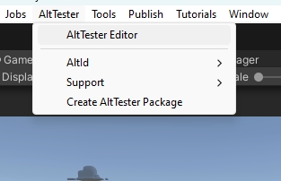
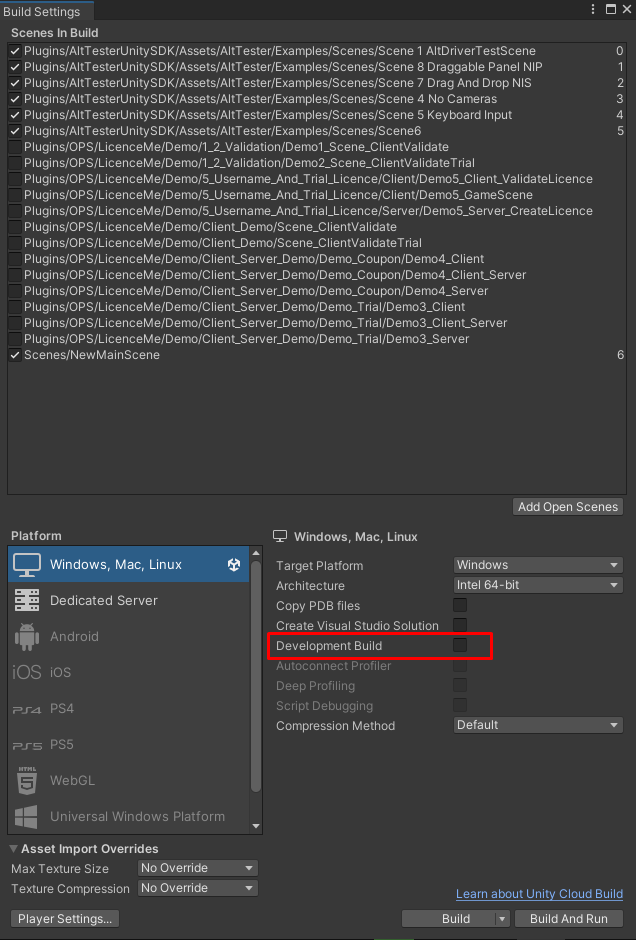

# Get Started

To run the first test for your Unity app you need to:

```eval_rst

.. contents::
    :local:
    :depth: 1
    :backlinks: none
    :class: custom-table-of-contents

.. note::

    If you don't have access to source code of the app you need to ask a person with access to give you an instrumented version of the app.

```

## Import AltTester® package in Unity Editor

To instrument your Unity application with AltTester® Unity SDK you first need to import the AltTester® package into Unity. This can be done either by downloading from the AltTester® website, or by following the steps from the OpenUPM website.

```eval_rst

.. tabs::

    .. tab:: UnityPackage from AltTester® website

        1. Download from :alttesterpage:`AltTester® <downloads/>`.
        2. Import it by drag and drop inside your Unity project.

    .. tab:: UnityPackage from OpenUPM website

        1. Go to `OpenUPM <https://openupm.com/packages/com.alttester.sdk/>`_.
        2. Follow the instructions from the `Install via Package Manager` section on the right to install via Unity's Package Manager or via Command-Line Interface.

```

### Resolve dependencies

-   Newtonsoft.Json

In order for AltTester® Unity SDK to work you need dependency for Newtonsoft.Json. Add `"com.unity.nuget.newtonsoft-json": "3.1.0"` to your project `manifest.json`, inside `dependencies`.

```json
{
    "dependencies": {
        "com.unity.nuget.newtonsoft-json": "3.1.0"
    }
}
```

-   Input System

AltTester® Unity SDK has support for Input System starting with version 1.7.1. To enable Input System in AltTester® Unity SDK you need to add `"com.unity.inputsystem"` to your `manifest.json`, inside `testables.`

```json
{
    "testables": ["com.unity.inputsystem"]
}
```

-   Editor Coroutines

In order for AltTester® Unity SDK to work with your project you need the dependency for Editor Coroutines. Add `"com.unity.editorcoroutines": "1.0.0` to your project `manifest.json`, inside `dependencies`.

```json
{
    "dependencies": {
        "com.unity.editorcoroutines": "1.0.0"
    }
}
```

<!--
To instrument your Unity application with AltTester® Unity SDK you first need to import the AltTester® package into Unity.

```eval_rst

    1. Download `AltTester® Unity SDK <https://alttester.com/app/uploads/altUnityProAlpha/AltUnityTesterUnityPackage>`_.

    2. Import it by drag and drop inside your Unity project.

```
-->

```eval_rst

.. important::

    To make sure the import was correct, check if you can open the AltTester® Editor window from Unity Editor -> AltTester® -> AltTester® Editor.

```



## Instrument your app with AltTester® Unity SDK

Steps:

1. Open the AltTester® Editor window from Unity Editor -> AltTester® -> AltTester® Editor <!--2. In the Build Settings section set the **AltTester® Server host** to the IP/hostname of the device where the AltTester® Server is running. Set the **AltTester® Server port** to the port configured in the AltTester® Server. -->
2. In the Build Settings section set **AltTester® Port** to 13000
3. In the Scene Manager section select the scenes you want to include in your build
4. In the Platform section select desired platform and set the path to where you want to save the build
5. Press "Build Only" to instrument the app or "Build & Run" to start your instrumented app
   after the build succeeded
6. Check the console to see if the build was successful.

```eval_rst

.. important::

    AltTester® Unity SDK is intended to be used only in debug builds, and it will not work in release mode out of the box. You need to make sure you don't release a production build instrumented with AltTester® Unity SDK.

.. note::

    If you want to build your intrumented app from outside the AltTester® Editor window you will have to make sure to uncheck the `Development Build` setting from the Build Settings menu in Unity (go to File -> Build Settings) after selecting your Scenes, as seen bellow.
```



```eval_rst
.. note::

    Your build files are available in the configured Output path. By default, the Output path is a folder with the same name as your game.
.. note::

    If you have a custom build, check how you can build from the command line using the instructions in the :ref:`Advanced Usage<pages/advanced-usage:Build apps from the command line>` section.

.. note::

    If changes are made inside a test, rebuilding the application is not necessary.
    A rebuild is needed only if changes are made inside the Unity project.

.. note::

    To be able to run your instrumented app in the background, go to File -> Build Settings -> Player Settings -> Project Settings -> Player -> Resolution and presentation and check the box next to Run in background.

.. note::

    To make sure you can catch possible exceptions thrown from your tests, you'll have to go to `Edit -> Project Settings -> Player -> Publishing Settings` and set `Enable Exceptions` to `Full With Stacktrace`.

.. note::

    When running the WebGL build of your app in browser, even with the Run in background setting enabled, you still might experience slow performance if the tab with your content is not on focus. Make sure that the tab with your app is visible, otherwise your content will only update once per second in most browsers.

.. note::

    If you are building your instrumented app using the `IL2CPP` Scripting Backend configuration, you may also want to set the Managed Stripping Level to `Minimal` from Player Settings -> Other Settings -> Optimization. Otherwise, AltTester® Desktop will throw an exception and will not be able to connect to the game.

```

## Start the AltTester® Server Module

The AltTester® Server Module is incorporated in AltTester® Desktop. In order to start it, all you have to do is to open AltTester® Desktop.

## Run your app in Unity or on desired platform

Before running your tests you need to start the instrumented Unity application. Upon startup, your instrumented Unity app should display a popup with the message: "Waiting for connections on port: {Port}". The popup disappears when your app has successfully connected to the tests.

```eval_rst

.. tabs::

    .. tab:: Unity Editor

        1. Open AltTester® Editor
        2. In platform section select Editor
        3. Click Play in Editor

    .. tab:: PC

        1. Open AltTester® Editor
        2. In platform section select Standalone
        3. Choose your build target
        4. Click Build & Run

        .. important::

            Make sure to set the "Api Compatibility Level" to ".NET 4.x" in Unity versions lower than 2021 when building using the Standalone option.

            This setting can be found under Edit menu -> Project Settings -> Player -> Other Settings -> Configuration.

    .. tab:: Android

        Prerequisites:

        * Use the Unity Hub to install Android Build Support and the required dependencies: Android SDK & NDK tools, and OpenJDK

        Steps:

        1. Open AltTester® Editor
        2. In platform section select Android
        3. Click Build & Run


    .. tab:: iOS

        Prerequisites:

        * Use the Unity Hub to install iOS Build Support

        Steps:

        1. Open AltTester® Editor
        2. In platform section select iOS
        3. Click Build & Run

        .. note::

            Check the following link to see how to build and run your app for iOS (.ipa file) -- :alttesteriphoneblog:`link <>`

    .. tab:: WebGL

        Prerequisites:

        * Use the Unity Hub to install WebGL Build Support

        Steps:

        1. Open AltTester® Editor
        2. In platform section select WebGL
        3. Click Build & Run

.. note::

    You can switch between the regular and the AltTester® input by toggling the box with the `AltTester® Input` label. Take into consideration that if you are using the New Input System, then after activating the AltTester® input, you will only be able to interact with the instrumented build via your automated tests or the AltTester® Desktop.

```

## Write and execute first test for your app

To write tests with AltTester® Unity SDK you need to import the AltDriver in your tests project.

AltTester® package contains AltDriver class used to connect to the instrumented app. In the setup method create an instance of the driver and in the tear-down method invoke the stop method of the driver. With the instance of the driver you can query the Unity objects and interact with the app.

```eval_rst

.. tabs::

    .. tab:: C#-Unity

        AltTester-Driver for C# is already included in AltTester® package. If you are writing tests in C# then you can create your tests directly from Unity.

        1.  Create a folder named Editor in your Unity Project.
        2.  Right-click on Editor folder and select `Create -> AltTest`. This will create a template file in which you could start to write your test.
        3.  Name the file MyFirstTest.
        4.  Open AltTester® Editor.
        5.  Make sure that the AltTester® Desktop app is running (Starting with version ``2.0.0``, AltTester® Desktop must be running on your PC while the tests are running).
        6.  In the `Run Tests` section press "Run All Tests" button. You should see the output of the tests in Unity Editor Console

        Example test file:

        .. tabs::

            .. tab:: Unity Editor, PC & WebGL

                .. literalinclude:: ../_static/examples~/get-started/csharp-test.cs
                    :language: c#

            .. tab:: Android

                .. literalinclude:: ../_static/examples~/common/csharp-android-test.cs
                    :language: c#
                    :emphasize-lines: 12,20

            .. tab:: iOS

                .. literalinclude:: ../_static/examples~/common/csharp-ios-test.cs
                    :language: c#


        Run your test file from the command line by using the following command:

        .. code-block:: console

            <UnityPath>/Unity -projectPath $PROJECT_DIR -executeMethod AltTestRunner.RunTestFromCommandLine -tests MyFirstTest.TestStartGame -logFile logFile.log -batchmode -quit

    .. tab:: C#

        **Prerequisite:**
            - `.NET <https://dotnet.microsoft.com/en-us/download>`_ installed.
            - Instrumented build.
            - The AltTester® Desktop installed on your PC.

        **Connection:**
            Starting with version ``2.0.0``, the AltTester® Desktop must be running on your PC while the tests are running.

            1. The AltTester® Desktop app is running.
            2. The instrumented build is running.
            3. Configure the IP of the build in order to match the IP of the machine (PC) the Desktop app is running on.
            4. Then press the restart button in the AltTester® dialog and wait until the `Connected to AltTester® Server…` message is displayed in the dialog.

        **Test Setup:**
            - You can use any IDE you want. As a suggestion, we prefer `Visual Studio Code <https://code.visualstudio.com/>`_.
            - To be able to run our test scripts, we should use a testing framework. For this tutorial, we will use the `NUnit testing framework <https://nunit.org/>`_.
            - In order to use ``NUnit``, you should start by creating an NUnit project. To do this, you need to create an empty folder (this will be the project folder) and open it in Visual Studio Code. `Open a terminal <https://code.visualstudio.com/docs/terminal/basics>`_ (we preferred git bash) and run the command below. This command will create a basic NUnit project for you:
            .. code-block:: console

                dotnet new nunit

            - To be able to interact with the game through your tests, you need AltDriver. To add the AltDriver to your testing project, all you need to do is to use the following command in your terminal:
            .. code-block:: console

                dotnet add package AltTester-Driver --version x.y.z

            **Note** that the ``x.y.z`` is the version of AltDriver you want to install.

        **Writing tests:**
            - There are many ways in which the project can be organized. We suggest using the `Page Object Model <https://www.guru99.com/page-object-model-pom-page-factory-in-selenium-ultimate-guide.html>`_ design pattern to organize your project into `pages` folders and `tests` folders.
            - To initialize the AltDriver in your project, you should import it. You can do it by using the following syntax: ``using AltTester.AltTesterSDK.Driver;``.
            - After that you can initialize the AltDriver: ``altDriver = new AltDriver();``.
        **Running the tests:**
            - To run your test, open a terminal window in the project folder and paste the following command:
            .. code-block:: console

                dotnet test

        Example test file:

        .. tabs::

            .. tab:: Unity Editor, PC & WebGL

                .. literalinclude:: ../_static/examples~/get-started/csharp-test.cs
                    :language: c#

            .. tab:: Android

                .. literalinclude:: ../_static/examples~/common/csharp-android-test.cs
                    :language: c#
                    :emphasize-lines: 12,20

            .. tab:: iOS

                .. literalinclude:: ../_static/examples~/common/csharp-ios-test.cs
                    :language: c#

    .. tab:: Java

        **Prerequisite:**
            - `Java <https://www.java.com/download/ie_manual.jsp>`_ installed.
            - Instrumented build.
            - The AltTester® Desktop installed on your PC.

        **Connection:**
            Starting with version ``2.0.0``, the AltTester® Desktop must be running on your PC while the tests are running.

            1. The AltTester® Desktop app is running.
            2. The instrumented build is running.
            3. Configure the IP of the build in order to match the IP of the machine (PC) the Desktop app is running on.
            4. Then press the restart button in the AltTester® dialog and wait until the `Connected to AltTester® Server…` message is displayed in the dialog.

        **Test Setup:**
            - You can use any IDE that works with Java, but for this setup tutorial, we will use `IntelliJ <https://www.jetbrains.com/idea/download/#section=windows>`_.
            - In order to have the structure already created for us and the possibility to install/update dependencies in an easy way, we can choose to create a `MAVEN project <https://www.jetbrains.com/idea/guide/tutorials/working-with-maven/creating-a-project/>`_.
            - In the new ``pom.xml`` generated, you should add the ``alttester`` and ``junit`` dependencies (and make sure to use the latest AltTester® driver version):
            .. code-block:: console

                <dependency>
                    <groupId>com.alttester</groupId>
                    <artifactId>alttester</artifactId>
                    <version>2.2.5</version>
                </dependency>

            .. code-block:: console

                <dependency>
                    <groupId>org.junit.jupiter</groupId>
                    <artifactId>junit-jupiter-engine</artifactId>
                    <version>5.11.0-M1</version>
                </dependency>

            - When you have these steps completed and you don’t have any errors, you are able to jump into the next section.

        **Writing tests:**
            - There are many ways in which the project can be organized. We suggest using the `Page Object Model <https://www.guru99.com/page-object-model-pom-page-factory-in-selenium-ultimate-guide.html>`_ design pattern to organize your project into `pages` folders and `tests` folders.
            - To initialize the AltDriver in your project, you should import it. You can do it by using the following syntax: ``import com.alttester.AltDriver;``.
            - After that you can initialize the AltDriver: ``driver = new AltDriver();``.
            - Considering that we’re using JUnit as a testing framework, you can find more information about JUnit in its official `documentation <https://junit.org/junit5/docs/current/user-guide/>`_.

        **Running the tests:**
            - Considering that we are using IntelliJ, the tests can be run using the runner that is inside of it. More information about this can be found in the official `documentation <https://www.jetbrains.com/help/idea/performing-tests.html>`_ of IntelliJ.

        Example test file:

        .. tabs::

            .. tab:: Unity Editor, PC & WebGL

                .. literalinclude:: ../_static/examples~/get-started/java-test.java
                    :language: java

            .. tab:: Android

                .. literalinclude:: ../_static/examples~/common/java-android-test.java
                    :language: java
                    :emphasize-lines: 19,26

            .. tab:: iOS

                .. literalinclude:: ../_static/examples~/common/java-ios-test.java
                    :language: java


    .. tab:: Python

        **Prerequisite:**
            - `Python <https://www.python.org/downloads/>`_ installed.
            - Instrumented build.
            - The AltTester® Desktop installed on your PC.

        **Connection:**
            Starting with version ``2.0.0``, the AltTester® Desktop must be running on your PC while the tests are running.

            1. The AltTester® Desktop app is running.
            2. The instrumented build is running.
            3. Configure the IP of the build in order to match the IP of the machine (PC) the Desktop app is running on.
            4. Then press the restart button in the AltTester® dialog and wait until the `Connected to AltTester® Server…` message is displayed in the dialog.

        **Test Setup:**
            - We suggest using the ``git bash`` terminal type for all the commands below.
            - You can use any IDE you want. As a suggestion, we prefer `Visual Studio Code <https://code.visualstudio.com/>`_  and `PyCharm <https://www.jetbrains.com/pycharm/download/>`_.
            - To actually run the tests we need a test framework. One of the most popular python testing frameworks is `pytest <https://pypi.org/project/pytest/>`_ which is easy to download because you just need to use the following command in your terminal:
            .. code-block:: console

                pip install pytest

            - To be able to interact with the game through your tests, you need AltDriver. It contains all the methods you need such as ``tap()``, ``wait_for_object()``, ``find_object()`` and so on. To add the `AltDriver <https://pypi.org/project/AltTester-Driver/>`_ to your testing project, all you need to do is to use the following command in your terminal:
            .. code-block:: console

                pip install AltTester-Driver

            The following setup steps are not mandatory, but if you choose to use them, you will act like a pro.

            - Install `assertpy <https://pypi.org/project/assertpy/>`_ - for easy and nice assertions.
            - Most of the time on a project, you will have to provide some reports with the results of your tests. In order to provide them, you can use ``pytest-html-reporter`` which generates nice and detailed reports with the results of your tests. To install ``pytest-html-reporter`` use the following command:
            .. code-block:: console

                pip install pytest-html-reporter

        **Writing tests:**
            - There are many ways in which the project can be organized. We suggest using the `Page Object Model <https://www.guru99.com/page-object-model-pom-page-factory-in-selenium-ultimate-guide.html>`_ design pattern to organize your project into `pages` folders and `tests` folders.
            - The AltDriver can be used in your code after you import it. Here is the import syntax: ``from alttester import AltDriver``, then you can instantiate an object of AltDriver type: ``alt_driver = AltDriver()`` . By doing this, you are able to use all the methods that come from AltDriver().
            - Considering that we are using ``pytest``, the names of the tests should start with ``test``.
        **Running the tests:**
            - Running tests using pytest can be easily done using the commands for cmd.
            - Run **all the tests**: navigate through the cmd in the folder that contains the tests folder and use the following command:
            .. code-block:: console

                pytest tests/
            - Run **a specific test file**: navigate into the tests folder and use the following command:
            .. code-block:: console

                pytest test_name.py

            - Run a **specific test method** from a file: navigate into the tests folder and use the following command:
            .. code-block:: console

                pytest test_name.py -k name_of_test_you_wanna_run
            - For running tests with the HTML reporter, all you have to do is to add this extra argument   to your running command:
            .. code-block:: console

                --html-report=./report/report.html.
            This will generate a report under the `report` folder.

        Example test file:

        .. tabs::

            .. tab:: Unity Editor, PC & WebGL

                .. literalinclude:: ../_static/examples~/get-started/python-test.py
                    :language: py

            .. tab:: Android

                .. literalinclude:: ../_static/examples~/common/python-android-test.py
                    :language: py
                    :emphasize-lines: 12,18

            .. tab:: iOS

                .. literalinclude:: ../_static/examples~/common/python-ios-test.py
                    :language: py

    .. tab:: robot

        **Prerequisite:**
            - `Robot Framework <https://robotframework.org/?tab=1#getting-started>`_ installed.
            - Instrumented build.
            - The AltTester® Desktop installed on your PC.

        **Connection:**
            Starting with version ``2.0.0``, the AltTester® Desktop must be running on your PC while the tests are running.

            1. The AltTester® Desktop app is running.
            2. The instrumented build is running.
            3. Configure the IP of the build in order to match the IP of the machine (PC) the Desktop app is running on.
            4. Then press the restart button in the AltTester® dialog and wait until the `Connected to AltTester® Server…` message is displayed in the dialog.

        **Test Setup:**
            - You can use any IDE you want. As a suggestion, we prefer `Visual Studio Code <https://code.visualstudio.com/>`_  and `PyCharm <https://www.jetbrains.com/pycharm/download/>`_.

        **Writing tests:**
            - First you need to create a new project with a Robot class under it, which can store your tests
            - In the ``Settings`` section:
                - Import the ``AltTesterLibrary``
                - Next create the ``Setup`` and ``Teardown`` suites for your tests
                    - In the ``Setup`` suite you need to include the initialization of the AltDriver - make sure to also add the ip, host and app name as parameters if the connection data for the connected instrumented app is not the default one
                    - In the ``Teardown`` suite the AltDriver needs to be stopped                
            .. code-block:: robot

                *** Settings***
                Library    AltTesterLibrary
                Suite Setup    Initialize Altdriver
                Suite Teardown    Stop Altdriver 
            - The ``Test Cases`` section stores all your tests which should have a specific and relevant name             
            .. code-block:: robot

                *** Test Cases ***
                Test My First Test

        **Running the tests:**
            
            - To run your test use the ``robot`` commmand            
            - Robot Framework test cases are created in files and directories, and they are executed by giving the path to the file or directory in question to the selected runner script
            - Examples:
            .. code-block:: console

                robot my_first_test.robot

            .. code-block:: console

                robot path/to/my_tests/

            - After running the test the Robot will generate 3 files: ``report.html``, ``log.html`` and ``output.xml`` - the  html files can be opened in the browser and for every test in ``log.html`` there will be a status highlight, the keywords used, as well as a potential error that might have occured during the test


        Example test file:

        .. tabs::

            .. tab:: Unity Editor, PC & WebGL

                .. literalinclude:: ../_static/examples~/get-started/robot-test.robot
                    :language: robot

            .. tab:: Android

                .. literalinclude:: ../_static/examples~/common/robot-android-test.robot
                    :language: robot
                    :emphasize-lines: 26, 31

            .. tab:: iOS

```

Now your project can use all the [AltDriver Commands](./commands.md).

<!--
```eval_rst

.. note::
    Before running your tests, start the AltTester® Server and the Instrumented Unity app.

```
-->

```eval_rst

.. note::
    Before the connection step, start the instrumented app and wait for the green popup with the message: `Waiting to connect to AltTester® Server on IP:port with app name: 'your app name'`.

```
