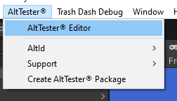

# Get Started

To run the first test for your Unity game you need to:

```eval_rst

.. contents::
    :local:
    :depth: 1
    :backlinks: none
    :class: custom-table-of-contents

.. note::

    If you don't have access to source code of the game you need to ask a person with access to give you an instrumented version of the game.

```

## Import AltTester package in Unity Editor

To instrument your Unity application with AltTester Unity SDK you first need to import the AltTester package into Unity. This can be done either by downloading from the Altom website.

```eval_rst

.. tabs::

    .. tab:: UnityPackage from Altom website

        1. Download from `Altom website - link <https://altom.com/app/uploads/AltTester/sdks/AltTester.unitypackage>`_.
        2. Import it by drag and drop inside your Unity project.

```

### Resolve dependencies

- Newtonsoft.Json

In order for AltTester Unity SDK to work you need dependency for Newtonsoft.Json. Add `"com.unity.nuget.newtonsoft-json": "3.0.1"` to your project `manifest.json`, inside `dependencies`.

```json
{
    "dependencies": {
        "com.unity.nuget.newtonsoft-json": "3.0.1"
    }
}
```

- Input System

AltTester Unity SDK has support for Input System starting with version 1.7.1. To enable Input System in AltTester Unity SDK you need to add `"com.unity.inputsystem"` to your `manifest.json`, inside `testables.`

```json
{
    "testables": [
        "com.unity.inputsystem"
  ]
}
```

<!--
To instrument your Unity application with AltTester Unity SDK you first need to import the AltTester package into Unity.

```eval_rst

    1. Download `AltTester Unity SDK <https://altom.com/app/uploads/altUnityProAlpha/AltUnityTesterUnityPackage>`_.

    2. Import it by drag and drop inside your Unity project.

```
-->

```eval_rst

.. important::

    To make sure the import was correct, check if you can open the AltTester Editor window from Unity Editor -> AltTester -> AltTester Editor.

```



## Instrument your game with AltTester Unity SDK

Steps:

1. Open the AltTester Editor window from Unity Editor -> AltTester -> AltTester Editor <!--2. In the Build Settings section set the **Proxy host** to the IP/hostname of the device where the Proxy is running. Set the **Proxy port** to the port configured in the Proxy. -->
2. In the Build Settings section set **AltTester Port** to 13000
3. In the Scene Manager section select the scenes you want to include in your build
4. In the Platform section select desired platform and set the path to where you want to save the build
5. Press "Build Only" to instrument the game or "Build & Run" to start your instrumented game
   after the build succeeded
6. Check the console to see if the build was successful.

```eval_rst

.. important::

    AltTester Unity SDK is intended to be used only in debug builds, and it will not work in release mode out of the box. You need to make sure you don't release a production build instrumented with AltTester Unity SDK.

.. note::

    Your build files are available in the configured Output path. By default, the Output path is a folder with the same name as your game.

.. note::

    If you have a custom build, check how you can build from the command line using the instructions in the :ref:`Advanced Usage<pages/advanced-usage:Build games from the command line>` section.

.. note::

    If changes are made inside a test, rebuilding the application is not necessary.
    A rebuild is needed only if changes are made inside the Unity project.

.. note::

    To be able to run your instrumented game in the background, go to File -> Build Settings -> Player Settings -> Project Settings -> Player -> Resolution and presentation and check the box next to Run in background.

```

<!--

```eval_rst
.. note::

    When running the WebGL build of your game in browser, even with the Run in background setting enabled, you still might experience slow performance if the tab with your content is not on focus. Make sure that the tab with your app is visible, otherwise your content will only update once per second in most browsers.

```

## Start the Proxy Module

The Proxy Module is incorporated in AltTester Desktop. In order to start it, all you have to do is to start AltTester Desktop.
-->

## Run your game in Unity or on desired platform

Before running your tests you need to start the instrumented Unity application. Upon startup, your instrumented Unity app should display a popup with the message: "Waiting for connections on port: {Port}". The popup disappears when your app has successfully connected to the tests.

```eval_rst

.. tabs::

    .. tab:: Unity Editor

        1. Open AltTester Editor
        2. In platform section select Editor
        3. Click Play in Editor

    .. tab:: PC

        1. Open AltTester Editor
        2. In platform section select Standalone
        3. Choose your build target
        4. Click Build & Run

        .. important::

            Make sure to set the "Api Compatibility Level" to ".NET 4.x" in Unity versions lower than 2021 when building using the Standalone option.

            This setting can be found under Edit menu -> Project Settings -> Player -> Other Settings -> Configuration.

    .. tab:: Android

        Prerequisites:

        * Use the Unity Hub to install Android Build Support and the required dependencies: Android SDK & NDK tools, and OpenJDK

        Steps:

        1. Open AltTester Editor
        2. In platform section select Android
        3. Click Build & Run


    .. tab:: iOS

        Prerequisites:

        * Have IProxy installed: ``brew install libimobiledevice``

        Steps:

        1. Open AltTester Editor
        2. In platform section select iOS
        3. Click Build & Run

        .. note::

            Check the following link to see how to build and run your game for iOS (.ipa file) -- `link <https://altom.com/testing-ios-applications-using-java-and-altunity-tester/>`_.

```

<!--
    .. tab:: WebGL

        Prerequisites:

        * Use the Unity Hub to install WebGL Build Support

        Steps:

        1. Open AltTester Editor
        2. In platform section select WebGL
        3. Click Build & Run
 -->

## Write and execute first test for your game

To write tests with AltTester Unity SDK you need to import the AltDriver in your tests project.

AltTester package contains AltDriver class used to connect to the instrumented game. In the setup method create an instance of the driver and in the tear-down method invoke the stop method of the driver. With the instance of the driver you can query the Unity objects and interact with the game.

```eval_rst

.. tabs::

    .. tab:: C#-Unity

        AltTester-Driver for C# is already included in AltTester package. If you are writing tests in C# then you can create your tests directly from Unity.

        1.  Create a folder named Editor in your Unity Project.
        2.  Right-click on Editor folder and select `Create -> AltTest`. This will create a template file in which you could start to write your test.
        3.  Name the file MyFirstTest.
        4.  Open AltTester Editor.
        5.  In the `Run Tests` section press "Run All Tests" button. You should see the output of the tests in Unity Editor Console

        Example test file:

        .. tabs::

            .. tab:: Unity Editor & PC

                .. literalinclude:: ../_static/examples~/get-started/csharp-test.cs
                    :language: c#

            .. tab:: Android

                .. literalinclude:: ../_static/examples~/common/csharp-android-test.cs
                    :language: c#
                    :emphasize-lines: 11,19

            .. tab:: iOS

                .. literalinclude:: ../_static/examples~/common/csharp-ios-test.cs
                    :language: c#
                    :emphasize-lines: 11,19


        Run your test file from the command line by using the following command:

        .. code-block:: console

            <UnityPath>/Unity -projectPath $PROJECT_DIR -executeMethod AltTestRunner.RunTestFromCommandLine -tests MyFirstTest.TestStartGame -logFile logFile.log -batchmode -quit

    .. tab:: C#

        AltTester-Driver for C# is available also as a nuget package. You can use the nuget package to write your tests in a separate tests project, independent of the Unity application.

        Create a new test project

        .. code-block:: console

            mkdir <test-project-name>
            cd <test-project-name>
            dotnet new nunit

        Install AltTester-Driver nuget package

        .. code-block:: console

            dotnet add package AltTester-Driver --version 1.8.1

        Run your tests

        .. code-block:: console

            dotnet test

        Example test file:

        .. tabs::

            .. tab:: Unity Editor & PC

                .. literalinclude:: ../_static/examples~/get-started/csharp-test.cs
                    :language: c#

            .. tab:: Android

                .. literalinclude:: ../_static/examples~/common/csharp-android-test.cs
                    :language: c#
                    :emphasize-lines: 11,19

            .. tab:: iOS

                .. literalinclude:: ../_static/examples~/common/csharp-ios-test.cs
                    :language: c#
                    :emphasize-lines: 11,19

    .. tab:: Java

        AltTester-Driver for Java is available as a maven package or as a standalone jar. Use one of the following methods to import the driver in your tests project.

            **Method 1**: Add AltTester-Driver for Java as a dependency in your ``pom.xml`` file:

            .. code-block:: xml

                <dependency>
                    <groupId>com.alttester</groupId>
                    <artifactId>alttester</artifactId>
                    <version>1.8.1</version>
                </dependency>


            **Method 2**: Use the ``.jar`` file from GIT (**without building it from source**)

                * Download `AltTester-Driver for Java <https://altom.com/app/uploads/AltTesterJAR/AltTester-Driver.jar>`__.

                * Install the ``.jar`` file:

                .. code-block:: console

                    mvn install:install-file -Dfile=./target/AltTester-Driver.jar -DgroupId=com.alttester -DartifactId=alttester -Dversion=1.8.1 -Dpackaging=jar


        Run your tests by using the following command (in the test project folder):

        .. code-block:: console

            mvn test

        Example test file:

        .. tabs::

            .. tab:: Unity Editor & PC

                .. literalinclude:: ../_static/examples~/get-started/java-test.java
                    :language: java

            .. tab:: Android

                .. literalinclude:: ../_static/examples~/common/java-android-test.java
                    :language: java
                    :emphasize-lines: 19,26

            .. tab:: iOS

                .. literalinclude:: ../_static/examples~/common/java-ios-test.java
                    :language: java
                    :emphasize-lines: 19,26


    .. tab:: Python

        There are two methods of installing the AltTester-Driver for Python package:

            **Method 1**: Installing using Pip:

            .. code-block:: console

                pip install AltTester-Driver

            **Method 2**: Install from the source code in the repository:

            .. code-block:: console

                git clone git@github.com:alttester/AltTester-Unity-SDK.git
                cd alttester/Bindings~/python
                python setup.py install

        Run your test file using the ``unittest`` module:

        .. code-block:: bash

            python -m unittest <name_of_your_test_file.py>

        Run your test file using the ``pytest`` package:

        .. code-block:: bash

            pytest <name_of_your_test_file.py>

        Example test file:

        .. tabs::

            .. tab:: Unity Editor & PC

                .. literalinclude:: ../_static/examples~/get-started/python-test.py
                    :language: py

            .. tab:: Android

                .. literalinclude:: ../_static/examples~/common/python-android-test.py
                    :language: py
                    :emphasize-lines: 12,18

            .. tab:: iOS

                .. literalinclude:: ../_static/examples~/common/python-ios-test.py
                    :language: py
                    :emphasize-lines: 12,18

```

Now your project can use all the [AltDriver Commands](./commands.md).

<!--
```eval_rst

.. note::
    Before running your tests, start the Proxy and the Instrumented Unity app.

```
-->

```eval_rst

.. note::
    Before running your tests, start the instrumented game and wait for popup with the message: *Waiting for connection on port: 13000*.

```
