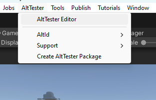

# Install the package

## Import AltTester® package in Unity Editor

To instrument your Unity application with AltTester® Unity SDK you first need to import the AltTester® package into Unity. This can be done either by downloading from the AltTester® website, or by following the steps from the OpenUPM website.

```eval_rst

.. tabs::

    .. tab:: UnityPackage from AltTester® website

        1. Download from :alttesterpage:`AltTester® <downloads/>`.
        2. Import it by drag and drop inside your Unity project.

    .. tab:: UnityPackage from OpenUPM website

        1. Go to `OpenUPM <https://openupm.com/packages/com.alttester.sdk/>`_.
        2. Follow the instructions from the `Install via Package Manager` section on the right to install via Unity's Package Manager or via Command-Line Interface.

```

### Resolve dependencies

-   Newtonsoft.Json

In order for AltTester® Unity SDK to work you need dependency for Newtonsoft.Json. Add `"com.unity.nuget.newtonsoft-json": "3.1.0"` to your project `manifest.json`, inside `dependencies`.

```json
{
    "dependencies": {
        "com.unity.nuget.newtonsoft-json": "3.1.0"
    }
}
```

-   Input System

AltTester® Unity SDK has support for Input System starting with version 1.7.1. To enable Input System in AltTester® Unity SDK you need to add `"com.unity.inputsystem"` to your `manifest.json`, inside `testables.`

```json
{
    "testables": ["com.unity.inputsystem"]
}
```

-   Editor Coroutines

In order for AltTester® Unity SDK to work with your project you need the dependency for Editor Coroutines. Add `"com.unity.editorcoroutines": "1.0.0` to your project `manifest.json`, inside `dependencies`.

```json
{
    "dependencies": {
        "com.unity.editorcoroutines": "1.0.0"
    }
}
```

<!--
To instrument your Unity application with AltTester® Unity SDK you first need to import the AltTester® package into Unity.

```eval_rst

    1. Download `AltTester® Unity SDK <https://alttester.com/app/uploads/altUnityProAlpha/AltUnityTesterUnityPackage>`_.

    2. Import it by drag and drop inside your Unity project.

```
-->

```eval_rst

.. important::

    To make sure the import was correct, check if you can open the AltTester® Editor window from Unity Editor -> AltTester® -> AltTester® Editor.

```


