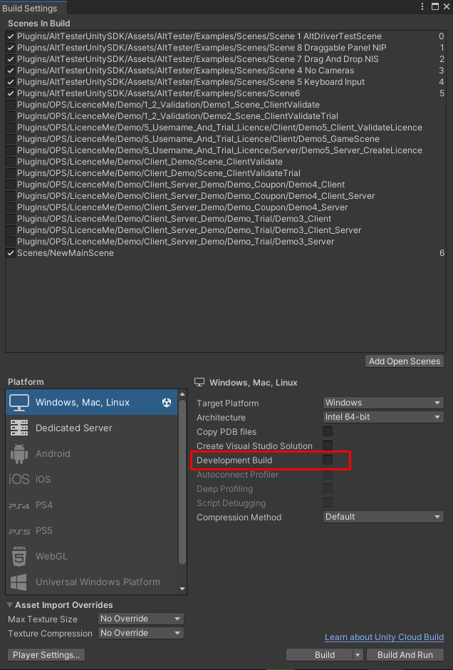

# Instrument your app

## Instrument your app with AltTester® Unity SDK

Steps:

1. Open the AltTester® Editor window from Unity Editor -> AltTester® -> AltTester® Editor <!--2. In the Build Settings section set the **AltTester® Server host** to the IP/hostname of the device where the AltTester® Server is running. Set the **AltTester® Server port** to the port configured in the AltTester® Server. -->
2. In the Build Settings section set **AltTester® Port** to 13000
3. In the Scene Manager section select the scenes you want to include in your build
4. In the Platform section select desired platform and set the path to where you want to save the build
5. Press "Build Only" to instrument the app or "Build & Run" to start your instrumented app
   after the build succeeded
6. Check the console to see if the build was successful.

```eval_rst

.. important::

    AltTester® Unity SDK is intended to be used only in debug builds, and it will not work in release mode out of the box. You need to make sure you don't release a production build instrumented with AltTester® Unity SDK.

.. note::

    If you want to build your intrumented app from outside the AltTester® Editor window you will have to make sure to uncheck the `Development Build` setting from the Build Settings menu in Unity (go to File -> Build Settings) after selecting your Scenes, as seen bellow.
```



```eval_rst
.. note::

    Your build files are available in the configured Output path. By default, the Output path is a folder with the same name as your game.
.. note::

    If you have a custom build, check how you can build from the command line using the instructions in the :ref:`Advanced Usage<pages/guides/building-from-command-line:Build apps from the command line>` section.

.. note::

    If changes are made inside a test, rebuilding the application is not necessary.
    A rebuild is needed only if changes are made inside the Unity project.

.. note::

    To be able to run your instrumented app in the background, go to File -> Build Settings -> Player Settings -> Project Settings -> Player -> Resolution and presentation and check the box next to Run in background.

.. note::

    To make sure you can catch possible exceptions thrown from your tests, you'll have to go to `Edit -> Project Settings -> Player -> Publishing Settings` and set `Enable Exceptions` to `Full With Stacktrace`.

.. note::

    When running the WebGL build of your app in browser, even with the Run in background setting enabled, you still might experience slow performance if the tab with your content is not on focus. Make sure that the tab with your app is visible, otherwise your content will only update once per second in most browsers.

.. note::

    If you are building your instrumented app using the `IL2CPP` Scripting Backend configuration, you may also want to set the Managed Stripping Level to `Minimal` from Player Settings -> Other Settings -> Optimization. Otherwise, AltTester® Desktop will throw an exception and will not be able to connect to the game.

```
