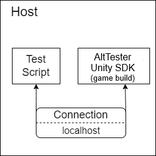
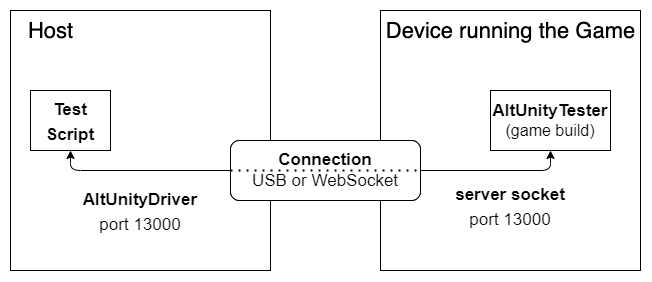
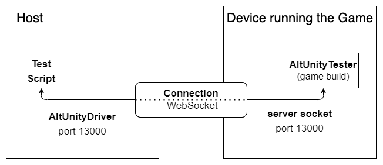
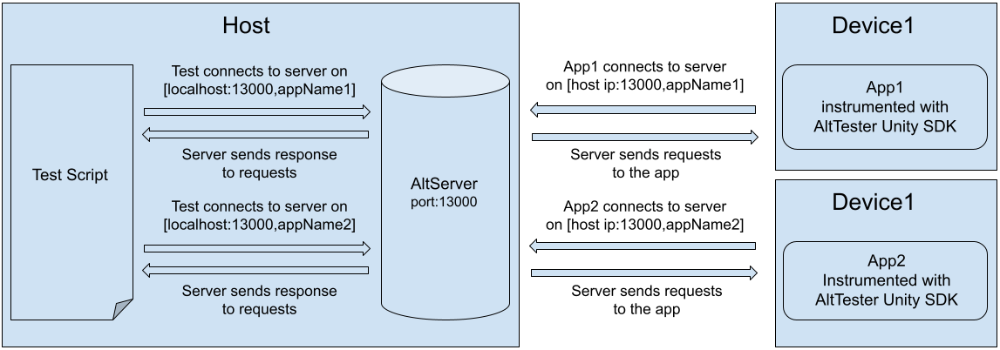
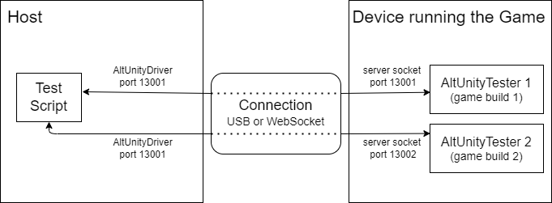

# Connecting to the server

## Connect AltTester® Unity SDK running inside the app to AltTester® Server

There are multiple scenarios:

  - [Establish connection when the instrumented app and the test code are running on the same machine](#establish-connection-when-the-instrumented-app-and-the-test-code-are-running-on-the-same-machine)
  - [Establish connection when the app is running on a device connected via USB](#establish-connection-when-the-app-is-running-on-a-device-connected-via-usb)
  - [Establish connection via IP when the app is running on a device](#establish-connection-via-ip-when-the-app-is-running-on-a-device)
  - [Establish connection when different instances of the same app are running on multiple devices](#establish-connection-when-different-instances-of-the-same-app-are-running-on-multiple-devices)
  - [Establish connection when multiple instances of the same application are running on the same device](#establish-connection-when-multiple-instances-of-the-same-application-are-running-on-the-same-device)

### Establish connection when the instrumented app and the test code are running on the same machine



1. Start AltTester® Server on your machine by opening AltTester® Desktop. The server will be listening on port 13000 by default.
2. Open your instrumented app on the same machine. It will automatically connect to AltTester® Server. The server identifies the app using the **appName**.
3. Connect your tests to the server using the line below in your **OneTimeSetup()**. Start your tests on the machine used before. Make sure that AltTester® Server, the instrumented app and your tests are using **the same port**. Data transmission happens on localhost.

```eval_rst
.. tabs::
    .. code-tab:: c#

            altDriver = new AltDriver (host: "127.0.0.1", port: 13000, appName: "MyApp");

    .. code-tab:: java

            altDriver = new AltDriver ("127.0.0.1", 13000, "MyApp");

    .. code-tab:: py

            cls.alt_driver = AltDriver(host="127.0.0.1", port=13000, app_name="MyApp")

    .. code-tab:: robot

            Initialize Altdriver    host=127.0.0.1    port=13000    app_name=MyApp
```

In this case **reverse port forwarding** is not needed as both the app and tests are using localhost:13000.

### Establish connection when the app is running on a device connected via USB



1. Start AltTester® Server on your machine by opening AltTester® Desktop. The server will be listening on port 13000 by default.
2. Open your instrumented app on your device.
3. Use [Reverse Port Forwarding](reverse-port-forwarding.html#what-is-reverse-port-forwarding-and-when-to-use-it) to direct the data traffic from the device's port to the computer's port. After this, your app will be connected to AltTester® Server. The server identifies the app using the **appName**.
4. Connect your tests to AltTester® Server using the line below in your **OneTimeSetup()**. Start your tests on the machine used before. Make sure that AltTester® Server, the instrumented app and your tests are using **the same port**. Data transmission happens on localhost.

```eval_rst
.. tabs::
    .. code-tab:: c#

            altDriver = new AltDriver (host: "127.0.0.1", port: 13000, appName: "MyApp");

    .. code-tab:: java

            altDriver = new AltDriver ("127.0.0.1", 13000, "MyApp");

    .. code-tab:: py

            cls.alt_driver = AltDriver(host="127.0.0.1", port=13000, app_name="MyApp")

    .. code-tab:: robot

            Initialize Altdriver    host=127.0.0.1    port=13000    app_name=MyApp
```

### Establish connection via IP when the app is running on a device



1. Start AltTester® Server on your machine by opening AltTester® Desktop. The server will be listening on port 13000 by default.
2. Open your instrumented app on your device. 
3. Change the host from the green popup in your instrumented build to the machine's IP AltTester® Server is running on. The server identifies the app using the **appName**.
4. Connect your tests to AltTester® Server using the line below in your **OneTimeSetup()**. Start your tests on the machine used before. Make sure that AltTester® Server, the instrumented app and your tests are using **the same port**. Data transmission between tests and server happens on localhost; transmission between device and server happens on the host's IP.

```eval_rst
.. tabs::
    .. code-tab:: c#

            altDriver = new AltDriver (host: "127.0.0.1", port: 13000, appName: "MyApp");

    .. code-tab:: java

            altDriver = new AltDriver ("127.0.0.1", 13000, "MyApp");

    .. code-tab:: py

            cls.alt_driver = AltDriver(host="127.0.0.1", port=13000, app_name="MyApp")

    .. code-tab:: robot

            Initialize Altdriver    host=127.0.0.1    port=13000    app_name=MyApp
```

In this case [Reverse Port Forwarding](reverse-port-forwarding.html#what-is-reverse-port-forwarding-and-when-to-use-it) is not needed. **Despite that**, it is recommended to use reverse port forwarding since IP addresses could change and would need to be updated more frequently.

### Establish connection when different instances of the same app are running on multiple devices

#### Connection through IP


1. Start AltTester® Server on your machine by opening AltTester® Desktop. The server will be listening on port 13000 by default.
2. Open your instrumented app on your devices. Make sure they have different names. In case you want to change the name, you can do that in the green popup. There is no need to make another instrumented build.
3. Change the hosts from the green popups in your instrumented builds to the machine's IP AltTester® Server is running on. The server identifies the apps using the **appName**.
4. Connect your tests to AltTester® Server using the line below in your **OneTimeSetup()**. You will need to create **2 AltDrivers** as you have 2 devices. AltDriver1 will communicate with device1 and AltDriver2 with device2. Start your tests on the machine used before. Make sure that AltTester® Server, the instrumented app and your tests are using **the same port**. Data transmission between tests and server happens on localhost; transmission between devices and server happens on the host's IP.

```eval_rst
.. tabs::
    .. code-tab:: c#

            altDriver1 = new AltDriver (host: "127.0.0.1", port: 13000, appName: "MyApp1");
            altDriver2 = new AltDriver (host: "127.0.0.1", port: 13000, appName: "MyApp2");

    .. code-tab:: java

            altDriver1 = new AltDriver ("127.0.0.1", 13000, "MyApp1");
            altDriver2 = new AltDriver ("127.0.0.1", 13000, "MyApp2");

    .. code-tab:: py

            cls.alt_driver1 = AltDriver(host="127.0.0.1", port=13000, app_name="MyApp1")
            cls.alt_driver2 = AltDriver(host="127.0.0.1", port=13000, app_name="MyApp2")

    .. code-tab:: robot

            Initialize Altdriver1    host=127.0.0.1    port=13000    app_name=MyApp1
            Initialize Altdriver2    host=127.0.0.1    port=13000    app_name=MyApp2
```

The same happens with n devices. Repeat the steps n times.

#### Connection through USB

Use **reverse port forwarding** for both devices. Data transmission happens exclusively on localhost.
Ex. with 2 Android devices:

    adb -s deviceId1 reverse tcp:13000 tcp:1300
    adb -s deviceId2 reverse tcp:13000 tcp:1300


### Establish connection when multiple instances of the same application are running on the same device

#### Connection through IP


1. Start AltTester® Server on your machine by opening AltTester® Desktop. The server will be listening on port 13000 by default.
2. Open your instrumented apps on your device. Make sure they have different names. In case you want to change the name, you can do that in the green popup. There is no need to make another instrumented build.
3. Change the hosts from the green popups in your instrumented builds to the machine's IP AltTester® Server is running on. The server identifies the apps using the **appName**.
4. Connect your tests to AltTester® Server using the line below in your **OneTimeSetup()**. You will need to create **2 AltDrivers** as you have 2 apps. AltDriver1 will communicate with app1 and AltDriver2 with app2. Start your tests on the machine used before. Make sure that AltTester® Server, the instrumented app and your tests are using **the same port**. Data transmission between tests and server happens on localhost; transmission between device and server happens on the host's IP.

```eval_rst
.. tabs::
    .. code-tab:: c#

            altDriver1 = new AltDriver (host: "127.0.0.1", port: 13000, appName: "MyApp1");
            altDriver2 = new AltDriver (host: "127.0.0.1", port: 13000, appName: "MyApp2");

    .. code-tab:: java

            altDriver1 = new AltDriver ("127.0.0.1", 13000, "MyApp1");
            altDriver2 = new AltDriver ("127.0.0.1", 13000, "MyApp2");

    .. code-tab:: py

            cls.alt_driver1 = AltDriver(host="127.0.0.1", port=13000, app_name="MyApp1")
            cls.alt_driver2 = AltDriver(host="127.0.0.1", port=13000, app_name="MyApp2")

    .. code-tab:: robot

            Initialize Altdriver1    host=127.0.0.1    port=13000    app_name=MyApp1
            Initialize Altdriver2    host=127.0.0.1    port=13000    app_name=MyApp2
```

#### Connection through USB

Use [Reverse Port Forwarding](reverse-port-forwarding.html#what-is-reverse-port-forwarding-and-when-to-use-it). Data transmission happens exclusively on localhost.

```eval_rst
.. important::

    On mobile devices, AltDriver can interact only with a single app at a time and the app needs to be in focus. In case of 2 drivers and 2 apps, you need to switch (in your test scripts) between the applications. This is due to the fact that on Android/iOS only one application is in focus at a time, even when using split screen mode.
```
