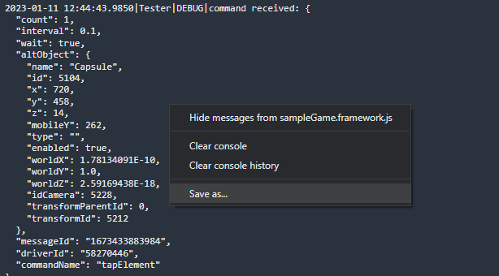

# Logging

There are two types of logging that can be configured in AltTester® Unity SDK. The logs from AltDriver (from the tests) and the logs from the AltTester® Unity SDK (from the instrumented Unity application)

```eval_rst
.. note::

    From version 1.7.0 on logs from `Server` are referred to as logs from `Tester`.

```

## AltTester® Unity SDK logging

Logging inside the instrumented Unity application is handled using a custom NLog LogFactory. The Server LogFactory can be accessed here: `AltTester.AltTesterUnitySDK.Logging.AltTesterLogManager.Instance`

There are two logger targets that you can configure on the server:

-   FileLogger
-   UnityLogger

Logging inside the instrumented app can be configured from the driver using the SetServerLogging command:

```eval_rst
.. tabs::

    .. code-tab:: c#

        altDriver.SetServerLogging(AltLogger.File, AltLogLevel.Off);
        altDriver.SetServerLogging(AltLogger.Unity, AltLogLevel.Info);

    .. code-tab:: java

        altDriver.setServerLogging(AltLogger.File, AltLogLevel.Off);
        altDriver.setServerLogging(AltLogger.Unity, AltLogLevel.Info);

    .. code-tab:: py

        alt_driver.set_server_logging(AltLogger.File, AltLogLevel.Off)
        alt_driver.set_server_logging(AltLogger.Unity, AltLogLevel.Info)

    .. code-tab:: robot

        Set Server Logging    File     Off
        Set Server Logging    Unity    Info

```

## AltDriver logging

Logging on the driver is handled using `NLog` in C#, `loguru` in python and `log4j` in Java. By default logging is disabled in the driver (tests). If you want to enable it you can set the `enableLogging` in `AltDriver` constructor.

```eval_rst
.. tabs::

    .. tab:: C#

        Logging is handled using a custom NLog LogFactory.  The Driver LogFactory can be accessed here: `AltTester.AltTesterSDK.Driver.Logging.DriverLogManager.Instance`

        There are three logger targets that you can configure on the driver:

        * FileLogger
        * UnityLogger //available only when runnning tests from Unity
        * ConsoleLogger //available only when runnning tests using the Nuget package

        If you want to configure different level of logging for different targets you can use `AltTester.AltTesterSDK.Driver.Logging.DriverLogManager.SetMinLogLevel(AltLogger.File, AltLogLevel.Info)`

        .. code-block:: c#

            /* start AltDriver with logging enabled */
            var altDriver = new AltDriver (enableLogging: true);

            /* start AltDriver with logging disabled */
            var altDriver = new AltDriver (enableLogging: false);

            /* disable AltDriver logging */
            altDriver.SetLogging(enableLogging: false);

            /* enable AltDriver logging */
            altDriver.SetLogging(enableLogging: true);

            /* set logging level to Info for File target */
            AltTester.AltTesterSDK.Driver.Logging.DriverLogManager.SetMinLogLevel(AltLogger.File, AltLogLevel.Info);

    .. tab:: Java

        Logging is handled via log4j. You can use log4j configuration files to customize your logging.

        Setting the `enableLogging` in `AltDriver` initializes logger named `com.AltTester` configured with two appenders, a file appender `AltFileAppender` and a console appender `AltConsoleAppender`

        .. code-block:: java

            /* start AltDriver with logging enabled */
            altDriver = new AltDriver("127.0.0.1", 13000, true);

            /* start AltDriver with logging disabled */
            altDriver = new AltDriver("127.0.0.1", 13000, false);

            /* disable logging for com.AltTester® logger */
            final LoggerContext ctx = (LoggerContext) LogManager.getContext(false);
            final Configuration config = ctx.getConfiguration();
            config.getLoggerConfig("com.AltTester").setLevel(Level.OFF);

            ctx.updateLoggers();

    .. tab:: Python

        Logging is handled via loguru.

        Setting the `enable_logging` to `True` in AltDriver, all logs from `alttester` package are enabled.

        .. code-block:: python

            /* start AltDriver with logging enabled */
            alt_driver = AltDriver(enable_logging= True)
            
            /* start AltDriver with logging disabled */
            alt_driver = AltDriver(enable_logging= False)            
            
            /* enable logging in driver /*
            loguru.logger.enable("alttester")

            /* disable logging in driver /*
            loguru.logger.disable("alttester")   

    .. tab:: robot

        Logging is handled via loguru.

        Setting the `enable_logging` to `True` in AltDriver, all logs from `alttester` package are enabled.

        .. code-block:: robot

            /* start AltDriver with logging enabled */
            Initialize AltDriver    enable_logging=True
            
            /* start AltDriver with logging disabled */
            Initialize AltDriver    enable_logging=False            

            /* enable logging in driver /*
            Enable Loguru Logger alttester

            /* disable logging in driver /*
            Disable Loguru Logger alttester
```

## Logging in WebGL

The logs for a WebGL instrumented build are displaied in the browser's console. You can open the `Console` tab by pressing `F12`. To download the logs right click inside the `Console` and choose `Save as...`.


