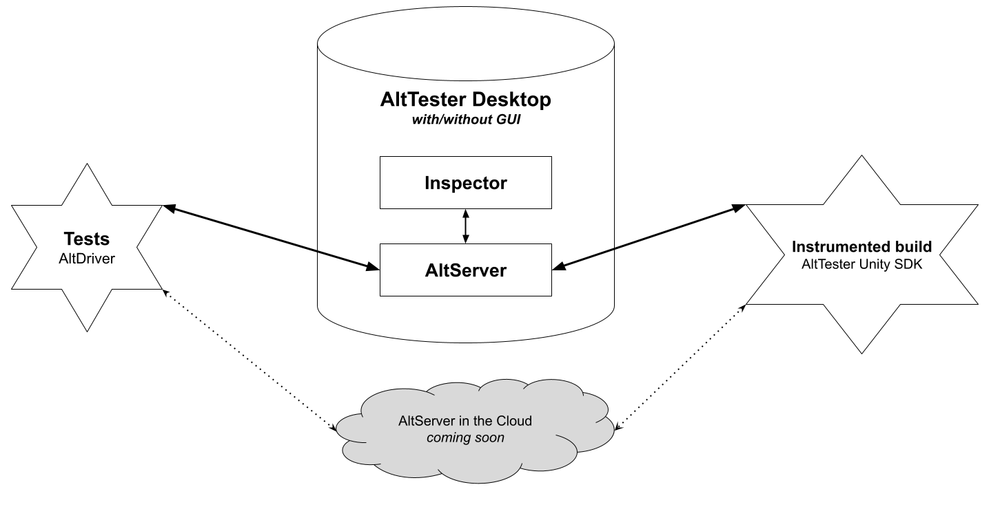

# How it works

Testing an app with AltTester® means assembling three pieces. Most setup problems are
one of the three missing, or the three not agreeing with each other.

AltTester® framework contains the following components:

* AltTester® Unity SDK (illustrated inside the game / app on the left below)
* AltTester® Desktop (illustrated in the middle)
* AltTester® Bindings / Clients (for C#, Python, Java, Robot Framework, illustrated on the right)

```eval_rst
        .. figure:: ../../_static/img/overview/architecture1.svg
            :scale: 150 %

```

* **AltTester® Unity SDK**

    This is a Unity plugin used to instrument your Unity game / app to expose access to all the objects in the Unity hierarchy. The AltTester® Unity SDK starts a websocket client connection inside the game / app that communicates with the AltTester® Server running within AltTester® Desktop app. 

* **AltTester® Desktop** 
    This is a desktop application for Mac, Windows and Linux that contains the following:

    * **AltTester® Server** - a WebSocket server that facilitates the communication between AltTester® Unity SDK within the game / app and the automated scripts controlling the game / app. 

    * **AltTester® Inspector and Recorder** - tools that help you create automated tests by recording your actions within the game / app and having them automatically transformed into test automation scripts.

* **AltTester® Bindings / Clients (for C#, Python, Java, Robot Framework)**
    These are packages used to write automated tests in your preferred scripting language. They give you access to the API described in this documentation that enables you to control the instrumented Unity game / app programmatically. The bindings / clients open a websocket client connection that communicates with the AltTester® Server running within the AltTester® Desktop app. 

    The AltDriver module inside each of the clients / bindings, similar to Appium Driver for mobile apps or Selenium WebDriver for web apps, is used to connect to the instrumented Unity game / app, access all the game objects and interact with them through tests written in C#, Python, Java and Robot Framework.



## Their versions have to agree

The three are released on independent schedules, so the combination matters. Check the
[compatibility matrix](compatibility.md) before upgrading any one of them.

A mismatch does not always announce itself clearly. Two symptoms worth recognising:

- The app connects but live update never refreshes -- usually an older SDK against a newer Desktop.
- The app appears in the Connected Apps list and immediately disappears -- usually a licence that
  does not cover that app's engine.

## What to read next

[Requirements](../get-started/requirements.md), then
[instrument your app](../get-started/install-the-package.md).
