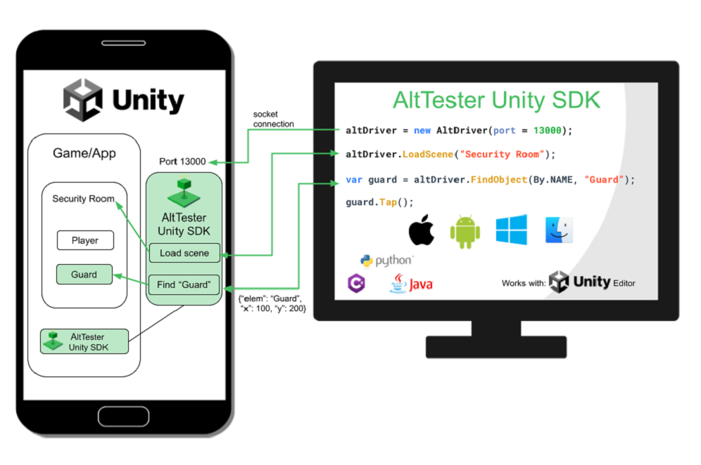

# Overview

AltTester Unity SDK is an open-source UI driven test automation tool that helps you find objects in your Unity application and interact with them using tests written in C#, Python or Java.

You can run your tests on real devices (mobile, PCs, etc.) or inside the Unity Editor.

## Key features

- find elements and get all their (public) properties: coordinates, text, values, Unity components, etc.
- use and modify any of the (public) methods and properties of a Unity element
- simulate any kind of device input (support for Input Manager and Input System)
- manipulate and generate test data
- get screenshots from your Unity Game
- instrument your game and run C# tests from within the Unity Editor using the AltTester Editor window
- run C#, Python or Java tests using your favorite IDE and against the game running on a device or inside the Unity Editor
- integrate with Appium tests for the ability to interact with native elements
- visualize input actions during test execution
- see test results and reports inside the Unity Editor

## How it works

AltTester Unity SDK framework contains the following modules:

* AltDriver
* AltTester Package (Unity)
<!--
* AltProxy
-->

AltTester Unity SDK is used to instrument your Unity App to expose access to all the objects in the Unity hierarchy. The instrumented Unity App opens up a Web socket connection on the device running the Unity application and waits for an AltDriver to connect after starting the application.

AltDriver module is used to connect to the instrumented Unity App, access all the Unity objects and interact with them through tests written in C#, Java or Python.

AltTester Package contains the AltTester Editor window which is the GUI used for instrumenting a Unity game and running C# tests directly from Unity Editor.

<!--
The AltProxy module is used to create the bridge between the tests and the instrumented Unity App. It acts as a websocket server that facilitates communication between AltDriver (tests) and AltTester Unity SDK (instrumented Unity app).
-->

