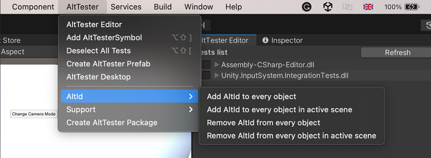

# By selector

## BY-Selector

It is used in find objects methods to set the criteria of which the objects are searched.
Currently there are 7 types implemented:

-   _By.TAG_ - search for objects that have a specific tag
-   _By.LAYER_ - search for objects that are set on a specific layer
-   _By.NAME_ - search for objects that are named in a certain way
-   _By.COMPONENT_ - search for objects that have certain component
-   _By.ID_ - search for objects that have assigned a certain id (every object has an unique id so this criteria always will return 1 or 0 objects). Id checks for InstanceId and [AltId](#altid)
-   _By.TEXT_ - search for objects that have a certain text
-   _By.PATH_ - search for objects that respect a certain path

**Searching object by PATH**

The following selecting nodes and attributes are implemented:

-   _object_ - Selects all object with the name "object"
-   _/_ - Selects from the root node
-   _//_ - Selects nodes in the document from the current node that match the selection no matter where they are
-   _.._ - Selects the parent of the current node
-   \* - Matches any element node
-   _contains_ - Selects objects that contain a certain string in the name
-   _[n-th]_ - Selects n-th object that respects the selectors. 0 - represents the first object, 1 - is the second object and so on. -1 -represents the last object
-   _@tag_
-   _@layer_
-   _@name_
-   _@component_
-   _@id_
-   _@text_

**Examples**

```eval_rst
.. tabs::

    .. tab:: \*

        ``//NameOfParent/NameOfChild/*``

        ``//NameOfParent/NameOfChild//*``

        .. code-block:: c#

            altDriver.FindObjects(By.PATH, "//Canvas/Panel/*")

        - Returns all direct children from Panel

        .. code-block:: c#

            altDriver.FindObjects(By.PATH, "//Canvas/Panel//*")

        - Returns all children from Panel

    .. tab:: \..

        ``//CapsuleInfo/..``

        .. code-block:: c#

            altDriver.FindObject(By.PATH, "//CapsuleInfo/..")

        - Returns the parent of the object CapsuleInfo

    .. tab:: selectors

        .. tabs::

            .. tab:: @tag

                ``//NameOfParent/NameOfChild/*[@tag=tagName]``

                .. code-block:: c#

                    altDriver.FindObjects(By.PATH, "//Canvas/Panel/*[@tag=UI]")

                - Returns every object that is tagged as UI and is a direct child of Panel

            .. tab:: @layer

                ``//NameOfParent/NameOfChild/*[@layer=layerName]``

                .. code-block:: c#

                    altDriver.FindObjects(By.PATH, "//Canvas/Panel/*[@layer=UI]")

                - Returns every object that is in the UI layer and is a direct child of Panel

            .. tab:: @id

                ``//NameOfParent/NameOfChild/*[@id=idMethod]``

                .. code-block:: c#

                    altDriver.FindObject(By.PATH, "//*[@id=8756]");

                - Returns the object which has the id equal to 8756

            .. tab:: @text

                ``//NameOfParent/NameOfChild/*[@text=textName]``

                .. code-block:: c#

                    altDriver.FindObject(By.PATH, "//Canvas/Panel//*[@text=Start]");

                - Returns the first object that has the text "Start" and is a child of Panel

            .. tab:: contains

                ``//NameOfParent/NameOfChild/*[contains(@name,name)]``

                ``//NameOfParent/NameOfChild/*[contains(@text,text)]``

                .. code-block:: c#

                    altDriver.FindObjects(By.PATH, "//*[contains(@name,Cub)]");

                - Returns every object that contains the string "Cub" in the name

            .. tab:: multiple selectors

                ``//NameOfParent/NameOfChild/*[@selector1=selectorName1][@selector2=selectorName2][@selector3=selectorName3]``

                .. code-block:: c#

                    altDriver.FindObject(By.PATH, "//Canvas/Panel/*[@component=Button][@tag=Untagged][@layer=UI]");

                - Returns the first direct child of the Panel that is untagged, is in the UI layer and has a component named Button

    .. tab:: find object

        ``//NameOfParent/NameObject``

        .. code-block:: c#

            altDriver.FindObjects(By.PATH, "/Canvas//Button[@component=ButtonLogic]");

        - Returns every button which is in Canvas that is a root object and has a component named ButtonLogic

    .. tab:: find a child of an object

        ``//NameOfParent/NameOfChild``

        ``//*[@id=idOfParent]/NameOfChild``

        .. code-block:: c#

            altDriver.FindObjects(By.PATH, "//Canvas/Panel")

        - Returns all direct children from Canvas that have the name "Panel

        .. code-block:: c#

            altDriver.FindObjects(By.PATH, "//Canvas/*/text")

        - Returns all children on the second level from Canvas that are named "text"

        .. code-block:: c#

            altDriver.FindObject(By.PATH, "//Canvas/Panel/StartButton[1]")

        - Returns the second child of the first object that has the name "StartButton" and is a direct child of Panel

    .. tab:: indexer
        

        .. important::
            Indexer functionality was changed in 2.0.2 to match that of XPath and it no longer returns the n-th child of the object. Now it returns the n-th object that respects the selectors (Name, Component, Tag, etc.) from the objects with the same parent. The numbering starts from 0 so the first object has the index 0 then the second object has the index 1 and so on. For example //Button/Text[1] will return the second object named `Text` that is the child of the `Button`
    

        ``//NameOfParent[n]``

        ``//NameOfParent/NameOfChild[n]``

        .. code-block:: c#

            altDriver.FindObject(By.PATH, "//Canvas[2]");

        - Returns the 3th `Canvas` object only if there are at least 3 Canvas object somewhere in the hierarchy with the same parent

        .. code-block:: c#

            altDriver.FindObject(By.PATH, "//Canvas/Panel/*[@tag=Player][-1]");

        - Returns the last direct child of Panel that is tagged as Player

```

### Escaping characters

There are several characters that you need to escape when you try to find an object. Some examples characters are the symbols for Request separator and Request ending, by default this are `;` and `&` but can be changed in Server settings. If you don't escape this characters the whole request is invalid and might shut down the server. Other characters are `!`, `[`, `]`, `(`, `)`, `/`, `\`, `.` or `,`. This characters are used in searching algorithm and if not escaped might return the wrong object or not found at all. To escape all the characters mentioned before just add `\\` before each character you want to escape.

**_Examples_**

* `//Q&A` - not escaped
* `//Q\\&A` - escaped

### AltId

Is a solution offered by AltTester® Unity SDK in order to find object easier. This is an unique identifier stored in an component and added to every object.
**A limitation of this is that only the object already in the scene before building the app will have an AltId. Object instantiated during run time will not have an AltId**

To add AltId to every object simply just click _Add AltId to every object_ from AltTester® menu.


