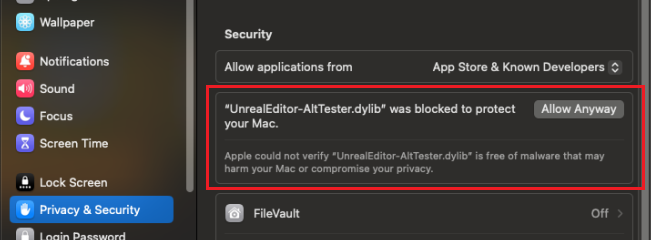

# FAQ

<details>
<summary> On what platforms can I run tests with AltTester® Unreal SDK? </summary>
<br>
PC, Mac, Android, iOS, WebGL, Console and Unreal Editor.
</details>
<br>

<details>
<summary> What programming language can I use to write tests?</summary>
<br>
 C#, Python, Java or Robot Framework.
</details>
<br>

<details>
<summary> What versions of Unreal Engine does AltTester® Unreal SDK work with? </summary>
<br>
AltTester® Unreal SDK works with Unreal Engine 5.3, 5.4, and 5.5.
</details>
<br>

<details>
<summary>Can I use AltTester® Unity SDK to run tests using device cloud services? </summary>
<br>
It works with some of the cloud services. We tried it with Bitbar, AWS Device Farm, BrowserStack and SauceLabs.
These give you access to a virtual machine or a Docker container that has a cloud device attached, where you upload your tests, configure your environment and run your tests. Some of these cloud services allow running Appium automated tests by giving you access to an Appium server running in the cloud that has access to all their mobile devices. More info about this here:<em><a href="alttester-with-cloud.html"> Running tests using device cloud services.</a></em>
</details>
<br>

<details>
<summary> Do I need access to the source code of the Unreal App to write tests?</summary>
<br>
In order to run tests using AltTester® Unreal SDK you require an <a href="get-started.html#set-up-the-alttester-unreal-sdk-in-your-project">instrumented build</a> of the Unreal App.
</details>
<br>

<details>
<summary> I don’t have access to source code, but I do have access to an instrumented build. How can I begin to write tests?</summary>
<br>

```eval_rst
We’ve published AltTester® Desktop, which allows you to inspect the app objects outside the unity editor without access to the source code. More information about AltTester® Desktop can be found in :altTesterdesktopdocumentation:`this documentation <home.html>`.
```
</details>
<br>

## Troubleshooting

<details>
<summary> I get <strong>`waiting for connection on port 13000`</strong> popup message when I start my Unreal App </summary>
<br>
The popup message shows up when you start your instrumented Unreal App. It tells you that the AltTester® Unreal SDK is ready and you can start running your tests.
</details>
<br>

<details>
<summary> MacOS blocks AltTester® Plugin files due to security verification </summary>
<br>
If you're unable to open the Unreal Engine project with the AltTester® Plugin enabled on macOS, and you encounter a message stating that <b><i>Apple could not verify that the `.dylib` file is free of malware</i></b>, follow one of these steps to resolve the issue.
<br><br>

1. **Download the AltTester® Plugin using *wget* command**:
    - For Unreal Engine 5.3, use the following command:
      ```
      wget https://alttester.com/app/uploads/AltTester/sdks/alttester-unreal/AltTesterUnrealSDK-Package-UE5.3.zip
      ```
    - For Unreal Engine 5.4, use this command:
      ```
      wget https://alttester.com/app/uploads/AltTester/sdks/alttester-unreal/AltTesterUnrealSDK-Package-UE5.4.zip
      ```

2. **Remove the quarantine attribute**:  
   Open *Terminal* and run the following command to remove the quarantine flag from the downloaded file:
   - Go to ```UE_5.x/Engine/Plugins/Marketplace/AltTester-Unreal-SDK/Binaries/Mac``` and run:
        ```
        xattr -d com.apple.quarantine UnrealEditor-AltTester.dylib 
        xattr -d com.apple.quarantine UnrealEditor-AltTesterEditor.dylib  
        ``` 

3. **Allow the files from *Privacy & Security Settings***:  
   Go to **System Preferences > Security & Privacy > General** and click **Allow Anyway** for the blocked file (do this for each `.dylib` file).
    

</details>
<br>