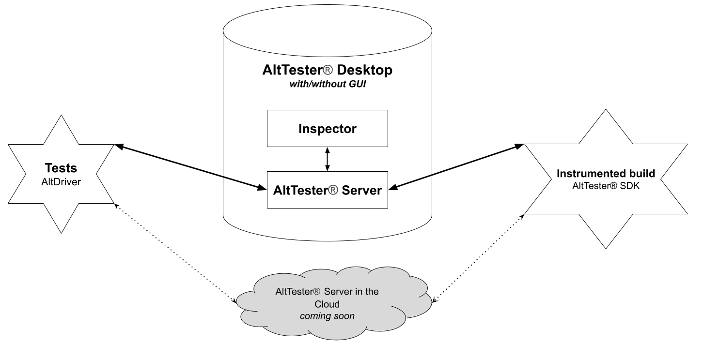

# Overview

The AltTester® Unreal SDK is part of the AltTester® test automation framework for games. Combined with the AltTester® Desktop, the AltTester® Unreal SDK helps you find objects in your Unreal Engine application and interact with them using tests written in C#, Python, Java, or Robot Framework.

You can run your tests on real devices (mobile, PCs, etc.) or inside the Unreal Editor.

## How it works

AltTester® framework contains the following components:

* AltTester® Unreal SDK (illustrated inside the game / app on the left below)
* AltTester® Desktop (illustrated in the middle)
* AltTester® Bindings / Clients (for C#, Python, Java, Robot Framework, illustrated on the right)

* **AltTester® Unreal SDK**

    This is an Unreal Engine plugin used to instrument your Unreal game/app to expose access to all the objects in the Unreal hierarchy. The AltTester® Unreal SDK starts a WebSocket client connection inside the game/app that communicates with the AltTester® Server running within the AltTester® Desktop app.

* **AltTester® Desktop** 
    This is a desktop application for Mac, Windows and Linux that contains the following:

    * **AltTester® Server** - a WebSocket server that facilitates the communication between AltTester® Unreal SDK within the game / app and the automated scripts controlling the game / app. 

    * **AltTester® Inspector and Recorder** - tools that help you create automated tests by recording your actions within the game / app and having them automatically transformed into test automation scripts.

* **AltTester® Bindings / Clients (for C#, Python, Java, Robot Framework)**
    These are packages used to write automated tests in your preferred scripting language. They give you access to the API described in this documentation that enables you to control the instrumented Unreal game / app programmatically. The bindings / clients open a WebSocket client connection that communicates with the AltTester® Server running within the AltTester® Desktop app. 

    The AltDriver module inside each of the clients / bindings, similar to Appium Driver for mobile apps or Selenium WebDriver for web apps, is used to connect to the instrumented Unreal game / app, access all the game objects and interact with them through tests written in C#, Python, Java and Robot Framework.

* **AltTester® Server in the Cloud** - (COMING SOON) is a cloud implementation of the AltTester® Server that will allow you to write and execute tests without needing an instance of the AltTester® Desktop running locally, thus simplifying both local development environments and CI setups. 

## Key features

- find elements and get all their (public) properties: coordinates, text, values, Unreal components, etc.
- use and modify any of the (public) methods and properties of a Unreal element
- simulate any kind of device input
- manipulate and generate test data
- get screenshots from your Unreal App
- run C#, Python, Java or Robot Framework tests using your favorite IDE and against the app running on a device or inside the Unreal Editor
- support for Browserstack on Android and iOS
- run tests concurrently on different devices
