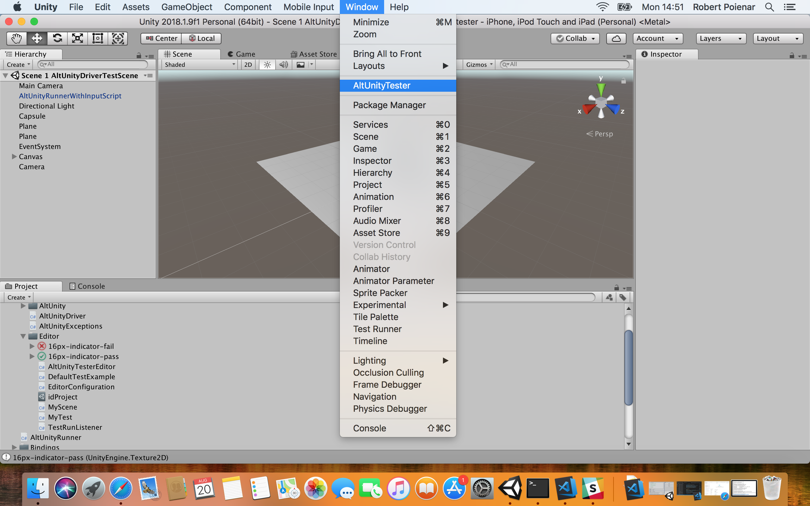
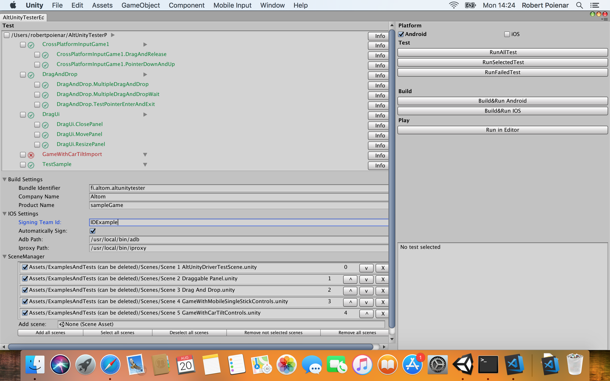

# AltUnityTester

## Table of Content

[Setup](#setup)
   - [Downloads - AltUnityTester Package](#downloads-altunitytester-package)
   - [Import AltUnityTester asset/package into your Unity project](#import-altunitytester-assetpackage-into-your-unity-project)
   - [Setting up local machine for iOS testing](#setting-up-local-machine-for-ios-testing)

[AltUnityTester User Interface](#altunitytester-user-interface)
   - [Building the game](#building-the-game)
   - [Run Tests ](#run-tests)
   - [Writing Test for AltUnityTester](#writing-test-for-altunitytester)
   - [iOS code stripping problems](#ios-code-stripping-problems)

[Actions/Commands](#actionscommands)
   - [AltUnityElements](#altunityelements)
   - [Available Actions](#available-actions)
   - [Finding elements](#finding-elements)
   - [Waiting for elements](#waiting-for-elements)
   - [Managing Unity Scenes](#managing-unity-scenes)
   - [Managing Unity PlayerPrefs](#managing-unity-playerprefs)
   - [Actions on Screen](#actions-on-screen)
   - [Actions on elements](#actions-on-elements)

Other Bindings:
   - [Python](https://gitlab.com/altom/altunitytester/tree/master/Assets/AltUnityTester-BindingsAndExamples(can_be_deleted)/Bindings/python)
   - [Java](https://gitlab.com/altom/altunitytester/tree/master/Assets/AltUnityTester-BindingsAndExamples(can_be_deleted)/Bindings/java)

## Setup
>
### Downloads - AltUnityTester Package
>
* From repository: 
	* https://gitlab.com/altom/altunitytester/blob/master/AltUnityTester.unitypackage
>	  
* From Unity Asset Store - import inside your project directly:
	* links soon


>
### Import AltUnityTester asset/package into your Unity project:
>
* if you use a downloaded Unity package, go to Assets->Import Package -> Custom Package in Unity Editor and select the ```AltUnityTester.unitypackage``` file
* if you dowloaded it from the Unity Asset store, just go to your Asset Store Downloads Manager from Unity Editor and import the package. 

>
### Setting up local machine for iOS testing
>
For iOS, to run the tests on real iOS device, please make sure you also go through this: http://appium.io/docs/en/drivers/ios-xcuitest/ because AltUnityTester uses iproxy command.
>		
The iproxy command is installed as part of the libimobiledevice package that you should have already installed when setting up your iOS environment (http://appium.io/docs/en/drivers/ios-xcuitest-real-devices/)
		
## AltUnityTester User Interface
>
After you imported AltUnityTester package to the project you are ready to use it. Go to Window --> AltUnityTester to open the user interface.

The UI should look like this for Mac user.(Very similar for Windows user but with less fields to fill)

>		
#### Building the game
>>
* Fill the fields in BuildSettings
* Add scenes to SceneManager
	* Only the scenes that are checked are going to be used in build
* Click build on the desired platform (Windows user can only build in Android)

>
#### Run Tests
>>
* First build the game and have the game running on the device
	* **It is important to build the game using AltUnityTester User Interface otherwise it won't work**
* Select all test that you want to run
* (Mac user only) Select which platform to test
* Press `RunSelectedTest` to run the selected test
	* Other option are `RunAllTest` that runs all existing test and `RunFailedTest` that runs all failed test
* After running the test, they will have been colored depending if they passed or failed
* To see more information about the result of a test press the `Info` button and it will display more information


>
### Writing Tests for AltUnityTester
>	
* Go to a folder named Editor or that has an Editor folder in path.
* Create an AltUnityTest file by right-clicking-->Create-->AltUnityTest or go to Assests-->Create-->AltUnityTest. 
* Name the file however you want and open it.
* Write the tests you want using available action that are listed below and NUnit asserts. 

>
For more information check the tests samples that come with the package.

## iOS Code Stripping Problems
>
Because Unity uses IL2CPP to strip unnecessary code to make games as small as possible it might remove code that AltUnityTester will use to get information. This is why some tests might fail. From our observation the methods that most likely will have this problem are: GetComponentProperty, SetComponentProperty and CallComponentMethod. If this happens it will need to create a `link.xml` file in the Asset folder.
>
For information how to create `link.xml` and more details about IL2CPP check [IL2CPP BytecodeStripping](#https://docs.unity3d.com/Manual/IL2CPP-BytecodeStripping.html).
>
**Don't forget to delete link.xml before releasing the game!**


## Actions/Commands
>
The list below contains all the actions that are currently supported by AltUnityDriver.
>
### AltUnityElements
>
All elements in AltUnityTester have the following structure, as seen in the AltUnityObject class:
>
  * `name` - the name of the object as it is in the Unity Scene Hierarchy
  * `cameraName` - the name of the camera from which the screen coordinate are calculated
  * `id` - the Unity Instance ID, this is unique for each element in the scene
  * `x` - the x coordinate of the middle of the element on screen
  * `y` - the y coordinate of the middle of the element on screen
  * `z` - the z coordinate of the middle of the element on screen(this is mostly used to see if the object is in front of camera or behind)
  * `mobileY` - the y coordinate of the middle of the element on a mobile screen
  * `type` - "scene" for Unity scenes and "" for all other elements
  * `worldX` - the x coordinate in world space of the element
  * `worldY` - the y coordinate in world space of the element
  * `worldZ` - the z coordinate in world space of the element

>
### Available Actions
>
#### Finding elements
>
  * `GetAllElements`
    * params: cameraName="" - the name of the camera for which the screen coordinate of the object will be calculated. If no camera is given It will search through all camera that are in the scene until some camera sees the object or return the screen coordinate of the object  calculated to the last camera in the scene.
    * returns: all elements that are currently Active in the scene
>    
    ```c#
      List<AltUnityObject> objects = altUnityDriver.GetAllElements();
    ```
>
  * `FindElement`
    * params:
        * name - the name of the object to be found, as it's shown in the Unity Scene hierarchy
        * cameraName="" - the name of the camera for which the screen coordinate of the object will be calculated. If no camera is given It will search through all camera that are in the scene until some camera sees the object or return the screen coordinate of the object  calculated to the last camera in the scene.
    * returns: the element with the correct name (or the last one found in the hierarchy if more than one element with the same name is present)
    * you can search for elements also by specifying a hierarchy path to them. For example, you can look for `Player1/Hand` or `Player2/Hand`, to make sure you find the correct `Hand` object you are interested in. When doing so, make sure you specify all the objects in between the `parent` and the `object` you are interested in. For example, if `Hand` is under a `Body` element for each `Player`, when you search for it make sure you specify it as `Player1/Body/Hand` 
>
    ```c#
    altUnityDriver.FindElement("Capsule"); // find object by name
    altUnityDriver.FindElement("Ship/Main/Capsule", "Main Camera"); //specify also the name of the parents, and the camera
    ```

>
  * `FindElementWhereNameContains`
    * params: 
        * partOfTheName - part of the name of the object to be found, as it's shown in the Unity Scene hierarchy
        * cameraName="" - the name of the camera for which the screen coordinate of the object will be calculated. If no camera is given It will search through all camera that are in the scene until some camera sees the object or return the screen coordinate of the object  calculated to the last camera in the scene.
    * returns: the element with a name that contains partOfTheName (or the last one found in the hierarchy if more than one element with the same name is present)
>
    ```c#
    altDriver.FindElementWhereNameContains("Capsul"); // should find Capsule     
    ```
>
  * `FindElementByComponent`
    * params: 
        * componentName - the name of a Unity Component, for example a C# script that is attached to an element, like Collider2D etc. This should be the assembly-qualified name of the type to get. If the type is in the currently executing assembly or in Mscorlib.dll, it is sufficient to supply the type name qualified by its namespace. For more info: https://msdn.microsoft.com/en-us/library/w3f99sx1(v=vs.110).aspx
        * cameraName="" - the name of the camera for which the screen coordinate of the object will be calculated. If no camera is given It will search through all camera that are in the scene until some camera sees the object or return the screen coordinate of the object  calculated to the last camera in the scene.
    * returns: the element with a componentName component (or the last one found in the hierarchy if more than one element with the same component is present)
>   
    ```c#
    altUnityDriver.FindElementByComponent("AltUnityRunnerPrefab"); 
    ```
>
  * `FindElements`
    * params: 
        * name - the name of the objects to be found, as they are shown in the Unity Scene hierarchy
        * cameraName="" - the name of the camera for which the screen coordinate of the object will be calculated. If no camera is given It will search through all camera that are in the scene until some camera sees the object or return the screen coordinate of the object  calculated to the last camera in the scene.
    * returns: a list of elements with the correct name
>
    ```c#
    altUnityDriver.FindElements("Capsule");     
    ```
>
  * `FindElementsWhereNameContains`
    * params: 
        * partOfTheName - part of the name of the objects to be found, as they are shown in the Unity Scene hierarchy
        * cameraName="" - the name of the camera for which the screen coordinate of the object will be calculated. If no camera is given It will search through all camera that are in the scene until some camera sees the object or return the screen coordinate of the object  calculated to the last camera in the scene. 
    * returns: a list of elements with a name that contains partOfTheName 
>
    ```c#
    altUnityDriver.FindElementsWhereNameContains("Capsul"); // should find Capsule, Capsules, Capsule1, Capsule 2 etc.     
    ```
>
  * `FindElementsByComponent`
    * params: 
        * componentName - the name of a Unity Component, for example a C# script that is attached to an element, like Collider2D etc. This should be the assembly-qualified name of the type to get. If the type is in the currently executing assembly or in Mscorlib.dll, it is sufficient to supply the type name qualified by its namespace. For more info: https://msdn.microsoft.com/en-us/library/w3f99sx1(v=vs.110).aspx
        * cameraName="" - the name of the camera for which the screen coordinate of the object will be calculated. If no camera is given It will search through all camera that are in the scene until some camera sees the object or return the screen coordinate of the object  calculated to the last camera in the scene.
    * returns: a list of elements with a componentName component
>
    ```c#
    altUnityDriver.FindElementsByComponent("Plane"); 
    ```
>
#### Waiting for elements
  * `WaitForElement`
   * params: 
      * name - the name of the object to be found, as it's shown in the Unity Scene hierarchy
      * cameraName="" - the name of the camera for which the screen coordinate of the object will be calculated. If no camera is given It will search through all camera that are in the scene until some camera sees the object or return the screen coordinate of the object  calculated to the last camera in the scene.
      * timeout=20 - time in seconds before we timeout (default 20)
      * interval=0.5 - how often to check again to see if the element is there (default 0.5)
    * returns: the element with the correct name (or the last one found in the hierarchy if more than one element with the same name is present)
>   
    ```c#
    altUnityDriver.WaitForElement("Capsule"); //specify also the name of the parents
    ```
>
  * `WaitForElementWhereNameContains`
    * params: 
      * partOfTheName - part of the name of the object to be found, as it's shown in the Unity Scene hierarchy
      * cameraName="" - the name of the camera for which the screen coordinate of the object will be calculated. If no camera is given It will search through all camera that are in the scene until some camera sees the object or return the screen coordinate of the object  calculated to the last camera in the scene.
      * timeout=20 - time in seconds before we timeout (default 20)
      * interval=0.5 - how often to check again to see if the element is there (default 0.5)
    * returns: the element with a name that contains partOfTheName (or the last one found in the hierarchy if more than one element with the same name is present)
>
    ```c#
    altUnityDriver.WaitForElementWhereNameContains("Capsul", timeout=30); // should find Capsule     
    ```
>
  * `WaitForElementToNotBePresent`
   * params: 
      * name - the name of the object, as it's shown in the Unity Scene hierarchy
      * cameraName=""="" - the name of the camera for which the screen coordinate of the object will be calculated. If no camera is given It will search through all camera that are in the scene until some camera sees the object or return the screen coordinate of the object  calculated to the last camera in the scene.
      * timeout=20 - time in seconds before we timeout (default 20)
      * interval=0.5 - how often to check again to see if the element is there (default 0.5)
    * returns: the element with the correct name (or the last one found in the hierarchy if more than one element with the same name is present)
>
    ```c#
    altUnityDriver.WaitForElementToNotBePresent("Capsule");
    ``` 
>
  * `WaitForElementWithText`
    * params: 
      * text - the text that we want to wait for (we are looking for an element with a Text component that has the correct value)
      * cameraName=""="" - the name of the camera for wich the screen coordinate of the object will be calculated. If no camera is given It will search through all camera that are in the scene until some camera sees the object or return the screen coordinate of the object  calculated to the last camera in the scene.
      * timeout=20 - time in seconds before we timeout (default 20)
      * interval=0.5 - how often to check again to see if the element is there (default 0.5)
    * returns: the element with the correct name (or the last one found in the hierarchy if more than one element with the same name is present)
>   
    ```c#
        altUnityDriver.WaitForElementWithText("CapsuleInfo", "Capsule was clicked to jump!");
    ``` 
  
>
#### Managing Unity Scenes
  * `GetCurrentScene`
    * params: none
    * returns: the name of the current scene
>
    ```c#
    altUnityDriver.GetCurrentScene();
    ```
  * `WaitForCurrentSceneToBe`
   * params: 
      * sceneName - the scene that we want to wait for 
      * timeout=20 - time in seconds before we timeout (default 20)
      * interval=0.5 - how often to check again to see if the element is there (default 0.5)
    * returns: the name of the scene that we waited for
>
  ```c#
    altUnityDriver.WaitForCurrentSceneToBe("AltUnityDriverTestScene");
  ``` 
* `LoadScene`
    * params: scene - name of the scene to be loved
>
     ```c#
    altUnityDriver.LoadScene("AltUnityDriverTestScene");
  ``` 
>
#### Managing Unity PlayerPrefs
  * `DeletePlayerPref`
    * params: none
    * returns: none
    * Delete all keys and values stored in PlayerPref
>
     ```c#
    altUnityDriver.DeletePlayerPref();
  ``` 
>   
  * `DeleteKeyPlayer`
    * params: keyName - name of the key that will be deleted
    * returns: none
>
     ```c#
    altUnityDriver.DeleteKeyPlayer("PlayerHp");
  ``` 
>    
  * `SetKeyPlayerPref`
    * params:
        * keyName - name of the key for wich a value will be set
        * value - value that will be associated with keyName. This can be an integer, float or a string
    * returns: none
>
     ```c#
    altUnityDriver.SetKeyPlayerPref("PlayerHp",100);
  ``` 
>   
  * `GetIntPlayerPref`
    * params: keyName -name of the key 
    * returns: an int that is associated with the key
>
     ```c#
    altUnityDriver.GetIntPlayerPref("PlayerHp");
  ``` 
>   
  * `GetFloatPlayerPref`
    * params: keyName -name of the key 
    * returns: an float that is associated with the key
>
     ```c#
    altUnityDriver.GetFloatPlayerPref("PlayerMana");
  ``` 
>
  * `GetStringPlayerPref`
    * params: keyName -name of the key 
    * returns: an string that is associated with the key
>
     ```c#
    altUnityDriver.GetStringPlayerPref("PlayerName");
  ``` 
>
#### Actions on screen
  * `Swipe`
	* params: 
		* start - position on the screen where the swipe will start
		* end - postion on the screen where the swipe will end
		* duration - how many seconds the swipe will need to complete
	* return: none
	* Use this method if more than one input is needed because this method will not wait until the swipe is completed to execute the next command. If you want to wait until the swipe is completed use `SwipeAndWait`
>
   ```c#
    var altElement1 = altUnityDriver.FindElement("Drag Image1");
    var altElement2 = altUnityDriver.FindElement("Drop Box1");
    altUnityDriver.Swipe(new Vector2(altElement1.x, altElement1.y), new Vector2(altElement2.x, altElement2.y), 2);
  ``` 
>	
  * `SwipeAndWait`
	* params: 
		* start - position on the screen where the swipe will start
		* end - postion on the screen where the swipe will end
		* duration - how many seconds the swipe will need to complete
	* return: none
	* Use this method if you don't need more inputs to run until th swipe is completed because this method will wait until the swipe is completed to execute the next command. If you want to use more inputs or check something mid-swipe use `Swipe`
>
	 ```c#
    var altElement1 = altUnityDriver.FindElement("Drag Image1");
    var altElement2 = altUnityDriver.FindElement("Drop Box1");
    altUnityDriver.SwipeAndWait(new Vector2(altElement1.x, altElement1.y), new Vector2(altElement2.x, altElement2.y), 2);
  ``` 
> 
  * `HoldButton`
	* params: 
		* position - (x,y) coordinates on the screen where a touch will be simulated
		* duration - how many seconds the touch will exist/be pressing 
	* return: none
	*Use this method if more than one input is needed because this method will not wait until the swipe is completed to execute the next command.If you want to wait until the hold is completed use `HoldButtonAndWait`
>
 ```c#
    var altElement1 = altUnityDriver.FindElement("Button");
    altUnityDriver.HoldButton(new Vector2(altElement1.x, altElement1.y), 2);
  ``` 
> 
  * `HoldButtonAndWait`
	* params: 
		* position - (x,y) coordinates on the screen where a touch will be simulated
		* duration - how many seconds the touch will exist/be pressing 
	* return: none
	* Use this method if you don't need more inputs to run until the action is completed because this method will wait until the action is completed to execute the next command. If you want to use more inputs or check something while holding use `HoldButton`
>
 ```c#
    var altElement1 = altUnityDriver.FindElement("Button");
    altUnityDriver.HoldButtonAndWait(new Vector2(altElement1.x, altElement1.y), 2);
  ``` 
> 
  * `TapScreen`
	* params: (x,y) - coordinates on the screen where it will be simulated a tap
	* return: the element that received the tap
>
 ```c#
     altUnityDriver.TapScreen(100,200);
  ``` 
> 
  * `Tilt`
	* params: acceleration - (x,y,z) values to simulate the device rotation
	*return: none
>
 ```c#
     altUnityDriver.Tilt(new Vector3(2, 2, 2));
  ``` 
> 
#### Actions on elements
  * `ClickEvent`
	* params: none
	* Execute pointerClick event on the object
> 
 ```c#
     altUnityDriver.FindElement("Capsule").ClickEvent();
  ``` 
>  
 * `DragObject`
	* params: position - (x,y) coordinates of the screen where the object will be dragged
	* Execute drag event on the object
> 
 ```c#
      altUnityDriver.FindElement("Capsule").DragObject(new Vector2(200, 200));
  ``` 
>  
  * `DropObject`
	* params: (x,y) coordinates of the screen where the object will be dropped
	* Execute drop event on the object
> 
 ```c#
     altUnityDriver.FindElement("Capsule").DropObject(new Vector2(200, 200));
  ``` 
>  
  * `PointerUpFromObject`
	* params: none
	* Execute pointerUp event on the object
>
 ```c#
      altUnityDriver.FindElement("Capsule").PointerUpFromObject();
  ``` 
>  
  * `PointerDownFromObject`
	* params: none
	* Execute pointerDown event on the object
>
 ```c#
     altUnityDriver.FindElement("Capsule").PointerDownFromObject();
  ``` 
>  
  * `PointerEnterObject`
	* params: none
	* Execute pointerEnter event on the object
>
	 ```c#
      altUnityDriver.FindElement("Capsule").PointerEnterObject();
    ```
>  
  * `PointerExitObject`
	* params: none
	* Execute pointerExit event on the object
>	
	 ```c#
      altUnityDriver.FindElement("Capsule").PointerExitObject();
   ``` 
>
  * `Tap`
   * params: none
   * simulates a tap on the object that trigger multiple events similar to a real tap 
>  
  ```c#
  altUnityDriver.FindElement("UIButton").Tap();
  ``` 
>
  * `GetText`
    * params: none
    * returns: the value of the Text component if the element has one 
>  
   ```c#
   var text=altUnityDriver.FindElement("CapsuleInfo").GetText();'
  ``` 
>  
  * `GetComponentProperty`
    * params: 
      * componentName: name of the Unity component that has the public property we want to get the value for. This should be the assembly-qualified name of the type to get. If the type is in the currently executing assembly or in Mscorlib.dll, it is sufficient to supply the type name qualified by its namespace. For more info: https://msdn.microsoft.com/en-us/library/w3f99sx1(v=vs.110).aspx
      * propertyName - the name of the public property (or field) that we want the value for
>
   For example, since Capsule.cs has a public "arrayOfInts", we can get the value of that:
>
   ```c#
    var result = altUnityDriver.FindElement("Capsule").GetComponentProperty("Capsule", "arrayOfInts");
   ```
>   
  * `SetComponentProperty`
  * params: 
      * componentName: name of the Unity component that has the public property we want to set the value for. This should be the assembly-qualified name of the type to get. If the type is in the currently executing assembly or in Mscorlib.dll, it is sufficient to supply the type name qualified by its namespace. For more info: https://msdn.microsoft.com/en-us/library/w3f99sx1(v=vs.110).aspx
      * propertyName - the name of the public property (or field) that we want to set the value for
      * value - the value that we want to set. This will be deserialized to match the correct type, so '[1,2,3] will deserialized to an array of ints, '1' will be an integer etc.
>
   For example, since Capsule.cs has a public "arrayOfInts", we can set the value of that:
>
   ```c#
   altUnityDriver.FindElement("Capsule").SetComponentProperty("Capsule", "arrayOfInts", "[2,3,4]");
   result = altUnityDriver.FindElement("Capsule").GetComponentProperty("Capsule", "arrayOfInts");
   ```
>
  * `CallComponentMethod`
   * params: 
      * componentName: name of the Unity component that has the public property we want to call a method for. This should be the assembly-qualified name of the type to get. If the type is in the currently executing assembly or in Mscorlib.dll, it is sufficient to supply the type name qualified by its namespace. For more info: https://msdn.microsoft.com/en-us/library/w3f99sx1(v=vs.110).aspx
      * method - the name of the public method that we want to call
      * parameters - a string containing the serialized parameters to be sent to the component method. This uses '?' to separate between parameters, like this:
      'some string ? [1,2,3]' - this represents two parameters "some string" and "[1,2,3]
       Each parameter will be deserialized to match the correct type, so '[1,2,3] will deserialized to an array of ints, '1' will be an integer etc.
>    
   For example, since Capsule.cs has a public "Jump" method that takes a string as a parameter, we can call it like this:
>
   ```c#
   altUnityDriver.FindElement("Capsule").CallComponentMethod("Capsule", "Jump", "setFromMethod");
   ```
>
   This calls `Jump("setFromMethod)` in C#
>
   If the Capsule.cs also has the following method:
 >
   ```c#
   public void TestMethodWithManyParameters(int param1, string param2, float param, int[] arrayOfInts) {
   ```
 > 
   we can call that by:
 >
   ```c#
   altUnityDriver.FindElement("Capsule").CallComponentMethod("Capsule", "TestMethodWithManyParameters", "1?this is a text?0.5?[1,2,3]");
   ```
>
   This will call `TestMethodWithManyParameters(1, "this is a text", 0,5, new int[]{1, 2, 3})` 
   
   
   


