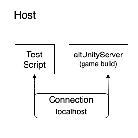
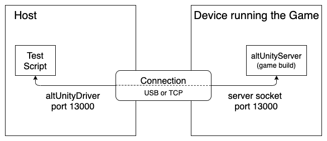
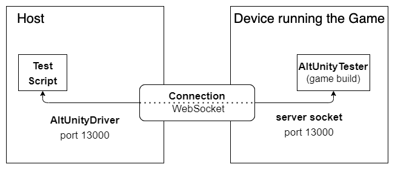
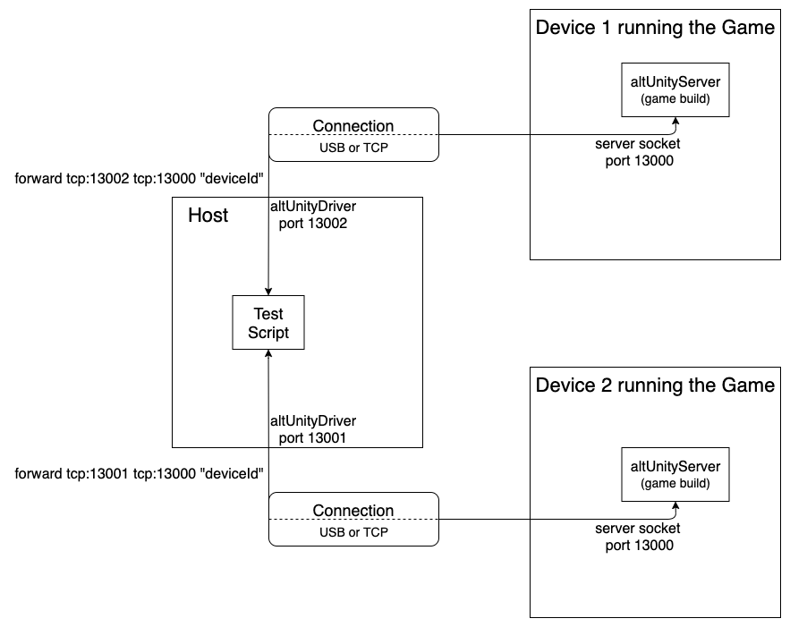
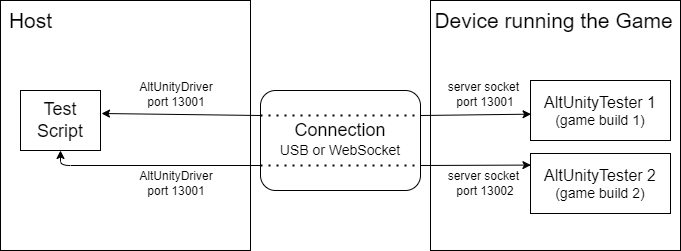
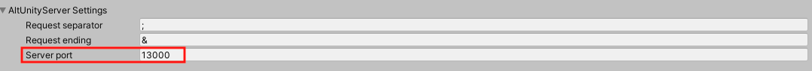

# Advanced Usage
## Build games from the command line

To build your game from command line you need a static method in your project that handles the build logic.  
To instrument your game with AltUnity Server, your build method must define AltUnity Tester and must insert AltUnity Prefab in the first scene of the game.

Depending on your project's setup, there are two ways in which games can be built from the command line:

```eval_rst
.. note::

    AltUnity Tester does not work by default in release mode. If you instrument your game in release mode, AltUnity Prefab self removes from the scenes and the socket server does not start. Best case practice is to customize your build script to insert AltUnity Prefab only in Debug mode. If you do want to use AltUnity Tester in release mode see `Using AltUnity Server in Release mode section <#using-altunity-server-in-release-mode>`_.
```

**1. If you already have a custom build method for your game**  

If you already have a custom build method for your game, you can add the following two lines to your build method:
```
AltUnityBuilder.AddAltUnityTesterInScritpingDefineSymbolsGroup(BuildTargetGroup.Android);
AltUnityBuilder.InsertAltUnityInScene(FirstSceneOfTheGame);
```

```eval_rst
.. note::

    Change `BuildTargetGroup` above to the target group for which you are building.
```

**2. If you create a new custom build method for your game** 

The following example script can be used.  
It sets all the project settings needed and uses the same two important lines from point 1 above.

This example method is configured for the Android platform, so make sure to update it based on your target platform.
 
```eval_rst
.. include:: other~/build-from-command-line.txt
    :code: c#
    
```

The following command is used to call the build method:

```eval_rst
.. code-block:: bash

    <UnityPath>/Unity -projectPath $CI_PROJECT_DIR -executeMethod BuilderClass.BuildFromCommandLine -logFile logFile.log -quit
```
 
You can find more information about the build command and arguments [here](https://docs.unity3d.com/Manual/CommandLineArguments.html).  

```eval_rst
.. note::
    After building from the command line you can run the tests by using the commands from the `next section <#run-tests-from-the-command-line>`_.
```

## Run tests from the command line

In order to run tests from the command line you can use the following example commands:

```eval_rst
.. tabs::

    .. tab:: C#

        .. code-block:: bash

            <UnityPath>/Unity -projectPath $PROJECT_DIR -executeMethod AltUnityTestRunner.RunTestFromCommandLine -tests MyFirstTest.TestStartGame -logFile logFile.log -batchmode -quit
    
    .. tab:: Java

        .. code-block:: bash

            mvn test

    .. tab:: Python

        .. code-block:: bash

            python <nameOfYourTestFile.py>
```

## Run tests on a Continuous Integration Server

1. Instrument your game build with altUnity Tester from Unity or by [building from the command line](#build-games-from-the-command-line).
2. Start the game build on a device.
3. Run your tests - see commands in the ["Run tests from the command line" section](#run-tests-from-the-command-line).

An example CI configuration file can be viewed in the [AltUnity Tester GitLab repository](https://gitlab.com/altom/altunity/altunitytester/-/blob/master/.gitlab-ci.yml).

## What is port forwarding and when to use it

Port forwarding, or tunneling, is the behind-the-scenes process of intercepting data traffic headed for a computer’s IP/port combination and redirecting it to a different IP and/or port.

When you run your game instrumented with AltUnity Server, on a device, you need to tell your AltUnity Driver how to connect to it. 

Port forwarding can be set up either through a command line command or in the test code by using the methods available in AltUnity classes.

The following are some cases when Port Forwarded is needed:
1. [Connect to the game running on a USB connected device](#connect-to-the-game-running-on-a-usb-connected-device)
2. [Connect to multiple devices running the game](#connect-to-multiple-devices-running-the-game)

### How to setup port forwarding

Port forwarding can be set up in two ways:
* through a command line command (using adb / IProxy) or 
* in the test code by using the methods available in AltUnity classes.

```eval_rst
.. tabs::

    .. tab:: Command Line

        .. tabs::

            .. tab:: Android

                - Have ADB installed and added in PATH Environment Variables (check `this article <https://developer.android.com/studio/command-line/adb>`_ for more information on ADB)
                - Click on the refresh button in the Port Forwarding section in the Editor
                - Forward the port using the following command: 

                    ``adb [-s UDID] forward tcp:local_port tcp:device_port``

            .. tab:: iOS

                - Install IProxy: ``brew install libimobiledevice``
                - Click on the refresh button in the Port Forwarding section in the Editor
                - Forward the port using the following command: 

                    ``iproxy LOCAL_TCP_PORT DEVICE_TCP_PORT [UDID]``

    .. tab:: C#

        .. tabs::

            .. tab:: Android

                Set up the path to ADB in AltUnity Editor window by writting it in the `Adb Path <altunity-tester-editor.html#build-run-settings>`_ input field.
                Use the following static methods (from the AltUnityPortHandler class) in your test file:
        
                    - ForwardAndroid (string deviceId = "", int localPort = 13000, int remotePort = 13000)
                    - RemoveForwardAndroid (int localPort = -1, string deviceId = "")
            
                Example test file:

                    .. include:: other~/test-files/csharp-Android-test.cs
                        :code: c#

            .. tab:: iOS

                Set up IProxy path in AltUnity Editor window.
                Use the following static methods (from the AltUnityPortHandler class) in your test file:

                    - ForwardIos (string id = "", int localPort = 13000, int remotePort = 13000)
                    - KillIProxy (int id)

                Example test file:
            
                    .. include:: other~/test-files/csharp-iOS-test.cs
                        :code: c#

    .. tab:: Java

        Have ADB installed and added in PATH Environment Variables (check `this article <https://developer.android.com/studio/command-line/adb>`_ for more information on ADB) for Android and IProxy for iOS.

        Use the following static methods (from the AltUnityDriver class) in your test file:

            - SetupPortForwarding (String platform, String deviceId, int local_port, int remote_port)
            - RemovePortForwarding ()

        Example test file:

        .. tabs::

            .. tab:: Android
            
                    .. include:: other~/test-files/java-Android-test.java
                        :code: java

            .. tab:: iOS
            
                    .. include:: other~/test-files/java-iOS-test.java
                        :code: java

    .. tab:: Python

        Have ADB installed and added in PATH Environment Variables (check `this article <https://developer.android.com/studio/command-line/adb>`_ for more information on ADB) for Android and IProxy for iOS.

        .. tabs:: 
            
            .. tab:: Android

                Use the following static methods (from the AltUnityAndroidPortForwarding class) in your test file:

                    - forward_port_device (self, local_port = 13000, device_port = 13000, device_id = "")
                    - remove_forward_port_device (self, port = 13000, device_id = "")
                    - remove_all_forwards (self):

                Example test file:
            
                    .. include:: other~/test-files/python-Android-test.py
                        :code: py

            .. tab:: iOS

                Use the following static methods (from the AltUnityiOSPortForwarding class) in your test file:
                
                    - forward_port_device (local_port = 13000, device_port = 13000, device_id = "")
                    - kill_iproxy_process (pid)  // pid is returned by forward_port_device
                    - kill_all_iproxy_process()

                Example test file:
            
                    .. include:: other~/test-files/python-iOS-test.py
                        :code: py

```

```eval_rst
.. note::
    The default port on which the AltUnity Server is running is 13000. 
    Port can be changed when making a new game build or make use of port forwarding if needed.
```

## Connect to AltUnity server running inside the game

There are multiple scenarios on how to connect to the AltUnity Server running inside a game:

1. [Connect to the game running on the same machine as the test code](#connect-to-the-game-running-on-the-same-machine-as-the-test-code)
2. [Connect to the game running on a USB connected device](#connect-to-the-game-running-on-a-usb-connected-device) by using [Port Forwarding](#what-is-port-forwarding-and-when-to-use-it).
3. [Connect to the device running the game by using an IP address](#connect-to-the-device-running-the-game-by-using-an-ip-address)
4. [Connect to multiple devices running the game](#connect-to-multiple-devices-running-the-game) by using [Port Forwarding](#what-is-port-forwarding-and-when-to-use-it).
5. [Connect to multiple builds of the application running on the same device](#connect-to-multiple-builds-of-the-application-running-on-the-same-device)

### Connect to the game running on the same machine as the test code



In this case Port Forwarding is not needed as both the game and tests are using localhost (127.0.0.1) connection and the default 13000 port.

### Connect to the game running on a USB connected device

If the device running the game is connected through a USB connection, commands sent to localhost port 13000 can be automatically forwarded to the device.



In this scenario you can use Port Forwarding to enable AltUnity Driver to connect to the device via localhost.

Check [Port Forwarding](#what-is-port-forwarding-and-when-to-use-it) for more details about Port Forwarding and [Setup Port Forwarding](#how-to-setup-port-forwarding) section on how to make the setup.

### Connect to the device running the game by using an IP address



You can connect directly through an IP address if the altUnity server port is available and the IP address is reachable.
It is recommended to use [Port Forwarding](#what-is-port-forwarding-and-when-to-use-it) since IP addresses could change and would need to be updated more frequently.

The following command can be used to connect to the altUnity server inside the game:

```eval_rst
.. tabs::
    .. code-tab:: c#

            altUnityDriver = new AltUnityDriver ("deviceIp", 13000); 

    .. code-tab:: java

            altUnityDriver = new AltUnityDriver ("deviceIp", 13000, ";", "&", true);  

    .. code-tab:: py

            cls.altdriver = AltUnityDriver(TCP_IP='deviceIp', TCP_PORT=13000)
```

### Connect to multiple devices running the game



For two devices you have to do the same steps above, by [connecting through port forwarding](#how-to-setup-port-forwarding) twice.

So, in the end, you will have:
* 2 devices, each with one AltUnity Server
* 1 computer with two AltUnity Drivers

Then, in your tests, you will send commands from each of the two AltUnity Drivers.

The same happens with n devices, repeat the steps n times.

### Connect to multiple builds of the application running on the same device

If you want to run two builds on the same device you will need to change the AltUnity Server Port. 

For example, you will build a game with AltUnity Server running on Server Port 13001 and another one that runs on Server Port 13002.



Then in your tests you will need to instantiate two AltUnity server drivers for each of the Server Ports.

```eval_rst
.. important::
    On mobile devices, AltUnity Driver can only interact with a single game at a time and the game needs to be in focus.  

    On Android/iOS only one application is in focus at a time so you need to switch (in code) between the applications if using two drivers at the same time.   
    This applies even when using split screen mode.
```

You can change the port for your game build from the AltUnityTesterEditor window inside your Unity project.




```eval_rst
.. note::
    After you have done the Server Port forwarding or connected to the AltUnity driver directly, you can use it in your tests to send commands to the server and receive information from the game.
```


## Using AltUnity Server in Release mode

By default AltUnity Server does not run in release mode. We recommended that you do not build your game in release mode with AltUnity Tester. That being said, if you do want to instrument your game with AltUnity Tester in release mode, you need to uncheck `RunOnlyInDebugMode` flag on AltUnityRunnerPrefab inside AltUnity Tester asset folder  `AltUnityTester/Prefab/AltUnityRunnerPrefab.prefab`