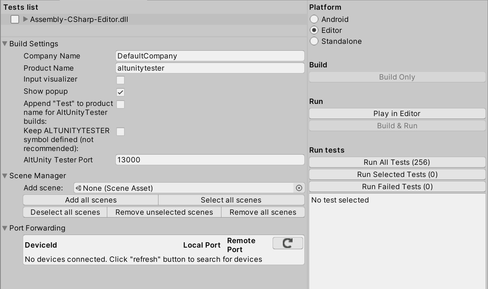
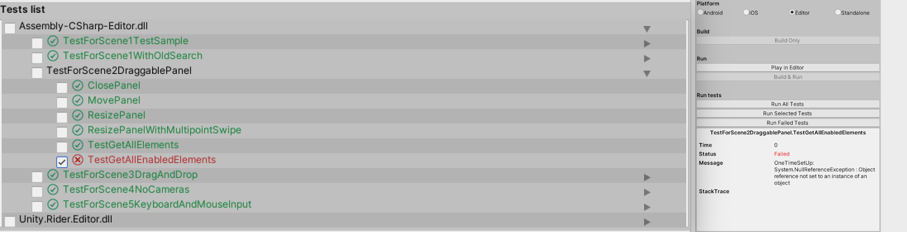
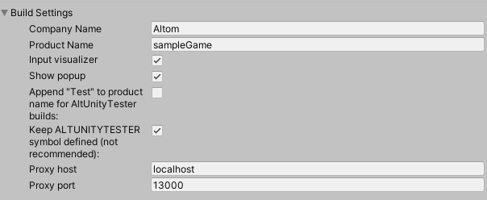
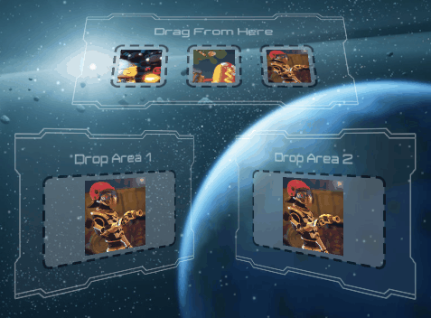
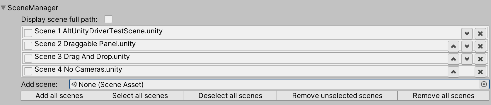
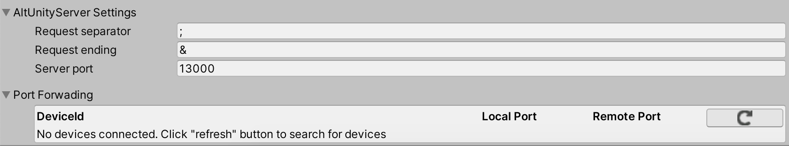

# AltUnity Tester Editor

The GUI refers to the "AltUnityTesterEditor" window that is displayed when adding the altUnity Tester package in Unity.



In the following sections you can see a breakdown of all the sections in the GUI.

## Tests List



* displays all the available tests from the project folder
* user can select what tests to run by checking the checkbox next to their name
* user can either check each test individually or check the whole class of tests
* tests that passed have a green checkmark while tests that failed are shown with a red x icon
* Test Log Summary: contains a log for why a test has failed (see right side of screenshot)

## Build Settings



* Output Path

    Your build files are available in the configured Output Path.  
    By default, the Output Path is a folder with the same name as your game.  
    The file extension will be set automatically based on Platform, if game name in Output Path has no extension.

* Company Name: company name used for the game build (same with Unity's Player Settings)
* Product Name: the company name (same with Unity's Player Settings)
* Input visualizer

```eval_rst
    | Lets you see where on screen an action (e.g. swipe or click) happens. 
    | The action position is marked on the screen with a red circle.
```
To activate this option before build check the "Input visualizer" checkbox.

|     Input Visualizer Disabled     |     Input Visualizer Enabled    |
| ---------------------------------- | ----------------------------- | 
|      |     |

You can also activate this option from within the test using the following code:

```eval_rst
.. tabs::

    .. code-tab:: c#

        altUnityDriver.FindObject (By.NAME, "AltUnityRunnerPrefab").SetComponentProperty("AltUnityRunner", "ShowInputs", "true");
    .. code-tab:: java

        altUnityDriver.findObject (AltUnityDriver.By.NAME,"AltUnityRunnerPrefab").setComponentProperty("AltUnityRunner", "ShowInputs", "true");


    .. code-tab:: py

        self.altdriver.find_object (By.NAME,"AltUnityRunnerPrefab").set_component_property("AltUnityRunner", "ShowInputs", "true")
```

* Show popup

```eval_rst
    | If this option is checked, it will display the "AltUnityTester" popup in game containing the text "Waiting for connection on port 13000". 
    | That means the build contains the AltUnity Tester. 
    | Popup will disappear once the tests are started.
```


* Append "Test" to product: will add "Test" to the product name

## Log Settings

* Max Length

    Through this parameter one can specify the maximum length of the logs. The default value of this
    parameter is 100, values lower than 100 are not allowed.
    It is optional to specify a value to Max Length. In case this field remains empty, no restrictions
    to the length of the logs are applied.

## Scene Settings



* The Scene Manager pane displays a list of the Scenes from your Project. Checked scenes are included in the build.
* Unity uses the list of Scenes to determine the order that it loads the Scenes in. To adjust the order of the Scenes use the action buttons associated to each scene to move them up or down the list.
* Display scene full path: displays the full path where the scenes are located
* Add Scene: displays all the scenes in the project. User can add scenes to the "Scene Manager" from the "Add Scene" popup
* Action buttons (add / select / remove scenes)


## Server Settings



* Request separator & Request ending

    When sending a request to the AltUnity Server, each command is separated by the Request Separator and finishes with the Request ending character.  
        For example, in Java, you'll see something like this in the log: `Sending rpc message [loadScene;Scene 2 Draggable Panel;&]`.

    These characters should be changed (when making a game build) if a UI element in your game has one of them as element identifier.  
    For example, if you have an element named as `item1; item2` and you want to find that element by using its name.

* Server port

    Refers to the port used by the AltUnity Server running inside the game.  
    You can change this value and make a new game build if you want to use another port.

* Port Forwarding
    
    In this section you can setup [Port Forwarding](advanced-usage.html#what-is-port-forwarding-and-when-to-use-it) on your device.  
    Your device needs to be connected to the computer through USB and you need to click the Refresh button in the section to view it in the list.

## Build & Run Settings

*Platform Settings*

```eval_rst
.. tabs::

    .. tab:: Platform

        .. tabs::

            .. tab:: Android

                .. image:: ../_static/images/platformSettings/AltUnityWindowAndroid.png

                The **Android Bundle Identifier** field: fill in a valid bundle ID.

                The **Adb Path** field: provide the path to adb.

            .. tab:: iOS

                .. image:: ../_static/images/platformSettings/AltUnityWindowiOS.png

                The **iOS Bundle Identifier** field: fill in a valid bundle ID.

                The **Signing Team ID** field:  fill in with the team's ID.

                The **Automatically Signed** field: check this for default signing.

                The **Iproxy path** field: provide the path to iproxy.

                The **Xcrun Path** field: provide the path to xcrun.

            .. tab:: Editor

                .. image:: ../_static/images/platformSettings/AltUnityWindowEditor.png

            .. tab:: Standalone

                .. image:: ../_static/images/platformSettings/AltUnityWindowStandalone.png

                The **Build Target** filed: choose build mode according to platform.

```

*Build Settings*

    * Build Only

*Run Settings*

    * Play in Editor
    * Build & Run 

*Run Tests Settings*

    * Run All Tests
    * Run Selected Tests
    * Run Failed Tests 

```eval_rst
.. note::
    Run Tests does not use the options set in the Platform section.
```
