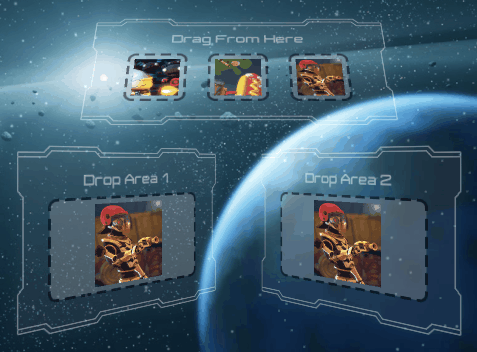
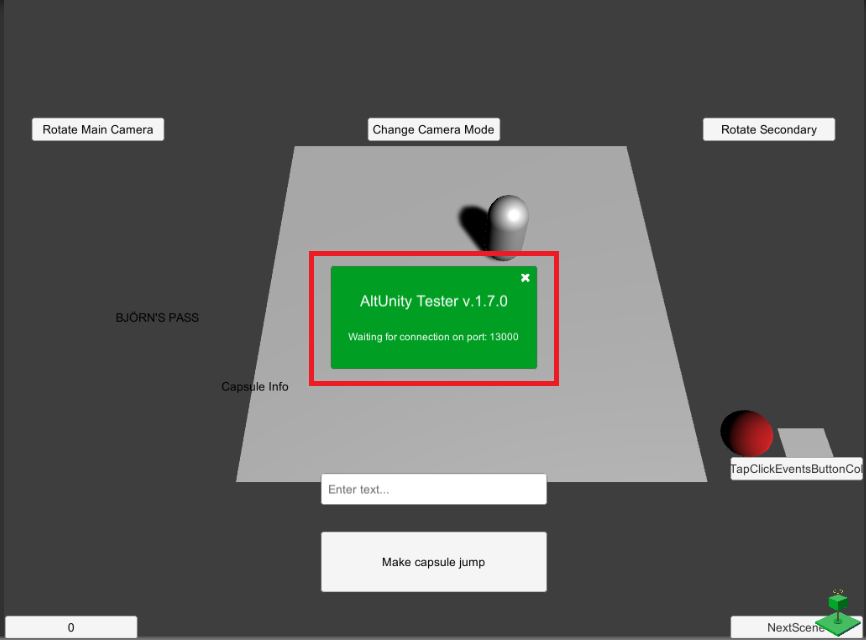

# AltUnity Tester GUI


## Show Inputs

Lets you see the during test where on screen an action as swipe or click happens. The action position is marked on the screen with a red circle.

To activate this option before build check "Input visualizer" checkbox.



You can also activate this option from test using the following code:

```eval_rst
.. tabs::

    .. code-tab:: c#

        altUnityDriver.FindObject(By.NAME, "AltUnityRunnerPrefab").SetComponentProperty("AltUnityRunner", "ShowInputs", "true");
    .. code-tab:: java

        altUnityDriver.findObject(AltUnityDriver.By.NAME,"AltUnityRunnerPrefab").setComponentProperty("AltUnityRunner", "ShowInputs", "true");


    .. code-tab:: py

        self.altdriver.find_object(By.NAME,"AltUnityRunnerPrefab").set_component_property("AltUnityRunner", "ShowInputs", "true")
```

## Show popup

If this option is checked an popup with that shows when AltUnityTester is inside the build appears on the screen. The popup goes away once the tests are started.


