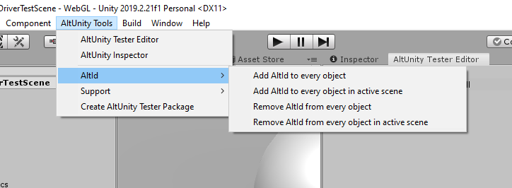

# API

## AltUnityDriver

The **AltUnityDriver** class represents the main game driver component. When you instantiate an AltUnityDriver in your tests, you can use it to "drive" your game like one of your users would, by interacting with all the game objects, their properties and methods.
An AltUnityDriver instance will connect to the AltUnity Proxy that bridges the connection with the instrumented Unity application. In the constructor, we need to tell the driver where (on what IP and on what port) the proxy is running. We can also set some more advanced parameters, as shown in the table below:

**_Parameters_**

| Name             | Type    | Required | Description                               |
| ---------------- | ------- | -------- | ----------------------------------------- |
| host             | string  | No       | The ip or hostname  AltUnity Proxy is listening on. The default value for this is "127.0.0.1" |
| port             | int     | No       | The default value for this is 13000                                                           |
| enableLogging    | boolean | No       | If true, enables logging on the driver. The default value for this is false                   |
| connectTimeout   | int     | No       | Number of seconds to retry connection to proxy. The default value for this is 60 seconds      |


Once you have an instance of the _AltUnityDriver_, you can use all the available commands to interact with the game. The available methods are the following:

### Find Objects

#### FindObject

Finds the first object in the scene that respects the given criteria. Check [By](#by-selector) for more information about criterias.

**_Parameters_**

| Name       | Type               | Required | Description                                                                                                                                                                                                                                                                                                                                                                                               |
| ---------- | ------------------ | -------- | --------------------------------------------------------------------------------------------------------------------------------------------------------------------------------------------------------------------------------------------------------------------------------------------------------------------------------------------------------------------------------------------------------- |
| by         | [By](#by-selector) | Yes      | Set what criteria to use in order to find the object                                                                                                                                                                                                                                                                                                                                                      |
| value      | string             | Yes      | The value to which object will be compared to see if they respect the criteria or not                                                                                                                                                                                                                                                                                                                     |
| cameraBy   | [By](#by-selector) | No       | Set what criteria to use in order to find the camera                                                                                                                                                                                                                                                                                                                                                      |
| cameraValue | string            | No       | The value to which all the cameras in the scene will be compared to see if they respect the criteria or not to get the camera for which the screen coordinate of the object will be calculated. If no camera is given It will search through all camera that are in the scene until some camera sees the object or return the screen coordinate of the object calculated to the last camera in the scene. |
| enabled    | boolean            | No       | If `true` will match only objects that are active in hierarchy. If `false` will match all objects.                                                                                                                                                                                                                                                                                                        |

**_Returns_**

-   AltUnityObject

**_Examples_**

```eval_rst
.. tabs::

    .. code-tab:: c#

        [Test]
        public void TestFindAltUnityObject()
        {
            const string name = "Capsule";
            var altUnityObject = altUnityDriver.FindObject(By.NAME,name);
            Assert.NotNull(altUnityObject);
            Assert.AreEqual(name, altUnityObject.name);
        }

    .. code-tab:: java

        @Test
        public void testfindObject() throws Exception
        {
            String name = "Capsule";
            AltFindObjectsParameters altFindObjectsParameters = new AltFindObjectsParameters.Builder(AltUnityDriver.By.NAME,
                    name).isEnabled(true).withCamera(AltUnityDriver.By.NAME,"Main Camera").build();
            AltUnityObject altUnityObject = altUnityDriver.findObject(altFindObjectsParameters);
            assertNotNull(altUnityObject);
            assertEquals(name, altUnityObject.name);
        }

    .. code-tab:: py

        def test_find_object(self):
            altUnityObject = self.altUnityDriver.find_object(By.NAME,"Capsule")
            self.assertEqual(altUnityObject.name, "Capsule")
```

#### FindObjects

Finds all objects in the scene that respects the given criteria. Check [By](#by-selector) for more information about criterias.

**_Parameters_**

| Name       | Type               | Required | Description                                                                                                                                                                                                                                                                                                                                                                                               |
| ---------- | ------------------ | -------- | --------------------------------------------------------------------------------------------------------------------------------------------------------------------------------------------------------------------------------------------------------------------------------------------------------------------------------------------------------------------------------------------------------- |
| by         | [By](#by-selector) | Yes      | Set what criteria to use in order to find the object                                                                                                                                                                                                                                                                                                                                                      |
| value      | string             | Yes      | The value to which object will be compared to see if they respect the criteria or not                                                                                                                                                                                                                                                                                                                     |
| cameraBy   | [By](#by-selector) | No       | Set what criteria to use in order to find the camera                                                                                                                                                                                                                                                                                                                                                      |
| cameraValue | string            | No       | The value to which all the cameras in the scene will be compared to see if they respect the criteria or not to get the camera for which the screen coordinate of the object will be calculated. If no camera is given It will search through all camera that are in the scene until some camera sees the object or return the screen coordinate of the object calculated to the last camera in the scene. |
| enabled    | boolean            | No       | If `true` will match only objects that are active in hierarchy. If `false` will match all objects.                                                                                                                                                                                                                                                                                                        |

**_Returns_**

-   List of AltUnityObjects/ empty list if no objects were found

**_Examples_**

```eval_rst
.. tabs::

    .. code-tab:: c#

        [Test]
        public void TestFindObjectsByTag()
        {
            var altUnityObjects = altUnityDriver.FindObjects(By.TAG,"plane");
            Assert.AreEqual(2, altUnityObjects.Count);
            foreach(var altUnityObject in altUnityObjects)
            {
                Assert.AreEqual("Plane", altUnityObject.name);
            }
        }

    .. code-tab:: java

           @Test
            public void testFindAltUnityObjects() throws Exception
            {
                String name = "Plane";
                AltFindObjectsParameters altFindObjectsParameters = new AltFindObjectsParameters.Builder(AltUnityDriver.By.NAME,
                    name).isEnabled(true).withCamera(AltUnityDriver.By.NAME,"Main Camera").build();
                AltUnityObject[] altUnityObjects = altUnityDriver.findObjects(altFindObjectsParameters);
                assertNotNull(altUnityObjects);
                assertEquals(altUnityObjects[0].name, name);
            }

    .. code-tab:: py

        def test_find_objects_by_layer(self):
                self.altUnityDriver.load_scene('Scene 1 AltUnityDriverTestScene')
                altUnityObjects = self.altUnityDriver.find_objects(By.LAYER,"Default")
                self.assertEquals(8, len(altUnityObjects))

```

#### FindObjectWhichContains

Finds the first object in the scene that respects the given criteria. Check [By](#by-selector) for more information about criterias.

**_Parameters_**

| Name       | Type               | Required | Description                                                                                                                                                                                                                                                                                                                                                                                               |
| ---------- | ------------------ | -------- | --------------------------------------------------------------------------------------------------------------------------------------------------------------------------------------------------------------------------------------------------------------------------------------------------------------------------------------------------------------------------------------------------------- |
| by         | [By](#by-selector) | Yes      | Set what criteria to use in order to find the object                                                                                                                                                                                                                                                                                                                                                      |
| value      | string             | Yes      | The value to which object will be compared to see if they respect the criteria or not                                                                                                                                                                                                                                                                                                                     |
| cameraBy   | [By](#by-selector) | No       | Set what criteria to use in order to find the camera                                                                                                                                                                                                                                                                                                                                                      |
| cameraValue | string            | No       | The value to which all the cameras in the scene will be compared to see if they respect the criteria or not to get the camera for which the screen coordinate of the object will be calculated. If no camera is given It will search through all camera that are in the scene until some camera sees the object or return the screen coordinate of the object calculated to the last camera in the scene. |
| enabled    | boolean            | No       | If `true` will match only objects that are active in hierarchy. If `false` will match all objects.                                                                                                                                                                                                                                                                                                        |

**_Returns_**

-   AltUnityObjects

**_Examples_**

```eval_rst
.. tabs::

    .. code-tab:: c#

       [Test]
        public void TestFindObjectWhichContains()
        {
            var altUnityObject = altUnityDriver.FindObjectWhichContains(By.NAME, "Event");
            Assert.AreEqual("EventSystem", altUnityObject.name);
        }


    .. code-tab:: java

        @Test
        public void TestFindObjectWhichContains()
        {
            String name = "Event";
            AltFindObjectsParameters altFindObjectsParameters = new AltFindObjectsParameters.Builder(AltUnityDriver.By.NAME,
                   name).isEnabled(true).withCamera(AltUnityDriver.By.NAME,"Main Camera").build();
            AltUnityObject altUnityObject = altUnityDriver.findObjectWhichContains(altFindObjectsParameters);
            assertEquals("EventSystem", altUnityObject.name);
        }

    .. code-tab:: py

       def test_find_object_which_contains(self):
        altUnityObject = self.altUnityDriver.find_object_which_contains(By.NAME, "Event");
        self.assertEqual("EventSystem", altUnityObject.name)

```

#### FindObjectsWhichContain

Finds all objects in the scene that respects the given criteria. Check [By](#by-selector) for more information about criterias.

**_Parameters_**

| Name       | Type               | Required | Description                                                                                                                                                                                                                                                                                                                                                                                               |
| ---------- | ------------------ | -------- | --------------------------------------------------------------------------------------------------------------------------------------------------------------------------------------------------------------------------------------------------------------------------------------------------------------------------------------------------------------------------------------------------------- |
| by         | [By](#by-selector) | Yes      | Set what criteria to use in order to find the object                                                                                                                                                                                                                                                                                                                                                      |
| value      | string             | Yes      | The value to which object will be compared to see if they respect the criteria or not                                                                                                                                                                                                                                                                                                                     |
| cameraBy   | [By](#by-selector) | No       | Set what criteria to use in order to find the camera                                                                                                                                                                                                                                                                                                                                                      |
| cameraValue | string            | No       | The value to which all the cameras in the scene will be compared to see if they respect the criteria or not to get the camera for which the screen coordinate of the object will be calculated. If no camera is given It will search through all camera that are in the scene until some camera sees the object or return the screen coordinate of the object calculated to the last camera in the scene. |
| enabled    | boolean            | No       | If `true` will match only objects that are active in hierarchy. If `false` will match all objects.                                                                                                                                                                                                                                                                                                        |

**_Returns_**

-   List of AltUnityObjects/ empty list if no objects were found

**_Examples_**

```eval_rst
.. tabs::

    .. code-tab:: c#

        [Test]
        public void TestFindObjectWhichContains()
        {
          var altUnityObject = altUnityDriver.FindObjectWhichContain(By.NAME, "Event");
          Assert.AreEqual("EventSystem", altUnityObject.name);
        }

    .. code-tab:: java

        @Test
        public void testFindObjectsWhereNameContains() throws Exception
        {
            String name = "Pla";
            AltFindObjectsParameters altFindObjectsParameters = new AltFindObjectsParameters.Builder(AltUnityDriver.By.NAME,
                name).isEnabled(true).withCamera("Main Camera").build();
            AltUnityObject[] altUnityObjects = altUnityDriver.findObjectsWhichContain(altFindObjectsParameters);
            assertNotNull(altUnityObjects);
            assertTrue(altUnityObjects[0].name.contains(name));
        }

    .. code-tab:: py

        def test_creating_stars(self):
                self.altUnityDriver.load_scene("Scene 5 Keyboard Input")

                stars = self.altUnityDriver.find_objects_which_contain(By.NAME,"Star","Player2")
                self.assertEqual(1, len(stars))
                player = self.altUnityDriver.find_objects_which_contain(By.NAME,"Player","Player2")

                self.altUnityDriver.move_mouse(int(stars[0].x),int(player[0].y)+500, 1)
                time.sleep(1.5)

                self.altUnityDriver.press_key(AltUnityKeyCode.Mouse0, 1,0)
                self.altUnityDriver.move_mouse_and_wait(int(stars[0].x),int(player[0].y)-500, 1)
                self.altUnityDriver.press_key(AltUnityKeyCode.Mouse0, 1,0)

                stars = self.altUnityDriver.find_objects_which_contain(By.NAME,"Star")
                self.assertEqual(3, len(stars))
```

#### GetAllElements

Returns information about every objects loaded in the currently loaded scenes. This also means objects that are set as DontDestroyOnLoad.

**_Parameters_**

| Name       | Type               | Required | Description                                                                                                                                                                                                                                                                                                                                                                                               |
| ---------- | ------------------ | -------- | --------------------------------------------------------------------------------------------------------------------------------------------------------------------------------------------------------------------------------------------------------------------------------------------------------------------------------------------------------------------------------------------------------- |
| cameraBy   | [By](#by-selector) | No       | Set what criteria to use in order to find the camera                                                                                                                                                                                                                                                                                                                                                      |
| cameraValue | string            | No       | The value to which all the cameras in the scene will be compared to see if they respect the criteria or not to get the camera for which the screen coordinate of the object will be calculated. If no camera is given It will search through all camera that are in the scene until some camera sees the object or return the screen coordinate of the object calculated to the last camera in the scene. |
| enabled    | boolean            | No       | If `true` will match only objects that are active in hierarchy. If `false` will match all objects.                                                                                                                                                                                                                                                                                                        |

**_Returns_**

-   List of AltUnityObjects/ empty list if no objects were found

**_Examples_**

```eval_rst
.. tabs::

    .. code-tab:: c#

        [Test]
        public void TestGetAllEnabledObjects()
        {

            var altUnityObjects = altUnityDriver.GetAllElements(enabled: true);
            Assert.IsNotEmpty(altUnityObjects);
            string listOfObjects="";
                foreach(var object in altUnityObjects){
                listOfObjects=object.name+"; ";
            }
            Debug.Log(listOfObjects);
            Assert.AreEqual(19, altUnityObjects.Count);
            Assert.IsNotNull(altUnityObjects.Where(p => p.name == "Capsule"));
            Assert.IsNotNull(altUnityObjects.Where(p => p.name == "Main Camera"));
            Assert.IsNotNull(altUnityObjects.Where(p => p.name == "Directional Light"));
            Assert.IsNotNull(altUnityObjects.Where(p => p.name == "Plane"));
            Assert.IsNotNull(altUnityObjects.Where(p => p.name == "Canvas"));
            Assert.IsNotNull(altUnityObjects.Where(p => p.name == "EventSystem"));
            Assert.IsNotNull(altUnityObjects.Where(p => p.name == "AltUnityRunner"));
            Assert.IsNotNull(altUnityObjects.Where(p => p.name == "CapsuleInfo"));
            Assert.IsNotNull(altUnityObjects.Where(p => p.name == "UIButton"));
            Assert.IsNotNull(altUnityObjects.Where(p => p.name == "Text"));
        }

    .. code-tab:: java

        @Test
        public void testGetAllElements() throws Exception {
            AltGetAllElementsParameters altGetAllElementsParameters = new AltGetAllElementsParameters.Builder().withCamera(AltUnityDriver.By.NAME,"Main Camera").isEnabled(true).build();
            AltUnityObject[] altUnityObjects = altUnityDriver.getAllElements(altGetAllElementsParameters);
            assertNotNull(altUnityObjects);
            String altUnityObjectsString = new Gson().toJson(altUnityObjects);
            assertTrue(altUnityObjectsString.contains("Capsule"));
            assertTrue(altUnityObjectsString.contains("Main Camera"));
            assertTrue(altUnityObjectsString.contains("Directional Light"));
            assertTrue(altUnityObjectsString.contains("Plane"));
            assertTrue(altUnityObjectsString.contains("Canvas"));
            assertTrue(altUnityObjectsString.contains("EventSystem"));
            assertTrue(altUnityObjectsString.contains("AltUnityRunnerPrefab"));
            assertTrue(altUnityObjectsString.contains("CapsuleInfo"));
            assertTrue(altUnityObjectsString.contains("UIButton"));
            assertTrue(altUnityObjectsString.contains("Text"));
        }

    .. code-tab:: py

        def test_get_all_elements(self):
            alt_elements = self.altUnityDriver.get_all_elements(enabled= False)
            self.assertIsNotNone(alt_elements)

            list_of_elements=[]
            for element in alt_elements:
                list_of_elements.append(element.name)

            self.assertEqual(28, len(list_of_elements))
            self.assertTrue("Capsule" in list_of_elements)
            self.assertTrue("Main Camera" in list_of_elements)
            self.assertTrue("Directional Light" in list_of_elements)
            self.assertTrue("Plane" in list_of_elements)
            self.assertTrue("Canvas" in list_of_elements)
            self.assertTrue("EventSystem" in list_of_elements)
            self.assertTrue("AltUnityRunnerPrefab" in list_of_elements)
            self.assertTrue("CapsuleInfo" in list_of_elements)
            self.assertTrue("UIButton" in list_of_elements)
            self.assertTrue("Cube" in list_of_elements)
            self.assertTrue("Camera" in list_of_elements)
            self.assertTrue("InputField" in list_of_elements)


```

#### WaitForObject

Waits until it finds an object that respects the given criteria or until timeout limit is reached. Check [By](#by-selector) for more information about criterias.

**_Parameters_**

| Name       | Type               | Required | Description                                                                                                                                                                                                                                                                                                                                                                                               |
| ---------- | ------------------ | -------- | --------------------------------------------------------------------------------------------------------------------------------------------------------------------------------------------------------------------------------------------------------------------------------------------------------------------------------------------------------------------------------------------------------- |
| by         | [By](#by-selector) | Yes      | Set what criteria to use in order to find the object                                                                                                                                                                                                                                                                                                                                                      |
| value      | string             | Yes      | The value to which object will be compared to see if they respect the criteria or not                                                                                                                                                                                                                                                                                                                     |
| cameraBy   | [By](#by-selector) | No       | Set what criteria to use in order to find the camera                                                                                                                                                                                                                                                                                                                                                      |
| cameraValue | string            | No       | The value to which all the cameras in the scene will be compared to see if they respect the criteria or not to get the camera for which the screen coordinate of the object will be calculated. If no camera is given It will search through all camera that are in the scene until some camera sees the object or return the screen coordinate of the object calculated to the last camera in the scene. |
| enabled    | boolean            | No       | If `true` will match only objects that are active in hierarchy. If `false` will match all objects.                                                                                                                                                                                                                                                                                                        |
| timeout    | double             | No       | number of seconds that it will wait for object                                                                                                                                                                                                                                                                                                                                                            |
| interval   | double             | No       | number of seconds after which it will try to find the object again. interval should be smaller than timeout                                                                                                                                                                                                                                                                                               |

**_Returns_**

-   AltUnityObject

**_Examples_**

```eval_rst
.. tabs::

    .. code-tab:: c#

       [Test]
        public void TestWaitForObjectToNotExistFail()
        {
            try
            {
                altUnityDriver.WaitForObjectNotBePresent(By.NAME,"Capsule", timeout: 1, interval: 0.5f);
                Assert.Fail();
            }
            catch (WaitTimeOutException exception)
            {
                Assert.AreEqual("Element //Capsule still found after 1 seconds", exception.Message);
            }
        }

    .. code-tab:: java

        @Test
        public void TestWaitForObjectWithCameraId() {
            AltFindObjectsParameters altFindObjectsParametersButton = new AltFindObjectsParameters.Builder(
                    AltUnityDriver.By.PATH, "//Button").build();
            AltUnityObject altButton = altUnityDriver.findObject(altFindObjectsParametersButton);
            altButton.clickEvent();
            altButton.clickEvent();
            AltFindObjectsParameters altFindObjectsParametersCamera = new AltFindObjectsParameters.Builder(By.PATH,
                    "//Camera").build();
            AltUnityObject camera = altUnityDriver.findObject(altFindObjectsParametersCamera);
            AltFindObjectsParameters altFindObjectsParametersCapsule = new AltFindObjectsParameters.Builder(By.COMPONENT,
                    "CapsuleCollider").withCamera(By.ID, String.valueOf(camera.id)).build();
            AltWaitForObjectsParameters altWaitForObjectsParameters = new AltWaitForObjectsParameters.Builder(
                    altFindObjectsParametersCapsule).build();
            AltUnityObject altUnityObject = altUnityDriver.waitForObject(altWaitForObjectsParameters);

            assertTrue("True", altUnityObject.name.equals("Capsule"));

            altFindObjectsParametersCamera = new AltFindObjectsParameters.Builder(By.PATH, "//Main Camera").build();
            AltUnityObject camera2 = altUnityDriver.findObject(altFindObjectsParametersCamera);
            altFindObjectsParametersCapsule = new AltFindObjectsParameters.Builder(By.COMPONENT, "CapsuleCollider")
                    .withCamera(By.ID, String.valueOf(camera2.id)).build();
            altWaitForObjectsParameters = new AltWaitForObjectsParameters.Builder(altFindObjectsParametersCapsule).build();
            AltUnityObject altUnityObject2 = altUnityDriver.waitForObject(altWaitForObjectsParameters);

            assertNotEquals(altUnityObject.getScreenPosition(), altUnityObject2.getScreenPosition());
        }

    .. code-tab:: py

        def test_wait_for_object(self):
            altUnityObject=self.altUnityDriver.wait_for_object(By.NAME,"Capsule")
            self.assertEqual(altUnityObject.name,"Capsule")

```

#### WaitForObjectWhichContains

Waits until it finds an object that respects the given criteria or time runs out and will throw an error. Check [By](#by-selector) for more information about criterias.

**_Parameters_**

| Name       | Type               | Required | Description                                                                                                                                                                                                                                                                                                                                                                                               |
| ---------- | ------------------ | -------- | --------------------------------------------------------------------------------------------------------------------------------------------------------------------------------------------------------------------------------------------------------------------------------------------------------------------------------------------------------------------------------------------------------- |
| by         | [By](#by-selector) | Yes      | Set what criteria to use in order to find the object                                                                                                                                                                                                                                                                                                                                                      |
| value      | string             | Yes      | The value to which object will be compared to see if they respect the criteria or not                                                                                                                                                                                                                                                                                                                     |
| cameraBy   | [By](#by-selector) | No       | Set what criteria to use in order to find the camera                                                                                                                                                                                                                                                                                                                                                      |
| cameraValue | string            | No       | The value to which all the cameras in the scene will be compared to see if they respect the criteria or not to get the camera for which the screen coordinate of the object will be calculated. If no camera is given It will search through all camera that are in the scene until some camera sees the object or return the screen coordinate of the object calculated to the last camera in the scene. |
| enabled    | boolean            | No       | If `true` will match only objects that are active in hierarchy. If `false` will match all objects.                                                                                                                                                                                                                                                                                                        |
| timeout    | double             | No       | number of seconds that it will wait for object                                                                                                                                                                                                                                                                                                                                                            |
| interval   | double             | No       | number of seconds after which it will try to find the object again. interval should be smaller than timeout                                                                                                                                                                                                                                                                                               |

**_Returns_**

-   AltUnityObject

**_Examples_**

```eval_rst
.. tabs::

    .. code-tab:: c#

        [Test]
        public void TestWaitForObjectWhichContains()
        {
            var altUnityObject = altUnityDriver.WaitForObjectWhichContains(By.NAME, "Canva");
            Assert.AreEqual("Canvas", altUnityObject.name);
        }
    .. code-tab:: java

        @Test
        public void TestWaitForObjectWhichContainsWithCameraId() {
            AltFindObjectsParameters altFindObjectsParametersCamera = new AltFindObjectsParameters.Builder(By.PATH,
                    "//Main Camera").build();
            AltUnityObject camera = altUnityDriver.findObject(altFindObjectsParametersCamera);

            AltFindObjectsParameters altFindObjectsParametersObject = new AltFindObjectsParameters.Builder(By.NAME, "Canva")
                    .withCamera(By.ID, String.valueOf(camera.id)).build();
            AltWaitForObjectsParameters altWaitForObjectsParameters = new AltWaitForObjectsParameters.Builder(
                    altFindObjectsParametersObject).build();
            AltUnityObject altUnityObject = altUnityDriver.waitForObjectWhichContains(altWaitForObjectsParameters);
            assertEquals("Canvas", altUnityObject.name);

        }

    .. code-tab:: py

        def test_wait_for_object_which_contains(self):
            altUnityObject=self.altUnityDriver.wait_for_object_which_contains(By.NAME,"Main")
            self.assertEqual(altUnityObject.name,"Main Camera")
```


#### WaitForObjectNotBePresent

Waits until the object in the scene that respects the given criteria is no longer in the scene or until timeout limit is reached. Check [By](#by-selector) for more information about criterias.

**_Parameters_**

| Name       | Type               | Required | Description                                                                                                                                                                                                                                                                                                                                                                                               |
| ---------- | ------------------ | -------- | --------------------------------------------------------------------------------------------------------------------------------------------------------------------------------------------------------------------------------------------------------------------------------------------------------------------------------------------------------------------------------------------------------- |
| by         | [By](#by-selector) | Yes      | Set what criteria to use in order to find the object                                                                                                                                                                                                                                                                                                                                                      |
| value      | string             | Yes      | The value to which object will be compared to see if they respect the criteria or not                                                                                                                                                                                                                                                                                                                     |
| cameraBy   | [By](#by-selector) | No       | Set what criteria to use in order to find the camera                                                                                                                                                                                                                                                                                                                                                      |
| cameraValue | string            | No       | The value to which all the cameras in the scene will be compared to see if they respect the criteria or not to get the camera for which the screen coordinate of the object will be calculated. If no camera is given It will search through all camera that are in the scene until some camera sees the object or return the screen coordinate of the object calculated to the last camera in the scene. |
| enabled    | boolean            | No       | If `true` will match only objects that are active in hierarchy. If `false` will match all objects.                                                                                                                                                                                                                                                                                                        |
| timeout    | double             | No       | number of seconds that it will wait for object                                                                                                                                                                                                                                                                                                                                                            |
| interval   | double             | No       | number of seconds after which it will try to find the object again. interval should be smaller than timeout                                                                                                                                                                                                                                                                                               |

**_Returns_**

-   Nothing

**_Examples_**

```eval_rst
.. tabs::

    .. code-tab:: c#

        [Test]
        public void TestWaitForObjectToNotExist()
        {
            altUnityDriver.WaitForObjectNotBePresent(By.NAME, "Capsulee", timeout: 1, interval: 0.5f);
        }

    .. code-tab:: java

        @Test
        public void TestWaitForObjectToNotBePresent(){
            AltFindObjectsParameters altFindObjectsParameters=new AltFindObjectsParameters.Builder(AltUnityDriver.By.NAME,"Capsulee").build();
            AltWaitForObjectsParameters altWaitForObjectsParameters=new AltWaitForObjectsParameters.Builder(altFindObjectsParameters).build();
            altUnityDriver.waitForObjectToNotBePresent(altWaitForObjectsParameters);
        }


    .. code-tab:: py

        def test_wait_for_object_to_not_be_present(self):
            self.altUnityDriver.wait_for_object_to_not_be_present(By.NAME,"Capsuule")


```

### Input Actions

#### KeyDown

Simulates that a specific key was pressed without taking into consideration the duration of the press.

**_Parameters_**

| Name     | Type           | Required | Description                                                                               |
| -------- | -------------- | -------- | ----------------------------------------------------------------------------------------- |
| keyCode | AltUnityKeyCode| Yes      | The keyCode of the key simulated to be pressed. |
| power | int          | Yes      | A value between [-1,1] used for joysticks to indicate how hard the button was pressed. |

**_Returns_**

-   Nothing

**_Examples_**

```eval_rst
.. tabs::

    .. code-tab:: c#

        [Test]
        public void TestKeyDownAndKeyUp()
        {
            altUnityDriver.LoadScene("Scene 5 Keyboard Input");
            AltUnityKeyCode kcode = AltUnityKeyCode.A;

            altUnityDriver.KeyDown(kcode, 1);
            var lastKeyDown = altUnityDriver.FindObject(By.NAME, "LastKeyDownValue");
            var lastKeyPress = altUnityDriver.FindObject(By.NAME, "LastKeyPressedValue");

            Assert.AreEqual((int)kcode, (int)Enum.Parse(typeof(AltUnityKeyCode), lastKeyDown.GetText(), true));
            Assert.AreEqual((int)kcode, (int)Enum.Parse(typeof(AltUnityKeyCode), lastKeyPress.GetText(), true));

            altUnityDriver.KeyUp(kcode);
            var lastKeyUp = altUnityDriver.FindObject(By.NAME, "LastKeyUpValue");

            Assert.AreEqual((int)kcode, (int)Enum.Parse(typeof(AltUnityKeyCode), lastKeyUp.GetText(), true));
        }

    .. code-tab:: java

        @Test
        public void TestKeyDownAndKeyUp() throws Exception {
            AltFindObjectsParameters altFindObjectsParameters1 = new AltFindObjectsParameters.Builder(
                    AltUnityDriver.By.NAME, "LastKeyDownValue").build();
            AltFindObjectsParameters altFindObjectsParameters2 = new AltFindObjectsParameters.Builder(
                    AltUnityDriver.By.NAME, "LastKeyUpValue").build();
            AltFindObjectsParameters altFindObjectsParameters3 = new AltFindObjectsParameters.Builder(
                    AltUnityDriver.By.NAME, "LastKeyPressedValue").build();
            AltUnityKeyCode kcode = AltUnityKeyCode.A;
            AltKeyParameters altKeyParams = new AltKeyParameters.Builder(kcode).build();

            altUnityDriver.KeyDown(altKeyParams);
            Thread.sleep(2000);
            AltUnityObject lastKeyDown = altUnityDriver.findObject(altFindObjectsParameters1);
            AltUnityObject lastKeyPress = altUnityDriver.findObject(altFindObjectsParameters3);
            assertEquals("A", AltUnityKeyCode.valueOf(lastKeyDown.getText()).name());
            assertEquals("A", AltUnityKeyCode.valueOf(lastKeyPress.getText()).name());

            altUnityDriver.KeyUp(kcode);
            Thread.sleep(2000);
            AltUnityObject lastKeyUp = altUnityDriver.findObject(altFindObjectsParameters2);
            assertEquals("A", AltUnityKeyCode.valueOf(lastKeyUp.getText()).name());
        }

    .. code-tab:: py

        def test_key_down_and_key_up(self):
            self.altUnityDriver.load_scene('Scene 5 Keyboard Input')

            self.altUnityDriver.key_down(AltUnityKeyCode.A)
            time.sleep(5)
            lastKeyDown = self.altUnityDriver.find_object(By.NAME, 'LastKeyDownValue')
            lastKeyPress = self.altUnityDriver.find_object(By.NAME, 'LastKeyPressedValue')

            self.assertEqual("A", lastKeyDown.get_text())
            self.assertEqual("A", lastKeyPress.get_text())

            self.altUnityDriver.key_up(AltUnityKeyCode.A)
            time.sleep(5)
            lastKeyUp = self.altUnityDriver.find_object(By.NAME, 'LastKeyUpValue')
            self.assertEqual("A", lastKeyUp.get_text())


```

#### KeyUp

Simulates that a specific key was released.

**_Parameters_**

| Name     | Type           | Required | Description                                                                               |
| -------- | -------------- | -------- | ----------------------------------------------------------------------------------------- |
| keyCode | AltUnityKeyCode| Yes      | The keyCode of the key simulated to be released. |

**_Returns_**

-   Nothing

**_Examples_**

```eval_rst
.. tabs::

    .. code-tab:: c#

        [Test]
        public void TestKeyDownAndKeyUp()
        {
            altUnityDriver.LoadScene("Scene 5 Keyboard Input");
            AltUnityKeyCode kcode = AltUnityKeyCode.A;

            altUnityDriver.KeyDown(kcode, 1);
            var lastKeyDown = altUnityDriver.FindObject(By.NAME, "LastKeyDownValue");
            var lastKeyPress = altUnityDriver.FindObject(By.NAME, "LastKeyPressedValue");

            Assert.AreEqual((int)kcode, (int)Enum.Parse(typeof(AltUnityKeyCode), lastKeyDown.GetText(), true));
            Assert.AreEqual((int)kcode, (int)Enum.Parse(typeof(AltUnityKeyCode), lastKeyPress.GetText(), true));

            altUnityDriver.KeyUp(kcode);
            var lastKeyUp = altUnityDriver.FindObject(By.NAME, "LastKeyUpValue");

            Assert.AreEqual((int)kcode, (int)Enum.Parse(typeof(AltUnityKeyCode), lastKeyUp.GetText(), true));
        }

    .. code-tab:: java

        @Test
        public void TestKeyDownAndKeyUp() throws Exception {
            AltFindObjectsParameters altFindObjectsParameters1 = new AltFindObjectsParameters.Builder(
                    AltUnityDriver.By.NAME, "LastKeyDownValue").build();
            AltFindObjectsParameters altFindObjectsParameters2 = new AltFindObjectsParameters.Builder(
                    AltUnityDriver.By.NAME, "LastKeyUpValue").build();
            AltFindObjectsParameters altFindObjectsParameters3 = new AltFindObjectsParameters.Builder(
                    AltUnityDriver.By.NAME, "LastKeyPressedValue").build();
            AltUnityKeyCode kcode = AltUnityKeyCode.A;
            AltKeyParameters altKeyParams = new AltKeyParameters.Builder(kcode).build();

            altUnityDriver.KeyDown(altKeyParams);
            Thread.sleep(2000);
            AltUnityObject lastKeyDown = altUnityDriver.findObject(altFindObjectsParameters1);
            AltUnityObject lastKeyPress = altUnityDriver.findObject(altFindObjectsParameters3);
            assertEquals("A", AltUnityKeyCode.valueOf(lastKeyDown.getText()).name());
            assertEquals("A", AltUnityKeyCode.valueOf(lastKeyPress.getText()).name());

            altUnityDriver.KeyUp(kcode);
            Thread.sleep(2000);
            AltUnityObject lastKeyUp = altUnityDriver.findObject(altFindObjectsParameters2);
            assertEquals("A", AltUnityKeyCode.valueOf(lastKeyUp.getText()).name());
        }

    .. code-tab:: py

        def test_key_down_and_key_up(self):
            self.altUnityDriver.load_scene('Scene 5 Keyboard Input')

            self.altUnityDriver.key_down(AltUnityKeyCode.A)
            time.sleep(5)
            lastKeyDown = self.altUnityDriver.find_object(By.NAME, 'LastKeyDownValue')
            lastKeyPress = self.altUnityDriver.find_object(By.NAME, 'LastKeyPressedValue')

            self.assertEqual("A", lastKeyDown.get_text())
            self.assertEqual("A", lastKeyPress.get_text())

            self.altUnityDriver.key_up(AltUnityKeyCode.A)
            time.sleep(5)
            lastKeyUp = self.altUnityDriver.find_object(By.NAME, 'LastKeyUpValue')
            self.assertEqual("A", lastKeyUp.get_text())

```

#### HoldButton

Simulates holding left click button down for a specified amount of time at given coordinates.

**_Parameters_**

| Name        | Type            | Required | Default | Description                                           |
| ----------- | --------------- | -------- | ------- | ----------------------------------------------------- |
| coordinates | Vector2         | Yes      |         | The coordinates where the button is held down.        |
| duration    | float           | No       | 0.1     | The time measured in seconds to keep the button down. |
| wait        | boolean         | No       | true    | If set wait for command to finish.                    |

**_Returns_**

-   Nothing

**_Examples_**

```eval_rst
.. tabs::

    .. code-tab:: c#

        [Test]
        public void TestHoldButton()
        {
            var button = altUnityDriver.FindObject(By.NAME, "UIButton");
            altUnityDriver.HoldButton(button.getScreenPosition(), 1);
            var capsuleInfo = altUnityDriver.FindObject(By.NAME, "CapsuleInfo");
            var text = capsuleInfo.GetText();
            Assert.AreEqual(text, "UIButton clicked to jump capsule!");
        }

    .. code-tab:: java

        @Test
        public void testHoldButton() throws Exception {
            AltUnityObject button = altUnityDriver
                    .findObject(new AltFindObjectsParameters.Builder(AltUnityDriver.By.NAME, "UIButton").build());
            altUnityDriver.holdButton(new AltHoldParameters.Builder(button.getScreenPosition()).withDuration(1).build());
            AltUnityObject capsuleInfo = altUnityDriver
                    .findObject(new AltFindObjectsParameters.Builder(AltUnityDriver.By.NAME, "CapsuleInfo").build());
            String text = capsuleInfo.getText();
            assertEquals(text, "UIButton clicked to jump capsule!");
        }

    .. code-tab:: py

        def test_hold_button(self):
            self.altdriver.load_scene("Scene 1 AltUnityDriverTestScene")
            button = self.altdriver.find_object(By.NAME, "UIButton")
            self.altdriver.hold_button(button.get_screen_position(), 1)

            capsule_info = self.altdriver.find_object(By.NAME, "CapsuleInfo")
            text = capsule_info.get_text()
            assert text == "UIButton clicked to jump capsule!"

```

#### MoveMouse

Simulate mouse movement in your game

**_Parameters_**

| Name        | Type            | Required | Default |  Description                                                                                           |
| ----------- | --------------- | -------- | ------- |  ----------------------------------------------------------------------------------------------------- |
| coordinates | Vector2         | Yes      |         | The screen coordinates                                                                                 |
| duration    | float           | No       | 0.1     | The time measured in seconds to move the mouse from the current mouse position to the set coordinates. |
| wait        | boolean         | No       | true    | If set wait for command to finish.                                                                     |


**_Returns_**

-   Nothing

**_Examples_**

```eval_rst
.. tabs::

    .. code-tab:: c#

        [Test]
        public void TestCreatingStars()
        {
            altUnityDriver.LoadScene("Scene 5 Keyboard Input");

            var stars = altUnityDriver.FindObjectsWhichContain(By.NAME, "Star", cameraValue: "Player2");
            var pressingpoint1 = altUnityDriver.FindObjectWhichContains(By.NAME, "PressingPoint1", cameraValue: "Player2");
            Assert.AreEqual(1, stars.Count);

            altUnityDriver.MoveMouse(new AltUnityVector2(pressingpoint1.x, pressingpoint1.y), 1);
            altUnityDriver.PressKey(AltUnityKeyCode.Mouse0, 0.1f);

            var pressingpoint2 = altUnityDriver.FindObjectWhichContains(By.NAME, "PressingPoint2", cameraValue: "Player2");
            altUnityDriver.MoveMouse(new AltUnityVector2(pressingpoint2.x, pressingpoint2.y), 1);
            altUnityDriver.PressKey(AltUnityKeyCode.Mouse0, 0.1f);

            stars = altUnityDriver.FindObjectsWhichContain(By.NAME, "Star");
            Assert.AreEqual(3, stars.Count);
        }

    .. code-tab:: java

        @Test
        public void TestCreatingStars2() throws InterruptedException {
            AltUnityObject[] stars = altUnityDriver.findObjectsWhichContain(new AltFindObjectsParameters.Builder(By.NAME, "Star").build());
            assertEquals(1, stars.length);

            AltUnityObject pressingPoint1 = altUnityDriver.findObject(new AltFindObjectsParameters.Builder(By.NAME, "PressingPoint1").withCamera(By.NAME, "Player2").build());
            altUnityDriver.moveMouse(new AltMoveMouseParameters.Builder(pressingPoint1.getScreenPosition()).build());
            altUnityDriver.pressKey(new AltPressKeyParameters.Builder(AltUnityKeyCode.Mouse0).build());

            AltUnityObject pressingPoint2 = altUnityDriver.findObject(new AltFindObjectsParameters.Builder(AltUnityDriver.By.NAME, "PressingPoint2").withCamera(AltUnityDriver.By.NAME, "Player2").build());
            altUnityDriver.moveMouse(new AltMoveMouseParameters.Builder(pressingPoint2.getScreenPosition()).build());
            altUnityDriver.pressKey(new AltPressKeyParameters.Builder(AltUnityKeyCode.Mouse0).build());

            stars = altUnityDriver.findObjectsWhichContain(new AltFindObjectsParameters.Builder(By.NAME, "Star").build());
            assertEquals(3, stars.length);
        }

    .. code-tab:: py

        def test_creating_stars(self):
            self.altdriver.load_scene("Scene 5 Keyboard Input")
            stars = self.altdriver.find_objects_which_contain(By.NAME, "Star", By.NAME, "Player2")
            assert len(stars) == 1

            self.altdriver.find_objects_which_contain(By.NAME, "Player", By.NAME, "Player2")
            pressing_point_1 = self.altdriver.find_object(By.NAME, "PressingPoint1", By.NAME, "Player2")

            self.altdriver.move_mouse(pressing_point_1.get_screen_position(), duration=1)
            self.altdriver.press_key(AltUnityKeyCode.Mouse0, 1, 1)
            pressing_point_2 = self.altdriver.find_object(By.NAME, "PressingPoint2", By.NAME, "Player2")
            self.altdriver.move_mouse(pressing_point_2.get_screen_position(), duration=1)
            self.altdriver.press_key(AltUnityKeyCode.Mouse0, power=1, duration=1)

            stars = self.altdriver.find_objects_which_contain(By.NAME, "Star")
            assert len(stars) == 3

```

#### PressKey

Simulates key press action in your game.


**_Parameters_**

| Name     | Type            | Required | Default  | Description                                                                             |
| -------- | --------------- | -------- | -------- | --------------------------------------------------------------------------------------- |
| keycode  | AltUnityKeyCode | Yes      |          | The key code of the key simulated to be pressed.                                        |
| power    | float           | No       | 1        | A value between \[-1,1\] used for joysticks to indicate how hard the button was pressed |
| duration | float           | No       | 0.1      | The time measured in seconds from the key press to the key release.                     |
| wait     | boolean         | No       | true     | If set wait for command to finish.                                                      |

**_Returns_**

-   Nothing

**_Examples_**

```eval_rst
.. tabs::
    .. code-tab:: c#

        [Test]
        public void TestCreatingStars()
        {
            altUnityDriver.LoadScene("Scene 5 Keyboard Input");

            var stars = altUnityDriver.FindObjectsWhichContain(By.NAME, "Star", cameraValue: "Player2");
            var pressingpoint1 = altUnityDriver.FindObjectWhichContains(By.NAME, "PressingPoint1", cameraValue: "Player2");
            Assert.AreEqual(1, stars.Count);

            altUnityDriver.MoveMouse(new AltUnityVector2(pressingpoint1.x, pressingpoint1.y), 1);
            altUnityDriver.PressKey(AltUnityKeyCode.Mouse0, 0.1f);

            var pressingpoint2 = altUnityDriver.FindObjectWhichContains(By.NAME, "PressingPoint2", cameraValue: "Player2");
            altUnityDriver.MoveMouse(new AltUnityVector2(pressingpoint2.x, pressingpoint2.y), 1);
            altUnityDriver.PressKey(AltUnityKeyCode.Mouse0, 0.1f);

            stars = altUnityDriver.FindObjectsWhichContain(By.NAME, "Star");
            Assert.AreEqual(3, stars.Count);
        }

    .. code-tab:: java

        @Test
        public void TestCreatingStars2() throws InterruptedException {
            AltUnityObject[] stars = altUnityDriver.findObjectsWhichContain(new AltFindObjectsParameters.Builder(By.NAME, "Star").build());
            assertEquals(1, stars.length);

            AltUnityObject pressingPoint1 = altUnityDriver.findObject(new AltFindObjectsParameters.Builder(By.NAME, "PressingPoint1").withCamera(By.NAME, "Player2").build());
            altUnityDriver.moveMouse(new AltMoveMouseParameters.Builder(pressingPoint1.getScreenPosition()).build());
            altUnityDriver.pressKey(new AltPressKeyParameters.Builder(AltUnityKeyCode.Mouse0).build());

            AltUnityObject pressingPoint2 = altUnityDriver.findObject(new AltFindObjectsParameters.Builder(AltUnityDriver.By.NAME, "PressingPoint2").withCamera(AltUnityDriver.By.NAME, "Player2").build());
            altUnityDriver.moveMouse(new AltMoveMouseParameters.Builder(pressingPoint2.getScreenPosition()).build());
            altUnityDriver.pressKey(new AltPressKeyParameters.Builder(AltUnityKeyCode.Mouse0).build());

            stars = altUnityDriver.findObjectsWhichContain(new AltFindObjectsParameters.Builder(By.NAME, "Star").build());
            assertEquals(3, stars.length);
        }

    .. code-tab:: py

        def test_creating_stars(self):
            self.altdriver.load_scene("Scene 5 Keyboard Input")
            stars = self.altdriver.find_objects_which_contain(By.NAME, "Star", By.NAME, "Player2")
            assert len(stars) == 1

            self.altdriver.find_objects_which_contain(By.NAME, "Player", By.NAME, "Player2")
            pressing_point_1 = self.altdriver.find_object(By.NAME, "PressingPoint1", By.NAME, "Player2")

            self.altdriver.move_mouse(pressing_point_1.get_screen_position(), duration=1)
            self.altdriver.press_key(AltUnityKeyCode.Mouse0, 1, 1)
            pressing_point_2 = self.altdriver.find_object(By.NAME, "PressingPoint2", By.NAME, "Player2")
            self.altdriver.move_mouse(pressing_point_2.get_screen_position(), duration=1)
            self.altdriver.press_key(AltUnityKeyCode.Mouse0, power=1, duration=1)

            stars = self.altdriver.find_objects_which_contain(By.NAME, "Star")
            assert len(stars) == 3

```

#### Scroll

Simulate scroll action in your game.

**_Parameters_**

| Name     | Type    | Required | Default | Description                                                                                  |
| -------- | ------- | -------- | ------- | -------------------------------------------------------------------------------------------- |
| speed    | float   | No       | 1       | Set how fast to scroll. Positive values will scroll up and negative values will scroll down. |
| duration | float   | No       | 0.1     | The duration of the scroll in seconds.                                                       |
| wait     | boolean | No       | true    | If set wait for command to finish.                                                           |

**_Returns_**

-   Nothing

**_Examples_**

```eval_rst
.. tabs::

    .. code-tab:: c#

        [Test]
        public void TestScroll()
        {
            altUnityDriver.LoadScene("Scene 5 Keyboard Input");
            var player2 = altUnityDriver.FindObject(By.NAME, "Player2");
            AltUnityVector3 cubeInitialPostion = new AltUnityVector3(player2.worldX, player2.worldY, player2.worldY);
            altUnityDriver.Scroll(4, 2);

            player2 = altUnityDriver.FindObject(By.NAME, "Player2");
            AltUnityVector3 cubeFinalPosition = new AltUnityVector3(player2.worldX, player2.worldY, player2.worldY);
            Assert.AreNotEqual(cubeInitialPostion, cubeFinalPosition);
        }

    .. code-tab:: java

        @Test
        public void TestScroll() throws InterruptedException {
            AltFindObjectsParameters altFindObjectsParameters = new AltFindObjectsParameters.Builder(AltUnityDriver.By.NAME,
                    "Player2").build();
            AltUnityObject player2 = altUnityDriver.findObject(altFindObjectsParameters);
            Vector3 cubeInitialPostion = new Vector3(player2.worldX, player2.worldY, player2.worldY);
            altUnityDriver.scroll(new AltScrollParameters.Builder().withSpeed(4).withDuration(2).build());

            player2 = altUnityDriver.findObject(altFindObjectsParameters);
            Vector3 cubeFinalPosition = new Vector3(player2.worldX, player2.worldY, player2.worldY);
            assertNotEquals(cubeInitialPostion, cubeFinalPosition);
        }

    .. code-tab:: py

        def test_scroll(self):
            self.altdriver.load_scene("Scene 5 Keyboard Input")
            player2 = self.altdriver.find_object(By.NAME, "Player2")
            cubeInitialPostion = [player2.worldX, player2.worldY, player2.worldY]
            self.altdriver.scroll(4, 2)

            player2 = self.altdriver.find_object(By.NAME, "Player2")
            cubeFinalPosition = [player2.worldX, player2.worldY, player2.worldY]
            assert cubeInitialPostion != cubeFinalPosition

```

#### Swipe

Simulates a swipe action between two points.

**_Parameters_**

| Name     | Type                | Required | Default | Description                                                                 |
| -------- | ------------------- | -------- | ------- | --------------------------------------------------------------------------- |
| start    | Vector2             | Yes      |         | Starting location of the swipe                                              |
| end      | Vector2             | Yes      |         | Ending location of the swipe                                                |
| duration | float               | No       | 0.1     | The time measured in seconds to move the mouse from start to end location.  |
| wait     | boolean             | No       | true    | If set wait for command to finish.                                          |

**_Returns_**

-   Nothing

**_Examples_**

```eval_rst
.. tabs::

    .. code-tab:: c#

        [Test]
        public void MultipleDragAndDrop()
        {
            var altElement1 = altUnityDriver.FindObject(By.NAME, "Drag Image1");
            var altElement2 = altUnityDriver.FindObject(By.NAME, "Drop Box1");
            altUnityDriver.Swipe(new AltUnityVector2(altElement1.x, altElement1.y), new AltUnityVector2(altElement2.x, altElement2.y), 1);

            altElement1 = altUnityDriver.FindObject(By.NAME, "Drag Image2");
            altElement2 = altUnityDriver.FindObject(By.NAME, "Drop Box2");
            altUnityDriver.Swipe(new AltUnityVector2(altElement1.x, altElement1.y), new AltUnityVector2(altElement2.x, altElement2.y), 1);

            altElement1 = altUnityDriver.FindObject(By.NAME, "Drag Image3");
            altElement2 = altUnityDriver.FindObject(By.NAME, "Drop Box1");
            altUnityDriver.Swipe(new AltUnityVector2(altElement1.x, altElement1.y), new AltUnityVector2(altElement2.x, altElement2.y), 1);


            altElement1 = altUnityDriver.FindObject(By.NAME, "Drag Image1");
            altElement2 = altUnityDriver.FindObject(By.NAME, "Drop Box1");
            altUnityDriver.Swipe(new AltUnityVector2(altElement1.x, altElement1.y), new AltUnityVector2(altElement2.x, altElement2.y), 1);
            var imageSource = altUnityDriver.FindObject(By.NAME, "Drag Image1").GetComponentProperty("UnityEngine.UI.Image", "sprite");
            var imageSourceDropZone = altUnityDriver.FindObject(By.NAME, "Drop Image").GetComponentProperty("UnityEngine.UI.Image", "sprite");
            Assert.AreNotEqual(imageSource, imageSourceDropZone);

            imageSource = altUnityDriver.FindObject(By.NAME, "Drag Image2").GetComponentProperty("UnityEngine.UI.Image", "sprite");
            imageSourceDropZone = altUnityDriver.FindObject(By.NAME, "Drop").GetComponentProperty("UnityEngine.UI.Image", "sprite");
            Assert.AreNotEqual(imageSource, imageSourceDropZone);
        }

    .. code-tab:: java

        @Test
        public void testMultipleDragAndDrop() throws Exception {

            AltFindObjectsParameters altFindObjectsParameters1 = new AltFindObjectsParameters.Builder(
                    AltUnityDriver.By.NAME, "Drag Image1").build();
            AltFindObjectsParameters altFindObjectsParameters2 = new AltFindObjectsParameters.Builder(
                    AltUnityDriver.By.NAME, "Drop Box1").build();
            AltFindObjectsParameters altFindObjectsParameters3 = new AltFindObjectsParameters.Builder(
                    AltUnityDriver.By.NAME, "Drag Image2").build();
            AltFindObjectsParameters altFindObjectsParameters4 = new AltFindObjectsParameters.Builder(
                    AltUnityDriver.By.NAME, "Drag Image3").build();
            AltFindObjectsParameters altFindObjectsParameters5 = new AltFindObjectsParameters.Builder(
                    AltUnityDriver.By.NAME, "Drop Box2").build();
            AltFindObjectsParameters altFindObjectsParameters6 = new AltFindObjectsParameters.Builder(
                    AltUnityDriver.By.NAME, "Drop Image").build();
            AltFindObjectsParameters altFindObjectsParameters7 = new AltFindObjectsParameters.Builder(
                    AltUnityDriver.By.NAME, "Drop Image").build();

            AltUnityObject altElement1 = altUnityDriver.findObject(altFindObjectsParameters1);
            AltUnityObject altElement2 = altUnityDriver.findObject(altFindObjectsParameters2);
            altUnityDriver
                    .swipe(new AltSwipeParameters.Builder(altElement1.getScreenPosition(), altElement2.getScreenPosition())
                            .withDuration(2).build());

            altElement1 = altUnityDriver.findObject(altFindObjectsParameters3);
            altElement2 = altUnityDriver.findObject(altFindObjectsParameters5);
            altUnityDriver
                    .swipe(new AltSwipeParameters.Builder(altElement1.getScreenPosition(), altElement2.getScreenPosition())
                            .withDuration(2).build());

            altElement1 = altUnityDriver.findObject(altFindObjectsParameters4);
            altElement2 = altUnityDriver.findObject(altFindObjectsParameters2);
            altUnityDriver
                    .swipe(new AltSwipeParameters.Builder(altElement1.getScreenPosition(), altElement2.getScreenPosition())
                            .withDuration(3).build());

            altElement1 = altUnityDriver.findObject(altFindObjectsParameters1);
            altElement2 = altUnityDriver.findObject(altFindObjectsParameters2);
            altUnityDriver
                    .swipe(new AltSwipeParameters.Builder(altElement1.getScreenPosition(), altElement2.getScreenPosition())
                            .withDuration(1).build());
            String imageSource = altUnityDriver.findObject(altFindObjectsParameters1)
                    .getComponentProperty("UnityEngine.UI.Image", "sprite");
            String imageSourceDropZone = altUnityDriver.findObject(altFindObjectsParameters6)
                    .getComponentProperty("UnityEngine.UI.Image", "sprite");
            assertNotSame(imageSource, imageSourceDropZone);

            imageSource = altUnityDriver.findObject(altFindObjectsParameters3).getComponentProperty("UnityEngine.UI.Image",
                    "sprite");
            imageSourceDropZone = altUnityDriver.findObject(altFindObjectsParameters7)
                    .getComponentProperty("UnityEngine.UI.Image", "sprite");
            assertNotSame(imageSource, imageSourceDropZone);
        }

    .. code-tab:: py

        def test_multiple_swipes(self):
            self.altdriver.load_scene("Scene 3 Drag And Drop")

            image2 = self.altdriver.find_object(By.NAME, "Drag Image2")
            box2 = self.altdriver.find_object(By.NAME, "Drop Box2")

            self.altdriver.swipe(image2.get_screen_position(), box2.get_screen_position(), 2)

            image3 = self.altdriver.find_object(By.NAME, "Drag Image3")
            box1 = self.altdriver.find_object(By.NAME, "Drop Box1")

            self.altdriver.swipe(image3.get_screen_position(), box1.get_screen_position(), 1)

            image1 = self.altdriver.find_object(By.NAME, "Drag Image1")
            box1 = self.altdriver.find_object(By.NAME, "Drop Box1")

            self.altdriver.swipe(image1.get_screen_position(), box1.get_screen_position(), 3)

            image_source = image1.get_component_property("UnityEngine.UI.Image", "sprite")
            image_source_drop_zone = self.altdriver.find_object(
                By.NAME, "Drop Image").get_component_property("UnityEngine.UI.Image", "sprite")
            assert image_source != image_source_drop_zone

            image_source = image2.get_component_property("UnityEngine.UI.Image", "sprite")
            image_source_drop_zone = self.altdriver.find_object(
                By.NAME, "Drop").get_component_property("UnityEngine.UI.Image", "sprite")
            assert image_source != image_source_drop_zone

```

#### MultipointSwipe

Simulates a multipoint swipe action.

**_Parameters_**

| Name      | Type                    | Required | Default | Description                                                                      |
| --------  | ----------------------- | -------- | ------- | -------------------------------------------------------------------------------- |
| positions | List\[AltUnityVector2\] | Yes      |         | A list of positions on the screen where the swipe be made                        |
| duration  | float                   | No       | 0.1     | The time measured in seconds to swipe from first position to the last position.  |
| wait      | boolean                 | No       | true    | If set wait for command to finish.                                               |

**_Returns_**

-   Nothing

**_Examples_**

```eval_rst
.. tabs::

    .. code-tab:: c#

        [Test]
        public void TestResizePanelWithMultipointSwipe()
        {
            var altElement = altUnityDriver.FindObject(By.NAME, "Resize Zone");
            var position = new AltUnityVector2(altElement.x, altElement.y);
            var pos = new[]
            {
                altElement.getScreenPosition(),
                new AltUnityVector2(altElement.x - 200, altElement.y - 200),
                new AltUnityVector2(altElement.x - 300, altElement.y - 100),
                new AltUnityVector2(altElement.x - 50, altElement.y - 100),
                new AltUnityVector2(altElement.x - 100, altElement.y - 100)
            };
            altUnityDriver.MultipointSwipe(pos, 4);

            altElement = altUnityDriver.FindObject(By.NAME, "Resize Zone");
            var position2 = new AltUnityVector2(altElement.x, altElement.y);
            Assert.AreNotEqual(position, position2);
        }

    .. code-tab:: java

        @Test
        public void testResizePanelWithMultipointSwipe() throws Exception {
            AltFindObjectsParameters altFindObjectsParameters1 = new AltFindObjectsParameters.Builder(
                    AltUnityDriver.By.NAME, "Resize Zone").build();
            AltUnityObject altElement = altUnityDriver.findObject(altFindObjectsParameters1);

            List<Vector2> positions = Arrays.asList(altElement.getScreenPosition(),
                    new Vector2(altElement.x + 100, altElement.y + 100),
                    new Vector2(altElement.x + 100, altElement.y + 200));

            altUnityDriver.multipointSwipe(new AltMultipointSwipeParameters.Builder(positions).withDuration(3).build());

            AltUnityObject altElementAfterResize = altUnityDriver.findObject(altFindObjectsParameters1);
            assertNotSame(altElement.x, altElementAfterResize.x);
            assertNotSame(altElement.y, altElementAfterResize.y);
        }

    .. code-tab:: py

        def test_resize_panel_with_multipoint_swipe(self):
            self.altdriver.load_scene("Scene 2 Draggable Panel")

            alt_unity_object = self.altdriver.find_object(By.NAME, "Resize Zone")
            position_init = (alt_unity_object.x, alt_unity_object.y)

            positions = [
                alt_unity_object.get_screen_position(),
                [alt_unity_object.x - 200, alt_unity_object.y - 200],
                [alt_unity_object.x - 300, alt_unity_object.y - 100],
                [alt_unity_object.x - 50, alt_unity_object.y - 100],
                [alt_unity_object.x - 100, alt_unity_object.y - 100]
            ]
            self.altdriver.multipoint_swipe(positions, duration=4)

            alt_unity_object = self.altdriver.find_object(By.NAME, "Resize Zone")
            position_final = (alt_unity_object.x, alt_unity_object.y)

            assert position_init != position_final


```

#### BeginTouch

Simulates starting of a touch on the screen. To further interact with the touch use [MoveTouch](#movetouch) and [EndTouch](#endtouch)

**_Parameters_**

| Name        | Type           | Required | Description        |
| ----------- | -------------- | -------- | ------------------ |
| coordinates | Vector2        | Yes      | Screen coordinates |

**_Returns_**

-   int fingerId

**_Examples_**

```eval_rst
.. tabs::

    .. code-tab:: c#

            [Test]
            public void TestNewTouchCommands()
            {
                var draggableArea = altUnityDriver.FindObject(By.NAME, "Drag Zone");
                var initialPosition = draggableArea.getScreenPosition();
                int fingerId = altUnityDriver.BeginTouch(draggableArea.getScreenPosition());
                AltUnityVector2 newPosition = new AltUnityVector2(draggableArea.x + 20, draggableArea.y + 10);
                altUnityDriver.MoveTouch(fingerId, newPosition);
                altUnityDriver.EndTouch(fingerId);
                draggableArea = altUnityDriver.FindObject(By.NAME, "Drag Zone");
                Assert.AreNotEqual(initialPosition, draggableArea.getScreenPosition());

            }

    .. code-tab:: java

            @Test
            public void testNewTouchCommands() throws InterruptedException {
                AltFindObjectsParameters altFindObjectsParameters1 = new AltFindObjectsParameters.Builder(
                        AltUnityDriver.By.NAME, "Drag Zone").build();
                AltUnityObject draggableArea = altUnityDriver.findObject(altFindObjectsParameters1);
                Vector2 initialPosition = draggableArea.getScreenPosition();
                int fingerId = altUnityDriver.beginTouch(draggableArea.getScreenPosition());
                Vector2 newPosition = new Vector2(draggableArea.x + 20, draggableArea.y + 10);
                altUnityDriver.moveTouch(fingerId, newPosition);
                altUnityDriver.endTouch(fingerId);
                draggableArea = altUnityDriver.findObject(altFindObjectsParameters1);
                assertNotEquals(initialPosition.x, draggableArea.getScreenPosition().x);
                assertNotEquals(initialPosition.y, draggableArea.getScreenPosition().y);
            }

    .. code-tab:: py

            def test_new_touch_commands(self):
                self.altUnityDriver.load_scene('Scene 2 Draggable Panel')
                draggable_area = self.altUnityDriver.find_object(By.NAME, 'Drag Zone')
                initial_position = draggable_area.get_screen_position()
                finger_id = self.altUnityDriver.begin_touch(draggable_area.get_screen_position())
                self.altUnityDriver.move_touch(finger_id, [int(draggable_area.x) + 10, int(draggable_area.y) + 10])
                self.altUnityDriver.end_touch(finger_id)
                draggable_area = self.altUnityDriver.find_object(By.NAME, 'Drag Zone')
                self.assertNotEqual(initial_position, draggable_area)


```

#### MoveTouch

Simulates a touch movement on the screen. Move the touch created with [BeginTouch](#begintouch) from the previous position to the position given as parameters.

**_Parameters_**

| Name        | Type         | Required | Description                                              |
| ----------- | ------------ | -------- | -------------------------------------------------------- |
| fingerId    | int          | Yes      | Identifier returned by [BeginTouch](#begintouch) command |
| coordinates | Vector2      | Yes      | Screen coordinates where the touch will be moved         |

**_Returns_**

-   void

**_Examples_**

```eval_rst
.. tabs::

    .. code-tab:: c#

            [Test]
            public void TestNewTouchCommands()
            {
                var draggableArea = altUnityDriver.FindObject(By.NAME, "Drag Zone");
                var initialPosition = draggableArea.getScreenPosition();
                int fingerId = altUnityDriver.BeginTouch(draggableArea.getScreenPosition());
                AltUnityVector2 newPosition = new AltUnityVector2(draggableArea.x + 20, draggableArea.y + 10);
                altUnityDriver.MoveTouch(fingerId, newPosition);
                altUnityDriver.EndTouch(fingerId);
                draggableArea = altUnityDriver.FindObject(By.NAME, "Drag Zone");
                Assert.AreNotEqual(initialPosition, draggableArea.getScreenPosition());

            }

    .. code-tab:: java

            @Test
            public void testNewTouchCommands() throws InterruptedException {
                AltFindObjectsParameters altFindObjectsParameters1 = new AltFindObjectsParameters.Builder(
                        AltUnityDriver.By.NAME, "Drag Zone").build();
                AltUnityObject draggableArea = altUnityDriver.findObject(altFindObjectsParameters1);
                Vector2 initialPosition = draggableArea.getScreenPosition();
                int fingerId = altUnityDriver.beginTouch(draggableArea.getScreenPosition());
                Vector2 newPosition = new Vector2(draggableArea.x + 20, draggableArea.y + 10);
                altUnityDriver.moveTouch(fingerId, newPosition);
                altUnityDriver.endTouch(fingerId);
                draggableArea = altUnityDriver.findObject(altFindObjectsParameters1);
                assertNotEquals(initialPosition.x, draggableArea.getScreenPosition().x);
                assertNotEquals(initialPosition.y, draggableArea.getScreenPosition().y);
            }

    .. code-tab:: py

            def test_new_touch_commands(self):
                self.altUnityDriver.load_scene('Scene 2 Draggable Panel')
                draggable_area = self.altUnityDriver.find_object(By.NAME, 'Drag Zone')
                initial_position = draggable_area.get_screen_position()
                finger_id = self.altUnityDriver.begin_touch(draggable_area.get_screen_position())
                self.altUnityDriver.move_touch(finger_id, [int(draggable_area.x) + 10, int(draggable_area.y) + 10])
                self.altUnityDriver.end_touch(finger_id)
                draggable_area = self.altUnityDriver.find_object(By.NAME, 'Drag Zone')
                self.assertNotEqual(initial_position, draggable_area)


```

#### EndTouch

Simulates ending of a touch on the screen. This command will destroy the touch making it no longer usable to other movements.

**_Parameters_**

| Name     | Type | Required | Description                                              |
| -------- | ---- | -------- | -------------------------------------------------------- |
| fingerId | int  | Yes      | Identifier returned by [BeginTouch](#begintouch) command |

**_Returns_**

-   void

**_Examples_**

```eval_rst
.. tabs::

    .. code-tab:: c#

            [Test]
            public void TestNewTouchCommands()
            {
                var draggableArea = altUnityDriver.FindObject(By.NAME, "Drag Zone");
                var initialPosition = draggableArea.getScreenPosition();
                int fingerId = altUnityDriver.BeginTouch(draggableArea.getScreenPosition());
                AltUnityVector2 newPosition = new AltUnityVector2(draggableArea.x + 20, draggableArea.y + 10);
                altUnityDriver.MoveTouch(fingerId, newPosition);
                altUnityDriver.EndTouch(fingerId);
                draggableArea = altUnityDriver.FindObject(By.NAME, "Drag Zone");
                Assert.AreNotEqual(initialPosition, draggableArea.getScreenPosition());

            }

    .. code-tab:: java

            @Test
            public void testNewTouchCommands() throws InterruptedException {
                AltFindObjectsParameters altFindObjectsParameters1 = new AltFindObjectsParameters.Builder(
                        AltUnityDriver.By.NAME, "Drag Zone").build();
                AltUnityObject draggableArea = altUnityDriver.findObject(altFindObjectsParameters1);
                Vector2 initialPosition = draggableArea.getScreenPosition();
                int fingerId = altUnityDriver.beginTouch(draggableArea.getScreenPosition());
                Vector2 newPosition = new Vector2(draggableArea.x + 20, draggableArea.y + 10);
                altUnityDriver.moveTouch(fingerId, newPosition);
                altUnityDriver.endTouch(fingerId);
                draggableArea = altUnityDriver.findObject(altFindObjectsParameters1);
                assertNotEquals(initialPosition.x, draggableArea.getScreenPosition().x);
                assertNotEquals(initialPosition.y, draggableArea.getScreenPosition().y);
            }

    .. code-tab:: py

            def test_new_touch_commands(self):
                self.altUnityDriver.load_scene('Scene 2 Draggable Panel')
                draggable_area = self.altUnityDriver.find_object(By.NAME, 'Drag Zone')
                initial_position = draggable_area.get_screen_position()
                finger_id = self.altUnityDriver.begin_touch(draggable_area.get_screen_position())
                self.altUnityDriver.move_touch(finger_id, [int(draggable_area.x) + 10, int(draggable_area.y) + 10])
                self.altUnityDriver.end_touch(finger_id)
                draggable_area = self.altUnityDriver.find_object(By.NAME, 'Drag Zone')
                self.assertNotEqual(initial_position, draggable_area)


```

#### Click

Click at screen coordinates

**_Parameters_**

| Name        | Type            | Required | Default | Description                        |
| ----------- | --------------- | -------- | ------- | ---------------------------------- |
| coordinates | Vector2         | Yes      |         | The screen coordinates             |
| count       | int             | No       | 1       | Number of clicks                   |
| interval    | float           | No       | 0.1     | Interval between clicks in seconds |
| wait        | boolean         | No       | true    | If set wait for command to finish. |


**_Returns_**

-   void

**_Examples_**

```eval_rst
.. tabs::

    .. code-tab:: c#

        [Test]
        public void TestClickCoordinates()
        {
            const string name = "UIButton";
            var altUnityObject = altUnityDriver.FindObject(By.NAME,name);
            altUnityDriver.Click(altUnityObject.getScreenPosition());
            Assert.AreEqual(name, altUnityObject.name);
            altUnityDriver.WaitForObject(By.PATH,"//CapsuleInfo[@text="UIButton clicked to jump capsule!"]");
        }

    .. code-tab:: java

         @Test()
        public void TestTapCoordinates() {
            AltFindObjectsParameters findCapsuleParameters = new AltFindObjectsParameters.Builder(By.NAME, "Capsule")
                    .build();
            AltUnityObject capsule = altUnityDriver.findObject(findCapsuleParameters);
            AltTapClickCoordinatesParameters clickParameters = new AltTapClickCoordinatesParameters.Builder(
                    capsule.getScreenPosition()).build();
            altUnityDriver.click(clickParameters);

            AltFindObjectsParameters findCapsuleInfoParameters = new AltFindObjectsParameters.Builder(By.PATH,
                    "//CapsuleInfo[@text=Capsule was clicked to jump!]").build();
            AltWaitForObjectsParameters waitParams = new AltWaitForObjectsParameters.Builder(findCapsuleInfoParameters)
                    .build();
            altUnityDriver.waitForObject(waitParams);
        }

    .. code-tab:: py

        def test_tapcoordinates(self):
            capsule_element = self.altUnityDriver.find_object(By.NAME, 'Capsule')
            self.altUnityDriver.click(capsule_element.get_screen_position())
            self.altUnityDriver.wait_for_object_with_text(By.NAME, 'CapsuleInfo', 'Capsule was clicked to jump!', '', 1)

```

#### Tap

Tap at screen coordinates

**_Parameters_**

| Name        | Type            | Required | Default | Description                        |
| ----------- | --------------- | -------- | ------- | ---------------------------------- |
| coordinates | Vector2         | Yes      |         | The screen coordinates             |
| count       | int             | No       | 1       | Number of taps                     |
| interval    | float           | No       | 0.1     | Interval between taps in seconds   |
| wait        | boolean         | No       | true    | If set wait for command to finish. |

**_Returns_**

-   void

**_Examples_**

```eval_rst
.. tabs::

    .. code-tab:: c#

        [Test]
        public void TestTapCoordinates()
        {
            const string name = "UIButton";
            var altUnityObject = altUnityDriver.FindObject(By.NAME,name);
            altUnityDriver.Tap(altUnityObject.getScreenPosition());
            Assert.AreEqual(name, altUnityObject.name);
            altUnityDriver.WaitForObject(By.PATH,"//CapsuleInfo[@text="UIButton clicked to jump capsule!"]");
        }

    .. code-tab:: java

        @Test()
        public void TestTapCoordinates() {
            AltFindObjectsParameters findCapsuleParameters = new AltFindObjectsParameters.Builder(By.NAME, "Capsule")
                    .build();
            AltUnityObject capsule = altUnityDriver.findObject(findCapsuleParameters);
            AltTapClickCoordinatesParameters tapParameters = new AltTapClickCoordinatesParameters.Builder(
                    capsule.getScreenPosition()).build();
            altUnityDriver.tap(tapParameters);

            AltFindObjectsParameters findCapsuleInfoParameters = new AltFindObjectsParameters.Builder(By.PATH,
                    "//CapsuleInfo[@text=Capsule was clicked to jump!]").build();
            AltWaitForObjectsParameters waitParams = new AltWaitForObjectsParameters.Builder(findCapsuleInfoParameters)
                    .build();
            altUnityDriver.waitForObject(waitParams);
        }

    .. code-tab:: py

        def test_tapcoordinates(self):
            capsule_element = self.altUnityDriver.find_object(By.NAME, 'Capsule')
            self.altUnityDriver.tap(capsule_element.get_screen_position())
            self.altUnityDriver.wait_for_object_with_text(By.NAME, 'CapsuleInfo', 'Capsule was clicked to jump!', '', 1)

```

#### Tilt

Simulates device rotation action in your game.

**_Parameters_**


| Name         | Type            | Required | Default | Description                                 |
| ------------ | --------------- | -------- | ------- | ------------------------------------------- |
| acceleration | Vector3         | Yes      |         | The linear acceleration of a device.        |
| duration     | float           | No       | 0.1     | How long the rotation will take in seconds. |
| wait         | boolean         | No       | true    | If set wait for command to finish.          |


**_Returns_**

-   Nothing

**_Examples_**

```eval_rst
.. tabs::

    .. code-tab:: c#

        [Test]
        public void TestAcceleration()
        {
            var capsule = altUnityDriver.FindObject(By.NAME, "Capsule");
            var initialWorldCoordinates = capsule.getWorldPosition();
            altUnityDriver.Tilt(new AltUnityVector3(1, 1, 1), 1);
            Thread.Sleep(100);
            capsule = altUnityDriver.FindObject(By.NAME, "Capsule");
            var afterTiltCoordinates = capsule.getWorldPosition();
            Assert.AreNotEqual(initialWorldCoordinates, afterTiltCoordinates);
        }

    .. code-tab:: java

        @Test
        public void TestAcceleration() throws InterruptedException {
            AltFindObjectsParameters altFindObjectsParameters1 = new AltFindObjectsParameters.Builder(
                    AltUnityDriver.By.NAME, "Capsule").build();
            AltUnityObject capsule = altUnityDriver.findObject(altFindObjectsParameters1);
            Vector3 initialWorldCoordinates = capsule.getWorldPosition();
            altUnityDriver.tilt(new AltTiltParameters.Builder(new Vector3(1, 1, 1)).withDuration(1).build());
            capsule = altUnityDriver.findObject(altFindObjectsParameters1);
            Vector3 afterTiltCoordinates = capsule.getWorldPosition();
            assertNotEquals(initialWorldCoordinates, afterTiltCoordinates);
        }


    .. code-tab:: py

        def test_acceleration(self):
            self.altdriver.load_scene("Scene 1 AltUnityDriverTestScene")
            capsule = self.altdriver.find_object(By.NAME, "Capsule")
            initial_position = [capsule.worldX, capsule.worldY, capsule.worldZ]
            self.altdriver.tilt([1, 1, 1], 1)
            
            capsule = self.altdriver.find_object(By.NAME, "Capsule")
            final_position = [capsule.worldX, capsule.worldY, capsule.worldZ]
            assert initial_position != final_position

```

### Screenshot

#### GetPNGScreenshot

Creates a screenshot of the current scene in png format.

**_Parameters_**

| Name | Type   | Required | Description                         |
| ---- | ------ | -------- | ----------------------------------- |
| path | string | Yes      | location where the image is created |

**_Returns_**

-   Nothing

**_Examples_**

```eval_rst
.. tabs::

    .. code-tab:: c#

        [Test]
        public void TestGetScreenshot()
        {
            var path="testC.png";
            altUnityDriver.GetPNGScreenshot(path);
            FileAssert.Exists(path);
        }
    .. code-tab:: java

        @Test
        public void testScreenshot()
        {
            String path="testJava2.png";
            altUnityDriver.getPNGScreeshot(path);
            assertTrue(new File(path).isFile());
        }


    .. code-tab:: py

       def test_screenshot(self):
        png_path="testPython.png"
        self.altUnityDriver.get_png_screenshot(png_path)
        self.assertTrue(path.exists(png_path))
```

### Unity Commands

#### PlayerPrefKeyType

This is an enum type used for the **option** parameter in the [set_player_pref_key](#settingplayerprefs) command listed below and has the following values:

| Type   | Assigned Value |
| ------ | -------------- |
| Int    | 1              |
| String | 2              |
| Float  | 3              |

#### GettingPlayerPrefs

```eval_rst
.. tabs::

    .. tab:: C#

        **GetIntKeyPlayerPref**

            Returns the value for a given key from PlayerPrefs.

            *Parameters*

            +---------+---------+----------+---------------------+
            |  Name   |  Type   | Required |     Description     |
            +=========+=========+==========+=====================+
            | keyname |  string |    Yes   | Key to be retreived |
            +---------+---------+----------+---------------------+

            *Returns*

            - int

            .. literalinclude:: other~/test-files/csharp-delete-player-pref-int-test.cs
                :language: C#
                :emphasize-lines: 6,11

        **GetFloatKeyPlayerPref**

            Returns the value for a given key from PlayerPrefs.

            *Parameters*

            +---------+---------+----------+---------------------+
            |  Name   |  Type   | Required |     Description     |
            +=========+=========+==========+=====================+
            | keyname |  string |    Yes   | Key to be retreived |
            +---------+---------+----------+---------------------+

            *Returns*

            - float

            .. literalinclude:: other~/test-files/csharp-delete-player-pref-float-test.cs
                :language: C#
                :emphasize-lines: 6,11

        **GetStringKeyPlayerPref**

            Returns the value for a given key from PlayerPrefs.

            *Parameters*

            +---------+---------+----------+---------------------+
            |  Name   |  Type   | Required |     Description     |
            +=========+=========+==========+=====================+
            | keyname |  string |    Yes   | Key to be retreived |
            +---------+---------+----------+---------------------+

            *Returns*

            - string

            .. literalinclude:: other~/test-files/csharp-delete-player-pref-string-test.cs
                :language: C#
                :emphasize-lines: 6,11

    .. tab:: Java

        **getFloatKeyPlayerPref**

            Returns the value for a given key from PlayerPrefs.

            *Parameters*

            +---------+---------+----------+---------------------+
            |  Name   |  Type   | Required |     Description     |
            +=========+=========+==========+=====================+
            | keyname |  string |    Yes   | Key to be retreived |
            +---------+---------+----------+---------------------+

            *Returns*

            - float

            .. literalinclude:: other~/test-files/java-delete-key-player-pref-float-test.java
                :language: java
                :emphasize-lines: 6,11

        **getIntKeyPlayerPref**

        Returns the value for a given key from PlayerPrefs.

            *Parameters*

            +---------+---------+----------+---------------------+
            |  Name   |  Type   | Required |     Description     |
            +=========+=========+==========+=====================+
            | keyname |  string |    Yes   | Key to be retreived |
            +---------+---------+----------+---------------------+

            *Returns*

            - int

            .. literalinclude:: other~/test-files/java-delete-key-player-pref-int-test.java
                :language: java
                :emphasize-lines: 6,11

        **getStringKeyPlayerPref**

        Returns the value for a given key from PlayerPrefs.

            *Parameters*

            +---------+---------+----------+---------------------+
            |  Name   |  Type   | Required |     Description     |
            +=========+=========+==========+=====================+
            | keyname |  string |    Yes   | Key to be retreived |
            +---------+---------+----------+---------------------+

            *Returns*

            - string

            .. literalinclude:: other~/test-files/java-delete-key-player-pref-string-test.java
                :language: java
                :emphasize-lines: 6,11

    .. tab:: Python

        **get_player_pref_key**

            Returns the value for a given key from PlayerPrefs.

            *Parameters*

            +---------+---------+----------+---------------------+
            |  Name   |  Type   | Required |     Description     |
            +=========+=========+==========+=====================+
            | keyname |  string |    Yes   | Key to be retreived |
            +---------+---------+----------+---------------------+

            *Returns*

            - string/float/int

            .. literalinclude:: other~/test-files/python_delete_player_prefs_string.py
                :language: py
                :emphasize-lines: 6,10
```

##### SettingPlayerPrefs

```eval_rst
.. tabs::

    .. tab:: C#

        **SetKeyPlayerPref**

            Sets the value for a given key in PlayerPrefs.

            *Parameters*

            +------------+-----------------------+-----------+----------------------------------+
            |    Name    |          Type         |  Required |           Description            |
            +============+=======================+===========+==================================+
            |   keyname  |         string        |     Yes   |        Key to be set             |
            +------------+-----------------------+-----------+----------------------------------+
            |   value    |  integer/float/string |     Yes   |        Value to be set           |
            +------------+-----------------------+-----------+----------------------------------+

            *Returns*

            - Nothing

            *Examples*

            .. literalinclude:: other~/test-files/csharp-delete-player-pref-string-test.cs
                :language: C#
                :emphasize-lines: 5

    .. tab:: Java

        **setKeyPlayerPref**

            Sets the value for a given key in PlayerPrefs.

            *Parameters*

            +------------+-----------------------+-----------+----------------------------------+
            |    Name    |          Type         |  Required |           Description            |
            +============+=======================+===========+==================================+
            |   keyname  |         string        |     Yes   |        Key to be set             |
            +------------+-----------------------+-----------+----------------------------------+
            |   value    |  integer/float/string |     Yes   |        Value to be set           |
            +------------+-----------------------+-----------+----------------------------------+

            *Returns*

            - Nothing

            *Examples*

            .. literalinclude:: other~/test-files/java-delete-key-player-pref-string-test.java
                :language: java
                :emphasize-lines: 5

    .. tab:: Python

        **set_player_pref_key**

            Sets the value for a given key in PlayerPrefs.

            *Parameters*


            +------------+-----------------------+-----------+----------------------------------+
            |    Name    |          Type         |  Required |           Description            |
            +============+=======================+===========+==================================+
            |   keyname  |         string        |     Yes   |        Key to be set             |
            +------------+-----------------------+-----------+----------------------------------+
            |   value    |  integer/float/string |     Yes   |        Value to be set           |
            +------------+-----------------------+-----------+----------------------------------+
            |   option   |    PlayerPrefKeyType  |    Yes    |         Type of keyname          |
            +------------+-----------------------+-----------+----------------------------------+

            *Returns*

            - Nothing

            *Examples*

            .. literalinclude:: other~/test-files/python_delete_player_prefs_string.py
                :language: py
                :emphasize-lines: 4,5
```

#### DeleteKeyPlayerPref

Removes key and its corresponding value from PlayerPrefs.

**_Parameters_**

| Name    | Type  | Required | Description       |
| ------- | ----- | -------- | ----------------- |
| keyname | sting | Yes      | Key to be deleted |

**_Returns_**

-   Nothing

**_Examples_**

```eval_rst
.. tabs::

    .. code-tab:: c#

        [Test]
        public void TestDeleteKey()
        {
            altUnityDriver.DeletePlayerPref();
            altUnityDriver.SetKeyPlayerPref("test", 1);
            var val = altUnityDriver.GetIntKeyPlayerPref("test");
            Assert.AreEqual(1, val);
            altUnityDriver.DeleteKeyPlayerPref("test");
            try
            {
                altUnityDriver.GetIntKeyPlayerPref("test");
                Assert.Fail();
            }
            catch (NotFoundException exception)
            {
                Assert.AreEqual("notFound", exception.Message);
            }

        }

    .. code-tab:: java

        @Test
        public void testDeleteKey() throws Exception
        {
            altUnityDriver.deletePlayerPref();
            altUnityDriver.setKeyPlayerPref("test", 1);
            int val = altUnityDriver.getIntKeyPlayerPref("test");
            assertEquals(1, val);
            altUnityDriver.deleteKeyPlayerPref("test");
            try
            {
                altUnityDriver.getIntKeyPlayerPref("test");
                fail();
            }
            catch (NotFoundException e)
            {
                assertEquals(e.getMessage(), "notFound");
            }
        }

    .. tab:: Python

        .. literalinclude:: other~/test-files/python_delete_player_prefs_string.py
            :language: py
            :emphasize-lines: 8
```

#### DeletePlayerPref

Removes all keys and values from PlayerPref.

**_Parameters_**

None

**_Returns_**

-   Nothing

**_Examples_**

```eval_rst
.. tabs::

    .. code-tab:: c#

        [Test]
        public void TestSetKeyInt()
        {
            altUnityDriver.DeletePlayerPref();
            altUnityDriver.SetKeyPlayerPref("test", 1);
            var val = altUnityDriver.GetIntKeyPlayerPref("test");
            Assert.AreEqual(1, val);
        }

    .. code-tab:: java

        @Test
        public void testSetKeyFloat() throws Exception
        {
            altUnityDriver.deletePlayerPref();
            altUnityDriver.setKeyPlayerPref("test", 1f);
            float val = altUnityDriver.getFloatKeyPlayerPref("test");
            assertEquals(1f, val, 0.01);
        }

    .. code-tab:: py

        def test_delete_key_player_pref(self):
            self.altUnityDriver.load_scene("Scene 1 AltUnityDriverTestScene")
            self.altUnityDriver.delete_player_prefs()
            self.altUnityDriver.set_player_pref_key("test", "1", PlayerPrefKeyType.String)
            val = self.altUnityDriver.get_player_pref_key("test", player_pref_key_type)
            self.assertEqual("1", str(val))
```

#### GetCurrentScene

Returns the current active scene.

**_Parameters_**

None

**_Returns_**

-   String

**_Examples_**

```eval_rst
.. tabs::

    .. code-tab:: c#

        [Test]
        public void TestGetCurrentScene()
        {
            altUnityDriver.LoadScene("Scene 1 AltUnityDriverTestScene");
            Assert.AreEqual("Scene 1 AltUnityDriverTestScene", altUnityDriver.GetCurrentScene());
        }
    .. code-tab:: java

        @Test
        public void testGetCurrentScene() throws Exception
        {
            altUnityDriver.loadScene("Scene 1 AltUnityDriverTestScene");
            assertEquals("Scene 1 AltUnityDriverTestScene", altUnityDriver.getCurrentScene());
        }

    .. code-tab:: py

       def test_get_current_scene(self):
        self.altUnityDriver.load_scene("Scene 1 AltUnityDriverTestScene")
        self.assertEqual("Scene 1 AltUnityDriverTestScene",self.altUnityDriver.get_current_scene())
```

#### LoadScene

Loads the scene mentioned by its name.

**_Parameters_**

| Name       | Type   | Required | Description                                                                                                                                                    |
| ---------- | ------ | -------- | -------------------------------------------------------------------------------------------------------------------------------------------------------------- |
| scene      | string | Yes      | Name of the scene to be loaded                                                                                                                                 |
| loadSingle | bool   | No       | Flag to set the mode how to load the scene. Default value is true. If set to false the scene will be loaded additive, together with the current loaded scenes. |

**_Returns_**

-   Nothing

**_Examples_**

```eval_rst
.. tabs::

    .. code-tab:: c#

        [Test]
        public void TestGetCurrentScene()
        {
            altUnityDriver.LoadScene("Scene 1 AltUnityDriverTestScene",true);
            Assert.AreEqual("Scene 1 AltUnityDriverTestScene", altUnityDriver.GetCurrentScene());
        }
    .. code-tab:: java

        @Test
        public void testGetCurrentScene() throws Exception
        {
            altUnityDriver.loadScene(new AltLoadSceneParameters.Builder("Scene 1 AltUnityDriverTestScene").loadMode(true).build());
            assertEquals("Scene 1 AltUnityDriverTestScene", altUnityDriver.getCurrentScene());
        }

    .. code-tab:: py

       def test_get_current_scene(self):
        self.altUnityDriver.load_scene("Scene 1 AltUnityDriverTestScene",True)
        self.assertEqual("Scene 1 AltUnityDriverTestScene",self.altUnityDriver.get_current_scene())
```

#### UnloadScene

Unloads the scene mentioned by its name.

**_Parameters_**

| Name  | Type   | Required | Description                      |
| ----- | ------ | -------- | -------------------------------- |
| scene | string | Yes      | Name of the scene to be unloaded |

**_Returns_**

-   Nothing

**_Examples_**

```eval_rst
.. tabs::

    .. code-tab:: c#

        [Test]
        public void TestUnloadScene()
        {
            altUnityDriver.LoadScene("Scene 2 Draggable Panel", false);
            Assert.AreEqual(2, altUnityDriver.GetAllLoadedScenes().Count);
            altUnityDriver.UnloadScene("Scene 2 Draggable Panel");
            Assert.AreEqual(1, altUnityDriver.GetAllLoadedScenes().Count);
            Assert.AreEqual("Scene 1 AltUnityDriverTestScene", altUnityDriver.GetAllLoadedScenes()[0]);
        }
    .. code-tab:: java

        @Test
        public void TestUnloadScene() {
            AltLoadSceneParameters altLoadSceneParameters = new AltLoadSceneParameters.Builder("Scene 2 Draggable Panel")
                    .loadMode(false).build();
            altUnityDriver.loadScene(altLoadSceneParameters);
            assertEquals(2, altUnityDriver.getAllLoadedScenes().length);
            altUnityDriver.unloadScene("Scene 2 Draggable Panel");
            assertEquals(1, altUnityDriver.getAllLoadedScenes().length);
            assertEquals("Scene 1 AltUnityDriverTestScene", altUnityDriver.getAllLoadedScenes()[0]);
        }

    .. code-tab:: py

       def test_unload_scene(self):
        self.altUnityDriver.load_scene('Scene 1 AltUnityDriverTestScene', True)
        self.altUnityDriver.load_scene('Scene 2 Draggable Panel', False)
        self.assertEqual(2, len(self.altUnityDriver.get_all_loaded_scenes()))
        self.altUnityDriver.unload_scene('Scene 2 Draggable Panel')
        self.assertEqual(1, len(self.altUnityDriver.get_all_loaded_scenes()))
        self.assertEqual("Scene 1 AltUnityDriverTestScene",
                         self.altUnityDriver.get_all_loaded_scenes()[0])
```

#### GetAllLoadedScenes

Returns all the scenes that have been loaded.

**_Parameters_**

-   None

**_Returns_**

-   List of strings

**_Examples_**

```eval_rst
.. tabs::

    .. code-tab:: c#

       [Test]
        public void TestGetAllLoadedScenes()
        {
            altUnityDriver.LoadScene("Scene 1 AltUnityDriverTestScene");
            System.Collections.Generic.List<string> loadedSceneNames = altUnityDriver.GetAllLoadedScenes();
            Assert.AreEqual(loadedSceneNames.Count, 1);
            altUnityDriver.LoadScene("Scene 2 Draggable Panel", false);
            altUnityDriver.LoadScene("Scene 3 Drag And Drop", false);
            altUnityDriver.LoadScene("Scene 4 No Cameras", false);
            altUnityDriver.LoadScene("Scene 5 Keyboard Input", false);
            loadedSceneNames = altUnityDriver.GetAllLoadedScenes();
            Assert.AreEqual(loadedSceneNames.Count, 5);
        }

    .. code-tab:: java

        @Test
        public void TestGetAllLoadedScenes()
        {
            altUnityDriver.loadScene("Scene 1 AltUnityDriverTestScene");
            List<String> loadedSceneNames = altUnityDriver.getAllLoadedScenes();
            assertEquals(loadedSceneNames.size(), 1);
            altUnityDriver.loadScene("Scene 2 Draggable Panel", false);
            altUnityDriver.loadScene("Scene 3 Drag And Drop", false);
            altUnityDriver.loadScene("Scene 4 No Cameras", false);
            altUnityDriver.loadScene("Scene 5 Keyboard Input", false);
            loadedSceneNames = altUnityDriver.getAllLoadedScenes();
            assertEquals(loadedSceneNames.size(), 5);
        }

    .. code-tab:: py

        def test_get_all_loaded_scenes(self):
            self.altUnityDriver.load_scene("Scene 1 AltUnityDriverTestScene")
            scenes_loaded = self.altUnityDriver.get_all_loaded_scenes()
            self.assertEqual(len(scenes_loaded),1)
            self.altUnityDriver.load_scene("Scene 2 Draggable Panel", False)
            self.altUnityDriver.load_scene("Scene 3 Drag And Drop",False)
            self.altUnityDriver.load_scene("Scene 4 No Cameras",False)
            self.altUnityDriver.load_scene("Scene 5 Keyboard Input",False)
            scenes_loaded = self.altUnityDriver.get_all_loaded_scenes()
            self.assertEqual(len(scenes_loaded),5)

```

#### WaitForCurrentSceneToBe

Waits for the scene to be loaded for a specified amount of time. It returns the name of the current scene.

**_Parameters_**

| Name     | Type            | Required | Description                                                                               |
| -------- | --------------- | -------- | ----------------------------------------------------------------------------------------- |
| sceneName| string          | Yes      | The name of the scene to wait for.              |
| timeout | double           | Optional | The time measured in seconds to wait for the specified scene. |
| interval| double           | Optional | How often to check that the scene was loaded in the given timeout. |

**_Returns_**

-   string

**_Examples_**

```eval_rst
.. tabs::

    .. code-tab:: c#

        [Test]
        public void TestWaitForCurrentSceneToBe()
        {
            const string name = "Scene 1 AltUnityDriverTestScene";
            var timeStart = DateTime.Now;
            var currentScene = altUnityDriver.WaitForCurrentSceneToBe(name);
            var timeEnd = DateTime.Now;
            var time = timeEnd - timeStart;
            Assert.Less(time.TotalSeconds, 20);
            Assert.NotNull(currentScene);
            Assert.AreEqual("Scene 1 AltUnityDriverTestScene", currentScene);
        }

    .. code-tab:: java

        @Test
        public void testWaitForCurrentSceneToBe() throws Exception {
            String name = "Scene 1 AltUnityDriverTestScene";
            long timeStart = System.currentTimeMillis();
            AltWaitForCurrentSceneToBeParameters params = new AltWaitForCurrentSceneToBeParameters.Builder(name).build();
            String currentScene = altUnityDriver.waitForCurrentSceneToBe(params);
            long timeEnd = System.currentTimeMillis();
            long time = timeEnd - timeStart;
            assertTrue(time / 1000 < 20);
            assertNotNull(currentScene);
            assertEquals("Scene 1 AltUnityDriverTestScene", currentScene);
        }

    .. code-tab:: py

        def test_wait_for_current_scene_to_be(self):
            self.altUnityDriver.load_scene('Scene 1 AltUnityDriverTestScene')
            self.altUnityDriver.wait_for_current_scene_to_be(
                'Scene 1 AltUnityDriverTestScene', 1)
            self.altUnityDriver.load_scene('Scene 2 Draggable Panel')
            self.altUnityDriver.wait_for_current_scene_to_be(
                'Scene 2 Draggable Panel', 1)
            self.assertEqual('Scene 2 Draggable Panel',
                         self.altUnityDriver.get_current_scene())

```

#### GetTimeScale

Returns the value of the time scale.

**_Parameters_**

 None

**_Returns_**

-   float

**_Examples_**

```eval_rst
.. tabs::

    .. code-tab:: c#

        [Test]
        public void TestTimeScale()
        {
            altUnityDriver.SetTimeScale(0.1f);
            Thread.Sleep(1000);
            var timeScaleFromGame = altUnityDriver.GetTimeScale();
            Assert.AreEqual(0.1f, timeScaleFromGame);
        }

    .. code-tab:: java

        @Test
        public void TestTimeScale() {
            altUnityDriver.setTimeScale(0.1f);
            float timeScale = altUnityDriver.getTimeScale();
            assertEquals(0.1f, timeScale, 0);
        }

    .. code-tab:: py

        def test_time_scale(self):
            self.altUnityDriver.set_time_scale(0.1)
            time.sleep(1)
            time_scale = self.altUnityDriver.get_time_scale()
            self.assertEqual(0.1, time_scale)

```

#### SetTimeScale

Sets the value of the time scale.

**_Parameters_**

| Name     | Type            | Required | Description                                                                               |
| -------- | --------------- | -------- | ----------------------------------------------------------------------------------------- |
| timeScale| float           | Yes      | The value you want to set the time scale to.    |


**_Returns_**

-   None

**_Examples_**

```eval_rst
.. tabs::

    .. code-tab:: c#

        [Test]
        public void TestTimeScale()
        {
            altUnityDriver.SetTimeScale(0.1f);
            Thread.Sleep(1000);
            var timeScaleFromGame = altUnityDriver.GetTimeScale();
            Assert.AreEqual(0.1f, timeScaleFromGame);
        }

    .. code-tab:: java

        @Test
        public void TestTimeScale() {
            altUnityDriver.setTimeScale(0.1f);
            float timeScale = altUnityDriver.getTimeScale();
            assertEquals(0.1f, timeScale, 0);
        }

    .. code-tab:: py

        def test_time_scale(self):
            self.altUnityDriver.set_time_scale(0.1)
            time.sleep(1)
            time_scale = self.altUnityDriver.get_time_scale()
            self.assertEqual(0.1, time_scale)

```

#### CallStaticMethod

Invokes static methods from your game.

**_Parameters_**

| Name             | Type   | Required | Description                                                                                                                                                                                                                                                                                                                                                                           |
| ---------------- | ------ | -------- | ------------------------------------------------------------------------------------------------------------------------------------------------------------------------------------------------------------------------------------------------------------------------------------------------------------------------------------------------------------------------------------- |
| typeName         | string | Yes      | name of the script. If the script has a namespace the format should look like this: "namespace.typeName" )                                                                                                                                                                                                                                                                            |
| methodName       | string | Yes      | The name of the public method that we want to call. If the method is inside a static property/field to be able to call that method, methodName need to be the following format "propertyName.MethodName"                                                                                                                                                                              |
| parameters       | array | No      | an array containing the serialized parameters to be sent to the component method.  |
| typeOfParameters | array | No       | an array containing the serialized type of parameters to be sent to the component method.                                                                                                                             |
| assemblyName     | string | No       | name of the assembly containing the script                                                                                                                                                                                                                                                                                                                                            |

**_Returns_**

-   This is a generic method. The return type depends on the type parameter.

**_Examples_**

```eval_rst
.. tabs::

    .. code-tab:: c#

        [Test]
        public void TestCallStaticMethod()
        {

            altUnityDriver.CallStaticMethod<string>("UnityEngine.PlayerPrefs", "SetInt", new[] { "Test", "1" });
            int a = altUnityDriver.CallStaticMethod<int>("UnityEngine.PlayerPrefs", "GetInt", new[] { "Test", "2" });
            Assert.AreEqual(1, a);

        }

    .. code-tab:: java

        @Test
        public void TestCallStaticMethod() throws Exception
        {

            altCallStaticMethodParameters altCallStaticMethodParameters = new altCallStaticMethodParameters.Builder("UnityEngine.PlayerPrefs","SetInt","Test?1").withAssembly("").withTypeOfParameters("").build();
            altUnityDriver.callStaticMethods(altCallStaticMethodParameters);
            altCallStaticMethodParameters = new altCallStaticMethodParameters.Builder("UnityEngine.PlayerPrefs","GetInt","Test?2").withAssembly("").withTypeOfParameters("").build();
            int a=Integer.parseInt(altUnityDriver.callStaticMethods(altCallStaticMethodParameters);
            assertEquals(1,a);
        }

    .. code-tab:: py

        def test_call_static_method(self):

            self.altdriver.call_static_method(
            "UnityEngine.PlayerPrefs", "SetInt", ["Test", "1"], assembly="UnityEngine.CoreModule")
            a = int(self.altdriver.call_static_method(
            "UnityEngine.PlayerPrefs", "GetInt", ["Test", "2"], assembly="UnityEngine.CoreModule"))
            self.assertEqual(1, a)

```

#### GetStaticProperty

Gets the value of the static field or property given as parameter.

**_Parameters_**

| Name     | Type            | Required | Description                                                                               |
| -------- | --------------- | -------- | ----------------------------------------------------------------------------------------- |
| componentName| string      | Yes      | The name of the component which has the static field or property to be retrieved.              |
| propertyName | string      | Yes      | The name of the static field or property to be retrieved. |
| assembly| string       | Yes      | The name of the assembly the component belongs to. |
| maxDepth    | int           | Optional | The maximum depth in the hierarchy to look for the static field or property. Its value is 2 by default. |

**_Returns_**

-   This is a generic method. The return type depends on the type of the static field or property to be retrieved.

**_Examples_**

```eval_rst
.. tabs::

    .. code-tab:: c#

        [Test] 
        public void TestGetStaticProperty()
        {
            altUnityDriver.CallStaticMethod<string>("UnityEngine.Screen", "SetResolution", new string[] {"1920", "1080", "true"}, new string[] {"System.Int32", "System.Int32", "System.Boolean"}, "UnityEngine.CoreModule");
            var width = altUnityDriver.GetStaticProperty<int>("UnityEngine.Screen", "currentResolution.width", "UnityEngine.CoreModule");
            Assert.AreEqual(1920, width);
        }

    .. code-tab:: java

        @Test
        public void testGetStaticProperty() {
            AltCallStaticMethodParameters altCallStaticMethodParameters = new AltCallStaticMethodParameters.Builder("UnityEngine.Screen", "SetResolution", new Object[] {"1920", "1080", "True"}).withTypeOfParameters(new String[] {"System.Int32", "System.Int32", "System.Boolean"}).withAssembly("UnityEngine.CoreModule").build();
            altUnityDriver.callStaticMethod(altCallStaticMethodParameters, Integer.class);
            AltGetComponentPropertyParameters altGetComponentPropertyParameters = new AltGetComponentPropertyParameters.Builder("UnityEngine.Screen", "currentResolution.width").withAssembly("UnityEngine.CoreModule").build();
            int width = altUnityDriver.GetStaticProperty(altGetComponentPropertyParameters, Integer.class);
            assertEquals(width, 1920);
        }

    .. code-tab:: py

        def test_get_static_property(self):
            self.altdriver.load_scene('Scene 1 AltUnityDriverTestScene')
            self.altdriver.call_static_method("UnityEngine.Screen", "SetResolution", ["1920", "1080", "True"], ["System.Int32", "System.Int32", "System.Boolean"], "UnityEngine.CoreModule")
            width = self.altdriver.get_static_property(
                "UnityEngine.Screen", "currentResolution.width", "UnityEngine.CoreModule")
            self.assertEqual(int(width), 1920)

```

### AltUnity Commands

#### SetServerLogging

Sets the level of logging in AltUnity Tester instrumented Unity application

**_Parameters_**

| Name     | Type             | Required | Description        |
| -------- | ---------------- | -------- | ------------------ |
| logger   | AltUnityLogger   | Yes      | The type of logger |
| logLevel | AltUnityLogLevel | Yes      | The logging level  |

**_Returns_**

-   Nothing

**_Examples_**

```eval_rst
.. tabs::

    .. code-tab:: c#

        altUnityDriver.SetServerLogging(AltUnityLogger.File, AltUnityLogLevel.Off);
        altUnityDriver.SetServerLogging(AltUnityLogger.Unity, AltUnityLogLevel.Info);

    .. code-tab:: java

        altUnityDriver.setServerLogging(AltUnityLogger.File, AltUnityLogLevel.Off);
        altUnityDriver.setServerLogging(AltUnityLogger.Unity, AltUnityLogLevel.Info);

    .. code-tab:: py

        altUnityDriver.set_server_logging(AltUnityLogger.File, AltUnityLogLevel.Off);
        altUnityDriver.set_server_logging(AltUnityLogger.Unity, AltUnityLogLevel.Info);

```

## AltUnityObject

The **AltUnityObject** class represents the objects present in the game and it allows you through the methods listed below to interact with them. It is the return type of the methods in the [FindObjects](#findobjects) category.

**_Fields_**

| Name              | Type   | Description                                                                                                                          |
| ----------------- | ------ | ------------------------------------------------------------------------------------------------------------------------------------ |
| name              | string | The name of the object                                                                                                               |
| id                | int    | The objects's id                                                                                                                     |
| x                 | int    | The value for x axis coordinate on screen                                                                                            |
| y                 | int    | The value for y axis coordinate on screen                                                                                            |
| mobileY           | int    | The value for y axis for appium                                                                                                      |
| type              | string | Object's type, for objects from the game is gameObject                                                                               |
| enabled           | bool   | The local active state of the object. Note that an object may be inactive because a parent is not active, even if this returns true. |
| worldX            | float  | The value for x axis coordinate in the game's world                                                                                  |
| worldY            | float  | The value for y axis coordinate in the game's world                                                                                  |
| worldZ            | float  | The value for z axis coordinate in the game's world                                                                                  |
| idCamera          | int    | The camera's id                                                                                                                      |
| transformId       | int    | The transform's component id                                                                                                         |
| parentId          | int    | The transform parent's id. It's obsolete. Use transformParentId instead                                                              |
| transformParentId | int    | The transform parent's id.                                                                                                           |

The available methods are the following:

### Object Commands

#### CallComponentMethod

Invokes a method from an existing component of the object.

**_Parameters_**

| Name             | Type   | Required | Description                                                                                                                                                                                                                                                                                                                                                                                                                                                                                    |
| ---------------- | ------ | -------- | ---------------------------------------------------------------------------------------------------------------------------------------------------------------------------------------------------------------------------------------------------------------------------------------------------------------------------------------------------------------------------------------------------------------------------------------------------------------------------------------------- |
| componentName    | string | Yes      | name of the component. If the component has a namespace the format should look like this: "namespace.componentName" )                                                                                                                                                                                                                                                                                                                                                                          |
| methodName       | string | Yes      | The name of the public method that will be called. If the method is inside a property/field to be able to call that method, methodName need to be the following format "propertyName.MethodName"                                                                                                                                                                                                                                                                                               |
| parameters       | array | No      | an array containing the serialized parameters to be sent to the component method.  |
| typeOfParameters | array | No       | an array containing the serialized type of parameters to be sent to the component method.                                                                                                                                                                                                                                       |
| assemblyName     | string | No       | name of the assembly containing the component                                                                                                                                                                                                                                                                                                                                                                                                                                                  |

**_Returns_**

-   This is a generic method. The return type depends on the type parameter.

**_Examples_**

```eval_rst
.. tabs::

    .. code-tab:: c#

        [Test]
        public void TestCallMethodWithAssembly(){

            AltUnityObject capsule = altUnityDriver.FindObject(By.NAME, "Capsule");
            var initialRotation = capsule.GetComponentProperty("UnityEngine.Transform", "rotation");
            capsule.CallComponentMethod<string>("UnityEngine.Transform", "Rotate", new[] { "10", "10", "10" }, new[] { "System.Single", "System.Single", "System.Single" }, "UnityEngine.CoreModule");
            AltUnityObject capsuleAfterRotation = altUnityDriver.FindObject(By.NAME, "Capsule");
            var finalRotation = capsuleAfterRotation.GetComponentProperty("UnityEngine.Transform", "rotation";
            Assert.AreNotEqual(initialRotation, finalRotation);
        }

    .. code-tab:: java

        @Test
        public void TestCallMethodWithMultipleDefinitions() throws Exception
        {

            String capsuleName = "Capsule";
            String capsuleInfo = "CapsuleInfo";
            AltFindObjectsParameters altFindObjectsParameters = new AltFindObjectsParameters.Builder(AltUnityDriver.By.NAME, capsuleName).isEnabled(true).withCamera("Main Camera").build();
            AltUnityObject capsule=altUnityDriver.findObject(altFindObjectsParameters);

            AltCallComponentMethodParameters altCallComponentMethodParameters=new AltCallComponentMethodParameters.Builder("Capsule","Test","2").withTypeOfParameters("System.Int32").withAssembly("").build();
            capsule.callComponentMethod(altCallComponentMethodParameters);

            altFindObjectsParameters = new AltFindObjectsParameters.Builder(AltUnityDriver.By.NAME, capsuleInfo).isEnabled(true).withCamera("Main Camera").build();
            AltUnityObject capsuleInfo=altUnityDriver.findObject(altFindObjectsParameters);

            assertEquals("6",capsuleInfo.getText());
        }

    .. code-tab:: py

        def test_call_component_method(self):

            self.altdriver.load_scene('Scene 1 AltUnityDriverTestScene')
            result = self.altdriver.find_object(By.NAME, "Capsule").call_component_method(
            "AltUnityExampleScriptCapsule", "Jump", ["setFromMethod"])
            self.assertEqual(result, None)
            self.altdriver.wait_for_object(By.PATH, '//CapsuleInfo[@text=setFromMethod]', timeout=1)
            self.assertEqual('setFromMethod', self.altdriver.find_object(
            By.NAME, 'CapsuleInfo').get_text())

```

#### GetComponentProperty

Returns the value of the given component property.

**_Parameters_**

| Name          | Type   | Required | Description |
| ------------- | ------ | -------- | ------------|
| componentName | string | Yes      | name of the component. If the component has a namespace the format should look like this: "namespace.componentName" |
| propertyName  | string | Yes      | Name of the property of which value you want. If the property is an array you can specify which element of the array to return by doing property[index], or if you want a property inside of another property you can get by doing property.property2 for example position.x.|
| assemblyName  | string | No       | name of the assembly containing the component
| maxDepth      | int    | No       | Set how deep the serialization of the property to do. For example for position property in transform the result are following: maxDepth=2 {"normalized":{"magnitude":1.0, "sqrMagnitude":1.0, "x":0.871575534, "y":0.490261227, "z":0.0}, "magnitude":1101.45361, "sqrMagnitude":1213200.0, "x":960.0,"y":540.0, "z":0.0} and for maxDepth=1 :{"normalized":{},"magnitude":1101.45361, "sqrMagnitude":1213200.0, "x":960.0,"y":540.0, "z":0.0}|

**_Returns_**

-   String

**_Examples_**

```eval_rst
.. tabs::

    .. code-tab:: c#

        [Test]
        public void TestGetComponentProperty()
        {
            const string componentName = "AltUnityRunner";
            const string propertyName = "SocketPortNumber";
            var altUnityObject = altUnityDriver.FindObject(By.NAME,"AltUnityRunnerPrefab");
            Assert.NotNull(altUnityObject);
            var propertyValue = altUnityObject.GetComponentProperty(componentName, propertyName);
            Assert.AreEqual(propertyValue, "13000");
        }

    .. code-tab:: java

        @Test
        public void testGetComponentProperty() throws Exception
        {
            String componentName = "AltUnityRunner";
            String propertyName = "SocketPortNumber";
            AltFindObjectsParameters altFindObjectsParameters = new AltFindObjectsParameters.Builder(AltUnityDriver.By.NAME, "AltUnityRunnerPrefab").isEnabled(true).withCamera("Main Camera").build();
            AltUnityObject altUnityObject = altUnityDriver.findObject(altFindObjectsParameters);
            assertNotNull(altUnityObject);
            AltGetComponentPropertyParameters altGetComponentPropertyParameters=new AltGetComponentPropertyParameters.Builder(componentName,propertyName).withAssembly("").build();
            String propertyValue = altUnityObject.getComponentProperty(altGetComponentPropertyParameters);
            assertEquals(propertyValue, "13000");
        }

    .. code-tab:: py

        def test_get_component_property(self):
            self.altUnityDriver.load_scene('Scene 1 AltUnityDriverTestScene')
            result = self.altUnityDriver.find_element("Capsule").get_component_property("Capsule", "arrayOfInts")
            self.assertEqual(result,"[1,2,3]")

```

#### SetComponentProperty

Sets value of the given component property.

**_Parameters_**

| Name          | Type   | Required | Description                                                                                                           |
| ------------- | ------ | -------- | --------------------------------------------------------------------------------------------------------------------- |
| componentName | string | Yes      | name of the component. If the component has a namespace the format should look like this: "namespace.componentName" ) |
| propertyName  | string | Yes      | name of the property of which value you want to set                                                                   |
| value         | string | Yes      | the value to be set for the chosen component's property                                                               |
| assemblyName  | string | No       | name of the assembly containing the component. It is NULL by default                                                  |

**_Returns_**

-   String

**_Examples_**

```eval_rst
.. tabs::

    .. code-tab:: c#

        [Test]
        public void TestSetComponentProperty()
        {
            const string componentName = "Capsule";
            const string propertyName = "stringToSetFromTests";
            var altUnityObject = altUnityDriver.FindObject(By.NAME, "Capsule");
            Assert.NotNull(altUnityObject);
            var propertyValue = altUnityObject.SetComponentProperty(componentName, propertyName, "2");
            Assert.AreEqual("valueSet", propertyValue);
            propertyValue = altUnityObject.GetComponentProperty(componentName, propertyName);
            Assert.AreEqual("2", propertyValue);
        }

    .. code-tab:: java

        @Test
        public void testSetComponentProperty()
        {
            String componentName = "Capsule";
            String propertyName = "stringToSetFromTests";
            AltFindObjectsParameters altFindObjectsParameters = new AltFindObjectsParameters.Builder(AltUnityDriver.By.NAME, "Capsule").isEnabled(true).withCamera("Main Camera").build();
            AltUnityObject altUnityObject = altUnityDriver.findObject(altFindObjectsParameters);
            assertNotNull(altUnityObject);
            String propertyValue = altUnityObject.setComponentProperty(componentName, propertyName, "2");
            assertEquals("valueSet", propertyValue);
            propertyValue = altUnityObject.getComponentProperty(componentName, propertyName);
            assertEquals("2", propertyValue);
        }

    .. code-tab:: py

        def test_set_component_property(self):
            self.altUnityDriver.load_scene("Scene 1 AltUnityDriverTestScene")
            componentName = "Capsule"
            propertyName = "stringToSetFromTests"
            altUnityObject = self.altUnityDriver.find_object(By.NAME, componentName)
            self.assertNotEqual(altUnityObject, None)
            propertyValue = altUnityObject.set_component_property(componentName, propertyName, "2")
            self.assertEqual("valueSet", propertyValue)
            propertyValue = altUnityObject.get_component_property(componentName, propertyName)
            self.assertEqual("2", propertyValue)

```

#### GetText

Returns text value from a Button, Text, InputField. This also works with TextMeshPro elements.

**_Parameters_**

None

**_Returns_**

-   String

**_Examples_**

```eval_rst
.. tabs::

    .. code-tab:: c#

        [Test]
        public void TestWaitForObjectWithText()
        {
            const string name = "CapsuleInfo";
            string text = altUnityDriver.FindObject(By.NAME,name).GetText();
            var timeStart = DateTime.Now;
            var altUnityObject = altUnityDriver.WaitForObject(By.PATH, "//" + name + "[@text=" + text + "]");
            var timeEnd = DateTime.Now;
            var time = timeEnd - timeStart;
            Assert.Less(time.TotalSeconds, 20);
            Assert.NotNull(altUnityObject);
            Assert.AreEqual(altUnityObject.GetText(), text);

        }

    .. code-tab:: java

        @Test
        public void testWaitForObjectWithText() throws Exception
        {
            String name = "CapsuleInfo";
            AltFindObjectsParameters altFindObjectsParameters = new AltFindObjectsParameters.Builder(AltUnityDriver.By.NAME, name).isEnabled(true).withCamera("Main Camera").build();
            String text = altUnityDriver.findObject(altFindObjectsParameters).getText();
            long timeStart = System.currentTimeMillis();
            AltWaitForObjectWithTextParameters altWaitForElementWithTextParameters = new AltWaitForObjectWithTextParameters.Builder(altFindObjectsParameters,text).withInterval(0).withTimeout(0).build();
            AltUnityObject altUnityObject = altUnityDriver.waitForObjectWithText(altWaitForElementWithTextParameters);
            long timeEnd = System.currentTimeMillis();
            long time = timeEnd - timeStart;
            assertTrue(time / 1000 < 20);
            assertNotNull(altUnityObject);
            assertEquals(altUnityObject.getText(), text);
        }

    .. code-tab:: py

        def test_call_component_method(self):
            self.altUnityDriver.load_scene('Scene 1 AltUnityDriverTestScene')
            result = self.altUnityDriver.find_element("Capsule").call_component_method("Capsule", "Jump", "setFromMethod")
            self.assertEqual(result,"null")
            self.altUnityDriver.wait_for_element_with_text('CapsuleInfo', 'setFromMethod')
            self.assertEqual('setFromMethod', self.altUnityDriver.find_element('CapsuleInfo').get_text())

```

#### SetText

Sets text value for a Button, Text, InputField. This also works with TextMeshPro elements.

**_Parameters_**

| Name | Type   | Required | Description    |
| ---- | ------ | -------- | -------------- |
| text | string | Yes      | text to be set |

**_Returns_**

-   AltUnityObject

**_Examples_**

```eval_rst
.. tabs::

    .. code-tab:: c#

        [Test]
        public void TestSetTextForElement()
        {
            const string name = "InputField";
            const string text = "InputFieldTest";
            var input = altUnityDriver.FindObject(By.NAME, name).SetText(text);
            Assert.NotNull(input);
            Assert.AreEqual(input.GetText(), text);
        }

    .. code-tab:: java

        @Test
        public void testSetTextForElement()
        {
            String name = "InputField";
            String text = "InputFieldTest";
            AltFindObjectsParameters altFindObjectsParameters = new AltFindObjectsParameters.Builder(AltUnityDriver.By.NAME, name).isEnabled(true).withCamera("Main Camera").build();
            AltUnityObject input = altUnityDriver.findObject(altFindObjectsParameters).setText(text);
            assertNotNull(input);
            assertEquals(input.getText(), text);
        }

    .. code-tab:: py

        def test_set_text_for_element(self):
            self.altUnityDriver.load_scene("Scene 1 AltUnityDriverTestScene")
            name = "InputField"
            text = "InputFieldTest"
            input = self.altUnityDriver.find_object(By.NAME, name).set_text(text)
            self.assertNotEqual(input, None)
            self.assertEqual(input.get_text(), text)

```

#### Tap

Tap current object

**_Parameters_**

| Name     | Type    | Required | Default | Description                      |
| -------- | ------- | -------- | ------- | -------------------------------- |
| count    | int     | No       | 1       | Number of taps                   |
| interval | float   | No       | 0.1     | Interval between taps in seconds |
| wait     | boolean | No       | true    | Wait for command to finish       |

**_Returns_**

-   void

**_Examples_**

```eval_rst
.. tabs::

    .. code-tab:: c#

        [Test]
        public void TestTap()
        {
            var counterButton = altUnityDriver.FindObject(By.NAME, "ButtonCounter");
            var counterButtonText = altUnityDriver.FindObject(By.NAME, "ButtonCounter/Text");
            counterButton.Tap();
            altUnityDriver.WaitForObject(By.PATH, "//ButtonCounter/Text[@text=1]");
        }

    .. code-tab:: java

        @Test()
        public void TestTapElement() {
            AltFindObjectsParameters findCapsuleParameters = new AltFindObjectsParameters.Builder(By.NAME, "Capsule")
                    .build();
            AltUnityObject capsule = altUnityDriver.findObject(findCapsuleParameters);

            AltTapClickElementParameters tapParameters = new AltTapClickElementParameters.Builder().build();
            capsule.tap(tapParameters);

            AltFindObjectsParameters findCapsuleInfoParameters = new AltFindObjectsParameters.Builder(By.PATH,
                    "//CapsuleInfo[@text=Capsule was clicked to jump!]").build();
            AltWaitForObjectsParameters waitParams = new AltWaitForObjectsParameters.Builder(findCapsuleInfoParameters)
                    .build();
            altUnityDriver.waitForObject(waitParams);
        }

    .. code-tab:: py

        def test_tapelement(self):
            self.altUnityDriver.load_scene('Scene 1 AltUnityDriverTestScene')
            capsule_element = self.altUnityDriver.find_object(By.NAME, 'Capsule')
            capsule_element.tap()
            self.altUnityDriver.wait_for_object_with_text(By.NAME, 'CapsuleInfo', 'Capsule was clicked to jump!', '', 1)

```

#### Click

Click current object

**_Parameters_**

| Name     | Type    | Required | Default | Description                        |
| -------- | ------- | -------- | ------- | ---------------------------------- |
| count    | int     | No       | 1       | Number of clicks                   |
| interval | float   | No       | 0.1     | Interval between clicks in seconds |
| wait     | boolean | No       | true    | Wait for command to finish         |

**_Returns_**

-   void

**_Examples_**

```eval_rst
.. tabs::

    .. code-tab:: c#

        [Test]
        public void TestClickElement()
        {
            var counterButton = altUnityDriver.FindObject(By.NAME, "ButtonCounter");
            var counterButtonText = altUnityDriver.FindObject(By.NAME, "ButtonCounter/Text");
            counterButton.Click();
            altUnityDriver.WaitForObject(By.PATH, "//ButtonCounter/Text[@text=1]");
        }

    .. code-tab:: java

        @Test()
        public void TestClickElement() {
            AltFindObjectsParameters findCapsuleParameters = new AltFindObjectsParameters.Builder(By.NAME, "Capsule")
                    .build();
            AltUnityObject capsule = altUnityDriver.findObject(findCapsuleParameters);

            AltTapClickElementParameters clickParameters = new AltTapClickElementParameters.Builder().build();
            capsule.Click(clickParameters);

            AltFindObjectsParameters findCapsuleInfoParameters = new AltFindObjectsParameters.Builder(By.PATH,
                    "//CapsuleInfo[@text=Capsule was clicked to jump!]").build();
            AltWaitForObjectsParameters waitParams = new AltWaitForObjectsParameters.Builder(findCapsuleInfoParameters)
                    .build();
            altUnityDriver.waitForObject(waitParams);
        }

    .. code-tab:: py

        def test_clickelement(self):
            self.altUnityDriver.load_scene('Scene 1 AltUnityDriverTestScene')
            capsule_element = self.altUnityDriver.find_object(By.NAME, 'Capsule')
            capsule_element.click()
            self.altUnityDriver.wait_for_object_with_text(By.NAME, 'CapsuleInfo', 'Capsule was clicked to jump!', '', 1)

```

#### PointerDown

Simulates pointer down action on the object.

**_Parameters_**

None

**_Returns_**

-   AltUnityObject

**_Examples_**

```eval_rst
.. tabs::

    .. code-tab:: c#

        [Test]
        public void TestPointerDownCommand()
        {
            var panel = altUnityDriver.FindObject(By.NAME, "Panel");
            var color1 = panel.GetComponentProperty("PanelScript","normalColor");
            panel.PointerDownFromObject();
            Thread.Sleep(1000);
            var color2 = panel.GetComponentProperty("PanelScript","highlightColor");
            Assert.AreNotEqual(color1, color2);
        }

    .. code-tab:: java

        @Test
        public void testPointerDownCommand() throws InterruptedException
        {
            AltUnityObject panel = altUnityDriver.findObject(AltUnityDriver.By.NAME, "Panel");
            String color1 = panel.getComponentProperty("PanelScript", "normalColor");
            panel.pointerDownFromObject();
            Thread.sleep(1000);
            String color2 = panel.getComponentProperty("PanelScript", "highlightColor");
            assertTrue(color1 != color2);
        }

    .. code-tab:: py

        def test_pointer_down_command():
            self.altUnityDriver.load_scene('Scene 2 Draggable Panel')
            time.sleep(1)
            p_panel = self.altUnityDriver.find_object(By.NAME, 'Panel')
            color1 = p_panel.get_component_property('PanelScript', 'normalColor')
            p_panel.pointer_down_from_object()
            time.sleep(1)
            color2 = p_panel.get_component_property('PanelScript', 'highlightColor')
            self.assertNotEquals(color1, color2)

```

#### PointerUp

Simulates pointer up action on the object.

**_Parameters_**

None

**_Returns_**

-   AltUnityObject

**_Examples_**

```eval_rst
.. tabs::

    .. code-tab:: c#

        [Test]
        public void TestPointerUpCommand()
        {
            var panel = altUnityDriver.FindObject(By.NAME, "Panel");
            var color1 = panel.GetComponentProperty("PanelScript","normalColor");
            panel.PointerDownFromObject();
            Thread.Sleep(1000);
            panel.PointerUpFromObject();
            var color2 = panel.GetComponentProperty("PanelScript","highlightColor");
            Assert.AreEqual(color1, color2);
        }

    .. code-tab:: java

        @Test
        public void testPointerUpCommand() throws InterruptedException
        {
            AltUnityObject panel = altUnityDriver.findObject(AltUnityDriver.By.NAME, "Panel");
            String color1 = panel.getComponentProperty("PanelScript", "normalColor");
            panel.pointerDownFromObject();
            Thread.sleep(1000);
            panel.pointerUpFromObject();
            String color2 = panel.getComponentProperty("PanelScript", "highlightColor");
            assertEquals(color1, color2);
        }


    .. code-tab:: py

        def test_pointer_up_command():
            self.altUnityDriver.load_scene('Scene 2 Draggable Panel')
            time.sleep(1)
            p_panel = self.altUnityDriver.find_object(By.NAME, 'Panel')
            color1 = p_panel.get_component_property('PanelScript', 'normalColor')
            p_panel.pointer_down_from_object()
            time.sleep(1)
            p_panel.pointer_up_from_object()
            color2 = p_panel.get_component_property('PanelScript', 'highlightColor')
            self.assertEquals(color1, color2)

```

#### PointerEnter

Simulates pointer enter action on the object.

**_Parameters_**

None

**_Returns_**

-   AltUnityObject

**_Examples_**

```eval_rst
.. tabs::

    .. code-tab:: c#

        [Test]
        public void TestPointerEnterAndExit()
        {
            var altUnityObject = altUnityDriver.FindObject(By.NAME,"Drop Image");
            var color1 = altUnityObject.GetComponentProperty("DropMe", "highlightColor");
            altUnityDriver.FindObject(By.NAME,"Drop Image").PointerEnterObject();
            var color2 = altUnityObject.GetComponentProperty("DropMe", "highlightColor");
            Assert.AreNotEqual(color1,color2);
            altUnityDriver.FindObject(By.NAME,"Drop Image").PointerExitObject();
            var color3 = altUnityObject.GetComponentProperty("DropMe", "highlightColor");
            Assert.AreNotEqual(color3, color2);
            Assert.AreEqual(color1,color3);
        }

    .. code-tab:: java

        @Test
        public void testPointerEnterAndExit()
        {
            AltFindObjectsParameters altFindObjectsParameters = new AltFindObjectsParameters.Builder(AltUnityDriver.By.NAME, "Drop Image").isEnabled(true).withCamera("Main Camera").build();
            AltUnityObject altUnityObject = altUnityDriver.findObject(altFindObjectsParameters);
            String color1 = altUnityObject.getComponentProperty("DropMe", "highlightColor");
            altUnityDriver.findObject(altFindObjectsParameters).pointerEnter();
            String color2 = altUnityObject.getComponentProperty("DropMe", "highlightColor");
            assertNotEquals(color1,color2);
            altUnityDriver.findObject(altFindObjectsParameters).pointerExit();
            String color3 = altUnityObject.getComponentProperty("DropMe", "highlightColor");
            assertNotEquals(color3, color2);
            assertEquals(color1,color3);
        }

    .. code-tab:: py

        def test_pointer_enter_and_exit(self):
            self.altUnityDriver.load_scene("Scene 3 Drag And Drop")
            alt_unity_object = self.altUnityDriver.find_object(By.NAME,"Drop Image")
            color1 = alt_unity_object.get_component_property("DropMe", "highlightColor")
            self.altUnityDriver.find_object(By.NAME,"Drop Image").pointer_enter()
            color2 = alt_unity_object.get_component_property("DropMe", "highlightColor")
            self.assertNotEqual(color1, color2)
            self.altUnityDriver.find_object(By.NAME,"Drop Image").pointer_exit()
            color3 = alt_unity_object.get_component_property("DropMe", "highlightColor")
            self.assertNotEqual(color3, color2)
            self.assertEqual(color1, color3)

```

#### PointerExit

Simulates pointer exit action on the object.

**_Parameters_**

None

**_Returns_**

-   AltUnityObject

**_Examples_**

```eval_rst
.. tabs::

    .. code-tab:: c#

        [Test]
        public void TestPointerEnterAndExit()
        {
            var altUnityObject = altUnityDriver.FindObject(By.NAME,"Drop Image");
            var color1 = altUnityObject.GetComponentProperty("DropMe", "highlightColor");
            altUnityDriver.FindObject(By.NAME,"Drop Image").PointerEnterObject();
            var color2 = altUnityObject.GetComponentProperty("DropMe", "highlightColor");
            Assert.AreNotEqual(color1,color2);
            altUnityDriver.FindObject(By.NAME,"Drop Image").PointerExitObject();
            var color3 = altUnityObject.GetComponentProperty("DropMe", "highlightColor");
            Assert.AreNotEqual(color3, color2);
            Assert.AreEqual(color1,color3);
        }

    .. code-tab:: java

        @Test
        public void testPointerEnterAndExit()
        {
            AltFindObjectsParameters altFindObjectsParameters = new AltFindObjectsParameters.Builder(AltUnityDriver.By.NAME, "Drop Image").isEnabled(true).withCamera("Main Camera").build();
            AltUnityObject altUnityObject = altUnityDriver.findObject(altFindObjectsParameters);
            String color1 = altUnityObject.getComponentProperty("DropMe", "highlightColor");
            altUnityDriver.findObject(altFindObjectsParameters).pointerEnter();
            String color2 = altUnityObject.getComponentProperty("DropMe", "highlightColor");
            assertNotEquals(color1,color2);
            altUnityDriver.findObject(altFindObjectsParameters).pointerExit();
            String color3 = altUnityObject.getComponentProperty("DropMe", "highlightColor");
            assertNotEquals(color3, color2);
            assertEquals(color1,color3);
        }

    .. code-tab:: py

        def test_pointer_enter_and_exit(self):
            self.altUnityDriver.load_scene("Scene 3 Drag And Drop")
            alt_unity_object = self.altUnityDriver.find_object(By.NAME,"Drop Image")
            color1 = alt_unity_object.get_component_property("DropMe", "highlightColor")
            self.altUnityDriver.find_object(By.NAME,"Drop Image").pointer_enter()
            color2 = alt_unity_object.get_component_property("DropMe", "highlightColor")
            self.assertNotEqual(color1, color2)
            self.altUnityDriver.find_object(By.NAME,"Drop Image").pointer_exit()
            color3 = alt_unity_object.get_component_property("DropMe", "highlightColor")
            self.assertNotEqual(color3, color2)
            self.assertEqual(color1, color3)
```

#### GetParent

Returns the parent of the AltUnity object on which it is called.

**_Parameters_**

 None

**_Returns_**

-   AltUnityObject

**_Examples_**

```eval_rst
.. tabs::

    .. code-tab:: c#

        [Test]
        public void TestGetParent()
        {
            var altUnityObject = altUnityDriver.FindObject(By.NAME, "Panel", By.NAME, "Main Camera");
            var altUnityObjectParent = altUnityObject.getParent();
            Assert.AreEqual("Panel Drag Area", altUnityObjectParent.name);
        }

    .. code-tab:: java

        @Test
        public void TestGetParent() {
            AltFindObjectsParameters altFindObjectsParameters = new AltFindObjectsParameters.Builder(By.NAME, "CapsuleInfo")
                    .build();
            AltUnityObject altUnityObject = altUnityDriver.findObject(altFindObjectsParameters);
            AltUnityObject altUnityObjectParent = altUnityObject.getParent();
            assertEquals("Canvas", altUnityObjectParent.name);
        }

    .. code-tab:: py

        def test_get_parent(self):
            self.altUnityDriver.load_scene('Scene 1 AltUnityDriverTestScene', True)
            element = self.altUnityDriver.find_object(By.NAME, 'Canvas/CapsuleInfo')
            elementParent = element.get_parent()
            self.assertEqual('Canvas', elementParent.name)

```

## BY-Selector

It is used in find objects methods to set the criteria of which the objects are searched.
Currenty there are 7 types implemented:

-   _By.TAG_ - search for objects that have a specific tag
-   _By.LAYER_ - search for objects that are set on a specific layer
-   _By.NAME_ - search for objects that are named in a certain way
-   _By.COMPONENT_ - search for objects that have certain component
-   _By.ID_ - search for objects that have assigned a certain id (every object has an unique id so this criteria always will return 1 or 0 objects). Id checks for InstanceId and [AltId](#altid)
-   _By.TEXT_ - search for objects that have a certain text
-   _By.PATH_ - search for objects that respect a certain path

**Searching object by PATH**

The following selecting nodes and attributes are implemented:

-   _object_ - Selects all object with the name "object"
-   _/_ - Selects from the root node
-   _//_ - Selects nodes in the document from the current node that match the selection no matter where they are
-   _.._ - Selects the parent of the current node
-   \* - Matches any element node
-   _contains_ - Selects objects that contain a certain string in the name
-   _[n-th]_ - Selects n-th child of the current node. 0 - represents the first child, 1 - is the second child and so on. -1 -represents the last child
-   _@tag_
-   _@layer_
-   _@name_
-   _@component_
-   _@id_
-   _@text_

**Examples**

```eval_rst
.. tabs::

    .. tab:: \*

        ``//NameOfParent/NameOfChild/*``

        ``//NameOfParent/NameOfChild//*``

        .. code-block:: c#

            altUnityDriver.FindObjects(By.PATH, "//Canvas/Panel/*")

        - Returns all direct children from Panel

        .. code-block:: c#

            altUnityDriver.FindObjects(By.PATH, "//Canvas/Panel//*")

        - Returns all children from Panel

    .. tab:: \..

        ``//CapsuleInfo/..``

        .. code-block:: c#

            altUnityDriver.FindObject(By.PATH, "//CapsuleInfo/..")

        - Returns the parent of the object CapsuleInfo

    .. tab:: selectors

        .. tabs::

            .. tab:: @tag

                ``//NameOfParent/NameOfChild/*[@tag=tagName]``

                .. code-block:: c#

                    altUnityDriver.FindObjects(By.PATH, "//Canvas/Panel/*[@tag=UI]")

                - Returns every object that is tagged as UI and is a direct child of Panel

            .. tab:: @layer

                ``//NameOfParent/NameOfChild/*[@layer=layerName]``

                .. code-block:: c#

                    altUnityDriver.FindObjects(By.PATH, "//Canvas/Panel/*[@layer=UI]")

                - Returns every object that is in the UI layer and is a direct child of Panel

            .. tab:: @id

                ``//NameOfParent/NameOfChild/*[@id=idMethod]``

                .. code-block:: c#

                    altUnityDriver.FindObject(By.PATH, "//*[@id=8756]")

                - Returns the object which has the id equal to 8756

            .. tab:: @text

                ``//NameOfParent/NameOfChild/*[@text=textName]``

                .. code-block:: c#

                    altUnityDriver.FindObject(By.PATH, "//Canvas/Panel//*[@text=Start]")

                - Returns the first object that has the text "Start" and is a child of Panel

            .. tab:: contains

                ``//NameOfParent/NameOfChild/*[contains(@name,name)]``

                ``//NameOfParent/NameOfChild/*[contains(@text,text)]``

                .. code-block:: c#

                    altUnityDriver.FindObjects(By.PATH, "//*[contains(@name,Cub)]")

                - Returns every object that contains the string "Cub" in the name

            .. tab:: multiple selectors

                ``//NameOfParent/NameOfChild/*[@selector1=selectorName1][@selector2=selectorName2][@selector3=selectorName3]``

                .. code-block:: c#

                    altUnityDriver.FindObject(By.PATH, "//Canvas/Panel/*[@component=Button][@tag=Untagged][@layer=UI]"

                - Returns the first direct child of the Panel that is untagged, is in the UI layer and has a component named Button

    .. tab:: find object

        ``//NameOfParent/NameObject``

        .. code-block:: c#

            altUnityDriver.FindObjects(By.PATH, "/Canvas//Button[@component=ButtonLogic]"

        - Returns every button which is in Canvas that is a root object and has a component named ButtonLogic

    .. tab:: find a child of an object

        ``//NameOfParent/NameOfChild``

        ``//*[@id=idOfParent]/NameOfChild``

        .. code-block:: c#

            altUnityDriver.FindObjects(By.PATH, "//Canvas/Panel")

        - Returns all direct children from Canvas that have the name "Panel

        .. code-block:: c#

            altUnityDriver.FindObjects(By.PATH, "//Canvas/*/text")

        - Returns all children on the second level from Canvas that are named "text"

        .. code-block:: c#

            altUnityDriver.FindObject(By.PATH, "//Canvas/Panel/StartButton[1]")

        - Returns the second child of the first object that has the name "StartButton" and is a direct child of Panel

    .. tab:: indexer

        ``//NameOfParent[n]``

        ``//NameOfParent/NameOfChild[n]``

        .. code-block:: c#

            altUnityDriver.FindObject(By.PATH, "//Canvas[5]")

        - Returns the 6th direct child of the root Canvas

        .. code-block:: c#

            altUnityDriver.FindObject(By.PATH, "//Canvas/Panel/*[@tag=Player][-1]")

        - Returns the last direct child of Panel that is tagged as Player

```

### Escaping characters

There are several characters that you need to escape when you try to find an object. Some examples characters are the symbols for Request separator and Request ending, by default this are `;` and `&` but can be changed in Server settings. If you don't escape this characters the whole request is invalid and might shut down the server. Other characters are `!`, `[`, `]`, `(`, `)`, `/`, `\`, `.` or `,`. This characters are used in searching algorithm and if not escaped might return the wrong object or not found at all. To escape all the characters mentioned before just add `\\` before each character you want to escape.

_Example:_
`//Q&A` - not escaped
`//Q\\&A` - escaped

### AltId

Is a solution offered by AltUnity Tester in order to find object easier. This is an unique identifier stored in an component and added to every object.
**A limitation of this is that only the object already in the scene before building the game will have an AltId. Object instantiated during run time will not have an AltId**

To add AltId to every object simply just click AddAltIdToEveryObject from AltUnityTester menu.




## AltUnityPortForwarding

API to interact with adb and iproxy programatically

### ForwardAndroid

Calls `adb forward [-s {deviceId}] tcp:{localPort} tcp:{remotePort}`

**_Parameters_**

| Name       | Type   | Required | Description                                                                                                                                                                                |
| ---------- | ------ | -------- | ------------------------------------------------------------------------------------------------------------------------------------------------------------------------------------------ |
| localPort  | int    | No       | The local port to forward from                                                                                                                                                             |
| remotePort | int    | No       | The device port to forward to                                                                                                                                                              |
| deviceId   | string | No       | The id of the device                                                                                                                                                                       |
| adbPath    | string | No       | The adb path. If no adb path is provided, it tries to use adb from ${ANDROID_SDK_ROOT}/platform-tools/adb. If ANDROID_SDK_ROOT env varibale is not set, it tries to execute adb from PATH. |

### RemoveForwardAndroid

Calls `adb forward --remove [-s {deviceId}] tcp:{localPort}` or `adb forward --remove-all` if no localport provided

**_Parameters_**

| Name      | Type   | Required | Description                                                                                                                                                                                |
| --------- | ------ | -------- | ------------------------------------------------------------------------------------------------------------------------------------------------------------------------------------------ |
| localPort | int    | No       | The local port to be removed                                                                                                                                                               |
| deviceId  | string | No       | The id of the device to be removed                                                                                                                                                         |
| adbPath   | string | No       | The adb path. If no adb path is provided, it tries to use adb from ${ANDROID_SDK_ROOT}/platform-tools/adb. If ANDROID_SDK_ROOT env varibale is not set, it tries to execute adb from PATH. |

### RemoveAllForwardAndroid

Calls `adb forward --remove-all`

**_Parameters_**

| Name    | Type   | Required | Description                                                                                                                                                                                |
| ------- | ------ | -------- | ------------------------------------------------------------------------------------------------------------------------------------------------------------------------------------------ |
| adbPath | string | No       | The adb path. If no adb path is provided, it tries to use adb from ${ANDROID_SDK_ROOT}/platform-tools/adb. If ANDROID_SDK_ROOT env varibale is not set, it tries to execute adb from PATH. |

### ForwardIos

Calls `iproxy {localport} {remotePort} -u {deviceId}`.

_Requires iproxy 2.0.2_.

**_Parameters_**

| Name       | Type   | Required | Description                                                                           |
| ---------- | ------ | -------- | ------------------------------------------------------------------------------------- |
| localPort  | int    | No       | The local port to forward from                                                        |
| remotePort | int    | No       | The device port to forward to                                                         |
| deviceId   | string | No       | The id of the device                                                                  |
| iproxyPath | string | No       | The path to iProxy. If iproxyPath is not provided, iproxy should be available in PATH |

### KillAllIproxyProcess

Kills iproxy process by name. Calls `killall iproxy`