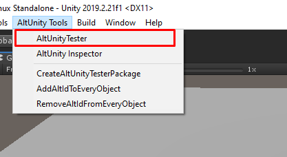

# Get Started

To run the first test for your Unity game you need to:

```eval_rst

.. contents::
    :local:
    :depth: 1
    :backlinks: none
    :class: custom-table-of-contents


.. note::

    If you don't have access to source code of the game you need to ask a person with access to give you an instrumented version of the game.

```

## Import AltUnity Tester package in Unity Editor

To instrument your game with AltUnity Server you first need to import the AltUnity Tester package into Unity. This can be done either by downloading from the Unity Asset Store or from the GitLab pages.

```eval_rst

.. tabs::

    .. tab:: From Unity Asset Store

        1. Download from Unity `Asset Store - link <https://assetstore.unity.com/packages/tools/utilities/altunitytester-112101>`_.
        2. Go to your Asset Store Downloads Manager from Unity Editor.
        3. Import the package into your Unity project.


    .. tab:: UnityPackage from GitLab pages

        1. Download from `GitLab pages (deployed using CI) - link <https://altom.gitlab.io/altunity/altunitytester/master/AltUnityPackage/AltUnityTester.unitypackage>`_.
        2. Import it by drag and drop inside your Unity project.

```

```important:: To make sure the import was correct, check if you can open AltUnity Tester Editor Window from Unity Editor -> AltUnity Tools -> AltUnityTester.

```



## Instrument your game with AltUnity Server

In order for the tests to have access to Unity objects via AltUnity Driver you need to instrument the game with AltUnity Server.

Steps:

1. Open AltUnity Tester Window from Unity Editor -> AltUnity Tools -> AltUnityTester.
2. Select Scenes in Build
3. Select on what platform you want to build the game.
4. Press "Build Only" to instrument the game.
5. Check the console to see if the build was successful.

```eval_rst

.. important::

    Make sure to set the "Api Compatibility Level" to ".NET 4.x" in Unity when building using the Standalone option.

    This setting can be found under Edit menu -> Project Settings -> Player -> Other Settings -> Configuration.

.. important::

    AltUnity Server is intended to be used only in debug builds, and it will not work in release mode out of the box. You need to make sure you don't release a production build instrumented with AltUnity Server.

.. note::

    Your build files are available in the configured Output path. By default, the Output path is a folder with the same name as your game.

.. note::

    If you have a custom build, check how you can build from the command line using the instructions in the `Advanced Usage section <advanced-usage.html#Build-games-from-the-command-line>`_.

.. note::

    If changes are made inside a test, rebuilding the application is not necessary.
    A rebuild is needed only if changes are made inside the Unity project.

.. note::

    To be able to run your instrumented game in the background, go to File -> Build Settings -> Player Settings -> Project Settings -> Player -> Resolution and presentation and check the box next to Run in background*.

```

## Instrument your game with AltUnity Pro Alpha

Steps:
1. Open AltUnity Tester Window from Unity Editor -> AltUnity Tools -> AltUnityTester
2. In the Build Settings section set the Proxy host to the IP of the device you will be
running your instrumented game on; set the Proxy port to the port you want to use both in
the instrumented game and in AltUnity Pro Alpha
3. In the Scene Manager section select the scenes you want to include in your build
4. In the Platform section select WebGL and the path to which you want to save the build
5. Press "Build Only" to instrument the game or "Build & Run" to start your instrumented game
after the build succeeded
6. Check the console to see if the build was successful. A green popup should appear in your
build in case of successful instrumentation.


## Run your game in Unity or on desired platform

Before running your tests you need to start the game instrumented with AltUnity Server. Upon startup, your game should display a popup with the message: "waiting for connection on port 13000".

```eval_rst

.. tabs::

    .. tab:: Unity Editor

        1. Open AltUnity Tester Window
        2. In platform section select Editor
        3. Click Play in Editor

    .. tab:: PC

        1. Open AltUnity Tester Window
        2. In platform section select Standalone
        3. Choose your build target
        4. Click Build & Run

        .. important::

            Make sure to set the "Api Compatibility Level" to ".NET 4.x" in Unity when building using the Standalone option.

            This setting can be found under Edit menu -> Project Settings -> Player -> Other Settings -> Configuration.

    .. tab:: Android

        Prerequisites:

        * Use the Unity Hub to install Android Build Support and the required dependencies: Android SDK & NDK tools, and OpenJDK

        Steps:

        1. Open AltUnity Tester Window
        2. In platform section select Android
        3. Click Build & Run


    .. tab:: iOS

        Prerequisites:

        * Have IProxy installed: ``brew install libimobiledevice``

        Steps:

        1. Open AltUnity Tester Window
        2. In platform section select iOS
        3. Click Build & Run

        .. note::
            Check the following link to see how to build and run your game for iOS (.ipa file) -- `link <https://altom.com/testing-ios-applications-using-java-and-altunity-tester/>`_.


        .. note::
            For more details read about `port forwarding at this link <advanced-usage.html#what-is-port-forwarding-and-when-to-use-it>`_.

```

## Write and execute first test for your game

To write tests with AltUnity Tester you need to import the AltUnity Driver in your tests project.

AltUnity Tester package contains AltUnityDriver class used to connect to the instrumented game. In the setup method create an instance of the driver and in the tear-down method invoke the stop method of the driver. With the instance of the driver you can query the Unity objects and interact with the game.

```eval_rst

.. tabs::

    .. tab:: C#

        AltUnity C# Driver is already included in AltUnity Tester package. If you are writing tests in C# then you can create your tests directly from Unity.

        1.  Create a folder named Editor in your Unity Project.
        2.  Right-click on Editor folder and select `Create -> AltUnityTest`. This will create a template file in which you could start to write your test.
        3.  Name the file MyFirstTest.
        4.  Open AltUnity Tester Window.
        5.  In the `Run Tests` section press "Run All Tests" button. You should see the output of the tests in Unity Editor Console


        Example test file:

        .. tabs::

            .. tab:: Unity Editor & PC

                .. literalinclude:: other~/test-files/cSharp-test.cs
                    :language: c#

            .. tab:: Android

                .. literalinclude:: other~/test-files/cSharp-Android-test.cs
                    :language: c#
                    :emphasize-lines: 11,19

            .. tab:: iOS

                .. literalinclude:: other~/test-files/cSharp-iOS-test.cs
                    :language: c#
                    :emphasize-lines: 11,19

        Run your test file from the command line by using the following command:

        .. code-block:: console

            <UnityPath>/Unity -projectPath $PROJECT_DIR -executeMethod AltUnityTestRunner.RunTestFromCommandLine -tests MyFirstTest.TestStartGame -logFile logFile.log -batchmode -quit

    .. tab:: Java

        AltUnity Java Driver is available as a maven package or as a standalone jar. Use one of the following methods to import the driver in your tests project.

            **Method 1**: Add AltUnity Java Driver as a dependency in your **pom.xml** file:

            .. code-block:: xml

                <dependency>
                    <groupId>com.altom</groupId>
                    <artifactId>altunitytester-java-client</artifactId>
                    <version>1.6.6</version>
                </dependency>


            **Method 2**: Use the **.jar** file from GIT (**without building it from source**)

                * Download `AltUnity Java Driver <https://altom.gitlab.io/altunity/altunitytester/master/AltUnityJAR/altunitytester-java-client-jar.jar>`__.

                * Install the **.jar** file:

                .. code-block:: console

                    mvn install:install-file -Dfile=./target/altunitytester-java-client-jar-with-dependencies.jar -DgroupId=ro.altom -DartifactId=altunitytester -Dversion=1.6.6 -Dpackaging=jar``


        Example test file:

        .. tabs::

            .. tab:: Unity Editor & PC

                .. literalinclude:: other~/test-files/java-test.java
                    :language: java

            .. tab:: Android

                .. literalinclude:: other~/test-files/java-Android-test.java
                    :language: java
                    :emphasize-lines: 19,26

            .. tab:: iOS

                .. literalinclude:: other~/test-files/java-iOS-test.java
                    :language: java
                    :emphasize-lines: 19,26

        Run your tests by using the following command (in the test project folder):

        .. code-block:: console

            mvn test

    .. tab:: Python

        There are two methods of installing the AltUnity Python Driver pip package:

            **Method 1**: Installing using Pip:

            .. code-block:: console

                pip install altunityrunner

            **Method 2**: Install from the source code in the repository:

            .. code-block:: console

                cd <project-dir>/Bindings~/python
                python setup.py install


        Example test file:

        .. tabs::

            .. tab:: Unity Editor & PC

                .. literalinclude:: other~/test-files/python-test.py
                    :language: py

            .. tab:: Android

                .. literalinclude:: other~/test-files/python-Android-test.py
                    :language: py
                    :emphasize-lines: 16,22

            .. tab:: iOS

                .. literalinclude:: other~/test-files/python-iOS-test.py
                    :language: py
                    :emphasize-lines: 16,22

        Run your test file by using the following command:

        .. code-block:: console

            python <nameOfYourTestFile.py>

```

Now your project can use all the [AltUnity Driver Commands](./commands.md).

```note::
        Before running your tests, start the instrumented game and wait for popup with the message: "waiting for connection on port 13000".
```
