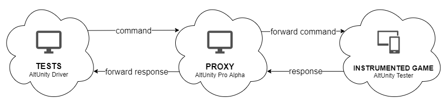

# Overview 

AltUnity Tester is an open-source UI driven test automation tool that helps you find objects in your Unity game and interact with them using tests written in C#, Python or Java.  
You can run your tests on real devices (mobile, PCs, etc.) or inside the Unity Editor. 

## Key features 

- find elements and get all their (public) properties: coordinates, text, values, Unity components, etc. 
- use and modify any of the (public) methods and properties of a Unity element
- simulate any kind of device input  
- manipulate and generate test data 
- get screenshots from your Unity Game 
- instrument your game and run C# tests from within the Unity Editor using the AltUnity Tester window
- run C#, Python or Java tests using your favourite IDE and against the game running on a device or inside the Unity Editor
- integrate with Appium tests for the ability to interact with native elements
- visualize input actions during test execution 
- see test results and reports inside the Unity Editor

## How it works 

AltUnity Tester framework contains the following modules:

* AltUnity Server
* AltUnity Client
* AltUnity Tester Editor Window

AltUnity Server module is used to instrument your game to expose access to all the objects in the Unity hierarchy. The instrumented game opens up a TCP socket connection on the device running the Unity application and waits for an AltUnity Client to connect after starting the application.

AltUnity Client module is used to connect to the AltUnity Server, access all the Unity objects and interact with them through tests written in C#, Java or Python.

AltUnity Tester Editor Window is the GUI used for instrumenting a Unity game and running C# tests directly from Unity Editor.

